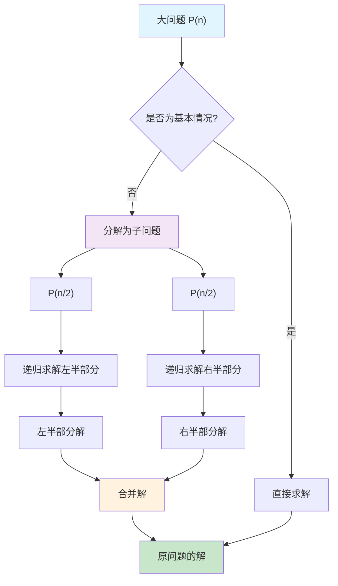
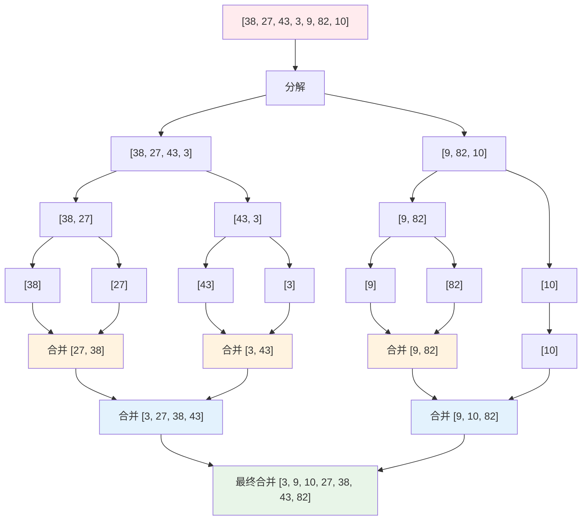
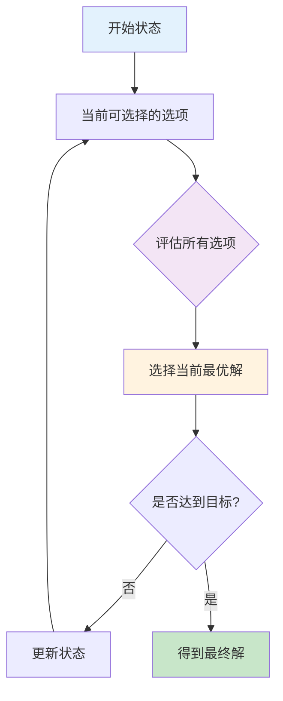
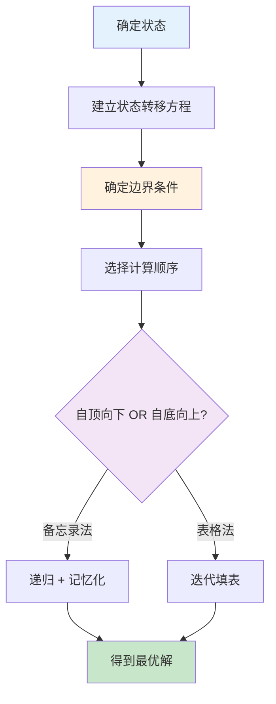
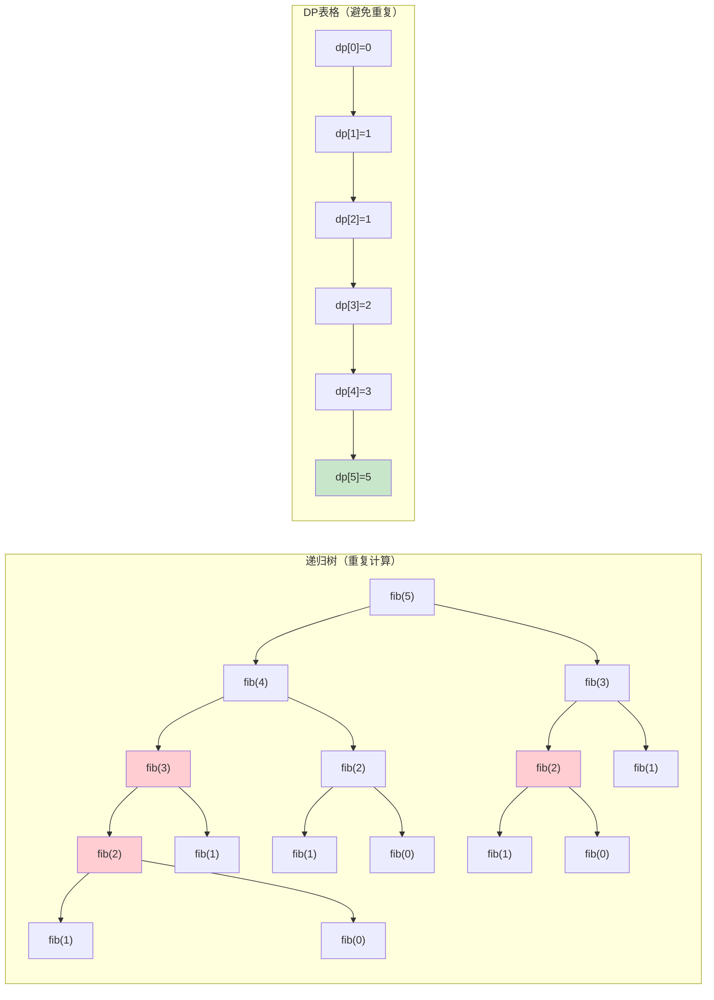
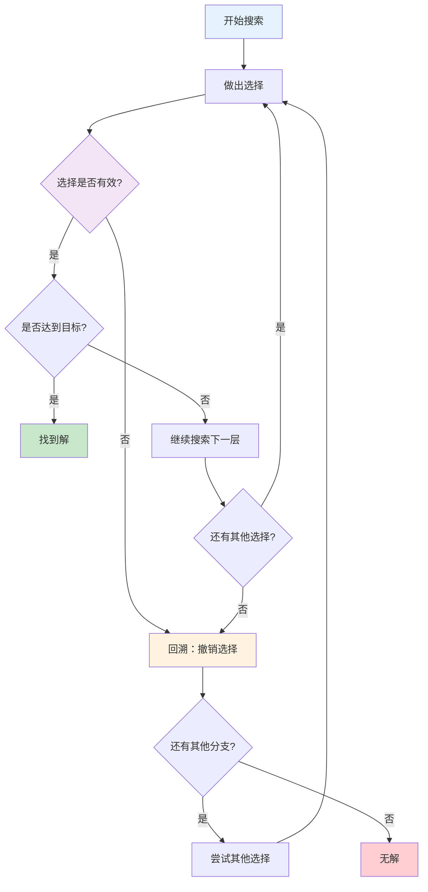
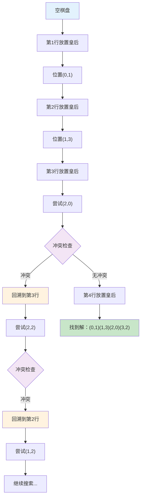
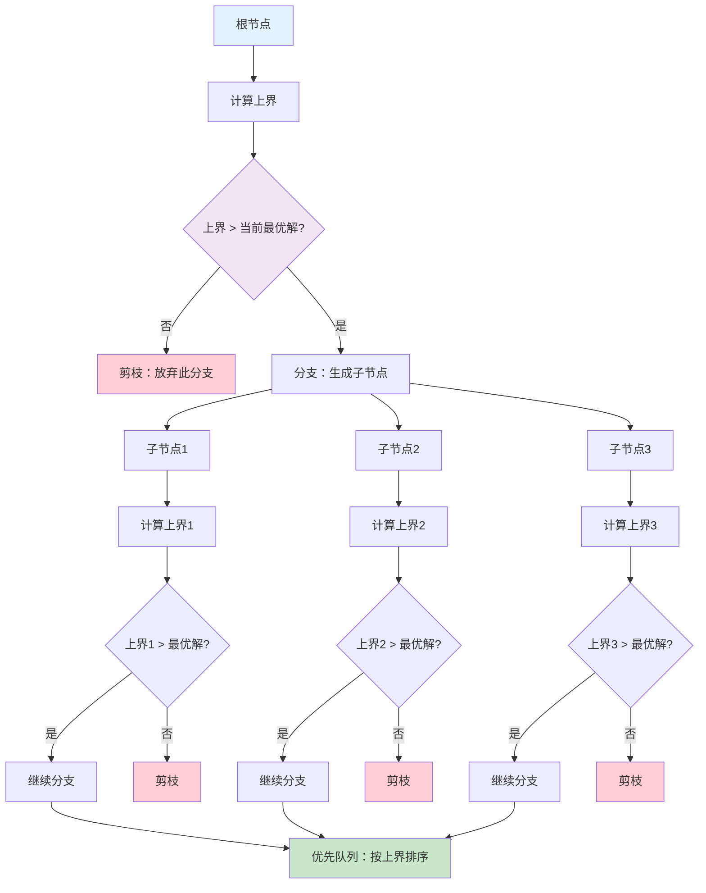
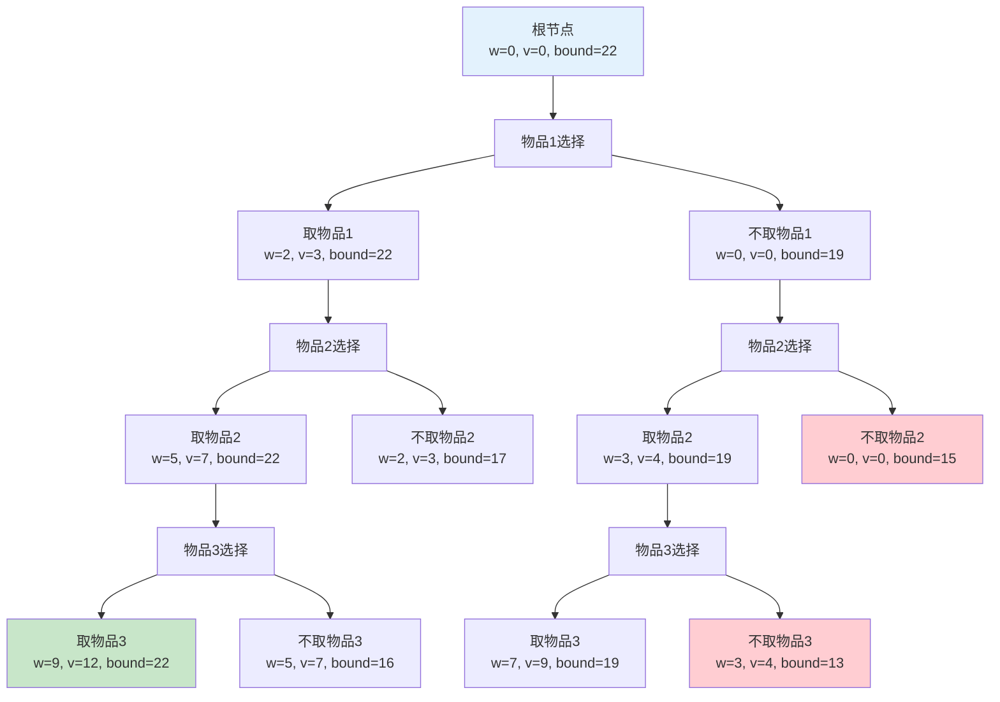

本文通过可视化图表深入讲解五种经典算法设计技术的核心思路和执行流程。

## 1. 分治法 (Divide and Conquer)

### 核心思想
将大问题分解为小问题，递归解决小问题，然后合并结果。

### 分治法流程图



### 归并排序可视化

**原问题描述**：
给定一个无序的整数数组，要求将其按照从小到大的顺序重新排列。

**输入**：[38, 27, 43, 3, 9, 82, 10]
**输出**：[3, 9, 10, 27, 38, 43, 82]

**分治策略**：
1. **分解**：将数组不断二分，直到每个子数组只有一个元素
2. **解决**：单个元素天然有序
3. **合并**：将两个有序的子数组合并成一个更大的有序数组



**关键特点**：
- **分解阶段**：递归地将数组分成两半
- **合并阶段**：将排序好的子数组合并成更大的有序数组
- **时间复杂度**：O(n log n)，稳定排序

### 最大子数组问题

**原问题描述**：
给定一个整数数组（可能包含正数、负数和零），找到一个连续的子数组，使得该子数组的和最大。

**输入**：[-2, 1, -3, 4, -1, 2, 1, -5, 4]
**输出**：最大子数组和为6，对应子数组[4, -1, 2, 1]

**分治策略**：
1. **分解**：将数组从中间分成两半
2. **递归求解**：分别求左半部分和右半部分的最大子数组和
3. **合并**：求跨越中点的最大子数组和
4. **取最大值**：返回三者中的最大值

---

## 2. 贪心法 (Greedy Algorithm)

### 核心思想
在每一步选择中都采取当前状态下最好或最优的选择，期望通过局部最优达到全局最优。

### 贪心法决策流程



### 活动选择问题可视化

**原问题描述**：
有n个活动要在同一个会议室举行，每个活动都有开始时间和结束时间。由于会议室同时只能举行一个活动，需要选择最多数量的活动，使得它们在时间上不冲突。

**输入活动列表**：
- 活动A: 时间段[1,4]
- 活动B: 时间段[3,5] 
- 活动C: 时间段[0,6]
- 活动D: 时间段[5,7]
- 活动E: 时间段[3,9]
- 活动F: 时间段[5,9]
- 活动G: 时间段[6,10]
- 活动H: 时间段[8,11]

**期望输出**：选择最多的不冲突活动组合

**贪心策略**：总是选择结束时间最早的活动，这样为后续活动预留最多时间。

```mermaid
gantt
    title 活动选择问题（贪心策略：按结束时间排序）
    dateFormat X
    axisFormat %s
    
    section 可选活动
    活动A(1,4)     :a1, 1, 4
    活动B(3,5)     :a2, 3, 5
    活动C(0,6)     :a3, 0, 6
    活动D(5,7)     :a4, 5, 7
    活动E(3,9)     :a5, 3, 9
    活动F(5,9)     :a6, 5, 9
    活动G(6,10)    :a7, 6, 10
    活动H(8,11)    :a8, 8, 11
    
    section 贪心选择
    选择A(1,4)     :done, s1, 1, 4
    选择D(5,7)     :done, s2, 5, 7
    选择H(8,11)    :done, s3, 8, 11
```



**贪心策略**：总是选择结束时间最早的活动，这样为后续活动留出最多时间。

**关键特点**：
- **局部最优**：每次选择当前最优选项
- **无后效性**：之前的选择不影响后续选择的最优性
- **适用条件**：问题具有贪心选择性质和最优子结构

---

## 3. 动态规划法 (Dynamic Programming)

### 核心思想
将复杂问题分解为重叠的子问题，通过保存子问题的解来避免重复计算。

### 动态规划解题步骤



### 斐波那契数列DP可视化

**原问题描述**：
计算斐波那契数列的第n项。斐波那契数列定义为：
- F(0) = 0
- F(1) = 1  
- F(n) = F(n-1) + F(n-2) (当n ≥ 2时)

**输入**：n = 5
**输出**：F(5) = 5

**问题分析**：
- 使用纯递归会导致大量重复计算
- 例如计算F(5)时，F(3)会被计算多次
- 动态规划通过保存中间结果避免重复计算



**关键特点**：
- **重叠子问题**：同样的子问题被多次求解
- **最优子结构**：问题的最优解包含子问题的最优解
- **状态转移**：dp[i] = dp[i-1] + dp[i-2]
- **时间复杂度**：从指数级O(2^n)优化到线性O(n)

### 0-1背包问题DP解法

**原问题描述**：
给定一个容量为W的背包和n个物品，每个物品有重量wi和价值vi。要求选择一些物品放入背包，使得总重量不超过背包容量，且总价值最大化。

**输入示例**：
- 背包容量：W = 7
- 物品1：重量=1，价值=1
- 物品2：重量=3，价值=4  
- 物品3：重量=4，价值=5
- 物品4：重量=5，价值=7

**DP状态定义**：dp[i][w] = 前i个物品在容量w下的最大价值

**状态转移方程**：
```
dp[i][w] = max(dp[i-1][w],                    // 不取第i个物品
               dp[i-1][w-weight[i]] + value[i]) // 取第i个物品
```

---

## 4. 回溯法 (Backtracking)

### 核心思想
在搜索过程中，当发现当前选择不能得到有效解时，退回到上一步继续搜索其他可能。

### 回溯法搜索过程



### N皇后问题可视化（4皇后）

**原问题描述**：
在n×n的国际象棋棋盘上放置n个皇后，使得它们彼此不能相互攻击。在国际象棋中，皇后可以攻击同一行、同一列以及同一对角线上的任意棋子。

**具体问题（4皇后）**：
- 棋盘大小：4×4
- 皇后数量：4个
- 约束条件：任意两个皇后不能在同一行、同一列、同一对角线上

**期望输出**：所有可能的放置方案

**回溯策略**：
1. 逐行放置皇后
2. 对每一行，尝试每一列
3. 检查是否与已放置的皇后冲突
4. 如果冲突，回溯到上一行重新选择
5. 如果无冲突，继续下一行



**关键特点**：
- **试探性搜索**：尝试所有可能的解
- **剪枝优化**：及时发现无效路径并回退
- **递归结构**：每一步都是相同的决策过程
- **空间复杂度**：O(深度)，时间复杂度通常是指数级

---

## 5. 分支界限法 (Branch and Bound)

### 核心思想
通过系统地搜索解空间，使用界限函数剪枝，优先搜索最有希望的分支。

### 分支界限法搜索策略



### 0-1背包问题分支界限可视化

**原问题描述**：
给定一个容量为W的背包和n个物品，每个物品有重量wi和价值vi。要求选择一些物品放入背包，使得总重量不超过背包容量，且总价值最大化。每个物品要么选择（1），要么不选择（0），不能部分选择。

**具体实例**：
- 背包容量：W = 10
- 物品列表：
  - 物品1：重量=2，价值=3，价值密度=1.5
  - 物品2：重量=3，价值=4，价值密度=1.33
  - 物品3：重量=4，价值=5，价值密度=1.25
  - 物品4：重量=5，价值=6，价值密度=1.2

**期望输出**：选择物品的组合，使得总价值最大

**分支界限策略**：
1. 按价值密度排序物品
2. 使用优先队列，优先探索上界最高的节点
3. 计算每个节点的上界（部分装入估计）
4. 当节点的上界不超过已知最优解时剪枝



**关键特点**：
- **界限函数**：估算子问题可能达到的最优值
- **优先搜索**：优先探索上界最高的节点
- **剪枝策略**：当上界低于已知最优解时剪枝
- **适用场景**：最优化问题，特别是整数规划

---

## 算法设计技术对比总结

| 设计技术 | 核心思想 | 适用问题 | 时间复杂度特点 | 典型应用 |
|---------|---------|---------|--------------|----------|
| **分治法** | 分解+合并 | 可分解的问题 | 通常O(n log n) | 排序、查找 |
| **贪心法** | 局部最优 | 具有贪心选择性质 | 通常O(n)或O(n log n) | 调度、图算法 |
| **动态规划** | 记忆化搜索 | 重叠子问题+最优子结构 | O(状态数×转移) | 背包、路径 |
| **回溯法** | 试探+回退 | 约束满足问题 | 指数级（有剪枝） | 组合、排列 |
| **分支界限** | 搜索+剪枝 | 最优化问题 | 指数级（有界限） | 整数规划 |

### 选择策略

1. **分治法**：问题可以自然分解且子问题相互独立
2. **贪心法**：每步都能做出最优选择且不影响后续
3. **动态规划**：存在重叠子问题，需要最优解
4. **回溯法**：需要搜索所有可能解或验证可行性
5. **分支界限法**：需要找到最优解且有好的界限估计

---

## 完整源码

如果您想查看本文所有排序算法的完整C++实现代码，请点击下方链接：

<div style="text-align: center; margin: 30px 0;">
  <a href="/2025/09/05/algorithm-design-techniques-code/" class="btn btn-primary btn-lg" style="display: inline-block; padding: 15px 30px; background: linear-gradient(45deg, #667eea 0%, #764ba2 100%); color: white; text-decoration: none; border-radius: 50px; font-weight: bold; font-size: 18px; box-shadow: 0 8px 15px rgba(0,0,0,0.1); transition: all 0.3s ease; border: none;">
    <i class="fa fa-code" style="margin-right: 10px;"></i>查看完整C++源码
  </a>
</div>

<style>
.btn:hover {
  transform: translateY(-2px);
  box-shadow: 0 15px 20px rgba(0,0,0,0.2) !important;
}
</style>

> **相关代码实现**: [算法设计技术完整C++代码](/2025/09/05/algorithm-design-techniques-code/)
