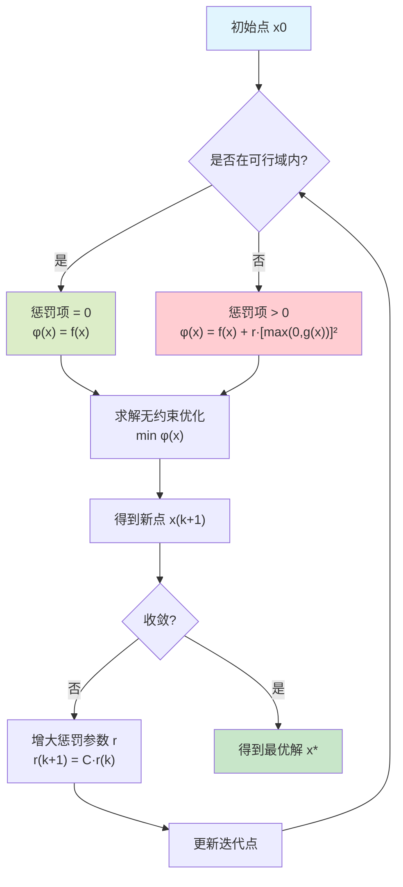
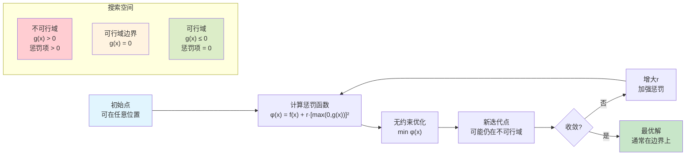

惩罚函数法又称乘子法，是将约束优化问题转换为无约束优化问题的方法之一。其基本思想就是通过在原始的目标函数中添加一个障碍函数（也可以理解成惩罚函数）来代替约束条件中的不等式约束。如果当前解不满足约束条件，就在目标项上加上一个正向的惩罚（这里考虑的都是最小化问题），强迫当前解往可行域的方向走。至于正向惩罚的力度，取决于所用的映射函数，即惩罚函数。

## 一、非线性规划模型

$$\begin{cases}
\min & f(\boldsymbol{x}) \\
\text{s.t.} & g_i(\boldsymbol{x}) \le 0,\quad i=1,\dots,p \\
& h_j(\boldsymbol{x}) = 0,\quad j=1,\dots,q
\end{cases}$$

其中，$f(\boldsymbol{x})$、$g_i(\boldsymbol{x})(i=1,2,\dots,p)$ 和 $h_j(\boldsymbol{x})(j=1,2,\dots,q)$ 是$\mathbb{R}^n$ 上的连续函数。

> 注意：后面惩罚函数的选取与这个模型相关，如果不等式约束方向相反惩罚函数就有所不同，也可以理解为该模型就是标准型。

由于约束条件是非线性的，不能用消元法将其转换为无约束问题，在求解时需同时考虑目标函数值下降和满足约束条件。可以通过由目标函数和约束条件组成惩罚函数，将原问题转化为极小化惩罚函数的无约束问题。

## 二、惩罚函数外点法

惩罚函数基本思想：通过构造惩罚函数将约束问题转化为无约束问题，进而用无约束最优化方法求解。主要分为内点法和外点法。注意：惩罚函数对目标函数的凹凸性没有要求，且结合启发式算法（如遗传算法、蚁群算法、禁忌搜索等）几乎可以求解任何问题，因为启发式算法无需目标函数的梯度等信息。外点法不保证搜索点保持在可行域内（搜索范围包括可行域和不可行域），适用于包含不等式约束或等式约束的优化问题。

## 外点法可视化说明

**外点法特点：**
- 🔵 **蓝色区域**：可行域（约束满足）
- 🔴 **红色区域**：不可行域（约束违反）
- 📍 **搜索路径**：可以从任意点开始，包括不可行域
- ⚡ **惩罚机制**：在不可行域时施加惩罚，推动点向可行域移动

## 几何直观理解

**关键理解：**
1. **外点法**允许搜索点在可行域**外部**开始和移动
2. 通过**惩罚项**将不可行域的点"推"向可行域
3. 随着惩罚参数r增大，搜索点逐渐**逼近**可行域边界
4. 最终收敛到约束边界上的最优解

## 惩罚函数法可视化

下图展示了惩罚函数法的基本概念和收敛过程：

**图片说明：**
- **左图**：展示不同惩罚参数r对惩罚函数形状的影响，随着r增大，最优解逐渐逼近约束边界
- **中图**：显示算法收敛过程，迭代解逐渐趋向最优解，惩罚参数按指数增长
- **右图**：简单示例，验证惩罚函数法的基本原理

惩罚函数为：

$$
\phi(\boldsymbol{x}, r^{(k)})
= f(\boldsymbol{x})
+ r^{(k)} \sum_{i=1}^{p} \left\{ \max\big[0,\, g_i(\boldsymbol{x})\big] \right\}^2
$$

其中，$r^{(k)}$ 为趋于无穷大的严格递增正数列，$r^{(k)} = C\, r^{(k-1)}$ 且 $C>1$，$\lim_{k\to\infty} r^{(k)} = \infty$。迭代点在可行域内时，惩罚项为 0，惩罚函数等于原函数；迭代点在可行域外时，惩罚项大于 0，大于原函数。因此，由于罚因子严格递增，随着迭代进行，可以迫使惩罚项趋于 0，从而逼近原函数。

## 三、应用

### 例题1：简单不等式约束问题

**题目：** 用惩罚函数外点法求解以下约束优化问题：

$$\begin{cases}
\min & f(x) = x^2 \\
\text{s.t.} & g(x) = x - 1 \leq 0
\end{cases}$$

**解答：**

1. **构造惩罚函数：**
   $\phi(x, r) = x^2 + r \cdot [\max(0, x-1)]^2$

2. **分情况讨论：**
   
   **情况1：** 当 $x \leq 1$ 时（满足约束）  
   $\phi(x, r) = x^2 + r \cdot 0 = x^2$
   
   **情况2：** 当 $x > 1$ 时（违反约束）  
   $\phi(x, r) = x^2 + r \cdot (x-1)^2$
   
3. **求无约束极值：**
   
   对 $\phi(x, r)$ 关于 $x$ 求导：  
   $\frac{d\phi}{dx} = 2x + 2r(x-1) = 2x + 2rx - 2r = 2x(1+r) - 2r$  
   
   令 $\frac{d\phi}{dx} = 0$，得：  
   $x^* = \frac{r}{1+r}$

4. **分析收敛性：**  
   $\lim_{r \to \infty} x^* = \lim_{r \to \infty} \frac{r}{1+r} = 1$
   
   因此，当 $r \to \infty$ 时，$x^* \to 1$，即最优解为 $x^* = 1$，$f(x^*) = 1$。

### 例题2：多约束问题

**题目：** 用惩罚函数外点法求解：

$$\begin{cases}
\min & f(x_1, x_2) = x_1^2 + x_2^2 \\
\text{s.t.} & g_1(x_1, x_2) = x_1 + x_2 - 1 \leq 0 \\
& g_2(x_1, x_2) = -x_1 \leq 0 \\
& g_3(x_1, x_2) = -x_2 \leq 0
\end{cases}$$

**解答：**

1. **构造惩罚函数：**
   $\phi(x_1, x_2, r) = x_1^2 + x_2^2 + r \sum_{i=1}^{3} [\max(0, g_i(x_1, x_2))]^2$

2. **展开惩罚项：**  
   $\phi(x_1, x_2, r) = x_1^2 + x_2^2 + r[\max(0, x_1+x_2-1)]^2 + r[\max(0, -x_1)]^2 + r[\max(0, -x_2)]^2$

3. **在可行域内分析：**  
   当 $x_1 \geq 0, x_2 \geq 0, x_1 + x_2 \leq 1$ 时：  
   $\phi(x_1, x_2, r) = x_1^2 + x_2^2$  
   
   求极值：$\frac{\partial \phi}{\partial x_1} = 2x_1 = 0$，$\frac{\partial \phi}{\partial x_2} = 2x_2 = 0$  
   
   得：$x_1^* = 0, x_2^* = 0$

4. **验证约束：**  
   $g_1(0,0) = -1 \leq 0$ ✓，$g_2(0,0) = 0 \leq 0$ ✓，$g_3(0,0) = 0 \leq 0$ ✓  
   
   因此最优解为 $$(x_1^*, x_2^*) = (0, 0)$$，最优值为 $$f^* = 0$$。

### 例题3：等式约束问题

**题目：** 用惩罚函数法求解：

$$\begin{cases}
\min & f(x_1, x_2) = x_1^2 + x_2^2 \\
\text{s.t.} & h(x_1, x_2) = x_1 + x_2 - 2 = 0
\end{cases}$$

**解答：**

1. **构造惩罚函数：**
   $\phi(x_1, x_2, r) = x_1^2 + x_2^2 + r(x_1 + x_2 - 2)^2$

2. **求偏导数：**  
   $\frac{\partial \phi}{\partial x_1} = 2x_1 + 2r(x_1 + x_2 - 2) = 0$  
   $\frac{\partial \phi}{\partial x_2} = 2x_2 + 2r(x_1 + x_2 - 2) = 0$

3. **求解方程组：**  
   从两个方程可得：$x_1 = x_2$  
   
   代入第一个方程：  
   $2x_1 + 2r(2x_1 - 2) = 0$  
   $2x_1 + 4rx_1 - 4r = 0$  
   $x_1(2 + 4r) = 4r$  
   $x_1 = \frac{4r}{2 + 4r} = \frac{2r}{1 + 2r}$

4. **求极限：**  
   $\lim_{r \to \infty} x_1 = \lim_{r \to \infty} \frac{2r}{1 + 2r} = 1$  
   
   因此 $x_1^* = x_2^* = 1$，满足约束 $x_1 + x_2 = 2$，最优值为 $f^* = 2$。

### 例题4：等式约束问题（博客园例题）

**题目：** 用外点法求等式约束问题

$$\begin{cases}
\min & \frac{1}{2}x_1^2 + \frac{1}{6}x_2^2 \\
\text{s.t.} & x_1 + x_2 = 1
\end{cases}$$

**解答：**

1. **构造惩罚函数：**
   $F(x, M_k) = \frac{1}{2}x_1^2 + \frac{1}{6}x_2^2 + M_k(x_1 + x_2 - 1)^2$

2. **求偏导数：**  
   $\frac{\partial F}{\partial x_1} = x_1 + 2M_k(x_1 + x_2 - 1) = 0$  
   $\frac{\partial F}{\partial x_2} = \frac{1}{3}x_2 + 2M_k(x_1 + x_2 - 1) = 0$

3. **联立求解：**  
   从两个偏导方程可得：$x_2 = 3x_1$  
   
   代入第一个方程:  
   $x_1 + 2M_k(4x_1 - 1) = 0$  
   $x_1 = \frac{2M_k}{1 + 8M_k}$  
   $x_2 = 3x_1 = \frac{6M_k}{1 + 8M_k}$

4. **求极限：**  
   $\lim_{M_k \to \infty} x_1 = \lim_{M_k \to \infty} \frac{2M_k}{1 + 8M_k} = \frac{1}{4}$  
   $\lim_{M_k \to \infty} x_2 = \lim_{M_k \to \infty} \frac{6M_k}{1 + 8M_k} = \frac{3}{4}$

   因此最优解为 $$(x_1^*, x_2^*) = (\frac{1}{4}, \frac{3}{4})$$。

### 例题5：多约束不等式问题

**题目：** 求解非线性规划

$$\begin{cases}
\min & f(x_1, x_2) = x_1 + x_2 \\
\text{s.t.} & x_1^2 - x_2 \leq 0 \\
& -x_1 \leq 0
\end{cases}$$

**解答：**

1. **构造惩罚函数：**  
   $P(x, M) = x_1 + x_2 + M[\max(0, x_1^2 - x_2)]^2 + M[\max(0, -x_1)]^2$

2. **求偏导数：**  
   $$\frac{\partial P}{\partial x_1} = 1 + 2M[\max(0, x_1^2 - x_2)](2x_1) - 2M[\max(0, -x_1)] = 0$$ 
   $$\frac{\partial P}{\partial x_2} = 1 - 2M[\max(0, x_1^2 - x_2)] = 0$$

3. **分析可行域外的点：**  
   对于 $x_1 < 0, x_2 < 0$ 的情况：
   $$\begin{cases}
   1 + 2M(x_1^2 - x_2)(2x_1) + 2Mx_1 = 0 \\
   1 - 2M(x_1^2 - x_2) = 0
   \end{cases}$$

4. **求解驻点：**  
   解得：
   $$\begin{cases}
   x_1 = -\frac{1}{2(1+M)} \\
   x_2 = \frac{1}{4(1+M)^2} - \frac{1}{2M}
   \end{cases}$$

5. **求极限：**  
   当 $M \to +\infty$ 时：
   $x_1 \to 0$，$x_2 \to 0$  
   
   验证：$(0, 0)$ 是可行点，满足所有约束条件，因此是最优解。

### 例题6：复杂约束问题

**题目：** 用惩罚函数法解如下非线性规划问题

$$\begin{cases}
\min & f(x_1, x_2) = 2x_1 + 2x_2 + 2 \\
\text{s.t.} & -x_1 + x_2^2 \leq 1 \\
& x_2 \geq 5
\end{cases}$$

**解答：**

1. **改写为标准形式：**  
   $$\begin{cases}
   \min & f(x_1, x_2) = 2x_1 + 2x_2 + 2 \\
   \text{s.t.} & g_1(x) = -x_1 + x_2^2 - 1 \leq 0 \\
   & g_2(x) = -x_2 + 5 \leq 0
   \end{cases}$$

2. **构造惩罚函数：**  
   $\phi(x_1, x_2, r) = 2x_1 + 2x_2 + 2 + r[\max(0, -x_1 + x_2^2 - 1)]^2 + r[\max(0, -x_2 + 5)]^2$

3. **分析约束：**  
   - 约束1：$-x_1 + x_2^2 \leq 1$，即 $x_1 \geq x_2^2 - 1$
   - 约束2：$x_2 \geq 5$

4. **求解思路：**  
   由于 $x_2 \geq 5$，在约束1中 $x_1 \geq 25 - 1 = 24$  
   目标函数在可行域内单调递增，因此最优解在边界上。

## 四、参数选择与算法步骤

### 参数选择

**初始点 $x^{(0)}$：** 可行域及非可行域内均可。

**初始罚因子 $r^{(0)}$：** 选择对算法的成败和计算效率有显著影响。
- 选取过小：无约束求解的次数增多，收敛速度慢
- 选取过大：非可行域内惩罚函数比原函数大得多，在起作用约束边界处产生尖点，函数形态变坏，从而限制了某些无约束优化方法的使用，导致计算失败

**罚因子递增系数 $C$：** 一般取 $C \in [5, 10]$

### 算法步骤

**惩罚函数外点法的详细步骤：**

1. **在 $n$ 维空间任取初始点 $x^{(0)}$**

2. **选取初始罚因子 $r^{(0)}$，递增系数 $C$，并置 $k = 0$**

3. **求解无约束优化问题 $\min \phi(x, r^{(k)})$，得到最优点 $x_k^*$**

4. **当 $k = 0$ 时转步骤5，否则转步骤6**

5. **置 $k = k + 1$，$r^{(k+1)} = Cr^{(k)}$，$x_{k+1}^{(0)} = x_k^*$**

6. **由终止准则，若满足则结束算法，输出最优解；否则转步骤5**

## 五、算法步骤总结

**惩罚函数外点法的一般步骤：**

1. **初始化：** 选择初始点 $\boldsymbol{x}^{(0)}$，初始惩罚参数 $r^{(0)} > 0$，放大因子 $C > 1$，精度要求 $\varepsilon > 0$，置 $k = 0$。

2. **构造惩罚函数：**  
   $\phi(\boldsymbol{x}, r^{(k)}) = f(\boldsymbol{x}) + r^{(k)} \sum_{i=1}^{p} [\max(0, g_i(\boldsymbol{x}))]^2 + r^{(k)} \sum_{j=1}^{q} [h_j(\boldsymbol{x})]^2$

3. **求解无约束优化问题：**  
   $\boldsymbol{x}^{(k+1)} = \arg\min_{\boldsymbol{x}} \phi(\boldsymbol{x}, r^{(k)})$

4. **检验收敛性：** 若满足收敛准则，停止；否则转步骤5。

5. **更新惩罚参数：** $r^{(k+1)} = C \cdot r^{(k)}$，置 $k = k+1$，转步骤2。

**收敛准则：**
- $\|\boldsymbol{x}^{(k+1)} - \boldsymbol{x}^{(k)}\| < \varepsilon$
- 或惩罚项足够小：$r^{(k)} \sum_{i=1}^{p} [\max(0, g_i(\boldsymbol{x}^{(k+1)}))]^2 < \varepsilon$

**算法特点：**
- 外点法不保证搜索点保持在可行域内（搜索范围包括可行域和不可行域）
- 适用于包含不等式约束或等式约束的优化问题
- 对目标函数的凹凸性没有要求
- 结合启发式算法（如遗传算法、蚁群算法、禁忌搜索等）几乎可以求解任何问题
- 启发式算法无需目标函数的梯度等信息

**注意事项：**
- 惩罚函数对目标函数的凹凸性没有要求
- 结合启发式算法几乎可以求解任何问题
- 外点法不保证搜索点保持在可行域内
- 适用于包含不等式约束或等式约束的优化问题
