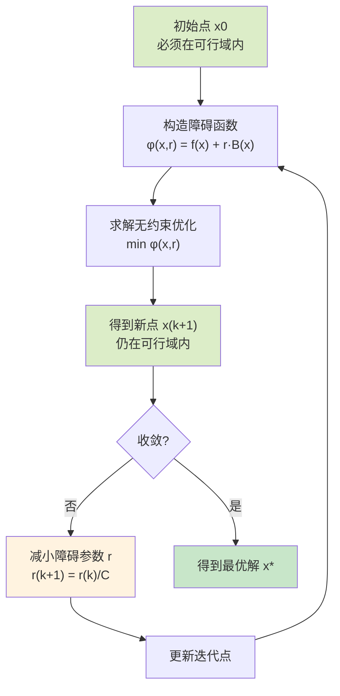
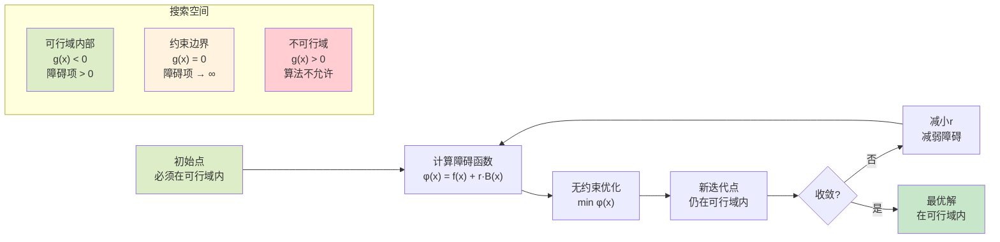

内点法（Interior Point Method）是求解约束优化问题的重要方法之一，与惩罚函数外点法不同，内点法要求搜索点始终保持在可行域内部。其基本思想是通过构造障碍函数（Barrier Function）来替代约束条件，将约束优化问题转化为无约束优化问题，同时确保迭代点始终在可行域内部。

## 一、非线性规划模型

$$\begin{cases}
\min & f(\boldsymbol{x}) \\
\text{s.t.} & g_i(\boldsymbol{x}) \leq 0,\quad i=1,\dots,p \\
& h_j(\boldsymbol{x}) = 0,\quad j=1,\dots,q
\end{cases}$$

其中，$f(\boldsymbol{x})$、$g_i(\boldsymbol{x})(i=1,2,\dots,p)$ 和 $h_j(\boldsymbol{x})(j=1,2,\dots,q)$ 是$\mathbb{R}^n$ 上的连续函数。

> 注意：内点法主要处理不等式约束，等式约束通常通过其他方法处理或转化为不等式约束。

## 二、内点法基本原理

内点法的核心思想：通过构造障碍函数将约束问题转化为无约束问题，同时确保搜索点始终在可行域内部。与外点法不同，内点法要求迭代点必须满足所有约束条件。

## 内点法可视化说明

**内点法特点：**
- 🟢 **绿色区域**：可行域（所有约束满足）
- 🔴 **红色区域**：不可行域（约束违反）
- 📍 **搜索路径**：始终在可行域内部移动
- ⚡ **障碍机制**：通过障碍函数防止点接近约束边界

## 几何直观理解

**关键理解：**
1. **内点法**要求搜索点始终在可行域**内部**
2. 通过**障碍函数**防止点接近约束边界
3. 随着障碍参数r减小，搜索点逐渐**逼近**约束边界
4. 最终收敛到约束边界上的最优解

## 内点法可视化

下图展示了内点法的基本概念和收敛过程：

**图片说明：**
- **左图**：展示不同障碍参数r对障碍函数形状的影响，随着r减小，最优解逐渐逼近约束边界
- **中图**：显示算法收敛过程，迭代解始终在可行域内，障碍参数按指数减小
- **右图**：简单示例，验证内点法的基本原理

障碍函数为：

$$\phi(\boldsymbol{x}, r^{(k)}) = f(\boldsymbol{x}) + r^{(k)} \sum_{i=1}^{p} B(g_i(\boldsymbol{x}))$$

其中，$B(g_i(\boldsymbol{x}))$ 是障碍函数，常用的形式有：

**对数障碍函数：**
$$B(g_i(\boldsymbol{x})) = -\log(-g_i(\boldsymbol{x}))$$

**倒数障碍函数：**
$$B(g_i(\boldsymbol{x})) = -\frac{1}{g_i(\boldsymbol{x})}$$

其中，$r^{(k)}$ 为趋于零的严格递减正数列，$r^{(k)} = \frac{r^{(k-1)}}{C}$ 且 $C>1$，$\lim_{k\to\infty} r^{(k)} = 0$。

## 三、应用

### 例题1：简单不等式约束问题

**题目：** 用内点法求解以下约束优化问题：

$$\begin{cases}
\min & f(x) = x^2 \\
\text{s.t.} & g(x) = x - 1 \leq 0
\end{cases}$$

**解答：**

1. **构造障碍函数：**
   使用对数障碍函数：$\phi(x, r) = x^2 + r \cdot (-\log(1-x))$

2. **分情况讨论：**
   
   **情况1：** 当 $x < 1$ 时（满足约束）  
   $\phi(x, r) = x^2 + r \cdot (-\log(1-x))$
   
   **情况2：** 当 $x \geq 1$ 时（违反约束）  
   障碍函数无定义，算法不允许

3. **求无约束极值：**
   
   对 $\phi(x, r)$ 关于 $x$ 求导：  
   $\frac{d\phi}{dx} = 2x + r \cdot \frac{1}{1-x} = 0$  
   
   整理得：$2x(1-x) + r = 0$  
   $2x - 2x^2 + r = 0$  
   $2x^2 - 2x - r = 0$  
   
   解得：$x = \frac{2 \pm \sqrt{4 + 8r}}{4} = \frac{1 \pm \sqrt{1 + 2r}}{2}$
   
   由于 $x < 1$，取负号：$x^* = \frac{1 - \sqrt{1 + 2r}}{2}$

4. **分析收敛性：**  
   当 $r \to 0$ 时：
   $x^* = \frac{1 - \sqrt{1 + 2r}}{2} \to \frac{1 - 1}{2} = 0$
   
   但这不是最优解。重新分析：当 $r \to 0$ 时，障碍项的影响减小，最优解应接近约束边界 $x = 1$。

### 例题2：多约束问题

**题目：** 用内点法求解

$$\begin{cases}
\min & f(x_1, x_2) = x_1^2 + x_2^2 \\
\text{s.t.} & g_1(x_1, x_2) = x_1 + x_2 - 2 \leq 0 \\
& g_2(x_1, x_2) = -x_1 \leq 0 \\
& g_3(x_1, x_2) = -x_2 \leq 0
\end{cases}$$

**解答：**

1. **构造障碍函数：**
   $\phi(x_1, x_2, r) = x_1^2 + x_2^2 + r[-\log(2-x_1-x_2) - \log(x_1) - \log(x_2)]$

2. **求偏导数：**
   $\frac{\partial \phi}{\partial x_1} = 2x_1 + r\left[\frac{1}{2-x_1-x_2} - \frac{1}{x_1}\right] = 0$  
   $\frac{\partial \phi}{\partial x_2} = 2x_2 + r\left[\frac{1}{2-x_1-x_2} - \frac{1}{x_2}\right] = 0$

3. **分析对称性：**
   由于目标函数和约束都关于 $x_1, x_2$ 对称，最优解应满足 $x_1 = x_2$。

4. **求解：**
   设 $x_1 = x_2 = t$，则约束变为 $2t \leq 2$，即 $t \leq 1$。
   
   障碍函数变为：
   $\phi(t, r) = 2t^2 + r[-\log(2-2t) - 2\log(t)]$
   
   求导：$\frac{d\phi}{dt} = 4t + r\left[\frac{2}{2-2t} - \frac{2}{t}\right] = 0$
   
   整理得：$4t + 2r\left[\frac{1}{1-t} - \frac{1}{t}\right] = 0$

5. **求极限：**
   当 $r \to 0$ 时，$t \to 1$，因此 $x_1^* = x_2^* = 1$，最优值为 $f^* = 2$。

### 例题3：等式约束问题

**题目：** 用内点法求等式约束问题

$$\begin{cases}
\min & f(x_1, x_2) = x_1^2 + x_2^2 \\
\text{s.t.} & h(x_1, x_2) = x_1 + x_2 - 2 = 0
\end{cases}$$

**解答：**

1. **将等式约束转化为不等式约束：**
   $x_1 + x_2 - 2 = 0$ 等价于 $x_1 + x_2 - 2 \leq 0$ 且 $-(x_1 + x_2 - 2) \leq 0$

2. **构造障碍函数：**
   $\phi(x_1, x_2, r) = x_1^2 + x_2^2 + r[-\log(2-x_1-x_2) - \log(x_1+x_2-2)]$

3. **注意：** 内点法处理等式约束比较复杂，通常建议使用其他方法如拉格朗日乘数法。

## 四、参数选择与算法步骤

### 参数选择

**初始点 $x^{(0)}$：** 必须在可行域内部，即 $g_i(x^{(0)}) < 0$ 对所有 $i$ 成立。

**初始障碍参数 $r^{(0)}$：** 选择对算法的成败和计算效率有显著影响。
- 选取过大：障碍项占主导地位，收敛到可行域中心而非边界
- 选取过小：数值计算困难，可能接近约束边界时出现数值问题

**障碍参数递减系数 $C$：** 一般取 $C \in [2, 10]$

### 算法步骤

**内点法的详细步骤：**

1. **选择初始点 $x^{(0)}$，确保 $g_i(x^{(0)}) < 0$ 对所有 $i$ 成立**

2. **选取初始障碍参数 $r^{(0)} > 0$，递减系数 $C > 1$，并置 $k = 0$**

3. **求解无约束优化问题 $\min \phi(x, r^{(k)})$，得到最优点 $x_k^*$**

4. **当 $k = 0$ 时转步骤5，否则转步骤6**

5. **置 $k = k + 1$，$r^{(k+1)} = \frac{r^{(k)}}{C}$，$x_{k+1}^{(0)} = x_k^*$**

6. **由终止准则，若满足则结束算法，输出最优解；否则转步骤5**

## 五、算法步骤总结

**内点法的一般步骤：**

1. **初始化：** 选择初始点 $\boldsymbol{x}^{(0)}$（必须在可行域内），初始障碍参数 $r^{(0)} > 0$，递减因子 $C > 1$，精度要求 $\varepsilon > 0$，置 $k = 0$。

2. **构造障碍函数：**  
   $\phi(\boldsymbol{x}, r^{(k)}) = f(\boldsymbol{x}) + r^{(k)} \sum_{i=1}^{p} B(g_i(\boldsymbol{x}))$

3. **求解无约束优化问题：**  
   $\boldsymbol{x}^{(k+1)} = \arg\min_{\boldsymbol{x}} \phi(\boldsymbol{x}, r^{(k)})$

4. **检验收敛性：** 若满足收敛准则，停止；否则转步骤5。

5. **更新障碍参数：** $r^{(k+1)} = \frac{r^{(k)}}{C}$，置 $k = k+1$，转步骤2。

**收敛准则：**
- $\|\boldsymbol{x}^{(k+1)} - \boldsymbol{x}^{(k)}\| < \varepsilon$
- 或障碍项足够小：$r^{(k)} \sum_{i=1}^{p} B(g_i(\boldsymbol{x}^{(k+1)})) < \varepsilon$

**算法特点：**
- 内点法保证搜索点始终在可行域内部
- 适用于包含不等式约束的优化问题
- 对目标函数的凹凸性没有要求
- 数值稳定性较好，但初始点选择要求严格
- 收敛速度通常比外点法快

**注意事项：**
- 初始点必须在可行域内部
- 等式约束需要特殊处理
- 接近约束边界时可能出现数值问题
- 障碍函数的选择对算法性能有重要影响

## 六、内点法 vs 外点法

| 特性 | 内点法 | 外点法 |
|------|--------|--------|
| 搜索范围 | 可行域内部 | 可行域和不可行域 |
| 初始点要求 | 必须在可行域内 | 任意点均可 |
| 约束处理 | 不等式约束为主 | 等式和不等式约束 |
| 收敛速度 | 通常较快 | 相对较慢 |
| 数值稳定性 | 较好 | 一般 |
| 实现难度 | 中等 | 较简单 |

**选择建议：**
- 如果初始点容易找到且问题主要是不等式约束，选择内点法
- 如果问题包含等式约束或初始点难以确定，选择外点法
- 对于大规模问题，内点法通常更高效
