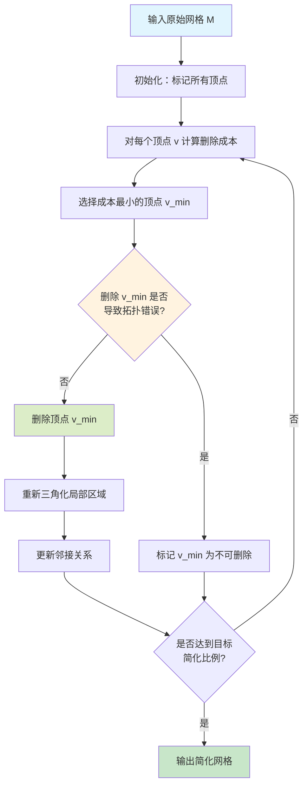
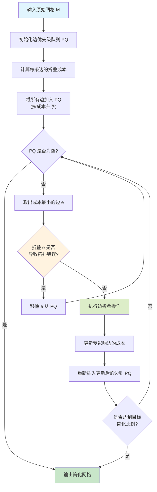
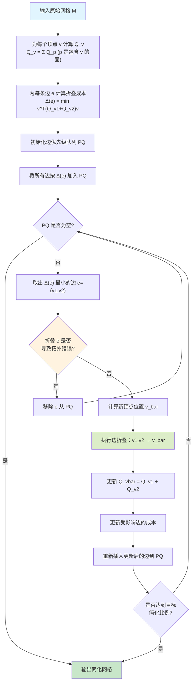

网格化简（Mesh Simplification）是三维几何处理中的核心问题之一，旨在减少三角网格的顶点和面片数量，同时尽可能保持原始网格的几何特征和视觉质量。该技术在实时渲染、3D打印、游戏开发、虚拟现实等领域有着广泛应用。本文深入探讨网格化简的基本原理、经典算法及其实现细节。

## 一、问题描述与应用背景

### 1.1 问题定义

给定一个原始三角网格 $M_0 = (V_0, F_0)$，其中：
- $V_0$ 是顶点集合，包含 $n$ 个顶点
- $F_0$ 是面片集合，包含 $m$ 个三角面片

网格化简的目标是生成一个简化网格 $M_s = (V_s, F_s)$，使得：
- $|V_s| < |V_0|$ 且 $|F_s| < |F_0|$（顶点和面片数量减少）
- $M_s$ 在视觉上与 $M_0$ 尽可能相似（保持几何特征）
- 简化过程的时间复杂度可接受

### 1.2 应用场景

**实时渲染优化**：在游戏和交互式应用中，需要根据距离和重要性动态调整模型细节级别（LOD），以保持流畅的帧率。

**内存和带宽优化**：减少网格数据量可以显著降低存储需求和网络传输开销。

**3D打印预处理**：移除不必要的细节，优化打印模型的质量和速度。

**科学可视化**：简化大规模网格数据，提高可视化效率。

### 1.3 简化质量评估

网格简化的质量通常通过以下指标评估：

1. **几何误差**：原始网格与简化网格之间的 Hausdorff 距离
2. **视觉质量**：简化后的网格在视觉上的保真度
3. **特征保持**：重要几何特征（如边、角、纹理细节）的保留程度
4. **拓扑正确性**：简化过程不应引入自相交或拓扑错误

## 二、经典网格化简算法

### 2.1 顶点删除法（Vertex Decimation）

顶点删除法是最直观的简化方法之一，由 Schroeder 等人在1992年提出。

#### 算法思想

逐步删除对几何贡献最小的顶点，然后对删除后的空洞进行局部重新三角化。

#### 算法流程



#### 删除成本计算

对于顶点 $v$，其删除成本可以通过以下方式计算：

$$Cost(v) = \alpha \cdot E_{distance}(v) + \beta \cdot E_{normal}(v) + \gamma \cdot E_{curvature}(v)$$

其中：
- $E_{distance}(v)$ 是删除后引起的几何位置误差
- $E_{normal}(v)$ 是法向量变化误差
- $E_{curvature}(v)$ 是曲率变化误差
- $\alpha, \beta, \gamma$ 是权重系数

#### 重新三角化

删除顶点后，需要在围绕该顶点的边界环上进行 Delaunay 三角化或其他三角化方法，填充空洞。

#### 优缺点分析

**优点**：
- 实现相对简单
- 可以精确控制简化的顶点数量

**缺点**：
- 每次删除后需要重新三角化，计算开销较大
- 可能出现非最优的三角化结果
- 难以保持锐边等特征

### 2.2 边折叠法（Edge Collapse）

边折叠法是当前最流行的网格化简方法，由 Hoppe 等人在1993年提出。

#### 算法思想

通过迭代地将边折叠成单个顶点来减少网格复杂度。每次折叠操作将一条边 $(v_1, v_2)$ 合并为一个新顶点 $\bar{v}$，同时移除相关的面片和顶点。

#### 边折叠操作

对于边 $e = (v_1, v_2)$，边折叠操作包括：

1. **顶点合并**：将 $v_1$ 和 $v_2$ 替换为新顶点 $\bar{v}$
2. **面片移除**：删除包含边 $e$ 的所有三角面片
3. **拓扑更新**：更新所有引用 $v_1$ 或 $v_2$ 的面片


#### 新顶点位置选择

新顶点 $\bar{v}$ 的位置可以选择：

1. **端点位置**：$\bar{v} = v_1$ 或 $\bar{v} = v_2$（中点折叠）
2. **中点位置**：$\bar{v} = \frac{v_1 + v_2}{2}$
3. **最优位置**：最小化折叠后的几何误差（QEM方法）

#### 算法流程



#### 折叠成本度量

边折叠的成本可以通过以下方式计算：

1. **距离误差**：折叠前后网格的 Hausdorff 距离
2. **法向量误差**：面片法向量的变化
3. **二次误差度量（QEM）**：下一节详细介绍

#### 拓扑约束

边折叠必须满足以下条件才能执行：

- 不能导致网格自相交
- 不能违反流形约束（每个边最多属于两个面片）
- 不能删除边界上的重要特征

### 2.3 二次误差度量（Quadric Error Metrics, QEM）

QEM 是由 Garland 和 Heckbert 在1997年提出的经典方法，是目前最广泛使用的边折叠成本度量方法。

#### 基本思想

QEM 方法通过二次误差函数来度量顶点到一组相关平面的距离，从而评估边折叠的几何误差。其核心洞察是：**一个顶点应该尽可能接近它周围的所有面片**，而顶点到平面的距离可以用一个二次形式（quadric form）精确表示。

#### 平面方程的齐次坐标表示

为了统一处理，我们使用齐次坐标表示顶点。对于三维顶点 $v = (v_x, v_y, v_z)$，其齐次坐标为：

$$\mathbf{v} = \begin{pmatrix} v_x \\ v_y \\ v_z \\ 1 \end{pmatrix}$$

对于平面 $p$，其方程为 $ax + by + cz + d = 0$，其中 $(a, b, c)$ 是单位法向量，$d$ 是到原点的有符号距离。平面的齐次表示为：

$$\mathbf{p} = \begin{pmatrix} a \\ b \\ c \\ d \end{pmatrix}$$

#### 距离计算的数学推导

顶点 $v$ 到平面 $p$ 的距离为：

$$d(v, p) = |ax + by + cz + d| = |\mathbf{p}^T \mathbf{v}|$$

距离的平方为：

$$d^2(v, p) = (ax + by + cz + d)^2 = (\mathbf{p}^T \mathbf{v})^2 = \mathbf{v}^T (\mathbf{p} \mathbf{p}^T) \mathbf{v}$$

这里关键的一步是将标量乘积 $(\mathbf{p}^T \mathbf{v})^2$ 转换为二次形式 $\mathbf{v}^T (\mathbf{p} \mathbf{p}^T) \mathbf{v}$。

#### 二次矩阵的构造

定义平面的二次矩阵为：

$$Q_p = \mathbf{p} \mathbf{p}^T = \begin{pmatrix} a \\ b \\ c \\ d \end{pmatrix} \begin{pmatrix} a & b & c & d \end{pmatrix} = \begin{pmatrix}
a^2 & ab & ac & ad \\
ab & b^2 & bc & bd \\
ac & bc & c^2 & cd \\
ad & bd & cd & d^2
\end{pmatrix}$$

**重要性质**：
- $Q_p$ 是一个 $4 \times 4$ 的对称半正定矩阵
- $Q_p$ 的秩为 1（因为它是外积）
- 对于任意顶点 $v$，有 $d^2(v, p) = \mathbf{v}^T Q_p \mathbf{v}$

#### 顶点误差矩阵的构造

对于顶点 $v$，其关联的所有面片集合为 $F(v)$。每个面片对应一个平面，设面片 $f$ 的平面为 $p_f$，其法向量可以通过三个顶点叉积计算：

$$\mathbf{n}_f = \frac{(v_2 - v_1) \times (v_3 - v_1)}{\|(v_2 - v_1) \times (v_3 - v_1)\|}$$

平面方程为 $\mathbf{n}_f^T \mathbf{x} + d_f = 0$，其中 $d_f = -\mathbf{n}_f^T v_1$。

顶点 $v$ 的误差矩阵定义为所有关联面片平面的二次矩阵之和：

$$Q_v = \sum_{f \in F(v)} Q_{p_f} = \sum_{f \in F(v)} \mathbf{p}_f \mathbf{p}_f^T$$

**几何意义**：$Q_v$ 编码了顶点 $v$ 周围所有平面的信息。顶点 $v$ 的误差为：

$$E(v) = \mathbf{v}^T Q_v \mathbf{v} = \sum_{f \in F(v)} d^2(v, p_f)$$

这个误差表示顶点 $v$ 到其周围所有面片的距离平方和。

#### 边折叠误差的数学推导

对于边 $e = (v_1, v_2)$，折叠后的新顶点 $\bar{v}$ 应该最小化合并后的误差。合并后的误差矩阵为：

$$Q_{merge} = Q_{v_1} + Q_{v_2}$$

新顶点的误差函数为：

$$E(\bar{v}) = \bar{\mathbf{v}}^T Q_{merge} \bar{\mathbf{v}}$$

我们的目标是找到最优位置：

$$\bar{\mathbf{v}}^* = \arg\min_{\bar{\mathbf{v}}} \bar{\mathbf{v}}^T Q_{merge} \bar{\mathbf{v}}$$

#### 最优位置的求解

对误差函数求梯度：

$$\frac{\partial E}{\partial \bar{\mathbf{v}}} = 2 Q_{merge} \bar{\mathbf{v}} = 0$$

这给出了线性方程组：

$$Q_{merge} \bar{\mathbf{v}} = \mathbf{0}$$

由于 $\bar{\mathbf{v}}$ 是齐次坐标，最后一个分量必须为 1。将 $Q_{merge}$ 分块：

$$Q_{merge} = \begin{pmatrix}
A & \mathbf{b} \\
\mathbf{b}^T & c
\end{pmatrix}$$

其中 $A$ 是 $3 \times 3$ 矩阵，$\mathbf{b}$ 是 $3 \times 1$ 向量，$c$ 是标量。

设 $\bar{\mathbf{v}} = \begin{pmatrix} \bar{v} \\ 1 \end{pmatrix}$，则：

$$\begin{pmatrix} A & \mathbf{b} \\ \mathbf{b}^T & c \end{pmatrix} \begin{pmatrix} \bar{v} \\ 1 \end{pmatrix} = \begin{pmatrix} A\bar{v} + \mathbf{b} \\ \mathbf{b}^T \bar{v} + c \end{pmatrix} = \mathbf{0}$$

如果 $A$ 可逆（通常如此），最优位置为：

$$\bar{v}^* = -A^{-1} \mathbf{b}$$

如果 $A$ 不可逆（退化情况），则选择边的中点或端点。

边折叠的误差为：

$$\Delta(e) = E(\bar{v}^*) = (\bar{\mathbf{v}}^*)^T Q_{merge} \bar{\mathbf{v}}^*$$

#### QEM矩阵的存储优化

由于 $Q_p$ 是 $4 \times 4$ 的对称矩阵，我们只需要存储上三角部分（10个元素），而不是16个元素，可以节省约37.5%的存储空间。

对于对称矩阵 $Q$，我们使用索引映射：
- $Q[i][j]$ 存储在 $m[k]$，其中 $k = i \cdot (i+1)/2 + j$（对于 $i \leq j$）

这种存储方式在计算误差时也能保持高效。

#### QEM 算法流程



#### QEM的数值稳定性

在实际实现中，需要注意数值稳定性问题：

1. **矩阵奇异性处理**：当 $A$ 矩阵接近奇异时，需要特殊处理：
   - 检查条件数：$\text{cond}(A) = \|A\| \|A^{-1}\|$
   - 如果条件数过大，使用边的中点或端点
   - 可以使用伪逆（Moore-Penrose pseudoinverse）

2. **浮点精度**：累积误差可能导致数值不稳定：
   - 使用双精度进行关键计算
   - 定期重新计算误差矩阵

3. **退化情况**：当三个顶点共线或四个顶点共面时，误差矩阵可能退化，需要检测并特殊处理。

#### QEM 的优势与局限

**优势**：
1. **高效性**：二次误差计算和优化都是线性时间，整体复杂度 $O(n \log n)$
2. **准确性**：能很好地保持网格的几何特征，误差有理论保证
3. **局部最优**：每次折叠选择局部最优的操作
4. **易于实现**：算法逻辑清晰，代码简洁
5. **可扩展性**：容易扩展到带属性的简化

**局限**：
1. **全局最优性**：只保证局部最优，不能保证全局最优
2. **特征保持**：基础QEM可能丢失重要特征（需要通过改进版本解决）
3. **属性处理**：基础版本不考虑颜色、纹理等属性（需要扩展版本）
4. **拓扑约束**：在某些拓扑复杂的情况下可能失效

### 2.4 顶点聚类法（Vertex Clustering）

顶点聚类法是一种基于空间划分的简化方法，由 Rossignac 和 Borrel 在1993年提出。

#### 算法思想

将三维空间划分为规则的网格（如八叉树），将每个网格单元内的所有顶点聚类为一个顶点，然后重新三角化。

#### 算法流程

1. **空间划分**：将包围盒划分为规则的网格
2. **顶点聚类**：每个网格单元内的顶点合并为一个代表顶点
3. **面片处理**：删除退化面片，重新三角化剩余区域

#### 优缺点

**优点**：
- 算法简单，实现容易
- 速度非常快
- 可以处理非流形网格

**缺点**：
- 质量较差，难以保持细节
- 可能出现较大几何误差
- 不适合需要高质量简化的场景

### 2.5 Hoppe的渐进网格（Progressive Meshes）

Hoppe 在1996年提出的渐进网格（Progressive Meshes, PM）是边折叠算法的先驱，采用能量最小化的思想。

#### 基本思想

将网格简化看作一个能量最小化问题，通过最小化能量函数来指导简化过程：

$$E(M) = E_{dist}(M) + E_{spring}(M) + E_{scalar}(M)$$

其中：
- $E_{dist}(M)$：几何距离误差（Hausdorff距离）
- $E_{spring}(M)$：弹簧能量（保持网格平滑）
- $E_{scalar}(M)$：标量属性误差

#### 能量函数的数学表达

**几何距离误差**：

$$E_{dist}(M) = \sum_{x \in M_0} \min_{y \in M} \|x - y\|^2 + \sum_{y \in M} \min_{x \in M_0} \|x - y\|^2$$

**弹簧能量**（保持网格的平滑性）：

$$E_{spring}(M) = \sum_{e \in E} k_e \|e\|^2$$

其中 $k_e$ 是边的弹簧常数，通常设为边的长度相关函数。

#### 算法特点

- 使用能量函数指导简化，理论保证更严格
- 支持渐进式传输和LOD
- 可以保持网格的拓扑结构
- 计算复杂度较高，适合离线处理

### 2.6 其他经典算法

#### 2.6.1 面片收缩（Face Contraction）

面片收缩是边折叠的推广，可以一次收缩整个面片到单个顶点。对于三角面片 $f = (v_1, v_2, v_3)$，收缩操作将三个顶点合并为一个新顶点。

收缩成本可以通过类似的二次误差方法计算：

$$Q_{merge} = Q_{v_1} + Q_{v_2} + Q_{v_3}$$

$$\Delta(f) = \min_{\bar{v}} \bar{\mathbf{v}}^T Q_{merge} \bar{\mathbf{v}}$$

#### 2.6.2 基于曲率的简化

基于曲率的简化方法优先删除曲率较小的区域（平坦区域），保留高曲率区域（特征区域）。

对于顶点 $v$，其曲率可以通过离散曲率算子计算：

$$\kappa(v) = \frac{1}{A(v)} \sum_{f \in F(v)} \theta_f \cdot \|e_f\|$$

其中：
- $A(v)$ 是顶点 $v$ 的Voronoi面积
- $\theta_f$ 是面片 $f$ 在 $v$ 处的角度
- $e_f$ 是与 $v$ 相对的边

## 三、QEM的改进算法

### 3.1 带属性的QEM（Attribute-Aware QEM）

基础的QEM方法只考虑几何误差，在实际应用中，网格通常还包含颜色、纹理坐标、法向量等属性。Cohen-Steiner等人在2004年提出了扩展的QEM方法，可以同时处理几何和属性信息。

#### 问题描述

对于顶点 $v = (v_x, v_y, v_z)$，其属性向量为 $\mathbf{a} = (a_1, a_2, \ldots, a_k)$，可能包括：
- 颜色：$\mathbf{a}_{color} = (r, g, b)$
- 纹理坐标：$\mathbf{a}_{uv} = (u, v)$
- 法向量：$\mathbf{a}_{normal} = (n_x, n_y, n_z)$

扩展的顶点表示为 $\mathbf{v} = [v_x, v_y, v_z, a_1, a_2, \ldots, a_k]^T$。

#### 扩展的二次误差度量

对于面片 $f$，不仅定义几何平面，还定义属性平面。属性平面表示属性在几何空间中的变化。

对于每个面片，我们需要定义：
1. **几何平面**：$p_{geom} = (n_x, n_y, n_z, d)$
2. **属性平面**：对每个属性维度 $i$，定义属性平面 $p_{attr,i}$

属性平面通过拟合面片上的属性值得到。例如，对于纹理坐标，可以通过平面拟合 $(u, v)$ 在几何空间 $(x, y, z)$ 中的变化。

#### 扩展的误差函数

扩展后的误差函数同时考虑几何误差和属性误差：

$$E(\mathbf{v}) = E_{geom}(\mathbf{v}) + \sum_{i=1}^{k} \lambda_i E_{attr,i}(\mathbf{v})$$

其中：
- $E_{geom}(\mathbf{v}) = \mathbf{v}^T Q_{geom} \mathbf{v}$ 是几何误差
- $E_{attr,i}(\mathbf{v}) = \mathbf{v}^T Q_{attr,i} \mathbf{v}$ 是第 $i$ 个属性的误差
- $\lambda_i$ 是属性权重

#### 纹理坐标的二次误差

对于纹理坐标 $(u, v)$，假设它们在几何空间中线性变化。对于面片 $f$ 的三个顶点 $v_1, v_2, v_3$，其纹理坐标分别为 $(u_1, v_1), (u_2, v_2), (u_3, v_3)$。

我们通过求解线性方程组来拟合纹理坐标在几何空间中的变化：

对于 $u$ 坐标：
$$\begin{pmatrix}
x_1 & y_1 & z_1 & 1 \\
x_2 & y_2 & z_2 & 1 \\
x_3 & y_3 & z_3 & 1
\end{pmatrix} \begin{pmatrix} a_u \\ b_u \\ c_u \\ d_u \end{pmatrix} = \begin{pmatrix} u_1 \\ u_2 \\ u_3 \end{pmatrix}$$

由于只有三个方程但四个未知数，可以通过最小二乘法或使用齐次坐标求解。在实际实现中，通常假设纹理坐标在三角形内部双线性插值，可以得到：

$$u(x, y, z) = a_u x + b_u y + c_u z + d_u$$
$$v(x, y, z) = a_v x + b_v y + c_v z + d_v$$

对于每个面片，构造纹理误差的二次矩阵：

$$Q_{uv,f} = \begin{pmatrix}
Q_{geom} & Q_{cross} \\
Q_{cross}^T & Q_{uv}
\end{pmatrix}$$

其中 $Q_{cross}$ 表示几何坐标与纹理坐标的交叉项。类似地，可以构造颜色误差矩阵 $Q_{color}$。

#### 颜色的二次误差

对于颜色属性 $(r, g, b)$，类似地假设颜色在几何空间中线性变化：

$$r(x, y, z) = a_r x + b_r y + c_r z + d_r$$
$$g(x, y, z) = a_g x + b_g y + c_g z + d_g$$
$$b(x, y, z) = a_b x + b_b y + c_b z + d_b$$

构造对应的二次矩阵 $Q_{color}$。

#### 合并的二次矩阵

对于顶点 $v$，其扩展的误差矩阵为：

$$Q_v = Q_{geom} + \lambda_{uv} Q_{uv} + \lambda_{color} Q_{color} + \cdots$$

边折叠时，新顶点的误差矩阵为：

$$Q_{merge} = Q_{v_1} + Q_{v_2}$$

最优位置和属性的求解方法与基础QEM相同，只是维度更高（从4维扩展到4+k维）。

### 3.2 保持锐边的QEM（Feature-Preserving QEM）

在模型简化中，保持锐边（如折痕、边界）非常重要。Garland等人在后续工作中提出了改进方法。

#### 锐边检测

首先检测锐边，可以通过面片之间的二面角判断：

$$\theta(e) = \arccos(\mathbf{n}_1 \cdot \mathbf{n}_2)$$

其中 $\mathbf{n}_1, \mathbf{n}_2$ 是两个邻接面片的法向量。如果 $\theta(e) > \theta_{threshold}$（通常 $\theta_{threshold} = \frac{\pi}{6}$），则认为 $e$ 是锐边。

#### 锐边惩罚

对于锐边 $e$，在计算折叠成本时增加惩罚项：

$$\Delta(e) = \Delta_{QEM}(e) + \alpha \cdot W_{feature}(e)$$

其中：

$$W_{feature}(e) = \begin{cases}
\infty & \text{如果 } e \text{ 是锐边} \\
0 & \text{否则}
\end{cases}$$

这样可以防止折叠锐边，保持模型的重要特征。

### 3.3 自适应QEM（Adaptive QEM）

自适应QEM根据局部几何复杂度调整简化策略，在平坦区域更激进地简化，在复杂区域更保守。

#### 局部复杂度度量

对于顶点 $v$，定义其局部复杂度为：

$$C(v) = \frac{1}{|F(v)|} \sum_{f \in F(v)} \kappa_f$$

其中 $\kappa_f$ 是面片 $f$ 的曲率。

#### 自适应权重

在边折叠时，使用自适应权重：

$$\Delta(e) = (1 + \beta \cdot C_{avg}(e)) \cdot \Delta_{QEM}(e)$$

其中 $C_{avg}(e)$ 是边两端点的平均复杂度，$\beta$ 是调整参数。

### 3.4 层次化QEM（Hierarchical QEM）

层次化QEM将简化过程组织为层次结构，支持多级LOD的快速生成。

#### 层次构建

1. 构建原始网格的层次分割（如八叉树）
2. 在每个层次上独立进行QEM简化
3. 层次间保持一致性约束

#### 多分辨率表示

通过层次化QEM可以生成多分辨率表示，支持：
- 渐进式传输
- 自适应渲染
- 快速LOD切换

## 四、算法实现细节

### 4.1 数据结构设计

网格化简需要高效的数据结构来支持频繁的拓扑操作：

```cpp
// 顶点结构
struct Vertex {
    Vec3 position;           // 顶点位置
    Vec3 normal;             // 法向量
    Quadric Q;               // 误差矩阵（QEM方法）
    std::vector<Face*> faces; // 关联的面片
    bool deleted;            // 删除标记
};

// 边结构
struct Edge {
    Vertex* v1, *v2;        // 边的两个端点
    Face* face1, *face2;    // 关联的两个面片
    float cost;             // 折叠成本
    Vec3 optimal_pos;       // 最优折叠位置（QEM）
    bool deleted;           // 删除标记
};

// 面片结构
struct Face {
    Vertex* v[3];           // 三个顶点
    Vec3 normal;            // 面片法向量
    bool deleted;           // 删除标记
};
```

### 4.2 优先级队列维护

边折叠算法需要维护一个优先级队列，通常使用堆（heap）数据结构：

```cpp
// 使用最小堆，成本最小的边在堆顶
std::priority_queue<Edge*, std::vector<Edge*>, EdgeCompare> edgeHeap;

struct EdgeCompare {
    bool operator()(const Edge* a, const Edge* b) {
        return a->cost > b->cost;  // 最小堆
    }
};
```

### 4.3 拓扑一致性检查

在执行边折叠前，需要检查是否会破坏网格拓扑：

```cpp
bool isValidCollapse(Edge* e) {
    // 检查是否为边界边且只有一个邻接面
    if (e->face2 == nullptr) {
        // 边界边，需要特殊处理
        return checkBoundaryCollapse(e);
    }
    
    // 检查折叠后是否会产生重复边
    Vertex* v1 = e->v1;
    Vertex* v2 = e->v2;
    
    // 检查 v1 和 v2 的共同邻接顶点
    for (auto f : v1->faces) {
        if (f == e->face1 || f == e->face2) continue;
        for (auto v : f->v) {
            if (v == v1 || v == v2) continue;
            // 检查 v 是否也与 v2 邻接
            for (auto f2 : v2->faces) {
                if (f2 == e->face1 || f2 == e->face2) continue;
                if (f2->contains(v)) {
                    // 存在共同邻接顶点，可能产生折叠
                    return false;
                }
            }
        }
    }
    
    return true;
}
```

## 五、高级技术与优化

### 5.1 特征边保持

为了保持模型的锐边和重要特征，可以在边折叠时增加特征边权重：

$$Cost(e) = \Delta(e) + \alpha \cdot W_{feature}(e)$$

其中 $W_{feature}(e)$ 是特征权重，对于特征边给予更高的惩罚。

### 5.2 并行化优化

- 独立边的折叠可以并行处理
- 使用空间划分减少冲突
- GPU加速实现

### 5.3 QEM实现的代码示例

以下是QEM算法的核心代码实现：

```cpp
// 二次矩阵结构（4x4对称矩阵）
struct Quadric {
    float m[10];  // 只存储上三角部分，节省空间
    
    Quadric() { memset(m, 0, sizeof(m)); }
    
    // 从平面构造二次矩阵
    void fromPlane(const Vec3& n, float d) {
        float a = n.x, b = n.y, c = n.z;
        m[0] = a*a; m[1] = a*b; m[2] = a*c; m[3] = a*d;  // 第一行
        m[4] = b*b; m[5] = b*c; m[6] = b*d;              // 第二行
        m[7] = c*c; m[8] = c*d;                          // 第三行
        m[9] = d*d;                                      // 第四行
    }
    
    // 矩阵加法
    Quadric operator+(const Quadric& q) const {
        Quadric result;
        for (int i = 0; i < 10; i++) {
            result.m[i] = m[i] + q.m[i];
        }
        return result;
    }
    
    // 计算顶点误差
    float evaluate(const Vec3& v) const {
        float x = v.x, y = v.y, z = v.z;
        return m[0]*x*x + 2*m[1]*x*y + 2*m[2]*x*z + 2*m[3]*x +
               m[4]*y*y + 2*m[5]*y*z + 2*m[6]*y +
               m[7]*z*z + 2*m[8]*z + m[9];
    }
};

// 计算边折叠的最优位置和误差
void computeEdgeCollapse(Edge* e, Vec3& optimalPos, float& error) {
    Quadric Q = e->v1->Q + e->v2->Q;
    
    // 提取3x3矩阵A和向量b
    Matrix3 A(Q.m[0], Q.m[1], Q.m[2],
              Q.m[1], Q.m[4], Q.m[5],
              Q.m[2], Q.m[5], Q.m[7]);
    Vec3 b(-Q.m[3], -Q.m[6], -Q.m[8]);
    
    // 求解 A * optimalPos = b
    if (A.determinant() > 1e-6) {
        optimalPos = A.inverse() * b;
        error = Q.evaluate(optimalPos);
    } else {
        // 矩阵奇异，使用边的中点
        optimalPos = (e->v1->pos + e->v2->pos) * 0.5f;
        error = Q.evaluate(optimalPos);
    }
}
```

### 5.4 带属性QEM的实现

带属性的QEM需要扩展二次矩阵的维度：

```cpp
// 扩展的二次矩阵（4+k维，k是属性维度）
struct ExtendedQuadric {
    MatrixN Q;  // (4+k) x (4+k) 对称矩阵
    int attributeDim;
    
    ExtendedQuadric(int attrDim) : attributeDim(attrDim), Q(4+attrDim) {}
    
    // 从几何平面和属性平面构造
    void fromPlanes(const Vec3& n, float d, const std::vector<VecN>& attrPlanes) {
        // 构造几何部分
        // ... 类似基础QEM
        
        // 构造属性部分
        for (int i = 0; i < attributeDim; i++) {
            // 为每个属性维度构造二次矩阵
            // ...
        }
    }
    
    // 计算扩展顶点的误差
    float evaluate(const ExtendedVertex& v) const {
        return v.transpose() * Q * v;
    }
};
```

## 六、性能分析与比较

### 6.1 时间复杂度

| 算法 | 时间复杂度 | 空间复杂度 |
|------|-----------|-----------|
| 顶点删除 | $O(n \log n)$ | $O(n)$ |
| 边折叠（QEM） | $O(n \log n)$ | $O(n)$ |
| 顶点聚类 | $O(n)$ | $O(n)$ |

其中 $n$ 是网格的顶点数量。

### 6.2 质量比较

| 算法 | 几何质量 | 特征保持 | 实现难度 | 速度 |
|------|---------|---------|---------|------|
| 顶点删除 | 中等 | 中等 | 中等 | 慢 |
| 边折叠（QEM） | 高 | 高 | 中等 | 中等 |
| 顶点聚类 | 低 | 低 | 简单 | 快 |

### 6.3 适用场景

- **实时渲染LOD**：边折叠（QEM），质量与速度平衡
- **大规模简化**：顶点聚类，速度优先
- **高精度要求**：边折叠（QEM），质量优先
- **交互式编辑**：顶点删除，可控性强

## 七、实际应用示例

### 7.1 游戏引擎中的LOD系统

现代游戏引擎（如Unity、Unreal Engine）都使用基于边折叠的网格简化来生成多级LOD，根据摄像机距离动态切换模型细节。

### 7.2 3D扫描数据处理

从3D扫描仪获得的高密度点云数据，通常包含数百万个顶点。通过网格化简可以生成适合渲染和存储的简化模型。

### 7.3 科学可视化

在科学计算可视化中，需要简化大规模网格数据以支持实时交互和可视化分析。

## 八、总结与展望

### 8.1 算法对比总结

| 算法 | 几何质量 | 属性保持 | 特征保持 | 速度 | 实现难度 | 适用场景 |
|------|---------|---------|---------|------|---------|---------|
| 顶点删除 | 中等 | 中等 | 中等 | 慢 | 中等 | 可控简化 |
| 边折叠（基础QEM） | 高 | 低 | 中等 | 中等 | 中等 | 几何简化 |
| 边折叠（属性QEM） | 高 | 高 | 中等 | 中等 | 高 | 完整属性简化 |
| 顶点聚类 | 低 | 低 | 低 | 快 | 简单 | 快速简化 |
| 渐进网格（PM） | 高 | 高 | 高 | 慢 | 高 | 高质量离线处理 |
| 自适应QEM | 高 | 高 | 高 | 中等 | 高 | 智能简化 |

### 8.2 总结

网格化简是三维几何处理中的核心问题，边折叠结合二次误差度量（QEM）是目前最主流的方法，在质量和效率之间取得了良好的平衡。实际应用中，需要根据具体需求选择合适的算法和参数。

未来的研究方向包括：
- 保持语义特征的高级简化方法
- 基于深度学习的自适应简化
- 实时渐进式简化算法
- 保持纹理和材质的简化技术

---

### 8.3 未来研究方向

1. **基于深度学习的简化**：使用神经网络学习最优简化策略
2. **语义感知简化**：根据模型的语义信息进行智能简化
3. **实时动态简化**：支持实时交互式简化编辑
4. **多模态属性简化**：同时处理几何、纹理、材质、物理属性等
5. **保体积/保质量简化**：在简化过程中保持模型的体积或质量
6. **拓扑优化简化**：在简化过程中优化网格拓扑结构

---

**参考文献**：

1. Schroeder, W. J., Zarge, J. A., & Lorensen, W. E. (1992). Decimation of triangle meshes. *SIGGRAPH*.
2. Hoppe, H., DeRose, T., Duchamp, T., McDonald, J., & Stuetzle, W. (1993). Mesh optimization. *SIGGRAPH*.
3. Hoppe, H. (1996). Progressive meshes. *SIGGRAPH*.
4. Garland, M., & Heckbert, P. S. (1997). Surface simplification using quadric error metrics. *SIGGRAPH*.
5. Rossignac, J., & Borrel, P. (1993). Multi-resolution 3D approximations for rendering complex scenes. *Geometric Modeling in Computer Graphics*.
6. Cohen-Steiner, D., Alliez, P., & Desbrun, M. (2004). Variational shape approximation. *SIGGRAPH*.
7. Garland, M., & Heckbert, P. S. (1998). Simplifying surfaces with color and texture using quadric error metrics. *IEEE Visualization*.

