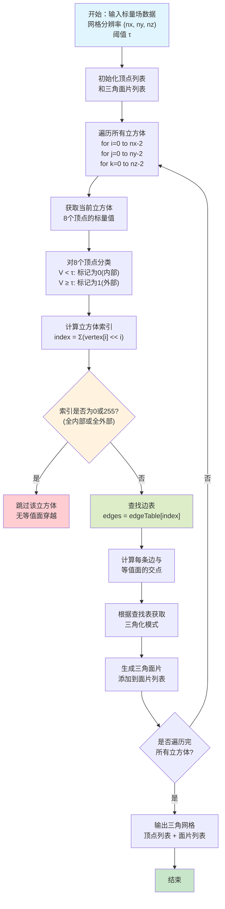
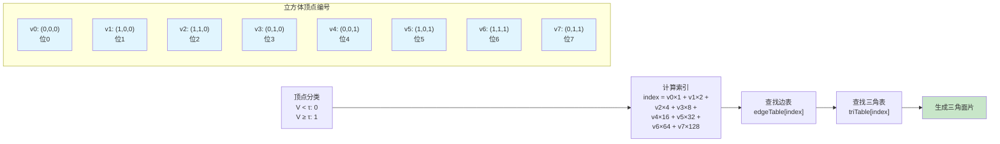

移动立方体算法（Marching Cubes Algorithm）是由 Lorensen 和 Cline 在1987年提出的经典算法，用于从三维标量场数据中提取等值面，构建三角网格模型。该算法在医学影像（CT、MRI）、科学可视化、地质建模等领域有着广泛应用。其核心思想是将三维空间划分为立方体网格，通过检查每个立方体的顶点标量值，确定等值面与立方体的交线，进而生成三角面片。

## 一、算法基本概念

### 1.1 问题描述

给定一个三维标量场函数 $f(x, y, z)$ 和阈值 $\tau$，我们需要提取满足 $f(x, y, z) = \tau$ 的所有点的集合，即等值面（isosurface），并用三角网格表示。

在实际应用中，$f(x, y, z)$ 通常以离散采样点的形式给出，即在一个规则的三维网格上，每个网格点 $(i, j, k)$ 对应一个标量值 $V_{i,j,k}$。

### 1.2 基本思想

移动立方体算法的基本思想是：

1. **空间划分**：将三维空间划分为规则的立方体网格
2. **顶点分类**：对每个立方体的8个顶点，根据其标量值与阈值的关系，标记为"内部"（小于阈值）或"外部"（大于等于阈值）
3. **查找表**：根据8个顶点的标记状态，查找对应的三角化模式
4. **插值计算**：在等值面与立方体边的交点处进行线性插值，确定顶点位置
5. **三角化**：根据查找表的模式，生成三角面片

## 二、算法流程详解

### 2.1 立方体的结构

对于每个立方体(体素)，都共有八个顶点(体元)。


### 2.2 立方体顶点分类

对于每个立方体，有8个顶点，每个顶点有两种状态：
- **内部点**：标量值 $$< \tau$$（$记为0）
- **外部点**：标量值 $$\geq \tau$$（记为1）

因此，8个顶点共有 $2^8 = 256$ 种可能的组合状态。由于对称性，实际只需要考虑15种不同的情况。


### 2.3 等值面与立方体的交点

等值面与立方体的交点必然位于立方体的边上。对于每条边，如果两个端点的标量值一个小于阈值、一个大于等于阈值，则等值面与该边有且仅有一个交点。

1.**线性插值**：交点位置可以通过线性插值计算：


$$P = P_1 + \frac{\tau - V_1}{V_2 - V_1}(P_2 - P_1)$$

其中：
- $P_1, P_2$ 是边的两个端点
- $V_1, V_2$ 是对应的标量值
- $\tau$ 是阈值
- $P$ 是交点位置

2.**光线穿透**：通过光线穿透穿透原始物体表面找到真是体素对应体元间的交点。

## 移动立方体算法流程



**算法特点：**
- 🔵 **蓝色区域**：算法初始化和输入数据
- 🟡 **黄色区域**：决策节点（判断是否需要处理）
- 🔴 **红色区域**：跳过无交点的立方体
- 🟢 **绿色区域**：核心处理流程（交点计算和三角化）

## 立方体索引计算



**关键理解：**
1. **顶点编号**：每个立方体的8个顶点按特定顺序编号（0-7）
2. **位编码**：每个顶点用一个位表示（0或1），8个顶点组成一个8位整数
3. **索引范围**：0-255，对应256种可能的顶点状态组合
4. **对称性**：利用互补对称性（如果所有顶点状态取反，等值面不变），可将256种情况减少到15种基本模式

以二维举例描述编码规则：


## 三、查找表构造

### 3.1 边表（Edge Table）

边表用于快速确定哪些边与等值面相交。对于立方体的12条边，使用12位整数表示：

$$edgeMask = \sum_{i=0}^{11} edge_i \times 2^i$$

其中 $edge_i = 1$ 表示第 $i$ 条边与等值面相交，否则为0。

### 3.2 三角表（Triangle Table）

三角表存储每个立方体索引对应的三角化模式。每个模式由一系列顶点索引组成，每3个连续索引构成一个三角形。

### 3.3 15种基本模式

由于立方体的对称性和互补性，256种情况可以归结为15种基本模式：

1. **情况0**：全内部或全外部，无等值面
2. **情况1-5**：单顶点在外或在内
3. **情况6-10**：两个相对顶点在外或在内
4. **情况11-14**：更复杂的相交模式

## 四、算法实现细节

### 4.1 顶点插值计算

对于每条与等值面相交的边，需要计算交点的精确位置：

```cpp
// 伪代码：线性插值计算交点
Point3D interpolate(Point3D p1, Point3D p2, float v1, float v2, float threshold) {
    if (abs(v1 - v2) < epsilon) return p1;  // 避免除零
    
    float t = (threshold - v1) / (v2 - v1);
    return p1 + t * (p2 - p1);
}
```

数学表达式：

$$t = \frac{\tau - V_1}{V_2 - V_1}$$

$$P = (1-t) \cdot P_1 + t \cdot P_2$$

### 4.2 法向量计算

为了渲染高质量的三维模型，需要计算每个顶点的法向量。法向量可以通过梯度估计得到：

$$\nabla f = \left(\frac{\partial f}{\partial x}, \frac{\partial f}{\partial y}, \frac{\partial f}{\partial z}\right)$$

在离散网格中，可以使用中心差分法近似：

$$g_x = \frac{V_{i+1,j,k} - V_{i-1,j,k}}{2h}$$

$$g_y = \frac{V_{i,j+1,k} - V_{i,j-1,k}}{2h}$$

$$g_z = \frac{V_{i,j,k+1} - V_{i,j,k-1}}{2h}$$

其中 $h$ 是网格间距。归一化后的法向量为：

$$\mathbf{n} = \frac{\nabla f}{|\nabla f|}$$

## 五、应用示例

### 示例1：简单球体提取

**问题描述：** 从一个距离场中提取半径为 $R$ 的球面。

**解决方案：**

1. **定义标量场：**
   $$f(x, y, z) = \sqrt{x^2 + y^2 + z^2}$$

2. **设置阈值：**
   $$\tau = R$$

3. **应用算法：**
   - 对于每个立方体，计算8个顶点到原点的距离
   - 根据距离与 $R$ 的关系标记顶点
   - 生成等值面三角网格

**结果：** 得到一个由三角面片组成的球面网格。


## 六、算法优化与改进

### 6.1 计算复杂度

- **时间复杂度：** $O(n^3)$，其中 $n$ 是每个维度的网格分辨率
- **空间复杂度：** $O(n^3)$ 用于存储标量场数据

### 6.2 优化策略

1. **空间分割：** 使用八叉树等数据结构，只处理与等值面相交的区域
2. **并行计算：** 每个立方体可以独立处理，适合并行化
3. **自适应细化：** 在等值面附近使用更细的网格，远离等值面的区域使用粗网格
4. **缓存优化：** 重用相邻立方体共享的顶点和边

### 6.3 歧义性问题

原始移动立方体算法在某些配置下存在歧义性，可能导致网格出现空洞。解决方案包括：

- **双线性插值方法：** 使用更复杂的插值函数
- **歧义性检测：** 检测并特殊处理歧义情况
- **改进算法：** 如Marching Tetrahedra等变体

### 6.4 多属性mc算法  
不同的体元节点有不同的属性，在体元节点判断内外的时候的时候只跟自己同属性的判断。因此带标签的体元输入时，结果可能为多个体。简单描述就是不同体带不同属性进入MC构造一次。但是由于多层进入MC初始化加重新遍历，n个标签就要操作n次，时间复杂度高。因此，根据论文方案采取了利用细分最小基本体素单元，更换体素构型的方案(体素重新划分8个块根据8个角点的不同属性构造)。

多次构造：  
MC(sdf_tooth) → Mesh_tooth  
MC(sdf_bone)  → Mesh_bone  
MC(sdf_gum)   → Mesh_gum  

单次构造：  
MCTT(sdf_bone_tooth_gum) -> Mesh_tooth,Mesh_bone,Mesh_gum


### 6.5 跨体素算法  
（算法是一种将不同分辨率体素数据生成的相邻三角网格无缝拼接在一起的方法，从而使细节层次（LOD）能够应用于大型体素数据集）

Transvoxel算法的工作原理是在以一种分辨率采样的体素数据和以该分辨率一半采样的体素数据之间的边界上，在常规单元之间插入特殊的过渡单元。我们并非考虑过渡边界处全分辨率和半分辨率数据的所有可能的体素状态组合（这将需要处理大约120万个案例），而是仅考虑高分辨率数据的9个样本。这使得我们需要处理的案例数量大大减少，仅为512个，而这些案例恰好属于图2所示的73个等价类。每个过渡单元都填充有这些三角形图案之一，以便完美填充不同分辨率网格之间出现的接缝、裂缝和孔洞，正如图1中洞穴的处理方式一样。

📄 [跨体素算法的网站](https://transvoxel.org/)


**相关参考资料：**  
📄 [Octree-Based Decimation of Marching Cubes Surface]({{ site.baseurl }}/files/marching cude/Multiple%20material%20marching%20cubes%20algorithm.pdf) - 基于多材质MC行进立方体算法

### 6.5 OCtree加速构建算法  

传统 MC 的问题
* 分辨率固定 → **细节要靠整体加密**  
* **内存爆炸**（$N^3$）  
* **量空区域也在跑** Marching Cube 
* 牙齿 / 骨骼这种 **局部高曲率、局部细节** 非常浪费

Octree + MC 的优势"哪里复杂就细，哪里简单就粗"
Octree 的思想其实非常直观：
1.把这件事和 MC 结合起来，等价于：
2.不在整个体素网格上跑 MC，只在“真正需要的地方”跑

#### 1. Octree 的细分判定（核心逻辑）
对于一个 Octree cell，我只做了一件事：

> **在 8 个角点采样 SDF**

* 如果全部 > 0 或全部 < 0  
    → 这个 cell 完全在内 / 外，不可能有表面
    
* 如果正负混合  
    → 等值面穿过该 cell
    
是否继续细分，取决于：
* cell 的尺寸是否大于最小阈值  
* SDF / 法向变化是否足够大  
否则，该 cell 就作为 **叶节点**，交给 MC 处理。

* * *

#### 2. 在 Octree 叶节点上跑 MC

这一阶段非常“朴素”：

* 每个叶节点就是一个小立方体
    
* 使用标准 MC 的 edge table / tri table
    
* 在这个 cell 内生成三角形
    

也就是说：
> **Octree 负责“剪枝”，MC 负责“成型”。**


**相关参考资料：**  
📄 [Octree-Based Decimation of Marching Cubes Surface]({{ site.baseurl }}/files/marching cude/5_Octree-Based%20Decimation%20of%20Marching%20Cubes%20Surface.ppt) - 基于八叉树的移动立方体表面简化方法

**具体实现和代码：**
📄 [参考meshlab中对possion重建中的MC算法优化和实现](https://github.com/cnr-isti-vclab/meshlab/tree/main/src/meshlabplugins/filter_screened_poisson/Src)

## 七、算法步骤总结以及代码

**移动立方体算法的完整步骤：**

1. **初始化：** 输入标量场数据 $V_{i,j,k}$，设置阈值 $\tau$，初始化顶点列表和面片列表

2. **遍历立方体：** 对每个立方体 $(i, j, k)$，其中 $i \in [0, nx-2]$，$j \in [0, ny-2]$，$k \in [0, nz-2]$

3. **顶点分类：** 获取8个顶点的标量值，根据与阈值的关系标记为0（内部）或1（外部）

4. **计算索引：** 
   $$index = \sum_{i=0}^{7} vertex_i \times 2^i$$

5. **判断：** 如果 $index = 0$ 或 $index = 255$，跳过该立方体（无等值面穿越）

6. **查找边表：** 根据 $index$ 查找 $edgeTable[index]$，确定哪些边与等值面相交

7. **计算交点：** 对每条相交的边，使用线性插值计算交点位置：
   $$P = P_1 + \frac{\tau - V_1}{V_2 - V_1}(P_2 - P_1)$$

8. **三角化：** 根据 $triTable[index]$ 获取三角化模式，生成三角面片

9. **计算法向量：** （可选）使用梯度估计计算顶点法向量

10. **输出结果：** 返回顶点列表和三角面片索引列表

**算法特点：**
- ✅ 适用于规则网格数据
- ✅ 生成连续的三角网格
- ✅ 计算效率高，适合实时应用
- ⚠️ 存在歧义性问题（可通过改进方法解决）
- ⚠️ 内存占用较大（需要存储完整网格数据）


**注意事项：**
- 阈值的选择对结果影响很大，需要根据应用场景调整
- 对于高分辨率数据，需要考虑内存和计算资源的限制
- 生成的网格可能包含冗余顶点，需要进行优化
- 在某些复杂情况下，可能需要后处理来改善网格质量

**代码：**

1.**python示例代码:**

```python
## 安装
pip install scikit-image numpy
import numpy as np
from skimage import measure

# 构造一个 3D 标量场（例：球的 SDF）
N = 64
x, y, z = np.mgrid[-1:1:N*1j, -1:1:N*1j, -1:1:N*1j]
sdf = x**2 + y**2 + z**2 - 0.5**2   # 球的 SDF

# Marching Cubes
verts, faces, normals, values = measure.marching_cubes(
    sdf,
    level=0.0,          # 等值面（SDF = 0）
    spacing=(1.0, 1.0, 1.0)
)

print("V:", verts.shape)   # (n, 3)
print("F:", faces.shape)   # (m, 3)
```

2.**c++（libigl）示例代码:**
```cpp
#include <igl/marching_cubes.h>
#include <Eigen/Core>
#include <iostream>

int main()
{
    int nx = 50, ny = 50, nz = 50;

    // 标量场
    Eigen::VectorXd S(nx * ny * nz);

    // 网格坐标
    Eigen::VectorXd X(nx), Y(ny), Z(nz);

    for (int i = 0; i < nx; i++) X(i) = -1.0 + 2.0 * i / (nx - 1);
    for (int j = 0; j < ny; j++) Y(j) = -1.0 + 2.0 * j / (ny - 1);
    for (int k = 0; k < nz; k++) Z(k) = -1.0 + 2.0 * k / (nz - 1);

    // 构造球的 SDF
    for (int i = 0; i < nx; i++)
        for (int j = 0; j < ny; j++)
            for (int k = 0; k < nz; k++)
            {
                double x = X(i), y = Y(j), z = Z(k);
                double sdf = x*x + y*y + z*z - 0.5*0.5;
                S(i + nx * (j + ny * k)) = sdf;
            }

    // MC 输出
    Eigen::MatrixXd V;
    Eigen::MatrixXi F;

    igl::marching_cubes(S, X, Y, Z, 0.0, V, F);

    std::cout << "V: " << V.rows() << std::endl;
    std::cout << "F: " << F.rows() << std::endl;

    return 0;
}


```
**注：查找表：**
```cpp
const int MarchingCubes::triangles[1<<Cube::CORNERS][MAX_TRIANGLES*3+1] = {
	{  -1,  -1,  -1,  -1,  -1,  -1,  -1,  -1,  -1,  -1,  -1,  -1,  -1,  -1,  -1,  -1},
	{   0,   4,   8,  -1,  -1,  -1,  -1,  -1,  -1,  -1,  -1,  -1,  -1,  -1,  -1,  -1},
	{   5,   0,   9,  -1,  -1,  -1,  -1,  -1,  -1,  -1,  -1,  -1,  -1,  -1,  -1,  -1},
	{   8,   9,   5,   8,   5,   4,  -1,  -1,  -1,  -1,  -1,  -1,  -1,  -1,  -1,  -1},
	{   1,   5,  11,  -1,  -1,  -1,  -1,  -1,  -1,  -1,  -1,  -1,  -1,  -1,  -1,  -1},
	{   0,   4,   8,   1,   5,  11,  -1,  -1,  -1,  -1,  -1,  -1,  -1,  -1,  -1,  -1},
	{   9,  11,   1,   9,   1,   0,  -1,  -1,  -1,  -1,  -1,  -1,  -1,  -1,  -1,  -1},
	{   8,   9,  11,   8,  11,   1,   8,   1,   4,  -1,  -1,  -1,  -1,  -1,  -1,  -1},
	{   4,   1,  10,  -1,  -1,  -1,  -1,  -1,  -1,  -1,  -1,  -1,  -1,  -1,  -1,  -1},
	{  10,   8,   0,  10,   0,   1,  -1,  -1,  -1,  -1,  -1,  -1,  -1,  -1,  -1,  -1},
	{   5,   0,   9,   4,   1,  10,  -1,  -1,  -1,  -1,  -1,  -1,  -1,  -1,  -1,  -1},
	{  10,   8,   9,  10,   9,   5,  10,   5,   1,  -1,  -1,  -1,  -1,  -1,  -1,  -1},
	{  11,  10,   4,  11,   4,   5,  -1,  -1,  -1,  -1,  -1,  -1,  -1,  -1,  -1,  -1},
	{  11,  10,   8,  11,   8,   0,  11,   0,   5,  -1,  -1,  -1,  -1,  -1,  -1,  -1},
	{   9,  11,  10,   9,  10,   4,   9,   4,   0,  -1,  -1,  -1,  -1,  -1,  -1,  -1},
	{   8,   9,  11,   8,  11,  10,  -1,  -1,  -1,  -1,  -1,  -1,  -1,  -1,  -1,  -1},
	{   8,   6,   2,  -1,  -1,  -1,  -1,  -1,  -1,  -1,  -1,  -1,  -1,  -1,  -1,  -1},
	{   6,   2,   0,   4,   6,   0,  -1,  -1,  -1,  -1,  -1,  -1,  -1,  -1,  -1,  -1},
	{   6,   2,   8,   5,   0,   9,  -1,  -1,  -1,  -1,  -1,  -1,  -1,  -1,  -1,  -1},
	{   5,   4,   6,   9,   5,   6,   2,   9,   6,  -1,  -1,  -1,  -1,  -1,  -1,  -1},
	{   1,   5,  11,   8,   6,   2,  -1,  -1,  -1,  -1,  -1,  -1,  -1,  -1,  -1,  -1},
	{   1,   5,  11,   6,   2,   0,   4,   6,   0,  -1,  -1,  -1,  -1,  -1,  -1,  -1},
	{   6,   2,   8,   9,  11,   1,   9,   1,   0,  -1,  -1,  -1,  -1,  -1,  -1,  -1},
	{   9,  11,   2,   2,  11,   1,   2,   1,   6,   6,   1,   4,  -1,  -1,  -1,  -1},
	{   1,  10,   4,   2,   8,   6,  -1,  -1,  -1,  -1,  -1,  -1,  -1,  -1,  -1,  -1},
	{   2,   0,   1,   6,   2,   1,  10,   6,   1,  -1,  -1,  -1,  -1,  -1,  -1,  -1},
	{   5,   0,   9,   4,   1,  10,   8,   6,   2,  -1,  -1,  -1,  -1,  -1,  -1,  -1},
	{   5,   2,   9,   5,   6,   2,   5,   1,   6,   1,  10,   6,  -1,  -1,  -1,  -1},
	{   2,   8,   6,   4,   5,  11,   4,  11,  10,  -1,  -1,  -1,  -1,  -1,  -1,  -1},
	{   5,   2,   0,   6,   2,   5,  11,   6,   5,  10,   6,  11,  -1,  -1,  -1,  -1},
	{   9,  11,  10,   9,  10,   4,   9,   4,   0,   8,   6,   2,  -1,  -1,  -1,  -1},
	{   9,  11,   2,   2,  11,   6,  10,   6,  11,  -1,  -1,  -1,  -1,  -1,  -1,  -1},
	{   9,   2,   7,  -1,  -1,  -1,  -1,  -1,  -1,  -1,  -1,  -1,  -1,  -1,  -1,  -1},
	{   7,   9,   2,   4,   8,   0,  -1,  -1,  -1,  -1,  -1,  -1,  -1,  -1,  -1,  -1},
	{   0,   2,   7,   0,   7,   5,  -1,  -1,  -1,  -1,  -1,  -1,  -1,  -1,  -1,  -1},
	{   7,   5,   4,   2,   7,   4,   8,   2,   4,  -1,  -1,  -1,  -1,  -1,  -1,  -1},
	{   7,   9,   2,   5,  11,   1,  -1,  -1,  -1,  -1,  -1,  -1,  -1,  -1,  -1,  -1},
	{   1,   5,  11,   0,   4,   8,   9,   2,   7,  -1,  -1,  -1,  -1,  -1,  -1,  -1},
	{   1,   0,   2,   1,   2,   7,   1,   7,  11,  -1,  -1,  -1,  -1,  -1,  -1,  -1},
	{   1,   7,  11,   1,   2,   7,   1,   4,   2,   4,   8,   2,  -1,  -1,  -1,  -1},
	{   4,   1,  10,   9,   2,   7,  -1,  -1,  -1,  -1,  -1,  -1,  -1,  -1,  -1,  -1},
	{   7,   9,   2,   0,   1,  10,   0,  10,   8,  -1,  -1,  -1,  -1,  -1,  -1,  -1},
	{   4,   1,  10,   2,   7,   5,   0,   2,   5,  -1,  -1,  -1,  -1,  -1,  -1,  -1},
	{   2,  10,   8,   1,  10,   2,   7,   1,   2,   5,   1,   7,  -1,  -1,  -1,  -1},
	{   7,   9,   2,  10,   4,   5,  11,  10,   5,  -1,  -1,  -1,  -1,  -1,  -1,  -1},
	{  11,  10,   8,  11,   8,   0,  11,   0,   5,   9,   2,   7,  -1,  -1,  -1,  -1},
	{  11,  10,   7,   7,  10,   4,   7,   4,   2,   2,   4,   0,  -1,  -1,  -1,  -1},
	{  11,  10,   7,   7,  10,   2,   8,   2,  10,  -1,  -1,  -1,  -1,  -1,  -1,  -1},
	{   7,   9,   8,   6,   7,   8,  -1,  -1,  -1,  -1,  -1,  -1,  -1,  -1,  -1,  -1},
	{   4,   6,   7,   0,   4,   7,   9,   0,   7,  -1,  -1,  -1,  -1,  -1,  -1,  -1},
	{   6,   7,   5,   8,   6,   5,   0,   8,   5,  -1,  -1,  -1,  -1,  -1,  -1,  -1},
	{   4,   6,   7,   5,   4,   7,  -1,  -1,  -1,  -1,  -1,  -1,  -1,  -1,  -1,  -1},
	{   5,  11,   1,   8,   6,   7,   9,   8,   7,  -1,  -1,  -1,  -1,  -1,  -1,  -1},
	{   4,   6,   7,   0,   4,   7,   9,   0,   7,  11,   1,   5,  -1,  -1,  -1,  -1},
	{   8,   1,   0,  11,   1,   8,   6,  11,   8,   7,  11,   6,  -1,  -1,  -1,  -1},
	{  11,   6,   7,   1,   6,  11,   6,   1,   4,  -1,  -1,  -1,  -1,  -1,  -1,  -1},
	{   1,  10,   4,   6,   7,   9,   6,   9,   8,  -1,  -1,  -1,  -1,  -1,  -1,  -1},
	{   0,   1,   9,   9,   1,  10,   9,  10,   7,   7,  10,   6,  -1,  -1,  -1,  -1},
	{   6,   7,   5,   8,   6,   5,   0,   8,   5,   1,  10,   4,  -1,  -1,  -1,  -1},
	{   1,   7,   5,  10,   7,   1,   7,  10,   6,  -1,  -1,  -1,  -1,  -1,  -1,  -1},
	{  11,  10,   4,  11,   4,   5,   7,   9,   8,   6,   7,   8,  -1,  -1,  -1,  -1},
	{   0,   6,   9,   9,   6,   7,   6,   0,   5,   5,  11,  10,   5,  10,   6,  -1},
	{   8,   7,   0,   6,   7,   8,   4,   0,   7,  11,  10,   4,   7,  11,   4,  -1},
	{  11,  10,   6,  11,   6,   7,  -1,  -1,  -1,  -1,  -1,  -1,  -1,  -1,  -1,  -1},
	{  11,   7,   3,  -1,  -1,  -1,  -1,  -1,  -1,  -1,  -1,  -1,  -1,  -1,  -1,  -1},
	{   0,   4,   8,  11,   7,   3,  -1,  -1,  -1,  -1,  -1,  -1,  -1,  -1,  -1,  -1},
	{   9,   5,   0,  11,   7,   3,  -1,  -1,  -1,  -1,  -1,  -1,  -1,  -1,  -1,  -1},
	{  11,   7,   3,   4,   8,   9,   5,   4,   9,  -1,  -1,  -1,  -1,  -1,  -1,  -1},
	{   3,   1,   5,   3,   5,   7,  -1,  -1,  -1,  -1,  -1,  -1,  -1,  -1,  -1,  -1},
	{   0,   4,   8,   7,   3,   1,   5,   7,   1,  -1,  -1,  -1,  -1,  -1,  -1,  -1},
	{   3,   1,   0,   3,   0,   9,   3,   9,   7,  -1,  -1,  -1,  -1,  -1,  -1,  -1},
	{   7,   8,   9,   4,   8,   7,   3,   4,   7,   1,   4,   3,  -1,  -1,  -1,  -1},
	{   1,  10,   4,   3,  11,   7,  -1,  -1,  -1,  -1,  -1,  -1,  -1,  -1,  -1,  -1},
	{   3,  11,   7,   8,   0,   1,  10,   8,   1,  -1,  -1,  -1,  -1,  -1,  -1,  -1},
	{   4,   1,  10,   5,   0,   9,  11,   7,   3,  -1,  -1,  -1,  -1,  -1,  -1,  -1},
	{  10,   8,   9,  10,   9,   5,  10,   5,   1,  11,   7,   3,  -1,  -1,  -1,  -1},
	{   4,   5,   7,   4,   7,   3,   4,   3,  10,  -1,  -1,  -1,  -1,  -1,  -1,  -1},
	{  10,   8,   3,   3,   8,   0,   3,   0,   7,   7,   0,   5,  -1,  -1,  -1,  -1},
	{   4,   3,  10,   4,   7,   3,   4,   0,   7,   0,   9,   7,  -1,  -1,  -1,  -1},
	{  10,   8,   3,   3,   8,   7,   9,   7,   8,  -1,  -1,  -1,  -1,  -1,  -1,  -1},
	{  11,   7,   3,   8,   6,   2,  -1,  -1,  -1,  -1,  -1,  -1,  -1,  -1,  -1,  -1},
	{  11,   7,   3,   2,   0,   4,   2,   4,   6,  -1,  -1,  -1,  -1,  -1,  -1,  -1},
	{  11,   7,   3,   8,   6,   2,   5,   0,   9,  -1,  -1,  -1,  -1,  -1,  -1,  -1},
	{   5,   4,   6,   9,   5,   6,   2,   9,   6,   3,  11,   7,  -1,  -1,  -1,  -1},
	{   8,   6,   2,   3,   1,   5,   3,   5,   7,  -1,  -1,  -1,  -1,  -1,  -1,  -1},
	{   3,   1,   5,   3,   5,   7,   6,   2,   0,   4,   6,   0,  -1,  -1,  -1,  -1},
	{   3,   1,   0,   3,   0,   9,   3,   9,   7,   2,   8,   6,  -1,  -1,  -1,  -1},
	{   9,   4,   2,   2,   4,   6,   4,   9,   7,   7,   3,   1,   7,   1,   4,  -1},
	{   8,   6,   2,  11,   7,   3,   4,   1,  10,  -1,  -1,  -1,  -1,  -1,  -1,  -1},
	{   2,   0,   1,   6,   2,   1,  10,   6,   1,  11,   7,   3,  -1,  -1,  -1,  -1},
	{   5,   0,   9,   4,   1,  10,   8,   6,   2,  11,   7,   3,  -1,  -1,  -1,  -1},
	{  11,   7,   3,   5,   2,   9,   5,   6,   2,   5,   1,   6,   1,  10,   6,  -1},
	{   4,   5,   7,   4,   7,   3,   4,   3,  10,   6,   2,   8,  -1,  -1,  -1,  -1},
	{  10,   5,   3,   3,   5,   7,   5,  10,   6,   6,   2,   0,   6,   0,   5,  -1},
	{   8,   6,   2,   4,   3,  10,   4,   7,   3,   4,   0,   7,   0,   9,   7,  -1},
	{   9,   7,  10,  10,   7,   3,  10,   6,   9,   6,   2,   9,  -1,  -1,  -1,  -1},
	{   3,  11,   9,   2,   3,   9,  -1,  -1,  -1,  -1,  -1,  -1,  -1,  -1,  -1,  -1},
	{   4,   8,   0,   2,   3,  11,   2,  11,   9,  -1,  -1,  -1,  -1,  -1,  -1,  -1},
	{   0,   2,   3,   0,   3,  11,   0,  11,   5,  -1,  -1,  -1,  -1,  -1,  -1,  -1},
	{   2,   3,   8,   8,   3,  11,   8,  11,   4,   4,  11,   5,  -1,  -1,  -1,  -1},
	{   2,   3,   1,   2,   1,   5,   2,   5,   9,  -1,  -1,  -1,  -1,  -1,  -1,  -1},
	{   2,   3,   1,   2,   1,   5,   2,   5,   9,   0,   4,   8,  -1,  -1,  -1,  -1},
	{   0,   2,   3,   0,   3,   1,  -1,  -1,  -1,  -1,  -1,  -1,  -1,  -1,  -1,  -1},
	{   2,   3,   8,   8,   3,   4,   1,   4,   3,  -1,  -1,  -1,  -1,  -1,  -1,  -1},
	{   1,  10,   4,   9,   2,   3,  11,   9,   3,  -1,  -1,  -1,  -1,  -1,  -1,  -1},
	{  10,   8,   0,  10,   0,   1,   3,  11,   9,   2,   3,   9,  -1,  -1,  -1,  -1},
	{   0,   2,   3,   0,   3,  11,   0,  11,   5,   1,  10,   4,  -1,  -1,  -1,  -1},
	{   5,   2,  11,  11,   2,   3,   2,   5,   1,   1,  10,   8,   1,   8,   2,  -1},
	{  10,   2,   3,   9,   2,  10,   4,   9,  10,   5,   9,   4,  -1,  -1,  -1,  -1},
	{   5,  10,   0,   0,  10,   8,  10,   5,   9,   9,   2,   3,   9,   3,  10,  -1},
	{   0,   2,   4,   4,   2,  10,   3,  10,   2,  -1,  -1,  -1,  -1,  -1,  -1,  -1},
	{  10,   8,   2,  10,   2,   3,  -1,  -1,  -1,  -1,  -1,  -1,  -1,  -1,  -1,  -1},
	{  11,   9,   8,   3,  11,   8,   6,   3,   8,  -1,  -1,  -1,  -1,  -1,  -1,  -1},
	{   0,  11,   9,   3,  11,   0,   4,   3,   0,   6,   3,   4,  -1,  -1,  -1,  -1},
	{  11,   5,   3,   5,   0,   3,   0,   6,   3,   0,   8,   6,  -1,  -1,  -1,  -1},
	{   3,   4,   6,  11,   4,   3,   4,  11,   5,  -1,  -1,  -1,  -1,  -1,  -1,  -1},
	{   3,   1,   6,   6,   1,   5,   6,   5,   8,   8,   5,   9,  -1,  -1,  -1,  -1},
	{   0,   6,   9,   4,   6,   0,   5,   9,   6,   3,   1,   5,   6,   3,   5,  -1},
	{   3,   1,   6,   6,   1,   8,   0,   8,   1,  -1,  -1,  -1,  -1,  -1,  -1,  -1},
	{   3,   1,   4,   3,   4,   6,  -1,  -1,  -1,  -1,  -1,  -1,  -1,  -1,  -1,  -1},
	{  11,   9,   8,   3,  11,   8,   6,   3,   8,   4,   1,  10,  -1,  -1,  -1,  -1},
	{   3,   9,   6,  11,   9,   3,  10,   6,   9,   0,   1,  10,   9,   0,  10,  -1},
	{   4,   1,  10,  11,   5,   3,   5,   0,   3,   0,   6,   3,   0,   8,   6,  -1},
	{   5,  10,   6,   1,  10,   5,   6,  11,   5,   6,   3,  11,  -1,  -1,  -1,  -1},
	{  10,   5,   3,   4,   5,  10,   6,   3,   5,   9,   8,   6,   5,   9,   6,  -1},
	{   6,   3,  10,   9,   0,   5,  -1,  -1,  -1,  -1,  -1,  -1,  -1,  -1,  -1,  -1},
	{   3,  10,   0,   0,  10,   4,   0,   8,   3,   8,   6,   3,  -1,  -1,  -1,  -1},
	{   6,   3,  10,  -1,  -1,  -1,  -1,  -1,  -1,  -1,  -1,  -1,  -1,  -1,  -1,  -1},
	{  10,   3,   6,  -1,  -1,  -1,  -1,  -1,  -1,  -1,  -1,  -1,  -1,  -1,  -1,  -1},
	{   3,   6,  10,   0,   4,   8,  -1,  -1,  -1,  -1,  -1,  -1,  -1,  -1,  -1,  -1},
	{   5,   0,   9,  10,   3,   6,  -1,  -1,  -1,  -1,  -1,  -1,  -1,  -1,  -1,  -1},
	{   3,   6,  10,   8,   9,   5,   8,   5,   4,  -1,  -1,  -1,  -1,  -1,  -1,  -1},
	{  11,   1,   5,  10,   3,   6,  -1,  -1,  -1,  -1,  -1,  -1,  -1,  -1,  -1,  -1},
	{   0,   4,   8,   1,   5,  11,  10,   3,   6,  -1,  -1,  -1,  -1,  -1,  -1,  -1},
	{  10,   3,   6,   0,   9,  11,   1,   0,  11,  -1,  -1,  -1,  -1,  -1,  -1,  -1},
	{   8,   9,  11,   8,  11,   1,   8,   1,   4,  10,   3,   6,  -1,  -1,  -1,  -1},
	{   4,   1,   3,   6,   4,   3,  -1,  -1,  -1,  -1,  -1,  -1,  -1,  -1,  -1,  -1},
	{   0,   1,   3,   8,   0,   3,   6,   8,   3,  -1,  -1,  -1,  -1,  -1,  -1,  -1},
	{   5,   0,   9,   3,   6,   4,   1,   3,   4,  -1,  -1,  -1,  -1,  -1,  -1,  -1},
	{   8,   9,   6,   6,   9,   5,   6,   5,   3,   3,   5,   1,  -1,  -1,  -1,  -1},
	{   6,   4,   5,   6,   5,  11,   6,  11,   3,  -1,  -1,  -1,  -1,  -1,  -1,  -1},
	{   0,   6,   8,   0,   3,   6,   0,   5,   3,   5,  11,   3,  -1,  -1,  -1,  -1},
	{   3,   9,  11,   0,   9,   3,   6,   0,   3,   4,   0,   6,  -1,  -1,  -1,  -1},
	{   8,   9,   6,   6,   9,   3,  11,   3,   9,  -1,  -1,  -1,  -1,  -1,  -1,  -1},
	{   2,   8,  10,   3,   2,  10,  -1,  -1,  -1,  -1,  -1,  -1,  -1,  -1,  -1,  -1},
	{   3,   2,   0,  10,   3,   0,   4,  10,   0,  -1,  -1,  -1,  -1,  -1,  -1,  -1},
	{   5,   0,   9,   8,  10,   3,   8,   3,   2,  -1,  -1,  -1,  -1,  -1,  -1,  -1},
	{   9,   3,   2,  10,   3,   9,   5,  10,   9,   4,  10,   5,  -1,  -1,  -1,  -1},
	{  11,   1,   5,   2,   8,  10,   3,   2,  10,  -1,  -1,  -1,  -1,  -1,  -1,  -1},
	{   3,   2,   0,  10,   3,   0,   4,  10,   0,   5,  11,   1,  -1,  -1,  -1,  -1},
	{   9,  11,   1,   9,   1,   0,   2,   8,  10,   3,   2,  10,  -1,  -1,  -1,  -1},
	{  10,   2,   4,   3,   2,  10,   1,   4,   2,   9,  11,   1,   2,   9,   1,  -1},
	{   1,   3,   2,   4,   1,   2,   8,   4,   2,  -1,  -1,  -1,  -1,  -1,  -1,  -1},
	{   0,   1,   3,   2,   0,   3,  -1,  -1,  -1,  -1,  -1,  -1,  -1,  -1,  -1,  -1},
	{   1,   3,   2,   4,   1,   2,   8,   4,   2,   9,   5,   0,  -1,  -1,  -1,  -1},
	{   9,   3,   2,   5,   3,   9,   3,   5,   1,  -1,  -1,  -1,  -1,  -1,  -1,  -1},
	{   3,   2,  11,  11,   2,   8,  11,   8,   5,   5,   8,   4,  -1,  -1,  -1,  -1},
	{   5,   2,   0,  11,   2,   5,   2,  11,   3,  -1,  -1,  -1,  -1,  -1,  -1,  -1},
	{   4,   3,   8,   8,   3,   2,   3,   4,   0,   0,   9,  11,   0,  11,   3,  -1},
	{   9,  11,   3,   9,   3,   2,  -1,  -1,  -1,  -1,  -1,  -1,  -1,  -1,  -1,  -1},
	{  10,   3,   6,   9,   2,   7,  -1,  -1,  -1,  -1,  -1,  -1,  -1,  -1,  -1,  -1},
	{   9,   2,   7,  10,   3,   6,   0,   4,   8,  -1,  -1,  -1,  -1,  -1,  -1,  -1},
	{  10,   3,   6,   7,   5,   0,   7,   0,   2,  -1,  -1,  -1,  -1,  -1,  -1,  -1},
	{   7,   5,   4,   2,   7,   4,   8,   2,   4,  10,   3,   6,  -1,  -1,  -1,  -1},
	{  10,   3,   6,   9,   2,   7,   1,   5,  11,  -1,  -1,  -1,  -1,  -1,  -1,  -1},
	{  10,   3,   6,   9,   2,   7,   1,   5,  11,   0,   4,   8,  -1,  -1,  -1,  -1},
	{   1,   0,   2,   1,   2,   7,   1,   7,  11,   3,   6,  10,  -1,  -1,  -1,  -1},
	{  10,   3,   6,   1,   7,  11,   1,   2,   7,   1,   4,   2,   4,   8,   2,  -1},
	{   9,   2,   7,   6,   4,   1,   6,   1,   3,  -1,  -1,  -1,  -1,  -1,  -1,  -1},
	{   0,   1,   3,   8,   0,   3,   6,   8,   3,   7,   9,   2,  -1,  -1,  -1,  -1},
	{   0,   2,   7,   0,   7,   5,   4,   1,   3,   6,   4,   3,  -1,  -1,  -1,  -1},
	{   2,   5,   8,   7,   5,   2,   6,   8,   5,   1,   3,   6,   5,   1,   6,  -1},
	{   6,   4,   5,   6,   5,  11,   6,  11,   3,   7,   9,   2,  -1,  -1,  -1,  -1},
	{   9,   2,   7,   0,   6,   8,   0,   3,   6,   0,   5,   3,   5,  11,   3,  -1},
	{   3,   4,  11,   6,   4,   3,   7,  11,   4,   0,   2,   7,   4,   0,   7,  -1},
	{  11,   3,   8,   8,   3,   6,   8,   2,  11,   2,   7,  11,  -1,  -1,  -1,  -1},
	{   9,   8,  10,   7,   9,  10,   3,   7,  10,  -1,  -1,  -1,  -1,  -1,  -1,  -1},
	{   9,   0,   7,   0,   4,   7,   4,   3,   7,   4,  10,   3,  -1,  -1,  -1,  -1},
	{   8,  10,   0,   0,  10,   3,   0,   3,   5,   5,   3,   7,  -1,  -1,  -1,  -1},
	{  10,   5,   4,   3,   5,  10,   5,   3,   7,  -1,  -1,  -1,  -1,  -1,  -1,  -1},
	{   9,   8,  10,   7,   9,  10,   3,   7,  10,   1,   5,  11,  -1,  -1,  -1,  -1},
	{   1,   5,  11,   9,   0,   7,   0,   4,   7,   4,   3,   7,   4,  10,   3,  -1},
	{  11,   0,   7,   1,   0,  11,   3,   7,   0,   8,  10,   3,   0,   8,   3,  -1},
	{   7,   1,   4,  11,   1,   7,   4,   3,   7,   4,  10,   3,  -1,  -1,  -1,  -1},
	{   4,   9,   8,   7,   9,   4,   1,   7,   4,   3,   7,   1,  -1,  -1,  -1,  -1},
	{   7,   1,   3,   9,   1,   7,   1,   9,   0,  -1,  -1,  -1,  -1,  -1,  -1,  -1},
	{   8,   7,   0,   0,   7,   5,   7,   8,   4,   4,   1,   3,   4,   3,   7,  -1},
	{   5,   1,   3,   7,   5,   3,  -1,  -1,  -1,  -1,  -1,  -1,  -1,  -1,  -1,  -1},
	{   3,   4,  11,  11,   4,   5,   4,   3,   7,   7,   9,   8,   7,   8,   4,  -1},
	{   3,   9,   0,   7,   9,   3,   0,  11,   3,   0,   5,  11,  -1,  -1,  -1,  -1},
	{   3,   7,  11,   8,   4,   0,  -1,  -1,  -1,  -1,  -1,  -1,  -1,  -1,  -1,  -1},
	{   3,   7,  11,  -1,  -1,  -1,  -1,  -1,  -1,  -1,  -1,  -1,  -1,  -1,  -1,  -1},
	{   6,  10,  11,   7,   6,  11,  -1,  -1,  -1,  -1,  -1,  -1,  -1,  -1,  -1,  -1},
	{   0,   4,   8,  10,  11,   7,  10,   7,   6,  -1,  -1,  -1,  -1,  -1,  -1,  -1},
	{   9,   5,   0,   6,  10,  11,   7,   6,  11,  -1,  -1,  -1,  -1,  -1,  -1,  -1},
	{   8,   9,   5,   8,   5,   4,   6,  10,  11,   7,   6,  11,  -1,  -1,  -1,  -1},
	{   5,   7,   6,   5,   6,  10,   5,  10,   1,  -1,  -1,  -1,  -1,  -1,  -1,  -1},
	{   5,   7,   6,   5,   6,  10,   5,  10,   1,   4,   8,   0,  -1,  -1,  -1,  -1},
	{   1,   0,  10,  10,   0,   9,  10,   9,   6,   6,   9,   7,  -1,  -1,  -1,  -1},
	{   1,   7,  10,  10,   7,   6,   7,   1,   4,   4,   8,   9,   4,   9,   7,  -1},
	{   7,   6,   4,   7,   4,   1,   7,   1,  11,  -1,  -1,  -1,  -1,  -1,  -1,  -1},
	{  11,   0,   1,   8,   0,  11,   7,   8,  11,   6,   8,   7,  -1,  -1,  -1,  -1},
	{   7,   6,   4,   7,   4,   1,   7,   1,  11,   5,   0,   9,  -1,  -1,  -1,  -1},
	{  11,   6,   1,   7,   6,  11,   5,   1,   6,   8,   9,   5,   6,   8,   5,  -1},
	{   4,   5,   7,   4,   7,   6,  -1,  -1,  -1,  -1,  -1,  -1,  -1,  -1,  -1,  -1},
	{   5,   7,   0,   0,   7,   8,   6,   8,   7,  -1,  -1,  -1,  -1,  -1,  -1,  -1},
	{   7,   6,   9,   9,   6,   0,   4,   0,   6,  -1,  -1,  -1,  -1,  -1,  -1,  -1},
	{   8,   9,   7,   8,   7,   6,  -1,  -1,  -1,  -1,  -1,  -1,  -1,  -1,  -1,  -1},
	{   8,  10,  11,   2,   8,  11,   7,   2,  11,  -1,  -1,  -1,  -1,  -1,  -1,  -1},
	{  10,  11,   4,   4,  11,   7,   4,   7,   0,   0,   7,   2,  -1,  -1,  -1,  -1},
	{   8,  10,  11,   2,   8,  11,   7,   2,  11,   5,   0,   9,  -1,  -1,  -1,  -1},
	{   9,   4,   2,   5,   4,   9,   7,   2,   4,  10,  11,   7,   4,  10,   7,  -1},
	{   1,   8,  10,   2,   8,   1,   5,   2,   1,   7,   2,   5,  -1,  -1,  -1,  -1},
	{   1,   7,  10,   5,   7,   1,   4,  10,   7,   2,   0,   4,   7,   2,   4,  -1},
	{   7,   1,   9,   9,   1,   0,   1,   7,   2,   2,   8,  10,   2,  10,   1,  -1},
	{   7,   2,   9,  10,   1,   4,  -1,  -1,  -1,  -1,  -1,  -1,  -1,  -1,  -1,  -1},
	{   8,   4,   2,   4,   1,   2,   1,   7,   2,   1,  11,   7,  -1,  -1,  -1,  -1},
	{  11,   0,   1,   7,   0,  11,   0,   7,   2,  -1,  -1,  -1,  -1,  -1,  -1,  -1},
	{   5,   0,   9,   8,   4,   2,   4,   1,   2,   1,   7,   2,   1,  11,   7,  -1},
	{   2,   5,   1,   9,   5,   2,   1,   7,   2,   1,  11,   7,  -1,  -1,  -1,  -1},
	{   4,   5,   8,   8,   5,   2,   7,   2,   5,  -1,  -1,  -1,  -1,  -1,  -1,  -1},
	{   7,   2,   0,   5,   7,   0,  -1,  -1,  -1,  -1,  -1,  -1,  -1,  -1,  -1,  -1},
	{   7,   2,   4,   4,   2,   8,   4,   0,   7,   0,   9,   7,  -1,  -1,  -1,  -1},
	{   7,   2,   9,  -1,  -1,  -1,  -1,  -1,  -1,  -1,  -1,  -1,  -1,  -1,  -1,  -1},
	{  10,  11,   9,   6,  10,   9,   2,   6,   9,  -1,  -1,  -1,  -1,  -1,  -1,  -1},
	{  10,  11,   9,   6,  10,   9,   2,   6,   9,   0,   4,   8,  -1,  -1,  -1,  -1},
	{   5,  10,  11,   6,  10,   5,   0,   6,   5,   2,   6,   0,  -1,  -1,  -1,  -1},
	{   2,   5,   8,   8,   5,   4,   5,   2,   6,   6,  10,  11,   6,  11,   5,  -1},
	{  10,   1,   6,   1,   5,   6,   5,   2,   6,   5,   9,   2,  -1,  -1,  -1,  -1},
	{   0,   4,   8,  10,   1,   6,   1,   5,   6,   5,   2,   6,   5,   9,   2,  -1},
	{   1,   0,  10,  10,   0,   6,   2,   6,   0,  -1,  -1,  -1,  -1,  -1,  -1,  -1},
	{   2,   6,   1,   1,   6,  10,   1,   4,   2,   4,   8,   2,  -1,  -1,  -1,  -1},
	{  11,   9,   1,   1,   9,   2,   1,   2,   4,   4,   2,   6,  -1,  -1,  -1,  -1},
	{   8,   1,   6,   0,   1,   8,   2,   6,   1,  11,   9,   2,   1,  11,   2,  -1},
	{  11,   6,   1,   1,   6,   4,   6,  11,   5,   5,   0,   2,   5,   2,   6,  -1},
	{   2,   6,   8,  11,   5,   1,  -1,  -1,  -1,  -1,  -1,  -1,  -1,  -1,  -1,  -1},
	{   6,   4,   2,   2,   4,   9,   5,   9,   4,  -1,  -1,  -1,  -1,  -1,  -1,  -1},
	{   5,   9,   6,   6,   9,   2,   6,   8,   5,   8,   0,   5,  -1,  -1,  -1,  -1},
	{   0,   2,   6,   0,   6,   4,  -1,  -1,  -1,  -1,  -1,  -1,  -1,  -1,  -1,  -1},
	{   2,   6,   8,  -1,  -1,  -1,  -1,  -1,  -1,  -1,  -1,  -1,  -1,  -1,  -1,  -1},
	{   8,  10,  11,   9,   8,  11,  -1,  -1,  -1,  -1,  -1,  -1,  -1,  -1,  -1,  -1},
	{   0,  11,   9,   4,  11,   0,  11,   4,  10,  -1,  -1,  -1,  -1,  -1,  -1,  -1},
	{   5,  10,  11,   0,  10,   5,  10,   0,   8,  -1,  -1,  -1,  -1,  -1,  -1,  -1},
	{   4,  10,  11,   5,   4,  11,  -1,  -1,  -1,  -1,  -1,  -1,  -1,  -1,  -1,  -1},
	{   1,   8,  10,   5,   8,   1,   8,   5,   9,  -1,  -1,  -1,  -1,  -1,  -1,  -1},
	{   9,   4,  10,   0,   4,   9,  10,   5,   9,  10,   1,   5,  -1,  -1,  -1,  -1},
	{   0,   8,  10,   1,   0,  10,  -1,  -1,  -1,  -1,  -1,  -1,  -1,  -1,  -1,  -1},
	{  10,   1,   4,  -1,  -1,  -1,  -1,  -1,  -1,  -1,  -1,  -1,  -1,  -1,  -1,  -1},
	{   4,   9,   8,   1,   9,   4,   9,   1,  11,  -1,  -1,  -1,  -1,  -1,  -1,  -1},
	{   1,  11,   9,   0,   1,   9,  -1,  -1,  -1,  -1,  -1,  -1,  -1,  -1,  -1,  -1},
	{  11,   0,   8,   5,   0,  11,   8,   1,  11,   8,   4,   1,  -1,  -1,  -1,  -1},
	{  11,   5,   1,  -1,  -1,  -1,  -1,  -1,  -1,  -1,  -1,  -1,  -1,  -1,  -1,  -1},
	{   5,   9,   8,   4,   5,   8,  -1,  -1,  -1,  -1,  -1,  -1,  -1,  -1,  -1,  -1},
	{   9,   0,   5,  -1,  -1,  -1,  -1,  -1,  -1,  -1,  -1,  -1,  -1,  -1,  -1,  -1},
	{   8,   4,   0,  -1,  -1,  -1,  -1,  -1,  -1,  -1,  -1,  -1,  -1,  -1,  -1,  -1},
	{  -1,  -1,  -1,  -1,  -1,  -1,  -1,  -1,  -1,  -1,  -1,  -1,  -1,  -1,  -1,  -1}
};
```

