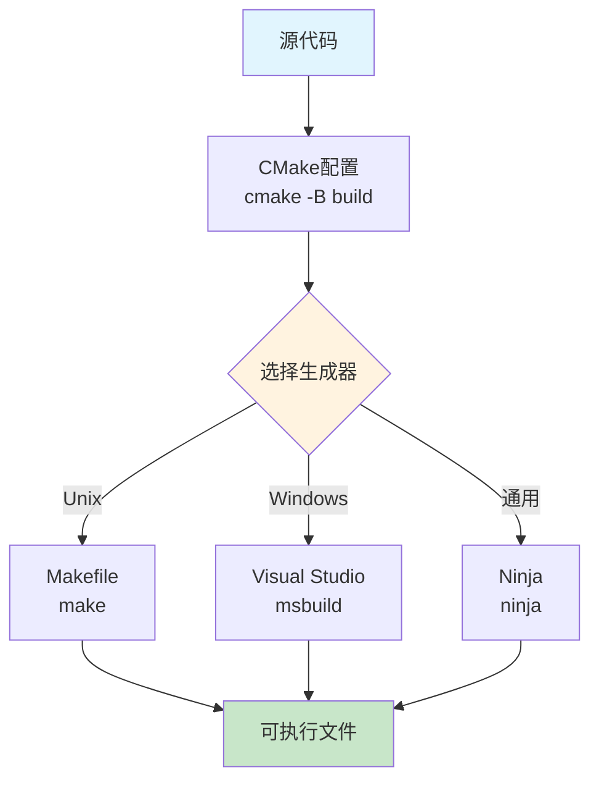
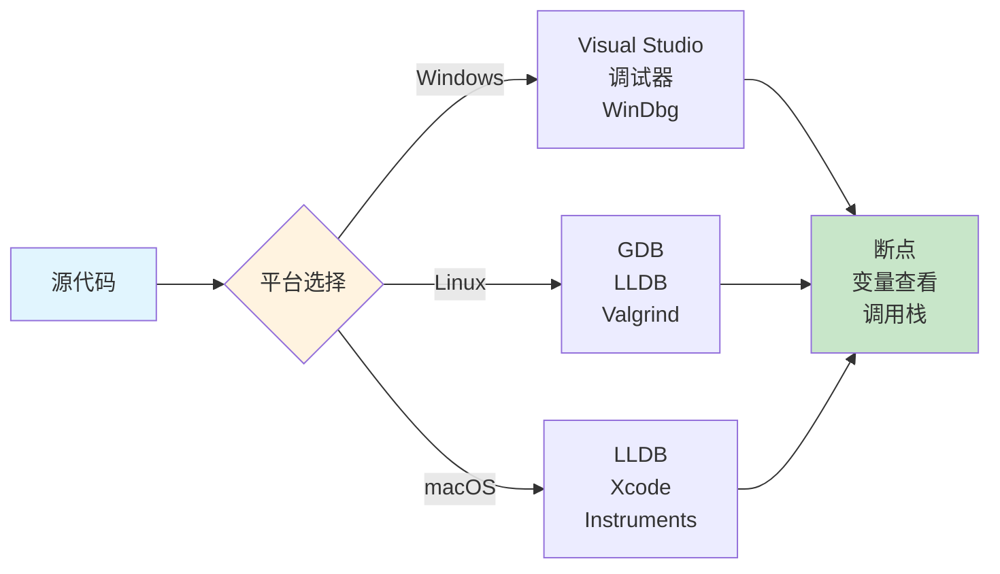

在现代软件开发中，跨平台支持已经成为许多项目的必需功能。C++作为系统级编程语言，在不同平台上存在诸多差异，包括编译器、标准库实现、系统API等。本文详细介绍C++项目在多平台（Windows、Linux、macOS）上的编译和调试方法，帮助开发者构建真正可移植的应用程序。

## 一、跨平台编译的挑战

### 1.0 文章涉及  
⚫**项目结构安排**:编译结构，子项目的分配，以及测试块的设置  
⚫**跨平台编译的项目内的定义**：包括导入导出库的设置，不同功能语句在平台的实现不同  
⚫**跨平台项目的gdb调试**：vs2019的gdb调试和直接在终端使用gdb调试  

### 1.1 主要挑战

跨平台C++开发面临的主要挑战包括：

1. **编译器差异**：MSVC、GCC、Clang在C++标准支持、扩展语法、警告级别上存在差异
2. **系统API差异**：文件系统、网络、线程等API在不同平台上完全不同
3. **路径分隔符**：Windows使用反斜杠`\`，Unix-like系统使用正斜杠`/`
4. **文件大小写敏感性**：Windows文件系统不区分大小写，Linux区分
5. **链接库差异**：静态库和动态库的命名和链接方式不同
6. **字符编码**：Windows默认使用宽字符，Linux使用UTF-8

### 1.2 平台检测方法

```cpp
// 平台检测宏定义
#if defined(_WIN32) || defined(_WIN64)
    #define PLATFORM_WINDOWS
#elif defined(__linux__)
    #define PLATFORM_LINUX
#elif defined(__APPLE__) && defined(__MACH__)
    #define PLATFORM_MACOS
#endif

// 编译器检测
#if defined(_MSC_VER)
    #define COMPILER_MSVC
#elif defined(__GNUC__)
    #define COMPILER_GCC
#elif defined(__clang__)
    #define COMPILER_CLANG
#endif

// 使用示例
void printPlatform() {
#ifdef PLATFORM_WINDOWS
    std::cout << "Running on Windows" << std::endl;
#elif defined(PLATFORM_LINUX)
    std::cout << "Running on Linux" << std::endl;
#elif defined(PLATFORM_MACOS)
    std::cout << "Running on macOS" << std::endl;
#endif
}
```

#### 1.2.1 项目命名空间和导出宏定义

```cpp
// 项目空间变量定义以及导出示例
#define _PGA ProgramA
#define _PGA_BEGIN namespace Program {
#define _PGA_END }

#ifdef __cplusplus
#define _C_START  extern "C" {
#define _CEND   }
#else
#define _C_START 
#define _CEND
#endif

#ifdef PGA_EXPORTS
#if defined(_MSC_VER)
#define _PGA_EXPORTS  __declspec(dllexport)
#else
#define _PGA_EXPORTS  __attribute__ ((visibility("default")))
#endif

#else
#if defined(_MSC_VER)
#  define _PGA_EXPORTS     __declspec(dllimport) 
#else
#  define _PGA_EXPORTS
#endif
#endif
```

#### 1.2.2 跨平台库导入导出详解

**动态库的符号导出机制：**

在Windows上，MSVC使用`__declspec(dllexport)`和`__declspec(dllimport)`来控制符号的导出和导入。而在Unix-like系统（Linux、macOS）上，默认所有符号都是可见的，需要显式控制符号可见性。

**完整的跨平台导出宏定义：**

```cpp
// export_macros.h
#ifndef EXPORT_MACROS_H
#define EXPORT_MACROS_H

// 在构建库时定义 MYLIBRARY_BUILDING_LIB
// 在使用库时不需要定义

#if defined(_WIN32) || defined(_WIN64)
    // Windows平台
    #ifdef MYLIBRARY_BUILDING_LIB
        #define MYLIBRARY_API __declspec(dllexport)
    #else
        #define MYLIBRARY_API __declspec(dllimport)
    #endif
    #define MYLIBRARY_LOCAL
#elif defined(__GNUC__) || defined(__clang__)
    // GCC和Clang编译器（Linux/macOS）
    #ifdef MYLIBRARY_BUILDING_LIB
        #define MYLIBRARY_API __attribute__((visibility("default")))
    #else
        #define MYLIBRARY_API
    #endif
    #define MYLIBRARY_LOCAL __attribute__((visibility("hidden")))
#else
    #define MYLIBRARY_API
    #define MYLIBRARY_LOCAL
#endif

// 使用示例
// 在库的头文件中：
class MYLIBRARY_API MyClass {
public:
    MYLIBRARY_API void publicFunction();
    MYLIBRARY_LOCAL void internalFunction();  // 内部函数，不导出
};

MYLIBRARY_API int globalFunction();  // 导出函数

#endif // EXPORT_MACROS_H
```

**说明：** 在实际使用中，将`MYLIBRARY`替换为您的项目名称，例如`PROJECTA_API`、`MYAPP_API`等。

**CMake中的导出设置：**

```cmake
# 在CMakeLists.txt中设置导出宏
add_library(mylib SHARED
    src/class1.cpp
    src/class2.cpp
)

# 定义构建宏（仅在构建库时定义）
# 注意：将MYLIBRARY替换为您的实际项目名称
target_compile_definitions(mylib PRIVATE
    MYLIBRARY_BUILDING_LIB=1
)

# 设置符号可见性（Linux/macOS）
if(UNIX)
    set_target_properties(mylib PROPERTIES
        CXX_VISIBILITY_PRESET hidden          # 默认隐藏所有符号
        VISIBILITY_INLINES_HIDDEN ON          # 内联函数也隐藏
    )
endif()

# 导出头文件目录
target_include_directories(mylib PUBLIC
    $<BUILD_INTERFACE:${CMAKE_CURRENT_SOURCE_DIR}/include>
    $<INSTALL_INTERFACE:include>
)
```

**平台特定功能实现的示例：**

```cpp
// platform_utils.h - 统一接口
#ifndef PLATFORM_UTILS_H
#define PLATFORM_UTILS_H

#include "export_macros.h"

class MYLIBRARY_API PlatformUtils {
public:
    // 获取系统时间（高精度）
    static double getSystemTime();
    
    // 创建线程
    static void* createThread(void (*func)(void*), void* arg);
    
    // 获取当前线程ID
    static unsigned long getCurrentThreadId();
    
    // 平台特定的内存对齐分配
    static void* alignedMalloc(size_t size, size_t alignment);
    static void alignedFree(void* ptr);
};

#endif // PLATFORM_UTILS_H
```

```cpp
// platform_utils_windows.cpp - Windows实现
#ifdef _WIN32
#include "platform_utils.h"
#include <windows.h>
#include <profileapi.h>

double PlatformUtils::getSystemTime() {
    LARGE_INTEGER frequency, counter;
    QueryPerformanceFrequency(&frequency);
    QueryPerformanceCounter(&counter);
    return static_cast<double>(counter.QuadPart) / frequency.QuadPart;
}

void* PlatformUtils::createThread(void (*func)(void*), void* arg) {
    return CreateThread(nullptr, 0, 
        reinterpret_cast<LPTHREAD_START_ROUTINE>(func), 
        arg, 0, nullptr);
}

unsigned long PlatformUtils::getCurrentThreadId() {
    return GetCurrentThreadId();
}

void* PlatformUtils::alignedMalloc(size_t size, size_t alignment) {
    return _aligned_malloc(size, alignment);
}

void PlatformUtils::alignedFree(void* ptr) {
    _aligned_free(ptr);
}
#endif // _WIN32
```

```cpp
// platform_utils_linux.cpp - Linux实现
#ifdef __linux__
#include "platform_utils.h"
#include <pthread.h>
#include <sys/time.h>
#include <unistd.h>
#include <sys/syscall.h>
#include <malloc.h>

double PlatformUtils::getSystemTime() {
    struct timespec ts;
    clock_gettime(CLOCK_MONOTONIC, &ts);
    return ts.tv_sec + ts.tv_nsec * 1e-9;
}

void* PlatformUtils::createThread(void (*func)(void*), void* arg) {
    pthread_t thread;
    if (pthread_create(&thread, nullptr, 
        reinterpret_cast<void*(*)(void*)>(func), arg) == 0) {
        return reinterpret_cast<void*>(thread);
    }
    return nullptr;
}

unsigned long PlatformUtils::getCurrentThreadId() {
    return syscall(SYS_gettid);
}

void* PlatformUtils::alignedMalloc(size_t size, size_t alignment) {
    return memalign(alignment, size);
}

void PlatformUtils::alignedFree(void* ptr) {
    free(ptr);
}
#endif // __linux__
```

**条件编译的常见模式：**

```cpp
// 字符串转换（Windows使用宽字符，Linux使用UTF-8）
#ifdef _WIN32
    #include <windows.h>
    #include <stringapiset.h>
    
    std::string wideToUtf8(const std::wstring& wide) {
        int size_needed = WideCharToMultiByte(
            CP_UTF8, 0, wide.c_str(), -1, nullptr, 0, nullptr, nullptr);
        std::string str(size_needed, 0);
        WideCharToMultiByte(
            CP_UTF8, 0, wide.c_str(), -1, &str[0], size_needed, nullptr, nullptr);
        return str;
    }
    
    std::wstring utf8ToWide(const std::string& utf8) {
        int size_needed = MultiByteToWideChar(
            CP_UTF8, 0, utf8.c_str(), -1, nullptr, 0);
        std::wstring wstr(size_needed, 0);
        MultiByteToWideChar(
            CP_UTF8, 0, utf8.c_str(), -1, &wstr[0], size_needed);
        return wstr;
    }
#else
    // Linux/macOS默认使用UTF-8，不需要转换
    std::string wideToUtf8(const std::string& str) { return str; }
    std::string utf8ToWide(const std::string& str) { return str; }
#endif
```


## 二、构建系统选择

### 2.1 CMake（推荐）

CMake是最流行的跨平台构建系统生成器，支持多种构建后端（Make、Ninja、Visual Studio等）。

#### CMakeLists.txt 基本结构

```cmake
cmake_minimum_required(VERSION 3.15)
project(MyProject VERSION 1.0.0 LANGUAGES CXX)

# 设置C++标准
set(CMAKE_CXX_STANDARD 17)
set(CMAKE_CXX_STANDARD_REQUIRED ON)
set(CMAKE_CXX_EXTENSIONS OFF)

# 编译选项
if(MSVC)
    add_compile_options(/W4 /WX- /permissive-)
    add_compile_definitions(_CRT_SECURE_NO_WARNINGS)
else()
    add_compile_options(-Wall -Wextra -Wpedantic -Werror)
endif()

# 根据平台设置输出目录
if(WIN32)
    set(CMAKE_RUNTIME_OUTPUT_DIRECTORY ${CMAKE_BINARY_DIR}/bin)
else()
    set(CMAKE_RUNTIME_OUTPUT_DIRECTORY ${CMAKE_BINARY_DIR}/bin)
endif()

# 添加可执行文件
add_executable(myapp 
    src/main.cpp
    src/utils.cpp
)

# 链接库
target_link_libraries(myapp PRIVATE 
    ${CMAKE_THREAD_LIBS_INIT}
)
```

#### 跨平台配置示例

```cmake
# 平台特定的源文件
if(WIN32)
    target_sources(myapp PRIVATE src/platform/windows_impl.cpp)
elseif(UNIX AND NOT APPLE)
    target_sources(myapp PRIVATE src/platform/linux_impl.cpp)
elseif(APPLE)
    target_sources(myapp PRIVATE src/platform/macos_impl.cpp)
endif()

# 平台特定的库
if(WIN32)
    target_link_libraries(myapp PRIVATE ws2_32)
elseif(UNIX)
    target_link_libraries(myapp PRIVATE pthread dl)
endif()
```


**以下均为示例:**

1.主项目A(统筹管理多个子分支，包括多个平台测试和python库的编译)

```cmake
cmake_minimum_required(VERSION 3.15)

project(Main_ProgramA LANGUAGES CXX)


if(NOT CMAKE_BUILD_TYPE)
  set(CMAKE_BUILD_TYPE "Release" CACHE STRING "Choose the type of build." FORCE)
endif()

option(BUILD_PYINTERFACE "Build pyIntewinTestrface module" ON)
option(BUILD_WINTEST     "Build module" OFF)
option(BUILD_PYTEST      "Build pyTest module" OFF)
option(BUILD_SHARED_LIBS "Build shared libraries" ON)
if(NOT BUILD_SHARED_LIBS)
   set(CMAKE_POSITION_INDEPENDENT_CODE ON)
endif()

if (MSVC AND NOT BUILD_SHARED_LIBS)
    set(CMAKE_MSVC_RUNTIME_LIBRARY "MultiThreaded$<$<CONFIG:Debug>:Debug>")
endif()

set(CMAKE_CXX_STANDARD 17)
set(CMAKE_CXX_STANDARD_REQUIRED ON)
set(CMAKE_CXX_EXTENSIONS OFF)

if(POLICY CMP0177)
    cmake_policy(SET CMP0177 NEW)
endif()

if(WIN32)
    set(IS_WINDOWS TRUE)
elseif(UNIX AND NOT APPLE)
    set(IS_LINUX TRUE)
elseif(APPLE)
    set(IS_MACOS TRUE)
endif()

if(IS_WINDOWS)
    set(ALL_DEV "${CMAKE_SOURCE_DIR}/external_windows")
elseif(IS_LINUX)
    set(ALL_DEV "${CMAKE_SOURCE_DIR}/external_linux")
endif()

message(STATUS "ALL_DEV path: ${ALL_DEV}")

include_directories(
    "${ALL_DEV}/inner/include"
)

# 定义平台特定的库扩展名
set(LIB_PREFIX "")
set(LIB_POSTFIX "")

if(IS_WINDOWS)
    set(LIB_PREFIX "")
    set(LIB_POSTFIX ".lib")
elseif(IS_LINUX OR IS_MACOS)
    set(LIB_PREFIX "lib")
    if(BUILD_SHARED_LIBS)
        set(LIB_POSTFIX ".so")
    else()
        set(LIB_POSTFIX ".a")
    endif()
    if(IS_MACOS)
        if(BUILD_SHARED_LIBS)
            set(LIB_POSTFIX ".dylib")
        else()
            set(LIB_POSTFIX ".a")
    endif()
    endif()
endif()

# 公共库目录
if (NOT BUILD_SHARED_LIBS)
    if(IS_WINDOWS)
		list(APPEND PLATFORM_LIBS
		    "${_DEV}/3rd/STATIC/openmesh/lib/${LIB_PREFIX}OpenMeshCore${LIB_POSTFIX}"
		    "${_DEV}/3rd/STATIC/openmesh/lib/${LIB_PREFIX}OpenMeshTools${LIB_POSTFIX}"
		    "${_DEV}/inner/static_lib/${LIB_PREFIX}BaseClass${LIB_POSTFIX}"
		    #"${_DEV}/3rd/gmp/lib/${LIB_PREFIX}gmp${LIB_POSTFIX}"
		    #"${_DEV}/3rd/mpfr/lib/${LIB_PREFIX}mpfr${LIB_POSTFIX}"
		)
    elseif(IS_LINUX)
		list(APPEND PLATFORM_LIBS
		    "${_DEV}/RunTimeSys/${LIB_PREFIX}OpenMeshCore${LIB_POSTFIX}"
		    "${_DEV}/RunTimeSys/${LIB_PREFIX}OpenMeshTools${LIB_POSTFIX}"
		    "${_DEV}/RunTimeSys/${LIB_PREFIX}BaseClass${LIB_POSTFIX}"
		    #"${_DEV}/3rd/gmp/lib/${LIB_PREFIX}gmp${LIB_POSTFIX}"
		    #"${_DEV}/3rd/mpfr/lib/${LIB_PREFIX}mpfr${LIB_POSTFIX}"
		    )
    endif()
else()
    if(IS_WINDOWS)
		list(APPEND PLATFORM_LIBS
		    "${_DEV}/3rd/openmesh/lib/${LIB_PREFIX}OpenMeshCore${LIB_POSTFIX}"
		    "${_DEV}/3rd/openmesh/lib/${LIB_PREFIX}OpenMeshTools${LIB_POSTFIX}"
		    "${_DEV}/inner/lib/${LIB_PREFIX}BaseClass${LIB_POSTFIX}"
		    #"${_DEV}/3rd/gmp/lib/${LIB_PREFIX}gmp${LIB_POSTFIX}"
		    #"${_DEV}/3rd/mpfr/lib/${LIB_PREFIX}mpfr${LIB_POSTFIX}"
		)
    elseif(IS_LINUX)
		list(APPEND PLATFORM_LIBS
		    "${_DEV}/RunTimeSys/${LIB_PREFIX}OpenMeshCore${LIB_POSTFIX}"
		    "${_DEV}/RunTimeSys/${LIB_PREFIX}OpenMeshTools${LIB_POSTFIX}"
		    "${_DEV}/RunTimeSys/${LIB_PREFIX}BaseClass${LIB_POSTFIX}"
		    #"${_DEV}/3rd/gmp/lib/${LIB_PREFIX}gmp${LIB_POSTFIX}"
		    #"${_DEV}/3rd/mpfr/lib/${LIB_PREFIX}mpfr${LIB_POSTFIX}"
		    )
    endif()
endif()

#添加子项目核心功能
add_subdirectory(core)

if(BUILD_PYINTERFACE)   
    add_subdirectory(pyInterface)
endif()

#if(BUILD_WINTEST)
#    add_subdirectory(winTest)
#endif()

#if(BUILD_PYTEST)
#    enable_testing()
#    add_subdirectory(pythonTest)
#endif()

```

#### 2.1.1 项目结构安排

对于大型跨平台项目，合理的项目结构是成功的基础。以下是推荐的目录结构：

```
MyProject/
├── CMakeLists.txt          # 根CMake配置文件
├── README.md
├── LICENSE
├── cmake/                  # CMake工具脚本
│   ├── FindXXX.cmake
│   └── PlatformUtils.cmake
├── src/                    # 核心源代码
│   ├── CMakeLists.txt
│   ├── core/              # 核心功能模块
│   ├── utils/             # 工具函数
│   └── platform/          # 平台特定实现
│       ├── windows/
│       ├── linux/
│       └── macos/
├── include/                # 公共头文件
│   └── MyProject/
│       ├── core.h
│       └── utils.h
├── test/                   # 测试代码
│   ├── CMakeLists.txt
│   ├── unit/              # 单元测试
│   └── integration/       # 集成测试
├── examples/               # 示例代码
│   └── CMakeLists.txt
├── python/                 # Python绑定（如果使用）
│   └── CMakeLists.txt
├── external/               # 第三方库（可选）
│   ├── windows/
│   └── linux/
└── build/                  # 构建目录（不提交到版本控制）
```

**子项目的分配策略：**

在根`CMakeLists.txt`中，通过`option`控制子项目的编译：

```cmake
# 根CMakeLists.txt
cmake_minimum_required(VERSION 3.15)
project(MyProject VERSION 1.0.0 LANGUAGES CXX)

# 构建选项
option(BUILD_CORE "Build core library" ON)
option(BUILD_TESTS "Build test executables" ON)
option(BUILD_EXAMPLES "Build example executables" OFF)
option(BUILD_PYTHON "Build Python bindings" OFF)

# 根据平台设置外部库路径
if(WIN32)
    set(EXTERNAL_DIR "${CMAKE_SOURCE_DIR}/external/windows")
elseif(UNIX)
    set(EXTERNAL_DIR "${CMAKE_SOURCE_DIR}/external/linux")
endif()

# 添加子目录
add_subdirectory(src)

if(BUILD_TESTS)
    enable_testing()
    add_subdirectory(test)
endif()

if(BUILD_EXAMPLES)
    add_subdirectory(examples)
endif()

if(BUILD_PYTHON)
    add_subdirectory(python)
endif()
```

**核心库的CMakeLists.txt：**

```cmake
# src/CMakeLists.txt
# 核心库
add_library(core_lib STATIC
    core/file1.cpp
    core/file2.cpp
    utils/utils.cpp
)

target_include_directories(core_lib PUBLIC
    $<BUILD_INTERFACE:${CMAKE_SOURCE_DIR}/include>
    $<INSTALL_INTERFACE:include>
)

# 平台特定源文件
if(WIN32)
    target_sources(core_lib PRIVATE
        platform/windows/windows_impl.cpp
    )
    target_link_libraries(core_lib PRIVATE ws2_32)
elseif(UNIX AND NOT APPLE)
    target_sources(core_lib PRIVATE
        platform/linux/linux_impl.cpp
    )
    target_link_libraries(core_lib PRIVATE pthread dl)
endif()

target_compile_features(core_lib PUBLIC cxx_std_17)

# 导出符号（用于动态库）
set_target_properties(core_lib PROPERTIES
    CXX_VISIBILITY_PRESET hidden
    VISIBILITY_INLINES_HIDDEN ON
)
```

**测试模块的设置：**

```cmake
# test/CMakeLists.txt
# 查找测试框架（以Google Test为例）
include(FetchContent)
FetchContent_Declare(
    googletest
    URL https://github.com/google/googletest/archive/v1.14.0.zip
)
FetchContent_MakeAvailable(googletest)

# 单元测试可执行文件
add_executable(test_core
    unit/test_core.cpp
    unit/test_utils.cpp
)

target_link_libraries(test_core
    PRIVATE
    core_lib
    gtest_main
    gtest
)

# 集成测试
add_executable(test_integration
    integration/test_integration.cpp
)

target_link_libraries(test_integration
    PRIVATE
    core_lib
    gtest_main
)

# 注册测试
include(GoogleTest)
gtest_discover_tests(test_core)
gtest_discover_tests(test_integration)
```

**输出目录组织：**

```cmake
# 设置输出目录结构
set(CMAKE_ARCHIVE_OUTPUT_DIRECTORY ${CMAKE_BINARY_DIR}/lib)
set(CMAKE_LIBRARY_OUTPUT_DIRECTORY ${CMAKE_BINARY_DIR}/lib)
set(CMAKE_RUNTIME_OUTPUT_DIRECTORY ${CMAKE_BINARY_DIR}/bin)

# 按配置类型进一步组织（Debug/Release）
foreach(OUTPUTCONFIG ${CMAKE_CONFIGURATION_TYPES})
    string(TOUPPER ${OUTPUTCONFIG} OUTPUTCONFIG)
    set(CMAKE_ARCHIVE_OUTPUT_DIRECTORY_${OUTPUTCONFIG} ${CMAKE_BINARY_DIR}/lib/${OUTPUTCONFIG})
    set(CMAKE_LIBRARY_OUTPUT_DIRECTORY_${OUTPUTCONFIG} ${CMAKE_BINARY_DIR}/lib/${OUTPUTCONFIG})
    set(CMAKE_RUNTIME_OUTPUT_DIRECTORY_${OUTPUTCONFIG} ${CMAKE_BINARY_DIR}/bin/${OUTPUTCONFIG})
endforeach()
```

### 2.2 构建命令对比



**不同平台的构建命令：**

```bash
# Linux/macOS
mkdir build && cd build
cmake ..
make -j4

# Windows (MSVC)
mkdir build && cd build
cmake .. -G "Visual Studio 16 2019" -A x64
cmake --build . --config Release

# Windows (MinGW)
mkdir build && cd build
cmake .. -G "MinGW Makefiles"
cmake --build .

# 使用Ninja（所有平台）
cmake .. -G Ninja
ninja
```

## 三、编译器差异处理

### 3.1 编译器特性检测

使用CMake的编译器特性检测：

```cmake
# 检测C++17特性支持
include(CheckCXXCompilerFlag)
check_cxx_compiler_flag("-std=c++17" COMPILER_SUPPORTS_CXX17)

if(COMPILER_SUPPORTS_CXX17)
    set(CMAKE_CXX_STANDARD 17)
else()
    message(FATAL_ERROR "Compiler does not support C++17")
endif()

# 检测特定特性
target_compile_features(myapp PUBLIC cxx_std_17)
```

### 3.2 代码层面的兼容性处理

```cpp
// 对齐方式（C++11之前使用编译器扩展）
#if defined(_MSC_VER)
    #define ALIGNED(x) __declspec(align(x))
#elif defined(__GNUC__) || defined(__clang__)
    #define ALIGNED(x) __attribute__((aligned(x)))
#else
    #define ALIGNED(x)
#endif

// 内联函数提示
#if defined(_MSC_VER)
    #define FORCE_INLINE __forceinline
#elif defined(__GNUC__) || defined(__clang__)
    #define FORCE_INLINE __attribute__((always_inline)) inline
#else
    #define FORCE_INLINE inline
#endif

// 禁用警告
#if defined(_MSC_VER)
    #define DISABLE_WARNING_PUSH __pragma(warning(push))
    #define DISABLE_WARNING_POP __pragma(warning(pop))
    #define DISABLE_WARNING(warningNumber) __pragma(warning(disable: warningNumber))
#elif defined(__GNUC__) || defined(__clang__)
    #define DISABLE_WARNING_PUSH _Pragma("GCC diagnostic push")
    #define DISABLE_WARNING_POP _Pragma("GCC diagnostic pop")
    #define DISABLE_WARNING(warningName) _Pragma(GCC diagnostic ignored "-W" #warningName)
#else
    #define DISABLE_WARNING_PUSH
    #define DISABLE_WARNING_POP
    #define DISABLE_WARNING(warningNumber)
#endif
```

### 3.3 预编译头文件（PCH）配置

```cmake
# Windows上使用预编译头
if(MSVC)
    target_precompile_headers(myapp PRIVATE
        <iostream>
        <vector>
        <string>
        <memory>
    )
else()
    # GCC/Clang使用预编译头需要额外配置
    target_precompile_headers(myapp PRIVATE
        <iostream>
        <vector>
        <string>
        <memory>
    )
endif()
```

## 四、平台特定代码抽象

### 4.1 文件系统操作

```cpp
// filesystem_utils.h - 跨平台文件系统接口
#ifndef FILESYSTEM_UTILS_H
#define FILESYSTEM_UTILS_H

#include <string>
#include <vector>

class FileSystem {
public:
    // 路径分隔符
    static char pathSeparator();
    
    // 路径连接
    static std::string join(const std::string& path1, const std::string& path2);
    
    // 判断路径是否存在
    static bool exists(const std::string& path);
    
    // 创建目录
    static bool createDirectory(const std::string& path);
    
    // 列出目录内容
    static std::vector<std::string> listDirectory(const std::string& path);
};

#endif // FILESYSTEM_UTILS_H
```

```cpp
// filesystem_utils.cpp - Windows实现
#ifdef PLATFORM_WINDOWS
#include <windows.h>
#include <shlwapi.h>

char FileSystem::pathSeparator() {
    return '\\';
}

std::string FileSystem::join(const std::string& path1, const std::string& path2) {
    if (path1.empty()) return path2;
    if (path2.empty()) return path1;
    
    std::string result = path1;
    if (result.back() != '\\' && result.back() != '/') {
        result += '\\';
    }
    result += path2;
    return result;
}

bool FileSystem::exists(const std::string& path) {
    DWORD dwAttrib = GetFileAttributesA(path.c_str());
    return (dwAttrib != INVALID_FILE_ATTRIBUTES);
}

bool FileSystem::createDirectory(const std::string& path) {
    return CreateDirectoryA(path.c_str(), nullptr) != 0;
}
#endif
```

```cpp
// filesystem_utils.cpp - Linux实现
#ifdef PLATFORM_LINUX
#include <sys/stat.h>
#include <dirent.h>
#include <unistd.h>

char FileSystem::pathSeparator() {
    return '/';
}

std::string FileSystem::join(const std::string& path1, const std::string& path2) {
    if (path1.empty()) return path2;
    if (path2.empty()) return path1;
    
    std::string result = path1;
    if (result.back() != '/') {
        result += '/';
    }
    result += path2;
    return result;
}

bool FileSystem::exists(const std::string& path) {
    struct stat buffer;
    return (stat(path.c_str(), &buffer) == 0);
}

bool FileSystem::createDirectory(const std::string& path) {
    return mkdir(path.c_str(), 0755) == 0;
}
#endif
```

### 4.2 线程同步原语

```cpp
// thread_utils.h
#ifndef THREAD_UTILS_H
#define THREAD_UTILS_H

#include <cstdint>

class Mutex {
public:
    Mutex();
    ~Mutex();
    
    void lock();
    void unlock();
    bool tryLock();
    
private:
    void* m_impl;  // 平台特定的实现指针
};

class ConditionVariable {
public:
    ConditionVariable();
    ~ConditionVariable();
    
    void wait(Mutex& mutex);
    void notifyOne();
    void notifyAll();
    
private:
    void* m_impl;
};

#endif // THREAD_UTILS_H
```

### 4.3 动态库加载

```cpp
// dll_loader.h
#ifndef DLL_LOADER_H
#define DLL_LOADER_H

#include <string>
#include <functional>

class DynamicLibrary {
public:
    DynamicLibrary();
    ~DynamicLibrary();
    
    bool load(const std::string& path);
    void unload();
    
    template<typename T>
    T getSymbol(const std::string& name) {
        void* symbol = getSymbolImpl(name);
        return reinterpret_cast<T>(symbol);
    }
    
    bool isLoaded() const { return m_handle != nullptr; }
    
private:
    void* getSymbolImpl(const std::string& name);
    void* m_handle;
};
```

```cpp
// dll_loader.cpp - Windows实现
#ifdef PLATFORM_WINDOWS
#include <windows.h>

bool DynamicLibrary::load(const std::string& path) {
    m_handle = LoadLibraryA(path.c_str());
    return m_handle != nullptr;
}

void DynamicLibrary::unload() {
    if (m_handle) {
        FreeLibrary(static_cast<HMODULE>(m_handle));
        m_handle = nullptr;
    }
}

void* DynamicLibrary::getSymbolImpl(const std::string& name) {
    if (!m_handle) return nullptr;
    return GetProcAddress(static_cast<HMODULE>(m_handle), name.c_str());
}
#endif
```

```cpp
// dll_loader.cpp - Linux实现
#ifdef PLATFORM_LINUX
#include <dlfcn.h>

bool DynamicLibrary::load(const std::string& path) {
    m_handle = dlopen(path.c_str(), RTLD_LAZY);
    return m_handle != nullptr;
}

void DynamicLibrary::unload() {
    if (m_handle) {
        dlclose(m_handle);
        m_handle = nullptr;
    }
}

void* DynamicLibrary::getSymbolImpl(const std::string& name) {
    if (!m_handle) return nullptr;
    return dlsym(m_handle, name.c_str());
}
#endif
```

## 五、调试工具和方法

### 5.1 不同平台的调试器



### 5.2 GDB调试技巧（Linux）

```bash
# 启动调试
gdb ./myapp

# 设置断点
(gdb) break main
(gdb) break file.cpp:42
(gdb) break functionName

# 条件断点
(gdb) break file.cpp:42 if variable == 5

# 运行程序
(gdb) run
(gdb) run arg1 arg2

# 单步执行
(gdb) step        # 进入函数
(gdb) next        # 下一行
(gdb) continue    # 继续执行

# 查看变量
(gdb) print variable
(gdb) print *pointer
(gdb) print array[index]
(gdb) print/x variable  # 十六进制显示

# 查看调用栈
(gdb) backtrace
(gdb) frame 2     # 切换到第2层栈帧

# 查看源码
(gdb) list
(gdb) list functionName

# 观察点（watchpoint）
(gdb) watch variable
(gdb) watch *pointer
```

### 5.3 Visual Studio调试技巧（Windows）

```cpp
// 调试宏定义
#ifdef _DEBUG
    #define DEBUG_BREAK() __debugbreak()
    #define DEBUG_PRINT(msg) OutputDebugStringA(msg)
#else
    #define DEBUG_BREAK()
    #define DEBUG_PRINT(msg)
#endif

// 条件断点
if (variable == targetValue) {
    DEBUG_BREAK();  // 条件满足时中断
}

// 断言
#include <cassert>
assert(ptr != nullptr && "Pointer should not be null");

// 自定义断言（支持格式化字符串）
#define ASSERT_MSG(condition, msg) \
    do { \
        if (!(condition)) { \
            std::cerr << "Assertion failed: " << msg << std::endl; \
            DEBUG_BREAK(); \
        } \
    } while(0)
```

### 5.3.1 Visual Studio 2019中的GDB调试

Visual Studio 2019支持使用GDB调试Linux远程目标或WSL（Windows Subsystem for Linux）中的程序。

**配置WSL调试：**

1. **安装WSL和GDB：**
```bash
# 在WSL中安装GDB
sudo apt-get update
sudo apt-get install gdb build-essential
```

2. **在VS2019中配置Linux调试：**
   - 项目属性 → 调试 → 调试器类型：选择"GDB"
   - 连接类型：选择"SSH"或"WSL"
   - 远程主机：如果是WSL，输入`localhost`；如果是远程Linux，输入IP地址
   - 远程端口：默认22（SSH）
   - 远程可执行文件：指定Linux上可执行文件的完整路径
   - 其他命令：可添加GDB初始化命令

3. **launch.vs.json配置示例：**
```json
{
  "version": "0.2.1",
  "defaults": {},
  "configurations": [
    {
      "type": "cppdbg",
      "name": "Linux Debug (GDB)",
      "project": "CMakeLists.txt",
      "projectTarget": "myapp",
      "cwd": "${workspaceRoot}",
      "program": "${workspaceRoot}/build/myapp",
      "MIMode": "gdb",
      "miDebuggerPath": "/usr/bin/gdb",
      "setupCommands": [
        {
          "description": "Enable pretty-printing for gdb",
          "text": "-enable-pretty-printing",
          "ignoreFailures": true
        },
        {
          "description": "Set Disassembly Flavor to Intel",
          "text": "-gdb-set disassembly-flavor intel",
          "ignoreFailures": true
        }
      ],
      "pipeTransport": {
        "pipeCwd": "",
        "pipeProgram": "wsl",
        "pipeArgs": [],
        "debuggerPath": "/usr/bin/gdb"
      },
      "linux": {
        "MIMode": "gdb",
        "miDebuggerServerAddress": "localhost:1234"
      },
      "logging": {
        "moduleLoad": false,
        "trace": false,
        "engineLogging": false,
        "programOutput": true
      }
    }
  ]
}
```

4. **CMake配置（生成调试信息）：**
```cmake
# 在CMakeLists.txt中确保生成调试信息
set(CMAKE_BUILD_TYPE Debug)  # 或使用RelWithDebInfo
set(CMAKE_CXX_FLAGS_DEBUG "-g -O0")
```

**远程Linux服务器调试配置：**

```json
{
  "configurations": [
    {
      "type": "cppdbg",
      "name": "Remote Linux Debug",
      "project": "CMakeLists.txt",
      "projectTarget": "myapp",
      "cwd": "${workspaceRoot}",
      "program": "/home/user/project/build/myapp",
      "MIMode": "gdb",
      "miDebuggerPath": "/usr/bin/gdb",
      "pipeTransport": {
        "pipeCwd": "",
        "pipeProgram": "ssh",
        "pipeArgs": [
          "-T",
          "user@remote-host"
        ],
        "debuggerPath": "/usr/bin/gdb"
      }
    }
  ]
}
```

### 5.3.2 跨平台GDB调试实践

**在Windows上使用MinGW/MSYS2的GDB：**

如果使用MinGW或MSYS2环境，可以直接使用其提供的GDB：

```bash
# 在MSYS2中安装GDB
pacman -S mingw-w64-x86_64-gdb

# 编译时添加调试信息
g++ -g -O0 -o myapp.exe main.cpp

# 启动GDB
gdb ./myapp.exe
```

**在Linux终端中使用GDB：**

```bash
# 编译调试版本
g++ -g -O0 -Wall -o myapp main.cpp utils.cpp

# 启动GDB
gdb ./myapp

# 或者直接传递参数
gdb --args ./myapp arg1 arg2

# 使用GDB命令脚本
gdb -x gdb_script.gdb ./myapp
```

**GDB命令脚本示例（gdb_script.gdb）：**

```gdb
# gdb_script.gdb - GDB初始化脚本
set confirm off
set pagination off

# 设置断点
break main
break MyClass::myFunction
break file.cpp:42

# 条件断点
break file.cpp:100 if variable > 100

# 运行程序
run arg1 arg2

# 自动执行命令
define auto_continue
    continue
    backtrace
    print variable
end

# 自定义命令
define print_vector
    if $argc == 1
        set $idx = 0
        while $idx < $arg0.size()
            printf "[%d] = %d\n", $idx, $arg0[$idx]
            set $idx = $idx + 1
        end
    end
end

# 设置显示格式
set print pretty on
set print array on
set print array-indexes on
```

**常用GDB调试技巧：**

```bash
# 1. 调试已运行的程序
gdb -p <进程ID>

# 2. 调试core dump文件
gdb ./myapp core.dump

# 3. 查看变量值（多种格式）
(gdb) print variable          # 默认格式
(gdb) print/x variable        # 十六进制
(gdb) print/o variable        # 八进制
(gdb) print/t variable        # 二进制
(gdb) print/d variable        # 十进制
(gdb) print variable@10       # 数组的前10个元素

# 4. 查看内存
(gdb) x/10xb &variable        # 以字节形式查看10个字节
(gdb) x/10xw &variable        # 以字（4字节）形式查看
(gdb) x/s pointer             # 以字符串形式查看

# 5. 设置观察点（变量值改变时中断）
(gdb) watch variable
(gdb) watch *pointer
(gdb) rwatch variable         # 读取时中断
(gdb) awatch variable         # 读取或写入时中断

# 6. 条件断点
(gdb) break file.cpp:42 if variable == 5
(gdb) condition 1 variable > 10  # 为断点1设置条件

# 7. 临时断点（只触发一次）
(gdb) tbreak functionName

# 8. 命令列表（断点时自动执行命令）
(gdb) commands 1
>print variable
>continue
>end

# 9. 查看调用栈
(gdb) backtrace               # 完整调用栈
(gdb) backtrace full          # 显示所有局部变量
(gdb) frame 2                 # 切换到第2层栈帧
(gdb) up                      # 向上一层
(gdb) down                    # 向下一层

# 10. 查看源码
(gdb) list                    # 当前代码
(gdb) list function           # 特定函数
(gdb) list file.cpp:42        # 特定文件行号
(gdb) info source             # 当前源文件信息
(gdb) info line               # 当前行信息

# 11. 修改变量值
(gdb) set variable = 10
(gdb) set variable->member = 20

# 12. 调用函数
(gdb) call functionName(arg1, arg2)
(gdb) print functionName(arg1, arg2)  # 也会调用函数

# 13. 显示寄存器
(gdb) info registers
(gdb) print $rax              # x86-64寄存器
(gdb) print $pc               # 程序计数器

# 14. 反汇编
(gdb) disassemble
(gdb) disassemble function
(gdb) disassemble /m function # 混合源码和汇编

# 15. 多线程调试
(gdb) info threads            # 列出所有线程
(gdb) thread 2                # 切换到线程2
(gdb) thread apply all bt     # 所有线程的调用栈
(gdb) break function thread 2 # 只在特定线程中断

# 16. 调试fork的程序
(gdb) set follow-fork-mode child   # 跟踪子进程
(gdb) set follow-fork-mode parent  # 跟踪父进程
(gdb) set detach-on-fork off       # 不分离，同时调试
```

**使用GDB调试CMake项目：**

```cmake
# CMakeLists.txt中添加调试配置
if(CMAKE_BUILD_TYPE STREQUAL "Debug")
    # 添加调试符号和优化选项
    add_compile_options(-g -O0)
    
    # 在Linux上使用AddressSanitizer（可选）
    if(UNIX AND CMAKE_CXX_COMPILER_ID MATCHES "GNU|Clang")
        option(ENABLE_ASAN "Enable AddressSanitizer" OFF)
        if(ENABLE_ASAN)
            add_compile_options(-fsanitize=address -fno-omit-frame-pointer)
            add_link_options(-fsanitize=address)
        endif()
    endif()
endif()

# 安装调试符号（可选，用于发布版本）
if(UNIX)
    install(FILES $<TARGET_FILE:myapp>.debug
        DESTINATION bin
        OPTIONAL
    )
endif()
```

**GDB调试配置文件（.gdbinit）：**

在用户主目录或项目根目录创建`.gdbinit`文件：

```gdb
# ~/.gdbinit 或 ./.gdbinit

# 禁用确认提示
set confirm off

# 启用美化输出
set print pretty on
set print array on
set print array-indexes on
set print elements 0        # 不限制打印元素数量
set print null-stop on      # 遇到null停止打印字符串

# 历史记录
set history save on
set history size 1000

# 汇编显示格式（Intel语法）
set disassembly-flavor intel

# 自动加载本地.gdbinit（如果存在）
add-auto-load-safe-path .

# 定义便捷命令
define btfull
    backtrace full
end
document btfull
打印完整的调用栈，包括所有局部变量
end

define pvector
    if $argc == 1
        set $idx = 0
        set $size = $arg0.size()
        while $idx < $size
            printf "[%d] = ", $idx
            print $arg0[$idx]
            set $idx = $idx + 1
        end
    end
end
document pvector
打印std::vector的所有元素
用法: pvector vec
end
```

### 5.4 内存调试工具

#### Valgrind（Linux）

```bash
# 内存泄漏检测
valgrind --leak-check=full --show-leak-kinds=all ./myapp

# 内存错误检测
valgrind --tool=memcheck ./myapp

# 生成详细报告
valgrind --leak-check=full --log-file=valgrind.log ./myapp
```

#### AddressSanitizer（所有平台）

```cmake
# CMake中启用AddressSanitizer
if(CMAKE_CXX_COMPILER_ID MATCHES "GNU|Clang")
    option(ENABLE_ASAN "Enable AddressSanitizer" OFF)
    if(ENABLE_ASAN)
        add_compile_options(-fsanitize=address -g -O1)
        add_link_options(-fsanitize=address)
    endif()
endif()
```

```bash
# 编译时启用
g++ -fsanitize=address -g -O1 -o myapp main.cpp

# 运行时会自动检测内存错误
./myapp
```

### 5.5 日志系统

```cpp
// logger.h - 跨平台日志系统
#ifndef LOGGER_H
#define LOGGER_H

#include <string>
#include <fstream>
#include <memory>
#include <mutex>

enum class LogLevel {
    Debug,
    Info,
    Warning,
    Error,
    Fatal
};

class Logger {
public:
    static Logger& getInstance();
    
    void setLevel(LogLevel level);
    void setOutputFile(const std::string& filename);
    
    void log(LogLevel level, const std::string& message);
    void log(LogLevel level, const char* format, ...);
    
private:
    Logger();
    ~Logger();
    Logger(const Logger&) = delete;
    Logger& operator=(const Logger&) = delete;
    
    std::string levelToString(LogLevel level);
    void writeLog(LogLevel level, const std::string& message);
    
    LogLevel m_level;
    std::unique_ptr<std::ofstream> m_file;
    std::mutex m_mutex;
};

// 便捷宏
#define LOG_DEBUG(msg) Logger::getInstance().log(LogLevel::Debug, msg)
#define LOG_INFO(msg) Logger::getInstance().log(LogLevel::Info, msg)
#define LOG_WARNING(msg) Logger::getInstance().log(LogLevel::Warning, msg)
#define LOG_ERROR(msg) Logger::getInstance().log(LogLevel::Error, msg)
#define LOG_FATAL(msg) Logger::getInstance().log(LogLevel::Fatal, msg)

#endif // LOGGER_H
```

```cpp
// logger.cpp
#include "logger.h"
#include <iostream>
#include <ctime>
#include <iomanip>
#include <sstream>

#ifdef PLATFORM_WINDOWS
#include <windows.h>
#endif

Logger& Logger::getInstance() {
    static Logger instance;
    return instance;
}

Logger::Logger() : m_level(LogLevel::Info) {
#ifdef PLATFORM_WINDOWS
    // Windows上输出到调试器
    AllocConsole();
    freopen_s((FILE**)stdout, "CONOUT$", "w", stdout);
#endif
}

void Logger::log(LogLevel level, const std::string& message) {
    if (level < m_level) return;
    
    writeLog(level, message);
}

void Logger::writeLog(LogLevel level, const std::string& message) {
    std::lock_guard<std::mutex> lock(m_mutex);
    
    auto now = std::time(nullptr);
    auto tm = *std::localtime(&now);
    
    std::ostringstream oss;
    oss << std::put_time(&tm, "%Y-%m-%d %H:%M:%S");
    std::string timestamp = oss.str();
    
    std::string logMessage = "[" + timestamp + "] [" + 
                            levelToString(level) + "] " + 
                            message + "\n";
    
    // 输出到控制台
    std::cout << logMessage;
    
    // 输出到文件
    if (m_file && m_file->is_open()) {
        *m_file << logMessage;
        m_file->flush();
    }
    
#ifdef PLATFORM_WINDOWS
    // Windows上同时输出到调试器
    OutputDebugStringA(logMessage.c_str());
#endif
}

std::string Logger::levelToString(LogLevel level) {
    switch (level) {
        case LogLevel::Debug:   return "DEBUG";
        case LogLevel::Info:    return "INFO";
        case LogLevel::Warning: return "WARNING";
        case LogLevel::Error:   return "ERROR";
        case LogLevel::Fatal:   return "FATAL";
        default:                return "UNKNOWN";
    }
}
```

## 六、实用技巧和最佳实践

### 6.1 路径处理最佳实践

```cpp
// 使用C++17 filesystem库（推荐）
#include <filesystem>
namespace fs = std::filesystem;

// 跨平台路径操作
fs::path configPath = fs::path("config") / "settings.json";
std::string pathStr = configPath.string();  // 自动转换为平台格式

// 创建目录
fs::create_directories("logs/2025/09");

// 遍历目录
for (const auto& entry : fs::directory_iterator(".")) {
    if (entry.is_regular_file()) {
        std::cout << entry.path() << std::endl;
    }
}
```

#### 6.1.1 中文路径处理

在跨平台开发中，处理包含中文字符的路径是一个常见问题。不同平台对字符编码的处理方式不同，需要特别注意。

**Windows平台的中文路径处理：**

```cpp
// Windows上处理中文路径（使用宽字符API）
#ifdef _WIN32
#include <windows.h>
#include <string>
#include <locale>
#include <codecvt>

// UTF-8字符串转宽字符（Windows API需要）
std::wstring utf8ToWstring(const std::string& utf8) {
    if (utf8.empty()) return std::wstring();
    
    int size_needed = MultiByteToWideChar(
        CP_UTF8, 0, utf8.c_str(), -1, nullptr, 0);
    if (size_needed <= 0) return std::wstring();
    
    std::wstring wstr(size_needed, 0);
    MultiByteToWideChar(
        CP_UTF8, 0, utf8.c_str(), -1, &wstr[0], size_needed);
    return wstr;
}

// 宽字符转UTF-8字符串
std::string wstringToUtf8(const std::wstring& wstr) {
    if (wstr.empty()) return std::string();
    
    int size_needed = WideCharToMultiByte(
        CP_UTF8, 0, wstr.c_str(), -1, nullptr, 0, nullptr, nullptr);
    if (size_needed <= 0) return std::string();
    
    std::string str(size_needed, 0);
    WideCharToMultiByte(
        CP_UTF8, 0, wstr.c_str(), -1, &str[0], size_needed, nullptr, nullptr);
    return str;
}

// 使用宽字符API打开中文路径文件
bool openChinesePathFile(const std::string& utf8Path) {
    std::wstring wpath = utf8ToWstring(utf8Path);
    HANDLE hFile = CreateFileW(
        wpath.c_str(),
        GENERIC_READ,
        FILE_SHARE_READ,
        nullptr,
        OPEN_EXISTING,
        FILE_ATTRIBUTE_NORMAL,
        nullptr
    );
    
    if (hFile != INVALID_HANDLE_VALUE) {
        CloseHandle(hFile);
        return true;
    }
    return false;
}
#endif
```

**Linux/macOS平台的中文路径处理：**

```cpp
// Linux/macOS默认使用UTF-8，可以直接处理中文路径
#if defined(__linux__) || defined(__APPLE__)
#include <fstream>
#include <filesystem>

// Linux/macOS直接使用UTF-8路径即可
bool openChinesePathFile(const std::string& utf8Path) {
    std::ifstream file(utf8Path);
    return file.good();
}
#endif
```

**跨平台统一的中文路径处理方案：**

```cpp
// chinese_path_utils.h
#ifndef CHINESE_PATH_UTILS_H
#define CHINESE_PATH_UTILS_H

#include <string>
#include <filesystem>

#ifdef _WIN32
#include <windows.h>
#include <io.h>
#include <fcntl.h>
#endif

class ChinesePathUtils {
public:
    // 确保控制台支持UTF-8输出（Windows需要特殊处理）
    static void setupConsoleUTF8() {
#ifdef _WIN32
        // 设置控制台代码页为UTF-8
        SetConsoleOutputCP(CP_UTF8);
        SetConsoleCP(CP_UTF8);
        
        // 设置stdout/stdin为UTF-8模式
        _setmode(_fileno(stdout), _O_U8TEXT);
        _setmode(_fileno(stdin), _O_U8TEXT);
        _setmode(_fileno(stderr), _O_U8TEXT);
#endif
        // Linux/macOS默认UTF-8，无需设置
    }
    
    // 使用filesystem库处理中文路径（C++17，推荐方法）
    static bool existsUtf8(const std::string& utf8Path) {
        try {
            std::filesystem::path path(utf8Path);
            return std::filesystem::exists(path);
        } catch (const std::exception& e) {
            return false;
        }
    }
    
    // 打开UTF-8路径的文件流
    static std::ifstream openUtf8File(const std::string& utf8Path) {
#ifdef _WIN32
        // Windows上需要转换为宽字符路径
        std::wstring wpath = utf8ToWstring(utf8Path);
        return std::ifstream(wpath);
#else
        // Linux/macOS直接使用UTF-8
        return std::ifstream(utf8Path);
#endif
    }
    
#ifdef _WIN32
private:
    static std::wstring utf8ToWstring(const std::string& utf8) {
        if (utf8.empty()) return std::wstring();
        int size_needed = MultiByteToWideChar(
            CP_UTF8, 0, utf8.c_str(), -1, nullptr, 0);
        if (size_needed <= 0) return std::wstring();
        std::wstring wstr(size_needed, 0);
        MultiByteToWideChar(
            CP_UTF8, 0, utf8.c_str(), -1, &wstr[0], size_needed);
        return wstr;
    }
#endif
};

#endif // CHINESE_PATH_UTILS_H
```

**使用C++17 filesystem库处理中文路径（推荐）：**

```cpp
#include <filesystem>
#include <iostream>
#include <fstream>
#include <locale>
#include <codecvt>

namespace fs = std::filesystem;

// 设置UTF-8 locale（在某些系统上可能需要）
void setupUtf8Locale() {
#ifdef _WIN32
    // Windows上设置控制台UTF-8
    system("chcp 65001 > nul");
    SetConsoleOutputCP(CP_UTF8);
#endif
    // 设置全局locale（可选）
    try {
        std::locale::global(std::locale("en_US.UTF-8"));
    } catch (...) {
        // 如果locale不可用，使用默认locale
    }
}

// 处理中文路径的完整示例
void handleChinesePath(const std::string& chinesePath) {
    setupUtf8Locale();
    
    try {
        // 使用filesystem::path，它会自动处理编码
        fs::path path(chinesePath);
        
        // 检查路径是否存在
        if (fs::exists(path)) {
            std::cout << "路径存在: " << path << std::endl;
            
            // 如果是目录，遍历内容
            if (fs::is_directory(path)) {
                for (const auto& entry : fs::directory_iterator(path)) {
                    std::cout << "  " << entry.path().filename() << std::endl;
                }
            }
            
            // 如果是文件，读取内容
            if (fs::is_regular_file(path)) {
#ifdef _WIN32
                // Windows上需要特殊处理
                std::wifstream file(path.wstring());
                if (file.is_open()) {
                    file.imbue(std::locale(file.getloc(), 
                        new std::codecvt_utf8<wchar_t>));
                    std::wstring line;
                    while (std::getline(file, line)) {
                        // 处理文件内容
                    }
                    file.close();
                }
#else
                // Linux/macOS直接使用UTF-8
                std::ifstream file(path);
                std::string line;
                while (std::getline(file, line)) {
                    // 处理文件内容
                }
                file.close();
#endif
            }
        } else {
            std::cout << "路径不存在: " << path << std::endl;
        }
    } catch (const fs::filesystem_error& e) {
        std::cerr << "文件系统错误: " << e.what() << std::endl;
    }
}

// 示例：创建中文路径的目录
bool createChineseDirectory(const std::string& utf8Path) {
    try {
        fs::path dirPath(utf8Path);
        return fs::create_directories(dirPath);
    } catch (const std::exception& e) {
        std::cerr << "创建目录失败: " << e.what() << std::endl;
        return false;
    }
}
```

**CMake中的中文路径支持：**

```cmake
# CMakeLists.txt - 确保正确处理UTF-8
cmake_minimum_required(VERSION 3.15)
project(MyProject LANGUAGES CXX)

# 设置C++标准（C++17支持filesystem）
set(CMAKE_CXX_STANDARD 17)
set(CMAKE_CXX_STANDARD_REQUIRED ON)

# Windows上启用UTF-8编码支持
if(MSVC)
    # 使用UTF-8作为源文件和执行字符集
    add_compile_options(/utf-8)
    # 或者使用 /source-charset:utf-8 /execution-charset:utf-8
endif()

# 确保输出目录路径正确处理
set(CMAKE_RUNTIME_OUTPUT_DIRECTORY ${CMAKE_BINARY_DIR}/bin)
set(CMAKE_LIBRARY_OUTPUT_DIRECTORY ${CMAKE_BINARY_DIR}/lib)
set(CMAKE_ARCHIVE_OUTPUT_DIRECTORY ${CMAKE_BINARY_DIR}/lib)
```

**编译时的注意事项：**

```cpp
// 在代码中确保字符串字面量使用UTF-8编码
// 方法1：使用u8前缀（C++11）
const char* path = u8"中文路径/文件.txt";

// 方法2：确保源文件保存为UTF-8编码（推荐）
const std::string path = "中文路径/文件.txt";

// 方法3：使用原始字符串（C++11）
const std::string path = R"(中文路径\文件.txt)";  // Windows路径
const std::string path = R"(中文路径/文件.txt)";  // Unix路径
```

**常见问题和解决方案：**

1. **Windows控制台乱码：**
   - 使用`SetConsoleOutputCP(CP_UTF8)`设置控制台代码页
   - 或在编译时使用`/utf-8`选项

2. **文件流无法打开中文路径文件：**
   - Windows上使用宽字符版本的API（`std::ifstream`接受`std::wstring`，C++17支持）
   - 或使用`std::filesystem::path`，它会自动处理编码转换

3. **路径字符串的编码不一致：**
   - 统一使用UTF-8编码存储路径字符串
   - 仅在需要调用平台API时进行编码转换

### 6.2 预处理器宏管理

```cpp
// config.h - 统一配置管理
#ifndef CONFIG_H
#define CONFIG_H

// 平台定义
#if defined(_WIN32) || defined(_WIN64)
    #define PLATFORM_WINDOWS 1
    #ifndef PLATFORM_LINUX
        #define PLATFORM_LINUX 0
    #endif
    #ifndef PLATFORM_MACOS
        #define PLATFORM_MACOS 0
    #endif
#elif defined(__linux__)
    #define PLATFORM_WINDOWS 0
    #define PLATFORM_LINUX 1
    #define PLATFORM_MACOS 0
#elif defined(__APPLE__)
    #define PLATFORM_WINDOWS 0
    #define PLATFORM_LINUX 0
    #define PLATFORM_MACOS 1
#endif

// 特性检测
#if defined(__cpp_lib_filesystem) || (defined(_MSC_VER) && _MSC_VER >= 1914)
    #define HAS_STD_FILESYSTEM 1
#else
    #define HAS_STD_FILESYSTEM 0
#endif

#endif // CONFIG_H
```

### 6.3 错误处理策略

```cpp
// error_code.h - 统一错误码
enum class ErrorCode {
    Success = 0,
    FileNotFound,
    PermissionDenied,
    NetworkError,
    InvalidParameter,
    OutOfMemory,
    PlatformSpecificError = 1000  // 平台特定错误从此开始
};

class SystemError {
public:
    SystemError(ErrorCode code, const std::string& message)
        : m_code(code), m_message(message) {}
    
    ErrorCode code() const { return m_code; }
    const std::string& message() const { return m_message; }
    
    // 获取平台特定的错误码
    int platformCode() const;
    
private:
    ErrorCode m_code;
    std::string m_message;
};

// 错误码转换
ErrorCode getLastError() {
#ifdef PLATFORM_WINDOWS
    DWORD error = GetLastError();
    switch (error) {
        case ERROR_FILE_NOT_FOUND:
            return ErrorCode::FileNotFound;
        case ERROR_ACCESS_DENIED:
            return ErrorCode::PermissionDenied;
        default:
            return ErrorCode::PlatformSpecificError;
    }
#else
    int error = errno;
    switch (error) {
        case ENOENT:
            return ErrorCode::FileNotFound;
        case EACCES:
            return ErrorCode::PermissionDenied;
        default:
            return ErrorCode::PlatformSpecificError;
    }
#endif
}
```

### 6.4 单元测试框架

```cmake
# CMakeLists.txt - 集成Google Test
include(FetchContent)
FetchContent_Declare(
  googletest
  URL https://github.com/google/googletest/archive/03597a01ee50f33f9142a26dc09c7cbe6669e6f5.zip
)
FetchContent_MakeAvailable(googletest)

enable_testing()

add_executable(
  myapp_test
  test/main.cpp
  test/test_filesystem.cpp
)

target_link_libraries(
  myapp_test
  PRIVATE gtest_main
)

include(GoogleTest)
gtest_discover_tests(myapp_test)
```

```cpp
// test/test_filesystem.cpp
#include <gtest/gtest.h>
#include "filesystem_utils.h"

TEST(FileSystemTest, PathSeparator) {
#ifdef PLATFORM_WINDOWS
    EXPECT_EQ(FileSystem::pathSeparator(), '\\');
#else
    EXPECT_EQ(FileSystem::pathSeparator(), '/');
#endif
}

TEST(FileSystemTest, PathJoin) {
    std::string result = FileSystem::join("path1", "path2");
    EXPECT_FALSE(result.empty());
}
```

## 七、总结

### 8.1 关键要点

1. **使用CMake作为构建系统**：统一管理多平台构建配置
2. **抽象平台特定代码**：通过接口层隔离平台差异
3. **利用现代C++标准**：C++17的filesystem库简化路径处理
4. **完善的错误处理**：统一错误码和异常处理机制
5. **使用CI/CD**：自动化构建和测试流程

### 8.2 常见陷阱

- ⚠️ **路径硬编码**：避免在代码中硬编码路径分隔符
- ⚠️ **假设文件系统特性**：不要假设文件系统大小写敏感性
- ⚠️ **忽略字符编码**：确保正确处理UTF-8和多字节字符
- ⚠️ **平台特定类型**：使用标准类型而非平台特定类型（如`size_t`而非`DWORD`）
- ⚠️ **链接库顺序**：注意不同平台的库链接顺序要求

### 8.3 工具链

- **构建系统**：CMake 3.15+
- **编译器**：GCC 9+, Clang 10+, MSVC 2019+
- **调试器**：GDB (Linux), LLDB (macOS/Linux), Visual Studio Debugger (Windows)
- **内存检测**：Valgrind (Linux), AddressSanitizer (所有平台)
- **测试框架**：Google Test, Catch2