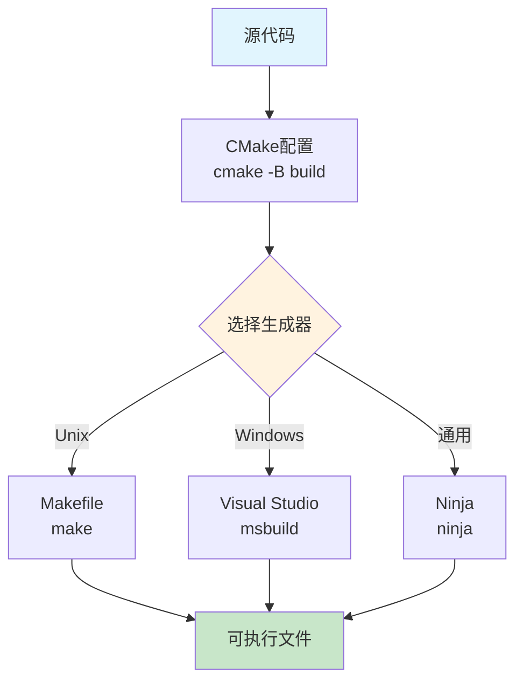
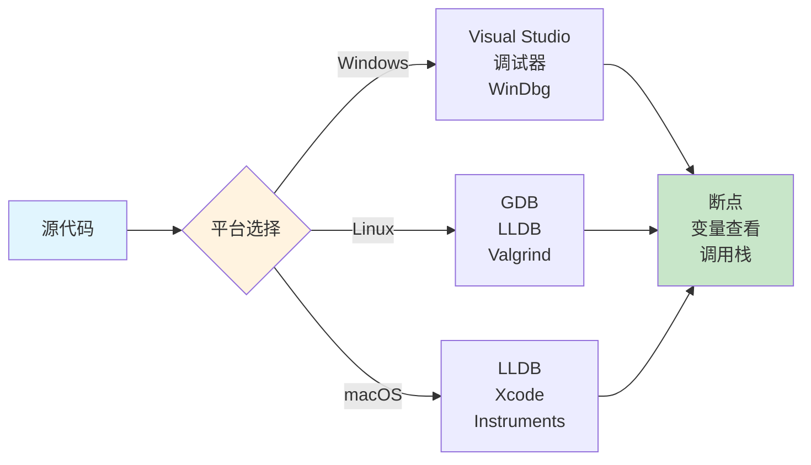

在现代软件开发中，跨平台支持已经成为许多项目的必需功能。C++作为系统级编程语言，在不同平台上存在诸多差异，包括编译器、标准库实现、系统API等。本文详细介绍C++项目在多平台（Windows、Linux、macOS）上的编译和调试方法，帮助开发者构建真正可移植的应用程序。

## 一、跨平台编译的挑战

### 1.1 主要挑战

跨平台C++开发面临的主要挑战包括：

1. **编译器差异**：MSVC、GCC、Clang在C++标准支持、扩展语法、警告级别上存在差异
2. **系统API差异**：文件系统、网络、线程等API在不同平台上完全不同
3. **路径分隔符**：Windows使用反斜杠`\`，Unix-like系统使用正斜杠`/`
4. **文件大小写敏感性**：Windows文件系统不区分大小写，Linux区分
5. **链接库差异**：静态库和动态库的命名和链接方式不同
6. **字符编码**：Windows默认使用宽字符，Linux使用UTF-8

### 1.2 平台检测方法

```cpp
// 平台检测宏定义
#if defined(_WIN32) || defined(_WIN64)
    #define PLATFORM_WINDOWS
#elif defined(__linux__)
    #define PLATFORM_LINUX
#elif defined(__APPLE__) && defined(__MACH__)
    #define PLATFORM_MACOS
#endif

// 编译器检测
#if defined(_MSC_VER)
    #define COMPILER_MSVC
#elif defined(__GNUC__)
    #define COMPILER_GCC
#elif defined(__clang__)
    #define COMPILER_CLANG
#endif

// 使用示例
void printPlatform() {
#ifdef PLATFORM_WINDOWS
    std::cout << "Running on Windows" << std::endl;
#elif defined(PLATFORM_LINUX)
    std::cout << "Running on Linux" << std::endl;
#elif defined(PLATFORM_MACOS)
    std::cout << "Running on macOS" << std::endl;
#endif
}
```

```cpp
// 项目空间变量定义以及导出示例
#define _PGA ProgramA
#define _PGA_BEGIN namespace Program {
#define _PGA_END }

#ifdef __cplusplus
#define _C_START  extern "c" {
#define _CEND   }
#else
#define _C_START 
#define _CEND
#endif

#ifdef PGA_EXPORTS
#if defined(_MSC_VER)
#define _PGA_EXPORTS  __declspec(dllexport)
#else
#define _PGA_EXPORTS  __attribute__ ((visibility("default")))
#endif

#else
#if defined(_MSC_VER)
#  define _PGA_EXPORTS     __declspec(dllimport) 
#else
#  define _PGA_EXPORTS
#endif
#endif

```


## 二、构建系统选择

### 2.1 CMake（推荐）

CMake是最流行的跨平台构建系统生成器，支持多种构建后端（Make、Ninja、Visual Studio等）。

#### CMakeLists.txt 基本结构

```cmake
cmake_minimum_required(VERSION 3.15)
project(MyProject VERSION 1.0.0 LANGUAGES CXX)

# 设置C++标准
set(CMAKE_CXX_STANDARD 17)
set(CMAKE_CXX_STANDARD_REQUIRED ON)
set(CMAKE_CXX_EXTENSIONS OFF)

# 编译选项
if(MSVC)
    add_compile_options(/W4 /WX- /permissive-)
    add_compile_definitions(_CRT_SECURE_NO_WARNINGS)
else()
    add_compile_options(-Wall -Wextra -Wpedantic -Werror)
endif()

# 根据平台设置输出目录
if(WIN32)
    set(CMAKE_RUNTIME_OUTPUT_DIRECTORY ${CMAKE_BINARY_DIR}/bin)
else()
    set(CMAKE_RUNTIME_OUTPUT_DIRECTORY ${CMAKE_BINARY_DIR}/bin)
endif()

# 添加可执行文件
add_executable(myapp 
    src/main.cpp
    src/utils.cpp
)

# 链接库
target_link_libraries(myapp PRIVATE 
    ${CMAKE_THREAD_LIBS_INIT}
)
```

#### 跨平台配置示例

```cmake
# 平台特定的源文件
if(WIN32)
    target_sources(myapp PRIVATE src/platform/windows_impl.cpp)
elseif(UNIX AND NOT APPLE)
    target_sources(myapp PRIVATE src/platform/linux_impl.cpp)
elseif(APPLE)
    target_sources(myapp PRIVATE src/platform/macos_impl.cpp)
endif()

# 平台特定的库
if(WIN32)
    target_link_libraries(myapp PRIVATE ws2_32)
elseif(UNIX)
    target_link_libraries(myapp PRIVATE pthread dl)
endif()
```


**以下均为示例:**

```cmake
cmake_minimum_required(VERSION 3.15)

project(TeethPad_RepairOriExport LANGUAGES CXX)


if(NOT CMAKE_BUILD_TYPE)
  set(CMAKE_BUILD_TYPE "Release" CACHE STRING "Choose the type of build." FORCE)
endif()

option(BUILD_PYINTERFACE "Build pyInterface module" ON)
option(BUILD_WINTEST     "Build winTest module" OFF)
option(BUILD_PYTEST      "Build pyTest module" OFF)
option(BUILD_SHARED_LIBS "Build shared libraries" ON)
if(NOT BUILD_SHARED_LIBS)
   set(CMAKE_POSITION_INDEPENDENT_CODE ON)
endif()

if (MSVC AND NOT BUILD_SHARED_LIBS)
    set(CMAKE_MSVC_RUNTIME_LIBRARY "MultiThreaded$<$<CONFIG:Debug>:Debug>")
endif()

set(CMAKE_CXX_STANDARD 17)
set(CMAKE_CXX_STANDARD_REQUIRED ON)
set(CMAKE_CXX_EXTENSIONS OFF)

if(POLICY CMP0177)
    cmake_policy(SET CMP0177 NEW)
endif()

if(WIN32)
    set(IS_WINDOWS TRUE)
elseif(UNIX AND NOT APPLE)
    set(IS_LINUX TRUE)
elseif(APPLE)
    set(IS_MACOS TRUE)
endif()

if(IS_WINDOWS)
    set(KFX_DEV "${CMAKE_SOURCE_DIR}/external_windows")
elseif(IS_LINUX)
    set(KFX_DEV "${CMAKE_SOURCE_DIR}/external_linux")
endif()

message(STATUS "KFX_DEV path: ${KFX_DEV}")

include_directories(
    "${KFX_DEV}/inner/include"
)

# 定义平台特定的库扩展名
set(LIB_PREFIX "")
set(LIB_POSTFIX "")

if(IS_WINDOWS)
    set(LIB_PREFIX "")
    set(LIB_POSTFIX ".lib")
elseif(IS_LINUX OR IS_MACOS)
    set(LIB_PREFIX "lib")
    if(BUILD_SHARED_LIBS)
        set(LIB_POSTFIX ".so")
    else()
        set(LIB_POSTFIX ".a")
    endif()
    if(IS_MACOS)
        if(BUILD_SHARED_LIBS)
            set(LIB_POSTFIX ".dylib")
        else()
            set(LIB_POSTFIX ".a")
    endif()
    endif()
endif()

# 公共库目录
if (NOT BUILD_SHARED_LIBS)
    if(IS_WINDOWS)
		list(APPEND PLATFORM_LIBS
		    "${KFX_DEV}/3rd/STATIC/openmesh/lib/${LIB_PREFIX}OpenMeshCore${LIB_POSTFIX}"
		    "${KFX_DEV}/3rd/STATIC/openmesh/lib/${LIB_PREFIX}OpenMeshTools${LIB_POSTFIX}"
		    "${KFX_DEV}/inner/static_lib/${LIB_PREFIX}KfxBaseClass${LIB_POSTFIX}"
		    #"${KFX_DEV}/3rd/gmp/lib/${LIB_PREFIX}gmp${LIB_POSTFIX}"
		    #"${KFX_DEV}/3rd/mpfr/lib/${LIB_PREFIX}mpfr${LIB_POSTFIX}"
		)
    elseif(IS_LINUX)
		list(APPEND PLATFORM_LIBS
		    "${KFX_DEV}/RunTimeSys/${LIB_PREFIX}OpenMeshCore${LIB_POSTFIX}"
		    "${KFX_DEV}/RunTimeSys/${LIB_PREFIX}OpenMeshTools${LIB_POSTFIX}"
		    "${KFX_DEV}/RunTimeSys/${LIB_PREFIX}KfxBaseClass${LIB_POSTFIX}"
		    #"${KFX_DEV}/3rd/gmp/lib/${LIB_PREFIX}gmp${LIB_POSTFIX}"
		    #"${KFX_DEV}/3rd/mpfr/lib/${LIB_PREFIX}mpfr${LIB_POSTFIX}"
		    )
    endif()
else()
    if(IS_WINDOWS)
		list(APPEND PLATFORM_LIBS
		    "${KFX_DEV}/3rd/openmesh/lib/${LIB_PREFIX}OpenMeshCore${LIB_POSTFIX}"
		    "${KFX_DEV}/3rd/openmesh/lib/${LIB_PREFIX}OpenMeshTools${LIB_POSTFIX}"
		    "${KFX_DEV}/inner/lib/${LIB_PREFIX}KfxBaseClass${LIB_POSTFIX}"
		    #"${KFX_DEV}/3rd/gmp/lib/${LIB_PREFIX}gmp${LIB_POSTFIX}"
		    #"${KFX_DEV}/3rd/mpfr/lib/${LIB_PREFIX}mpfr${LIB_POSTFIX}"
		)
    elseif(IS_LINUX)
		list(APPEND PLATFORM_LIBS
		    "${KFX_DEV}/RunTimeSys/${LIB_PREFIX}OpenMeshCore${LIB_POSTFIX}"
		    "${KFX_DEV}/RunTimeSys/${LIB_PREFIX}OpenMeshTools${LIB_POSTFIX}"
		    "${KFX_DEV}/RunTimeSys/${LIB_PREFIX}KfxBaseClass${LIB_POSTFIX}"
		    #"${KFX_DEV}/3rd/gmp/lib/${LIB_PREFIX}gmp${LIB_POSTFIX}"
		    #"${KFX_DEV}/3rd/mpfr/lib/${LIB_PREFIX}mpfr${LIB_POSTFIX}"
		    )
    endif()
endif()

add_subdirectory(core)

if(BUILD_PYINTERFACE)   
    add_subdirectory(pyInterface)
endif()

#if(BUILD_WINTEST)
#    add_subdirectory(winTest)
#endif()

#if(BUILD_PYTEST)
#    enable_testing()
#    add_subdirectory(pythonTest)
#endif()

```


### 2.2 构建命令对比



**不同平台的构建命令：**

```bash
# Linux/macOS
mkdir build && cd build
cmake ..
make -j4

# Windows (MSVC)
mkdir build && cd build
cmake .. -G "Visual Studio 16 2019" -A x64
cmake --build . --config Release

# Windows (MinGW)
mkdir build && cd build
cmake .. -G "MinGW Makefiles"
cmake --build .

# 使用Ninja（所有平台）
cmake .. -G Ninja
ninja
```

## 三、编译器差异处理

### 3.1 编译器特性检测

使用CMake的编译器特性检测：

```cmake
# 检测C++17特性支持
include(CheckCXXCompilerFlag)
check_cxx_compiler_flag("-std=c++17" COMPILER_SUPPORTS_CXX17)

if(COMPILER_SUPPORTS_CXX17)
    set(CMAKE_CXX_STANDARD 17)
else()
    message(FATAL_ERROR "Compiler does not support C++17")
endif()

# 检测特定特性
target_compile_features(myapp PUBLIC cxx_std_17)
```

### 3.2 代码层面的兼容性处理

```cpp
// 对齐方式（C++11之前使用编译器扩展）
#if defined(_MSC_VER)
    #define ALIGNED(x) __declspec(align(x))
#elif defined(__GNUC__) || defined(__clang__)
    #define ALIGNED(x) __attribute__((aligned(x)))
#else
    #define ALIGNED(x)
#endif

// 内联函数提示
#if defined(_MSC_VER)
    #define FORCE_INLINE __forceinline
#elif defined(__GNUC__) || defined(__clang__)
    #define FORCE_INLINE __attribute__((always_inline)) inline
#else
    #define FORCE_INLINE inline
#endif

// 禁用警告
#if defined(_MSC_VER)
    #define DISABLE_WARNING_PUSH __pragma(warning(push))
    #define DISABLE_WARNING_POP __pragma(warning(pop))
    #define DISABLE_WARNING(warningNumber) __pragma(warning(disable: warningNumber))
#elif defined(__GNUC__) || defined(__clang__)
    #define DISABLE_WARNING_PUSH _Pragma("GCC diagnostic push")
    #define DISABLE_WARNING_POP _Pragma("GCC diagnostic pop")
    #define DISABLE_WARNING(warningName) _Pragma(GCC diagnostic ignored "-W" #warningName)
#else
    #define DISABLE_WARNING_PUSH
    #define DISABLE_WARNING_POP
    #define DISABLE_WARNING(warningNumber)
#endif
```

### 3.3 预编译头文件（PCH）配置

```cmake
# Windows上使用预编译头
if(MSVC)
    target_precompile_headers(myapp PRIVATE
        <iostream>
        <vector>
        <string>
        <memory>
    )
else()
    # GCC/Clang使用预编译头需要额外配置
    target_precompile_headers(myapp PRIVATE
        <iostream>
        <vector>
        <string>
        <memory>
    )
endif()
```

## 四、平台特定代码抽象

### 4.1 文件系统操作

```cpp
// filesystem_utils.h - 跨平台文件系统接口
#ifndef FILESYSTEM_UTILS_H
#define FILESYSTEM_UTILS_H

#include <string>
#include <vector>

class FileSystem {
public:
    // 路径分隔符
    static char pathSeparator();
    
    // 路径连接
    static std::string join(const std::string& path1, const std::string& path2);
    
    // 判断路径是否存在
    static bool exists(const std::string& path);
    
    // 创建目录
    static bool createDirectory(const std::string& path);
    
    // 列出目录内容
    static std::vector<std::string> listDirectory(const std::string& path);
};

#endif // FILESYSTEM_UTILS_H
```

```cpp
// filesystem_utils.cpp - Windows实现
#ifdef PLATFORM_WINDOWS
#include <windows.h>
#include <shlwapi.h>

char FileSystem::pathSeparator() {
    return '\\';
}

std::string FileSystem::join(const std::string& path1, const std::string& path2) {
    if (path1.empty()) return path2;
    if (path2.empty()) return path1;
    
    std::string result = path1;
    if (result.back() != '\\' && result.back() != '/') {
        result += '\\';
    }
    result += path2;
    return result;
}

bool FileSystem::exists(const std::string& path) {
    DWORD dwAttrib = GetFileAttributesA(path.c_str());
    return (dwAttrib != INVALID_FILE_ATTRIBUTES);
}

bool FileSystem::createDirectory(const std::string& path) {
    return CreateDirectoryA(path.c_str(), nullptr) != 0;
}
#endif
```

```cpp
// filesystem_utils.cpp - Linux实现
#ifdef PLATFORM_LINUX
#include <sys/stat.h>
#include <dirent.h>
#include <unistd.h>

char FileSystem::pathSeparator() {
    return '/';
}

std::string FileSystem::join(const std::string& path1, const std::string& path2) {
    if (path1.empty()) return path2;
    if (path2.empty()) return path1;
    
    std::string result = path1;
    if (result.back() != '/') {
        result += '/';
    }
    result += path2;
    return result;
}

bool FileSystem::exists(const std::string& path) {
    struct stat buffer;
    return (stat(path.c_str(), &buffer) == 0);
}

bool FileSystem::createDirectory(const std::string& path) {
    return mkdir(path.c_str(), 0755) == 0;
}
#endif
```

### 4.2 线程同步原语

```cpp
// thread_utils.h
#ifndef THREAD_UTILS_H
#define THREAD_UTILS_H

#include <cstdint>

class Mutex {
public:
    Mutex();
    ~Mutex();
    
    void lock();
    void unlock();
    bool tryLock();
    
private:
    void* m_impl;  // 平台特定的实现指针
};

class ConditionVariable {
public:
    ConditionVariable();
    ~ConditionVariable();
    
    void wait(Mutex& mutex);
    void notifyOne();
    void notifyAll();
    
private:
    void* m_impl;
};

#endif // THREAD_UTILS_H
```

### 4.3 动态库加载

```cpp
// dll_loader.h
#ifndef DLL_LOADER_H
#define DLL_LOADER_H

#include <string>
#include <functional>

class DynamicLibrary {
public:
    DynamicLibrary();
    ~DynamicLibrary();
    
    bool load(const std::string& path);
    void unload();
    
    template<typename T>
    T getSymbol(const std::string& name) {
        void* symbol = getSymbolImpl(name);
        return reinterpret_cast<T>(symbol);
    }
    
    bool isLoaded() const { return m_handle != nullptr; }
    
private:
    void* getSymbolImpl(const std::string& name);
    void* m_handle;
};
```

```cpp
// dll_loader.cpp - Windows实现
#ifdef PLATFORM_WINDOWS
#include <windows.h>

bool DynamicLibrary::load(const std::string& path) {
    m_handle = LoadLibraryA(path.c_str());
    return m_handle != nullptr;
}

void DynamicLibrary::unload() {
    if (m_handle) {
        FreeLibrary(static_cast<HMODULE>(m_handle));
        m_handle = nullptr;
    }
}

void* DynamicLibrary::getSymbolImpl(const std::string& name) {
    if (!m_handle) return nullptr;
    return GetProcAddress(static_cast<HMODULE>(m_handle), name.c_str());
}
#endif
```

```cpp
// dll_loader.cpp - Linux实现
#ifdef PLATFORM_LINUX
#include <dlfcn.h>

bool DynamicLibrary::load(const std::string& path) {
    m_handle = dlopen(path.c_str(), RTLD_LAZY);
    return m_handle != nullptr;
}

void DynamicLibrary::unload() {
    if (m_handle) {
        dlclose(m_handle);
        m_handle = nullptr;
    }
}

void* DynamicLibrary::getSymbolImpl(const std::string& name) {
    if (!m_handle) return nullptr;
    return dlsym(m_handle, name.c_str());
}
#endif
```

## 五、调试工具和方法

### 5.1 不同平台的调试器



### 5.2 GDB调试技巧（Linux）

```bash
# 启动调试
gdb ./myapp

# 设置断点
(gdb) break main
(gdb) break file.cpp:42
(gdb) break functionName

# 条件断点
(gdb) break file.cpp:42 if variable == 5

# 运行程序
(gdb) run
(gdb) run arg1 arg2

# 单步执行
(gdb) step        # 进入函数
(gdb) next        # 下一行
(gdb) continue    # 继续执行

# 查看变量
(gdb) print variable
(gdb) print *pointer
(gdb) print array[index]
(gdb) print/x variable  # 十六进制显示

# 查看调用栈
(gdb) backtrace
(gdb) frame 2     # 切换到第2层栈帧

# 查看源码
(gdb) list
(gdb) list functionName

# 观察点（watchpoint）
(gdb) watch variable
(gdb) watch *pointer
```

### 5.3 Visual Studio调试技巧（Windows）

```cpp
// 调试宏定义
#ifdef _DEBUG
    #define DEBUG_BREAK() __debugbreak()
    #define DEBUG_PRINT(msg) OutputDebugStringA(msg)
#else
    #define DEBUG_BREAK()
    #define DEBUG_PRINT(msg)
#endif

// 条件断点
if (variable == targetValue) {
    DEBUG_BREAK();  // 条件满足时中断
}

// 断言
#include <cassert>
assert(ptr != nullptr && "Pointer should not be null");

// 自定义断言（支持格式化字符串）
#define ASSERT_MSG(condition, msg) \
    do { \
        if (!(condition)) { \
            std::cerr << "Assertion failed: " << msg << std::endl; \
            DEBUG_BREAK(); \
        } \
    } while(0)
```

### 5.4 内存调试工具

#### Valgrind（Linux）

```bash
# 内存泄漏检测
valgrind --leak-check=full --show-leak-kinds=all ./myapp

# 内存错误检测
valgrind --tool=memcheck ./myapp

# 生成详细报告
valgrind --leak-check=full --log-file=valgrind.log ./myapp
```

#### AddressSanitizer（所有平台）

```cmake
# CMake中启用AddressSanitizer
if(CMAKE_CXX_COMPILER_ID MATCHES "GNU|Clang")
    option(ENABLE_ASAN "Enable AddressSanitizer" OFF)
    if(ENABLE_ASAN)
        add_compile_options(-fsanitize=address -g -O1)
        add_link_options(-fsanitize=address)
    endif()
endif()
```

```bash
# 编译时启用
g++ -fsanitize=address -g -O1 -o myapp main.cpp

# 运行时会自动检测内存错误
./myapp
```

### 5.5 日志系统

```cpp
// logger.h - 跨平台日志系统
#ifndef LOGGER_H
#define LOGGER_H

#include <string>
#include <fstream>
#include <memory>
#include <mutex>

enum class LogLevel {
    Debug,
    Info,
    Warning,
    Error,
    Fatal
};

class Logger {
public:
    static Logger& getInstance();
    
    void setLevel(LogLevel level);
    void setOutputFile(const std::string& filename);
    
    void log(LogLevel level, const std::string& message);
    void log(LogLevel level, const char* format, ...);
    
private:
    Logger();
    ~Logger();
    Logger(const Logger&) = delete;
    Logger& operator=(const Logger&) = delete;
    
    std::string levelToString(LogLevel level);
    void writeLog(LogLevel level, const std::string& message);
    
    LogLevel m_level;
    std::unique_ptr<std::ofstream> m_file;
    std::mutex m_mutex;
};

// 便捷宏
#define LOG_DEBUG(msg) Logger::getInstance().log(LogLevel::Debug, msg)
#define LOG_INFO(msg) Logger::getInstance().log(LogLevel::Info, msg)
#define LOG_WARNING(msg) Logger::getInstance().log(LogLevel::Warning, msg)
#define LOG_ERROR(msg) Logger::getInstance().log(LogLevel::Error, msg)
#define LOG_FATAL(msg) Logger::getInstance().log(LogLevel::Fatal, msg)

#endif // LOGGER_H
```

```cpp
// logger.cpp
#include "logger.h"
#include <iostream>
#include <ctime>
#include <iomanip>
#include <sstream>

#ifdef PLATFORM_WINDOWS
#include <windows.h>
#endif

Logger& Logger::getInstance() {
    static Logger instance;
    return instance;
}

Logger::Logger() : m_level(LogLevel::Info) {
#ifdef PLATFORM_WINDOWS
    // Windows上输出到调试器
    AllocConsole();
    freopen_s((FILE**)stdout, "CONOUT$", "w", stdout);
#endif
}

void Logger::log(LogLevel level, const std::string& message) {
    if (level < m_level) return;
    
    writeLog(level, message);
}

void Logger::writeLog(LogLevel level, const std::string& message) {
    std::lock_guard<std::mutex> lock(m_mutex);
    
    auto now = std::time(nullptr);
    auto tm = *std::localtime(&now);
    
    std::ostringstream oss;
    oss << std::put_time(&tm, "%Y-%m-%d %H:%M:%S");
    std::string timestamp = oss.str();
    
    std::string logMessage = "[" + timestamp + "] [" + 
                            levelToString(level) + "] " + 
                            message + "\n";
    
    // 输出到控制台
    std::cout << logMessage;
    
    // 输出到文件
    if (m_file && m_file->is_open()) {
        *m_file << logMessage;
        m_file->flush();
    }
    
#ifdef PLATFORM_WINDOWS
    // Windows上同时输出到调试器
    OutputDebugStringA(logMessage.c_str());
#endif
}

std::string Logger::levelToString(LogLevel level) {
    switch (level) {
        case LogLevel::Debug:   return "DEBUG";
        case LogLevel::Info:    return "INFO";
        case LogLevel::Warning: return "WARNING";
        case LogLevel::Error:   return "ERROR";
        case LogLevel::Fatal:   return "FATAL";
        default:                return "UNKNOWN";
    }
}
```

## 六、实用技巧和最佳实践

### 6.1 路径处理最佳实践

```cpp
// 使用C++17 filesystem库（推荐）
#include <filesystem>
namespace fs = std::filesystem;

// 跨平台路径操作
fs::path configPath = fs::path("config") / "settings.json";
std::string pathStr = configPath.string();  // 自动转换为平台格式

// 创建目录
fs::create_directories("logs/2025/09");

// 遍历目录
for (const auto& entry : fs::directory_iterator(".")) {
    if (entry.is_regular_file()) {
        std::cout << entry.path() << std::endl;
    }
}
```

### 6.2 预处理器宏管理

```cpp
// config.h - 统一配置管理
#ifndef CONFIG_H
#define CONFIG_H

// 平台定义
#if defined(_WIN32) || defined(_WIN64)
    #define PLATFORM_WINDOWS 1
    #ifndef PLATFORM_LINUX
        #define PLATFORM_LINUX 0
    #endif
    #ifndef PLATFORM_MACOS
        #define PLATFORM_MACOS 0
    #endif
#elif defined(__linux__)
    #define PLATFORM_WINDOWS 0
    #define PLATFORM_LINUX 1
    #define PLATFORM_MACOS 0
#elif defined(__APPLE__)
    #define PLATFORM_WINDOWS 0
    #define PLATFORM_LINUX 0
    #define PLATFORM_MACOS 1
#endif

// 特性检测
#if defined(__cpp_lib_filesystem) || (defined(_MSC_VER) && _MSC_VER >= 1914)
    #define HAS_STD_FILESYSTEM 1
#else
    #define HAS_STD_FILESYSTEM 0
#endif

#endif // CONFIG_H
```

### 6.3 错误处理策略

```cpp
// error_code.h - 统一错误码
enum class ErrorCode {
    Success = 0,
    FileNotFound,
    PermissionDenied,
    NetworkError,
    InvalidParameter,
    OutOfMemory,
    PlatformSpecificError = 1000  // 平台特定错误从此开始
};

class SystemError {
public:
    SystemError(ErrorCode code, const std::string& message)
        : m_code(code), m_message(message) {}
    
    ErrorCode code() const { return m_code; }
    const std::string& message() const { return m_message; }
    
    // 获取平台特定的错误码
    int platformCode() const;
    
private:
    ErrorCode m_code;
    std::string m_message;
};

// 错误码转换
ErrorCode getLastError() {
#ifdef PLATFORM_WINDOWS
    DWORD error = GetLastError();
    switch (error) {
        case ERROR_FILE_NOT_FOUND:
            return ErrorCode::FileNotFound;
        case ERROR_ACCESS_DENIED:
            return ErrorCode::PermissionDenied;
        default:
            return ErrorCode::PlatformSpecificError;
    }
#else
    int error = errno;
    switch (error) {
        case ENOENT:
            return ErrorCode::FileNotFound;
        case EACCES:
            return ErrorCode::PermissionDenied;
        default:
            return ErrorCode::PlatformSpecificError;
    }
#endif
}
```

### 6.4 单元测试框架

```cmake
# CMakeLists.txt - 集成Google Test
include(FetchContent)
FetchContent_Declare(
  googletest
  URL https://github.com/google/googletest/archive/03597a01ee50f33f9142a26dc09c7cbe6669e6f5.zip
)
FetchContent_MakeAvailable(googletest)

enable_testing()

add_executable(
  myapp_test
  test/main.cpp
  test/test_filesystem.cpp
)

target_link_libraries(
  myapp_test
  PRIVATE gtest_main
)

include(GoogleTest)
gtest_discover_tests(myapp_test)
```

```cpp
// test/test_filesystem.cpp
#include <gtest/gtest.h>
#include "filesystem_utils.h"

TEST(FileSystemTest, PathSeparator) {
#ifdef PLATFORM_WINDOWS
    EXPECT_EQ(FileSystem::pathSeparator(), '\\');
#else
    EXPECT_EQ(FileSystem::pathSeparator(), '/');
#endif
}

TEST(FileSystemTest, PathJoin) {
    std::string result = FileSystem::join("path1", "path2");
    EXPECT_FALSE(result.empty());
}
```

## 七、持续集成（CI）配置

### 7.1 GitHub Actions示例

```yaml
# .github/workflows/build.yml
name: Build and Test

on: [push, pull_request]

jobs:
  build-linux:
    runs-on: ubuntu-latest
    steps:
      - uses: actions/checkout@v3
      - name: Install dependencies
        run: |
          sudo apt-get update
          sudo apt-get install -y build-essential cmake
      - name: Configure
        run: cmake -B build -DCMAKE_BUILD_TYPE=Release
      - name: Build
        run: cmake --build build
      - name: Test
        run: cd build && ctest

  build-windows:
    runs-on: windows-latest
    steps:
      - uses: actions/checkout@v3
      - name: Configure
        run: cmake -B build -G "Visual Studio 16 2019" -A x64
      - name: Build
        run: cmake --build build --config Release
      - name: Test
        run: cd build && ctest -C Release

  build-macos:
    runs-on: macos-latest
    steps:
      - uses: actions/checkout@v3
      - name: Install dependencies
        run: brew install cmake
      - name: Configure
        run: cmake -B build -DCMAKE_BUILD_TYPE=Release
      - name: Build
        run: cmake --build build
      - name: Test
        run: cd build && ctest
```

## 八、总结

### 8.1 关键要点

1. **使用CMake作为构建系统**：统一管理多平台构建配置
2. **抽象平台特定代码**：通过接口层隔离平台差异
3. **利用现代C++标准**：C++17的filesystem库简化路径处理
4. **完善的错误处理**：统一错误码和异常处理机制
5. **充分的测试**：在不同平台上进行完整测试
6. **使用CI/CD**：自动化构建和测试流程

### 8.2 常见陷阱

- ⚠️ **路径硬编码**：避免在代码中硬编码路径分隔符
- ⚠️ **假设文件系统特性**：不要假设文件系统大小写敏感性
- ⚠️ **忽略字符编码**：确保正确处理UTF-8和多字节字符
- ⚠️ **平台特定类型**：使用标准类型而非平台特定类型（如`size_t`而非`DWORD`）
- ⚠️ **链接库顺序**：注意不同平台的库链接顺序要求

### 8.3 推荐工具链

- **构建系统**：CMake 3.15+
- **编译器**：GCC 9+, Clang 10+, MSVC 2019+
- **调试器**：GDB (Linux), LLDB (macOS/Linux), Visual Studio Debugger (Windows)
- **内存检测**：Valgrind (Linux), AddressSanitizer (所有平台)
- **测试框架**：Google Test, Catch2
- **CI/CD**：GitHub Actions, GitLab CI, Azure DevOps

通过遵循这些最佳实践，可以构建出真正可移植、易于维护的跨平台C++应用程序。