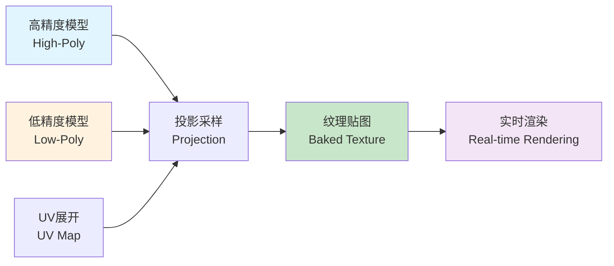

纹理烘焙（Texture Baking）是计算机图形学中的一项核心技术，用于将高精度三维模型的细节信息（如光照、阴影、法线、环境遮蔽等）预先计算并存储到低精度模型的纹理贴图中。这项技术在游戏开发、实时渲染、离线渲染管线优化、多级LOD的精模显示等领域有着广泛应用。通过纹理烘焙，可以在保持低多边形模型性能优势的同时，获得高精度模型的视觉效果。

## 一、纹理烘焙基本概念

### 1.1 问题背景

在实时渲染应用中（如游戏、VR/AR），需要在有限的计算资源下实现高质量的视觉效果。这导致了一个核心矛盾：

- **高精度模型**：具有大量多边形，细节丰富，但渲染开销大，不适合实时应用
- **低精度模型**：多边形数量少，渲染效率高，但缺少细节，视觉效果差

纹理烘焙技术正是为了解决这一矛盾：将高精度模型的细节信息"烘焙"到低精度模型的纹理中，实现"以空间换时间"的优化策略。


<center> Blender下的纹理映射(LSCM) </center>

### 1.2 基本思想

纹理烘焙的核心思想包括：

1. **源模型（High-Poly Model）**：高精度细节模型，包含丰富的几何细节
2. **目标模型（Low-Poly Model）**：低精度简化模型，用于实际渲染
3. **UV展开（UV Unwrapping）**：将三维模型表面映射到二维纹理坐标空间
4. **投影采样（Projection Sampling）**：从高精度模型采样信息，投影到低精度模型的UV空间
5. **纹理生成（Texture Generation）**：将采样结果存储为纹理贴图



### 1.3 烘焙类型

常见的纹理烘焙类型包括：

1. **光照烘焙（Lightmap Baking）**：将光照信息预先计算到纹理中
2. **法线贴图烘焙（Normal Map Baking）**：将高精度模型的法线信息烘焙到法线贴图
3. **环境遮蔽烘焙（Ambient Occlusion Baking）**：计算并存储环境遮蔽信息
4. **高光贴图烘焙（Specular Map Baking）**：烘焙高光反射信息
5. **颜色/漫反射烘焙（Diffuse/Albedo Baking）**：烘焙基础颜色信息
6. **ID贴图烘焙（ID Map Baking）**：用于材质识别和选择

## 二、UV展开与纹理坐标

### 2.1 UV坐标系统

UV坐标是二维纹理坐标，用于将三维模型表面映射到纹理图像：

- **U轴**：水平方向，范围通常为[0, 1]
- **V轴**：垂直方向，范围通常为[0, 1]
- **纹理坐标**：每个顶点对应一对(u, v)坐标

```cpp
// UV坐标结构
struct UVCoord {
    float u;  // 水平坐标 [0, 1]
    float v;  // 垂直坐标 [0, 1]
};

// 顶点结构（包含UV坐标）
struct Vertex {
    Vector3 position;   // 三维位置
    Vector3 normal;     // 法线
    UVCoord uv;         // UV坐标
};
```

### 2.2 UV展开算法

参数化的本质是建立一个**映射函数**，将三维网格上的点  $v\left(x,y,z\right)$  映射到二维平面的  $u\left(u,v\right)$  坐标上。

遗憾的是，根据高斯绝妙定理（Theorema Egregium），除了圆柱、圆锥这种“可展曲面”外，任何 3D 曲面在展开时都会产生扭曲。因此，**UV 算法的核心目标就是：如何平衡并最小化这种扭曲。**

### 2.2.1 三大优化目标

1.  **保角（Conformal）：** 保持角度不变。贴图上的正方形在模型上还是正方形，不会变成菱形。
    
2.  **等面积（Equiareal）：** 保持面积比例。模型上大的面，展开后依然大，保证像素密度均匀。
    
3.  **等距（Isometric）：** 最完美的境界（角度和面积均不变），但物理上几乎不可能对复杂模型实现。

一个完整的参数化流程包含三个关键环节：

*   **Segmentation（分割/切口）：** 像剥橘子皮一样，必须在合适的地方“剪开”。好的算法会自动寻找高曲率或隐蔽区域作为 Seams（缝合线）。
    
*   **Parameterization（参数化）：** 运行上述 LSCM 或 ARAP 算法，将模型摊平。
    
*   **Packing（排版）：** 将展开后的各个"UV 岛"紧凑地塞进 0 到 1 的正方形方块内，榨干每一张纹理贴图的像素利用率。

### 2.2.2 参数化的基本数学原理

在深入探讨具体算法之前，我们需要理解参数化的数学基础。参数化的本质是建立一个**映射函数**，将三维网格上的点 $v(x,y,z)$ 映射到二维平面的 $u(u,v)$ 坐标上。

#### 2.2.2.1 参数化映射

**参数化映射**可以形式化地表示为：

$$\phi: \mathcal{M} \subset \mathbb{R}^3 \rightarrow \Omega \subset \mathbb{R}^2$$

其中：
- $\mathcal{M}$ 是三维网格表面（流形）
- $\Omega$ 是二维参数域（通常是单位正方形 $[0,1]^2$）
- $\phi$ 是映射函数，将3D点 $(x,y,z)$ 映射到2D点 $(u,v)$

映射函数通过切映射，切映射本质上是通过雅可比矩阵操作：
$$
J_f = \frac{\partial (x, y, z)}{\partial (u, v)} = 
\begin{bmatrix}
\frac{\partial x}{\partial u} & \frac{\partial x}{\partial v} \\
\frac{\partial y}{\partial u} & \frac{\partial y}{\partial v} \\
\frac{\partial z}{\partial u} & \frac{\partial z}{\partial v}
\end{bmatrix}
= [f_u, f_v]
$$

设在P点的邻域内，(u,v)发生微小的变化，则其微分形式为:

$$
f(u + \Delta u, v + \Delta v) = f(u, v) + J_f \begin{bmatrix} \Delta u \\ \Delta v \end{bmatrix}
$$

现在对雅可比矩阵进行奇异值分解的操作:
$$
J_f = U \Sigma V^T = U 
\begin{bmatrix}
\sigma_1 & 0 \\
0 & \sigma_2 \\
0 & 0
\end{bmatrix} V^T
$$

> 其中雅可比矩阵解释：
1. $V^T$ 的作用
   将参数域坐标旋转到两个相互垂直的特征方向 $V_1、V_2$ 上。这两个方向对应曲面切平面椭圆的长轴和短轴方向。
2. Σ 的作用
   在新的 u、v 方向上进行伸缩变换：  
   在 u 方向上伸缩 $\sigma_1$ 倍  
   在 v 方向上伸缩 $\sigma_2$ 倍  
   **理想情况**：$\sigma_1 = \sigma_2 = 1$（无缩放）  
3. U 的作用
   将伸缩后的椭圆旋转到曲面的切平面上。

#### 2.2.2.2 度量张量与第一基本形式

为了量化参数化过程中的**失真**，我们需要引入**度量张量（Metric Tensor）**的概念。

由雅可比矩阵可知：
$$
J_f = U \Sigma V^T
$$

$$
J_f^T J_f = (U \Sigma V^T)^T U \Sigma V^T = V \Sigma^2 V^T = V \begin{bmatrix} \sigma_1^2 & 0 \\ 0 & \sigma_2^2 \\ 0 & 0 \end{bmatrix} V^T = V \begin{bmatrix} \lambda_1 & 0 \\ 0 & \lambda_2 \\ 0 & 0 \end{bmatrix} V^T
$$

因为 $V$ 是正交矩阵，所以 $\lambda_1, \lambda_2$ 是 $J_f^T J_f$ 的特征值，并且 $\sigma_1$ 和 $\sigma_2$ 是它们的平方根，我们可以通过求 $J_f^T J_f$ 的特征值来求解 $J_f$ 的特征值。

正好，$J_f^T J_f$ 就是曲面的第一基本式*：

$$
I = J_f^T J_f = \begin{bmatrix} E & G \\ G & F \end{bmatrix}
$$

可得：

$$
\lambda_{1,2} = \frac{1}{2} ((E + G) \pm \sqrt{4F^2 + (E - G)^2})
$$

在3D曲面上，给定参数化 $\phi: (u,v) \mapsto (x,y,z)$，**第一基本形式（First Fundamental Form）**定义为：

$$I = \begin{pmatrix} E & F \\ F & G \end{pmatrix} = \begin{pmatrix} \phi_u \cdot \phi_u & \phi_u \cdot \phi_v \\ \phi_v \cdot \phi_u & \phi_v \cdot \phi_v \end{pmatrix}$$

其中：
- $\phi_u = \frac{\partial \phi}{\partial u}$ 是 $u$ 方向的切向量
- $\phi_v = \frac{\partial \phi}{\partial v}$ 是 $v$ 方向的切向量
- $E, F, G$ 是第一基本形式的系数

**理想参数化**应该满足：
- **等距映射（Isometric）**：$$I = \begin{pmatrix} 1 & 0 \\ 0 & 1 \end{pmatrix}$$（单位矩阵）
- **共形映射（Conformal）**：$E = G$ 且 $F = 0$（保持角度）
- **等面积映射（Equiareal）**：$\det(I) = EG - F^2 = 1$（保持面积）

#### 2.2.2.3 能量最小化框架

曲面的参数化方法很多， 为了衡量算法的优劣，大多数参数化算法都可以统一到**能量最小化**框架：

$$\min_{u} E(u) = \sum_{T \in \text{Faces}} E_T(u)$$

其中 $E_T$ 是每个三角形的局部能量：

- **Tutte**：$E_T = \sum_{(i,j) \in T} \|u_i - u_j\|^2$（均匀权重）
- **Harmonic**：$E_T = \sum_{(i,j) \in T} w_{ij} \|u_i - u_j\|^2$（cotan权重）
- **LSCM**：$E_T = \text{Area}(T) \cdot \|\nabla u - \nabla v^{\bot}\|^2$（共形能量）
- **ARAP**：$E_T = \sum_{(i,j) \in T} w_{ij} \|(u_i - u_j) - R_i(v_i - v_j)\|^2$（刚体保持）

#### 2.2.2.4 三角形的局部线性映射

由于2.2.2.1 中3D三角形可以通过映射函数映射到参数域中，即:$$ f: S \subset R^{3} \rightarrow \Omega \subset R^{2} $$。因此我们亦可以用简单的线性映射研究这个问题。
为了简化计算，我们先将每个3D三角形上创建局部坐标系，将三维三角形坐标映射为二维坐标。因此我们只需研究（X，Y）和（u，v）之间的映射关系。


<center> 图.三角形中的局部X，Y坐标系 </center>

推导线性映射中的雅可比矩阵：


<center> 图.利用克拉默法则计算重心坐标 </center>


<center> 图.计算线性映射中的雅可比矩阵 </center>


#### 2.2.2.5 边界条件

参数化需要适当的**边界条件**来消除自由度：

1. **固定边界（Fixed Boundary）**：将边界点固定到凸多边形（如圆盘）
   - 优点：保证无翻转
   - 缺点：边界形状受限

2. **自由边界（Free Boundary）**：只固定少量点（通常2个），让边界自然优化
   - 优点：边界形状更自然
   - 缺点：可能产生翻转

3. **混合边界（Mixed Boundary）**：部分边界固定，部分自由 


<center> 图.固定边界法的人脸顶点映射 </center>

### 2.2.3 参数化的算法

UV展开是将三维网格表面展开到二维平面的过程，主要算法包括：

#### 2.2.3.1 **基于顶点的展开（Vertex-based Unfolding）**

核心思想：UV坐标直接定义到顶点上，每个顶点对应一个(u,v)，相邻三角形共用一个顶点的UV，不显式的定义seam边(接缝边)。本质上：展开的自由度定义在顶点而不是边上。

通常方法：  
* Tutte embedding  
* Harmonic parameterization  
* ARAP（As-Rigid-As-Possible）

##### ⭐ **Tutte embedding（圆盘展开参数化）**

**内容**：把有边界的三角网格，  
>* 边界点 <span style="color: #e74c3c;">固定在一个凸多边形(多半是圆盘)</span>  
>* 内部点 <span style="color: #e74c3c;">位置由“拉簧模型”自动平衡</span>  

**原理**：  
* 把每条边看成一个弹簧  
* 最小化总能量：    
$E = \sum_{(i,j)\in E} \|u_i - u_j\|^2$  
对应 **图拉普拉斯方程**：  
$\Delta u = 0 \quad (\text{内部点})$

**优缺点**：  
* 1.无反转  
* 2.对不规则物体易造成失真  
* 3.且要求<span style="color: #e74c3c;">边界必须是凸的</span>   
📌 **注：很多高级参数化算法的初始解就是 Tutte**

##### ⭐ **Harmonic Parameterization（调和参数化）**

**内容**：Harmonic 和 Tutte 的核心公式相同，但 Harmonic 用 <span style="color: #e74c3c;">cotan 权重</span> 让参数化考虑三角形几何，Tutte 用均匀权重只做平均；Harmonic 更平滑但不保证无翻转，而 Tutte 绝对稳定但角度畸变大

**对比**： 

| 方法 | 权重 $w_{ij}$ | 数学含义 | 工程效果 |
| --- | --- | --- | --- |
| Tutte | 均匀权重 $w_{ij} = 1$ | **每个邻居同等贡献** | 极稳定，不翻转，但几何失真大 |
| Harmonic | Cotan 权重 $w_{ij} = \frac12 (\cot \alpha_{ij} + \cot \beta_{ij})$ | **考虑三角形几何形状** | 保留更多局部角度信息，更接近平滑/共形 |

**优缺点**：  
* 1.局部更平滑、接近共形
* 2.不能保证不翻转（尤其边界不凸或切割不好）  
📌 **注：很多高级参数化算法的初始解也可以是 Harmonic**


<center> 图.利用弹簧系统解释参数tutte原理 </center>

##### ⭐ **ARAP（As-Rigid-As-Possible）参数化**

**内容**：ARAP是一种局部刚体保持的参数化方法，核心思想是<span style="color: #e74c3c;">最小化每个局部区域的非刚体变形</span>。与Tutte和Harmonic不同，ARAP不仅考虑顶点位置，还考虑每个三角形（或局部区域）的<span style="color: #e74c3c;">旋转和缩放</span>，试图让每个局部区域尽可能保持刚体变换，从而在参数化过程中<span style="color: #e74c3c;">最大程度保留原始几何形状</span>。

**原理**：  
* 对每个三角形（或顶点邻域），计算其从3D到2D的最优<span style="color: #e74c3c;">相似变换矩阵</span>  
* 最小化能量函数：  
$E_{\text{ARAP}} = \sum_{i=1}^{n} \sum_{j \in N(i)} w_{ij} \|(u_i - u_j) - R_i (v_i - v_j)\|^2$  

其中：
* $u_i, u_j$ 是2D参数化坐标
* $v_i, v_j$ 是3D原始坐标
* $R_i$ 是顶点 $i$ 的<span style="color: #e74c3c;">最优旋转矩阵</span>（2×2旋转矩阵）
* $w_{ij}$ 是权重（通常使用cotan权重）
* $N(i)$ 是顶点 $i$ 的邻域

* 求解过程采用<span style="color: #e74c3c;">交替优化</span>：
  1. **固定旋转**：给定当前旋转矩阵 $R_i$，求解最优UV坐标（线性系统）
  2. **固定UV坐标**：给定当前UV坐标，计算最优旋转矩阵（SVD分解）
  3. 迭代直到收敛

**算法流程**：
```cpp
// ARAP参数化伪代码
void arapParameterization(const Mesh& mesh, UVMap& uvMap) {
    // 1. 初始化UV坐标（可用Tutte或Harmonic作为初始解）
    initializeUV(mesh, uvMap);
    
    // 2. 迭代优化
    for (int iter = 0; iter < maxIterations; ++iter) {
        // 2.1 固定UV，计算每个顶点的最优旋转矩阵
        std::vector<Matrix2f> rotations;
        for (int i = 0; i < mesh.vertices.size(); ++i) {
            Matrix2f R = computeOptimalRotation(mesh, uvMap, i);
            rotations.push_back(R);
        }
        
        // 2.2 固定旋转，求解最优UV坐标（线性系统）
        solveLinearSystem(mesh, rotations, uvMap);
        
        // 检查收敛
        if (energyChange < threshold) break;
    }
}

// 计算顶点i的最优旋转矩阵
Matrix2f computeOptimalRotation(
    const Mesh& mesh, 
    const UVMap& uvMap, 
    int vertexIdx
) {
    // 构建协方差矩阵
    Matrix2f S = Matrix2f::Zero();
    Vector2f center3D, center2D;
    
    for (int j : mesh.neighbors[vertexIdx]) {
        float w = cotanWeight(vertexIdx, j);
        Vector3f e3D = mesh.vertices[j] - mesh.vertices[vertexIdx];
        Vector2f e2D = uvMap.getUV(j) - uvMap.getUV(vertexIdx);
        
        // 投影到切平面（简化处理）
        Vector2f e3D_proj = projectToTangentPlane(e3D, mesh.normals[vertexIdx]);
        
        S += w * e2D * e3D_proj.transpose();
    }
    
    // SVD分解求最优旋转
    Eigen::JacobiSVD<Matrix2f> svd(S, Eigen::ComputeFullU | Eigen::ComputeFullV);
    Matrix2f R = svd.matrixV() * svd.matrixU().transpose();
    
    // 确保是旋转矩阵（det=1）
    if (R.determinant() < 0) {
        Matrix2f V = svd.matrixV();
        V.col(1) *= -1;
        R = V * svd.matrixU().transpose();
    }
    
    return R;
}
```

**优缺点**：  
* 优点：
  * 1. <span style="color: #e74c3c;">保持局部形状</span>：每个三角形尽可能保持原始形状和角度
  * 2. <span style="color: #e74c3c;">低失真</span>：相比Tutte和Harmonic，几何失真更小
  * 3. <span style="color: #e74c3c;">适合复杂模型</span>：对不规则形状和复杂拓扑有更好的表现
  * 4. <span style="color: #e74c3c;">可控性强</span>：可以通过约束边界点来控制参数化结果
  
* 缺点：
  * 1. <span style="color: #e74c3c;">计算开销大</span>：需要迭代优化，比Tutte和Harmonic慢
  * 2. <span style="color: #e74c3c;">需要初始解</span>：通常需要Tutte或Harmonic作为初始值
  * 3. <span style="color: #e74c3c;">可能不收敛</span>：在某些情况下可能陷入局部最优

**对比总结**：

| 方法 | 能量函数 | 优化目标 | 计算复杂度 | 适用场景 |
| --- | --- | --- | --- | --- |
| Tutte | $E = \sum \|u_i - u_j\|^2$ | 均匀分布 | O(n) 线性 | 简单模型，需要稳定性 |
| Harmonic | $E = \sum w_{ij} \|u_i - u_j\|^2$ | 共形映射 | O(n) 线性 | 需要角度保持 |
| ARAP | $E = \sum \|(u_i - u_j) - R_i(v_i - v_j)\|^2$ | 局部刚体保持 | O(n·iter) 迭代 | 复杂模型，需要低失真 |

📌 **注：ARAP是现代参数化算法中的主流方法，在游戏引擎和建模软件中广泛应用，特别适合需要高质量UV展开的场景**

对于简单几何体，可以使用数学映射：
```cpp
// 1.球面映射
UVCoord sphereMapping(const Vector3& position, const Vector3& center) {
    Vector3 dir = (position - center).normalized();
    float u = 0.5f + atan2(dir.z, dir.x) / (2.0f * PI);
    float v = 0.5f - asin(dir.y) / PI;
    return {u, v};
}

// 2.圆柱映射
UVCoord cylinderMapping(const Vector3& position) {
    float u = atan2(position.z, position.x) / (2.0f * PI) + 0.5f;
    float v = position.y;  // 需要根据模型范围归一化
    return {u, v};
}

// 3.平面映射
UVCoord planarMapping(const Vector3& position, const Vector3& normal) {
    // 投影到垂直于normal的平面
    Vector3 uAxis = chooseOrthogonal(normal);
    Vector3 vAxis = normal.cross(uAxis);
    
    float u = position.dot(uAxis);
    float v = position.dot(vAxis);
    // 归一化到[0,1]
    return {normalize(u), normalize(v)};
}
```

> 利用libigl实现Tutte和harmonic，以及ARAP算法

```cpp
#include <igl/read_triangle_mesh.h>
#include <igl/write_triangle_mesh.h>
#include <igl/boundary_loop.h>
#include <igl/map_vertices_to_circle.h>
#include <igl/harmonic.h>
#include <igl/arap.h>
#include <Eigen/Core>
#include <iostream>

using namespace Eigen;
using namespace std;

int main(int argc, char *argv[])
{
    if(argc < 2)
    {
        cout << "Usage: " << argv[0] << " input_mesh.obj" << endl;
        return -1;
    }

    // ============================
    // 1. 读取网格
    // ============================
    MatrixXd V;
    MatrixXi F;
    if(!igl::read_triangle_mesh(argv[1], V, F))
    {
        cerr << "Failed to read mesh " << argv[1] << endl;
        return -1;
    }
    cout << "Mesh loaded: " << V.rows() << " vertices, " << F.rows() << " faces" << endl;

    // ============================
    // 2. 找边界并映射到单位圆（固定边界）
    // ============================
    VectorXi bnd;
    igl::boundary_loop(F, bnd);

    MatrixXd bnd_uv;
    igl::map_vertices_to_circle(V, bnd, bnd_uv);

    // ============================
    // 3. Tutte embedding（均匀权重）
    // ============================
    MatrixXd uv_tutte;
    igl::harmonic(V, F, bnd, bnd_uv, 1, uv_tutte); // 1 = uniform weight
    igl::write_triangle_mesh("uv_tutte.obj", uv_tutte, F);
    cout << "Tutte embedding saved to uv_tutte.obj" << endl;

    // ============================
    // 4. Harmonic mapping（cotangent权重）
    // ============================
    MatrixXd uv_harmonic;
    igl::harmonic(V, F, bnd, bnd_uv, 2, uv_harmonic); // 2 = cotangent weight
    igl::write_triangle_mesh("uv_harmonic.obj", uv_harmonic, F);
    cout << "Harmonic mapping saved to uv_harmonic.obj" << endl;

    // ============================
    // 5. ARAP 参数化
    // ============================
    MatrixXd uv_arap = uv_harmonic; // 用 Harmonic 初始化
    igl::ARAPData arap_data;
    int dim = 2; // 二维参数化
    igl::ARAPPrecomputation(V, F, dim, bnd, arap_data);

    int max_iter = 50;
    for(int i=0; i<max_iter; i++)
    {
        igl::ARAPStep(uv_arap, arap_data);
    }

    igl::write_triangle_mesh("uv_arap.obj", uv_arap, F);
    cout << "ARAP parameterization saved to uv_arap.obj" << endl;

    cout << "All done!" << endl;
    return 0;
}


```

#### 2.2.3.2 **基于边的展开（Edge-based Unfolding）**

核心思想：展开时候，允许在“边”上切开网格。每条边可以标记为：连续边和UV接缝（seam）。接缝边在 UV 空间中会被“断开”。即，原始的网格时一个连通的曲面，在若干条边上“剪开”，把曲面变成一个或者多个拓扑盘，再映射到2D的平面上。这种思想可以保证三角形再UV展开中不发生翻转，易于受到控制，但是同时也可能因为多个接缝，导致UV被切割为多个“岛”（区域块）。

通常方法：  
* LSCM（Least Squares Conformal Maps） 
* ABF / ABF++ 
* [BFF](https://www.youtube.com/embed/h_iJFQEb-_A) ([相关代码](https://github.com/GeometryCollective/boundary-first-flattening))


这是一份关于 **LSCM（Least Squares Conformal Maps，最小二乘共形映射）** 的深度解析，采用与你提供的 ARAP 风格一致的排版，突出核心逻辑与数学之美。

---

##### ⭐ **LSCM（Least Squares Conformal Maps）参数化**

**内容**：LSCM 是一种基于**共形（Conformal）几何**的参数化方法。其核心思想是<span style="color: #e74c3c;">最小化角度畸变</span>。与 ARAP 的局部刚性不同，LSCM 允许局部区域发生均匀的缩放，但要求<span style="color: #e74c3c;">保持形状的角度不变</span>（即满足柯西-黎曼方程）。它是目前工业界（如 Blender, Maya）最常用的 UV 展开算法之一。

**原理**：

*   **共形条件**：对于一个映射  $f\left(x,y\right)=u+iv$ ，如果它是共形的，则必须满足柯西-黎曼方程：
    
    $$
    \frac{\partial u}{\partial x}=\frac{\partial v}{\partial y},\frac{\partial u}{\partial y}=−\frac{\partial v}{\partial x}
    $$
    
*   **能量函数**：LSCM 衡量每个三角形从 3D 到 2D 映射时偏离共形条件的程度：
    
    $$E_{\text{LSCM}} = \sum_{T \in \text{Faces}} \text{Area}(T) \cdot \| \nabla u - \nabla v^{\bot} \|^2$$
    
    其中：
    
    *    $u,v$  是顶点的 2D 参数坐标。
        
    *    $\nabla u,\nabla v$  是在三角形面上的坐标梯度。
        
    *   该能量函数是**二次型**的，可以转化为求解一个大型稀疏线性方程组  $Ax=b$ 。
        
*   **自由边界**：与 Tutte 映射必须固定边界到凸多边形不同，LSCM <span style="color: #e74c3c;">不需要固定所有边界点</span>。只需固定至少两个顶点（以消除平移、旋转和缩放的自由度），边界会自动寻找最优形状。

---

**算法流程**：

```cpp
// LSCM参数化伪代码
void lscmParameterization(const Mesh& mesh, UVMap& uvMap) {
    // 1. 选取两个锚点以防止模型平移和缩放（通常选距离最远的两个边界点）
    setupConstraints(mesh, uvMap);

    // 2. 构建线性系统矩阵 M
    // M 是由每个三角形的几何关系（面积、边长）构成的系数矩阵
    SparseMatrix M = buildLSCMMatrix(mesh);

    // 3. 求解线性方程组
    // 由于是最小二乘问题，最终转化为求解 (M^T * M) x = b
    // 或者直接构造满足共形条件的线性约束方程组
    solveSparseLinearSystem(M, uvMap);

    // 4. 归一化结果
    normalizeUV(uvMap);
}

// 构建单个三角形的共形约束贡献
void addTriangleContribution(Triangle& T, SparseMatrix& A) {
    // 计算三角形在局部坐标系下的坐标 (x1,y1), (x2,y2), (x3,y3)
    // 根据柯西-黎曼方程的离散形式，填充矩阵 A 的对应位置
    // A * [u1, v1, u2, v2, u3, v3]^T = 0
    float area = T.area();
    // ... 填充梯度算子相关的系数 ...
}

```

**优缺点**：

* **优点**：
* 1. <span style="color: #e74c3c;">**角度保持**</span>：能完美保持纹理的正交性，避免拉伸感。

* 2. <span style="color: #e74c3c;">**自由边界**</span>：边界形状由内部几何自然导出，不会像 Tutte 那样在边缘产生剧烈挤压。

* 3. <span style="color: #e74c3c;">**计算高效**</span>：只需解一次线性方程组，无需像 ARAP 那样迭代，速度极快。

* 4. <span style="color: #e74c3c;">**全局最优**</span>：能量函数是凸的，保证能找到全局最小值。

* **缺点**：
* 1. <span style="color: #e74c3c;">**面积失真**</span>：为了保持角度，某些区域可能会被放大或缩小（缩放因子不一致）。

* 2. <span style="color: #e74c3c;">**容易重叠**</span>：对于极其复杂的流形或存在较大曲率的闭合模型，UV 可能会发生自交（Overlap）。

* 3. <span style="color: #e74c3c;">**依赖切口**</span>：对于闭合模型，必须手动设置合适的切口（Seams）才能获得好的效果。

用libigl实现lscm算法：
```cpp
#include <igl/read_triangle_mesh.h>
#include <igl/boundary_loop.h>
#include <igl/harmonic.h>
#include <igl/lscm.h>
#include <igl/opengl/glfw/Viewer.h>

#include <Eigen/Core>
#include <iostream>
#include <cmath>

int main()
{
    Eigen::MatrixXd V;
    Eigen::MatrixXi F;
    igl::read_triangle_mesh("input.obj", V, F);

    // ===============================
    // Step 1: boundary loop
    // ===============================
    Eigen::VectorXi bnd;
    igl::boundary_loop(F, bnd);

    // ===============================
    // Step 2: boundary -> unit circle
    // ===============================
    int nb = bnd.size();
    Eigen::MatrixXd bnd_uv(nb, 2);

    for (int i = 0; i < nb; ++i)
    {
        double t = 2.0 * M_PI * i / nb;
        bnd_uv(i, 0) = std::cos(t);
        bnd_uv(i, 1) = std::sin(t);
    }

    // ===============================
    // Step 3: Tutte (harmonic)
    // ===============================
    Eigen::MatrixXd UV_init;
    igl::harmonic(V, F, bnd, bnd_uv, 1, UV_init);

    // ===============================
    // Step 4: LSCM constraints
    // ===============================
    Eigen::VectorXi b(2);
    Eigen::MatrixXd bc(2, 2);

    b << bnd(0), bnd(nb / 2);
    bc.row(0) = UV_init.row(b(0));
    bc.row(1) = UV_init.row(b(1));

    // ===============================
    // Step 5: LSCM refine
    // ===============================
    Eigen::MatrixXd UV;
    igl::lscm(V, F, b, bc, UV);

    // ===============================
    // Step 6: visualize
    // ===============================
    igl::opengl::glfw::Viewer viewer;
    viewer.data().set_mesh(V, F);
    viewer.data().set_uv(UV);
    viewer.data().show_texture = true;
    viewer.launch();
}

```

##### ⭐ **ABF / ABF++（Angle-Based Flattening）参数化**

**内容**：ABF（Angle-Based Flattening）是一种<span style="color: #e74c3c;">基于角度优化的参数化方法</span>，由Sheffer和de Sturler在2001年提出。其核心思想是<span style="color: #e74c3c;">直接优化三角形内角</span>，而不是优化顶点位置，从而在参数化过程中<span style="color: #e74c3c;">最小化角度失真</span>。ABF++是ABF的改进版本，解决了原算法的一些数值稳定性问题，并提高了计算效率。

**原理**：

* **角度约束**：对于每个三角形，其内角之和必须满足：
  $$\alpha_i + \beta_i + \gamma_i = \pi$$
  
  其中 $\alpha_i, \beta_i, \gamma_i$ 是三角形 $i$ 的三个内角。

* **角度有效性约束**：每个内角必须为正：
  $$\alpha_i > 0, \quad \beta_i > 0, \quad \gamma_i > 0$$

* **顶点角度约束**：对于内部顶点，其周围所有三角形的角度之和必须为 $2\pi$：
  $$\sum_{j \in N(i)} \theta_{ij} = 2\pi$$
  
  其中 $N(i)$ 是顶点 $i$ 周围的三角形集合，$\theta_{ij}$ 是三角形 $j$ 在顶点 $i$ 处的角度。

* **边界顶点约束**：对于边界顶点，角度之和为 $\pi$（如果顶点在边界上）：
  $$\sum_{j \in N(i)} \theta_{ij} = \pi \quad (\text{边界顶点})$$

* **能量函数**：ABF最小化角度与原始3D网格角度的偏差：
  $$E_{\text{ABF}} = \sum_{i=1}^{n} \sum_{k=1}^{3} w_{ik} (\alpha_{ik} - \bar{\alpha}_{ik})^2$$
  
  其中：
  * $\alpha_{ik}$ 是参数化后三角形 $i$ 的第 $k$ 个角度
  * $\bar{\alpha}_{ik}$ 是原始3D网格中对应的角度
  * $w_{ik}$ 是权重（通常与三角形面积相关）

* **优化问题**：ABF将参数化问题转化为一个<span style="color: #e74c3c;">约束优化问题</span>：
  $$\min_{\alpha} E_{\text{ABF}}(\alpha)$$
  
  约束条件：
  * 三角形内角和约束：$\alpha_i + \beta_i + \gamma_i = \pi$
  * 顶点角度约束：$\sum_{j \in N(i)} \theta_{ij} = 2\pi$（内部顶点）
  * 角度有效性：$\alpha_i > 0, \beta_i > 0, \gamma_i > 0$

**算法流程**：

```cpp
// ABF参数化伪代码
void abfParameterization(const Mesh& mesh, UVMap& uvMap) {
    // 1. 初始化：从原始3D网格提取角度
    std::vector<double> targetAngles = extract3DAngles(mesh);
    
    // 2. 构建约束系统
    //    - 三角形内角和约束
    //    - 顶点角度约束（内部顶点 = 2π，边界顶点 = π）
    //    - 角度有效性约束（> 0）
    ConstraintSystem constraints = buildConstraintSystem(mesh);
    
    // 3. 求解约束优化问题
    //    使用拉格朗日乘数法或内点法
    std::vector<double> optimizedAngles = solveConstrainedOptimization(
        targetAngles, constraints
    );
    
    // 4. 从角度重建UV坐标
    //    给定角度，可以唯一确定三角形的形状（除了缩放和平移）
    reconstructUVFromAngles(mesh, optimizedAngles, uvMap);
    
    // 5. 归一化到[0,1]范围
    normalizeUV(uvMap);
}

// ABF++改进：使用对数空间优化提高数值稳定性
void abfPlusPlusParameterization(const Mesh& mesh, UVMap& uvMap) {
    // 1. 在对数空间中优化角度（避免角度为负的问题）
    std::vector<double> logAngles = logSpaceOptimization(mesh);
    
    // 2. 使用更稳定的数值方法求解
    //    - 改进的线性系统求解器
    //    - 更好的初始值选择
    std::vector<double> optimizedAngles = stableSolve(logAngles, mesh);
    
    // 3. 重建UV坐标
    reconstructUVFromAngles(mesh, optimizedAngles, uvMap);
    normalizeUV(uvMap);
}

// 从角度重建UV坐标
void reconstructUVFromAngles(
    const Mesh& mesh,
    const std::vector<double>& angles,
    UVMap& uvMap
) {
    // 方法1：使用正弦定理
    // 对于三角形ABC，已知角度和一条边，可以计算其他边
    for (const auto& triangle : mesh.triangles) {
        double alpha = angles[triangle.angleA];
        double beta = angles[triangle.angleB];
        double gamma = angles[triangle.angleC];
        
        // 使用正弦定理：a/sin(α) = b/sin(β) = c/sin(γ)
        // 给定一个边的长度，可以计算其他边
        double edgeLength = computeEdgeLength(triangle, angles);
        
        // 从边长度和角度重建三角形形状
        reconstructTriangle(triangle, edgeLength, alpha, beta, gamma, uvMap);
    }
    
    // 方法2：使用局部坐标系逐步构建
    // 从一个三角形开始，逐步添加相邻三角形
    buildUVIncrementally(mesh, angles, uvMap);
}
```

**ABF vs ABF++ 对比**：

| 特性 | ABF | ABF++ |
| --- | --- | --- |
| **数值稳定性** | 中等，可能出现角度为负 | 高，使用对数空间优化 |
| **计算效率** | 较慢 | 更快，改进的求解器 |
| **初始值敏感性** | 对初始值敏感 | 更鲁棒 |
| **约束处理** | 标准拉格朗日乘数法 | 改进的约束处理 |
| **适用场景** | 简单到中等复杂度模型 | 复杂模型，大规模网格 |

**优缺点**：

* **优点**：
  * 1. <span style="color: #e74c3c;">**角度优化**</span>：直接优化角度，能精确控制角度失真
  * 2. <span style="color: #e74c3c;">**无翻转保证**</span>：通过角度约束，理论上可以避免三角形翻转
  * 3. <span style="color: #e74c3c;">**高质量结果**</span>：对于需要精确角度保持的应用（如纹理映射），效果优秀
  * 4. <span style="color: #e74c3c;">**数学严谨**</span>：基于严格的几何约束，理论基础扎实

* **缺点**：
  * 1. <span style="color: #e74c3c;">**计算复杂**</span>：需要求解大型约束优化问题，计算开销大
  * 2. <span style="color: #e74c3c;">**数值稳定性**</span>：原ABF算法在某些情况下可能出现数值问题（ABF++已改进）
  * 3. <span style="color: #e74c3c;">**面积失真**</span>：专注于角度优化，可能牺牲面积保持
  * 4. <span style="color: #e74c3c;">**边界处理**</span>：边界顶点的角度约束可能限制参数化的灵活性

**算法对比总结**：

| 方法 | 优化目标 | 约束类型 | 计算复杂度 | 适用场景 |
| --- | --- | --- | --- | --- |
| **LSCM** | 共形能量（角度） | 线性约束 | O(n) 线性 | 快速共形映射 |
| **ABF** | 角度偏差 | 非线性约束 | O(n²) 或更高 | 精确角度控制 |
| **ABF++** | 角度偏差（对数空间） | 改进的非线性约束 | O(n²) 但更稳定 | 复杂模型，高精度需求 |
| **ARAP** | 局部刚体保持 | 迭代优化 | O(n·iter) | 低失真参数化 |

📌 **注：ABF/ABF++特别适合需要精确角度保持的应用，如CAD建模、工程制图等。对于游戏和实时渲染，LSCM和ARAP通常更实用，因为它们在质量和速度之间有更好的平衡。**

用libigl实现ABF算法：
```cpp
#include <igl/read_triangle_mesh.h>
#include <igl/abf_plus_plus.h>
#include <igl/opengl/glfw/Viewer.h>

#include <Eigen/Core>
#include <iostream>

int main()
{
    Eigen::MatrixXd V;
    Eigen::MatrixXi F;

    igl::read_triangle_mesh("input.obj", V, F);

    Eigen::MatrixXd UV;

    if (!igl::abf_plus_plus(V, F, UV))
    {
        std::cerr << "ABF++ failed!" << std::endl;
        return -1;
    }

    igl::opengl::glfw::Viewer viewer;
    viewer.data().set_mesh(V, F);
    viewer.data().set_uv(UV);
    viewer.data().show_texture = true;
    viewer.launch();
}
```

```cpp
// 简化的UV展开伪代码
class UVUnwrapper {
public:
    // 基于切割边的UV展开
    void unwrapMesh(const Mesh& mesh, UVMap& uvMap) {
        // 1. 选择切割边（seam edges），将网格分割成可展开的片
        std::vector<Edge> seamEdges = findSeamEdges(mesh);
        
        // 2. 将网格分割成多个chart（可展开的连通区域）
        std::vector<Chart> charts = splitIntoCharts(mesh, seamEdges);
        
        // 3. 对每个chart进行参数化（如LSCM - Least Squares Conformal Maps）
        for (auto& chart : charts) {
            parameterizeChart(chart);
        }
        
        // 4. 在UV空间中排列各个chart，最小化浪费空间
        packCharts(charts, uvMap);
        
        // 5. 更新网格的UV坐标
        updateMeshUVs(mesh, uvMap);
    }
    
private:
    // 查找切割边（边界或需要切割的边）
    std::vector<Edge> findSeamEdges(const Mesh& mesh) {
        std::vector<Edge> seams;
        // 实现边查找逻辑
        // 通常选择最短路径或基于网格拓扑
        return seams;
    }
    
    // LSCM参数化（最小二乘共形映射）
    void parameterizeChart(Chart& chart) {
        // 构建线性系统：最小化角度失真
        // 求解：argmin ||Lx - b||²
        // 其中L是拉普拉斯算子，x是UV坐标
        Eigen::SparseMatrix<double> L = buildLaplacian(chart);
        Eigen::VectorXd b = buildRHS(chart);
        Eigen::VectorXd uv = solveLinearSystem(L, b);
        
        // 更新chart的UV坐标
        updateChartUVs(chart, uv);
    }
    
    // Chart打包（在UV空间中排列）
    void packCharts(std::vector<Chart>& charts, UVMap& uvMap) {
        // 1. 计算每个chart的边界框
        // 2. 使用装箱算法（如Skyline算法）排列charts
        // 3. 确保不重叠且最小化空白区域
        // 4. 归一化到[0,1]范围
    }
};
```

## 三、投影采样算法

### 3.1 光线投射采样（Ray Casting）

最常用的投影方法是光线投射：从低精度模型表面向高精度模型发射光线进行采样。

```cpp
// 光线投射采样核心算法
class TextureBaker {
public:
    // 烘焙光照贴图
    void bakeLightmap(
        const Mesh& highPolyMesh,
        const Mesh& lowPolyMesh,
        const UVMap& uvMap,
        int textureWidth,
        int textureHeight,
        Texture& lightmap
    ) {
        // 初始化纹理
        lightmap.resize(textureWidth, textureHeight);
        
        // 对每个纹理像素进行采样
        for (int y = 0; y < textureHeight; ++y) {
            for (int x = 0; x < textureWidth; ++x) {
                // UV坐标 [0,1]
                float u = (x + 0.5f) / textureWidth;
                float v = (y + 0.5f) / textureHeight;
                
                // 1. 从UV坐标找到对应的三角形和重心坐标
                TriangleInfo triInfo = findTriangleAtUV(lowPolyMesh, uvMap, u, v);
                
                if (!triInfo.valid) continue;
                
                // 2. 计算三维表面点位置和法线
                Vector3 surfacePos = interpolatePosition(
                    triInfo.triangle, triInfo.barycentric
                );
                Vector3 surfaceNormal = interpolateNormal(
                    triInfo.triangle, triInfo.barycentric
                );
                
                // 3. 从表面点向高精度模型投射光线
                Vector3 rayOrigin = surfacePos + surfaceNormal * 0.01f;  // 轻微偏移
                Vector3 rayDir = -surfaceNormal;
                
                // 4. 计算光照值（采样高精度模型的几何）
                Color lightValue = sampleLighting(
                    highPolyMesh, rayOrigin, rayDir, surfaceNormal
                );
                
                // 5. 存储到纹理
                lightmap.setPixel(x, y, lightValue);
            }
        }
    }
    
private:
    // 查找UV坐标对应的三角形
    struct TriangleInfo {
        Triangle triangle;
        Vector3 barycentric;  // 重心坐标
        bool valid;
    };
    
    TriangleInfo findTriangleAtUV(
        const Mesh& mesh,
        const UVMap& uvMap,
        float u, float v
    ) {
        TriangleInfo info = {Triangle(), Vector3(), false};
        
        // 遍历所有三角形，查找包含该UV坐标的三角形
        for (const auto& triangle : mesh.triangles) {
            Vector3 uv0 = uvMap.getUV(triangle.v0);
            Vector3 uv1 = uvMap.getUV(triangle.v1);
            Vector3 uv2 = uvMap.getUV(triangle.v2);
            
            // 使用重心坐标判断点是否在三角形内
            Vector3 bary = computeBarycentric(
                Vector2(u, v),
                Vector2(uv0.u, uv0.v),
                Vector2(uv1.u, uv1.v),
                Vector2(uv2.u, uv2.v)
            );
            
            // 检查重心坐标是否有效（所有分量>=0且和=1）
            if (bary.x >= 0 && bary.y >= 0 && bary.z >= 0 &&
                fabs(bary.x + bary.y + bary.z - 1.0f) < 1e-5) {
                info.triangle = triangle;
                info.barycentric = bary;
                info.valid = true;
                return info;
            }
        }
        
        return info;
    }
    
    // 计算重心坐标
    Vector3 computeBarycentric(
        const Vector2& p,
        const Vector2& a,
        const Vector2& b,
        const Vector2& c
    ) {
        Vector2 v0 = c - a;
        Vector2 v1 = b - a;
        Vector2 v2 = p - a;
        
        float dot00 = v0.dot(v0);
        float dot01 = v0.dot(v1);
        float dot02 = v0.dot(v2);
        float dot11 = v1.dot(v1);
        float dot12 = v1.dot(v2);
        
        float invDenom = 1.0f / (dot00 * dot11 - dot01 * dot01);
        float u = (dot11 * dot02 - dot01 * dot12) * invDenom;
        float v = (dot00 * dot12 - dot01 * dot02) * invDenom;
        
        return Vector3(1.0f - u - v, v, u);
    }
    
    // 采样光照
    Color sampleLighting(
        const Mesh& highPolyMesh,
        const Vector3& rayOrigin,
        const Vector3& rayDir,
        const Vector3& surfaceNormal
    ) {
        // 射线与高精度网格的交点
        IntersectionResult intersection = rayMeshIntersect(
            highPolyMesh, rayOrigin, rayDir
        );
        
        if (!intersection.hit) {
            // 没有命中，使用默认值或环境光
            return Color(0.1f, 0.1f, 0.1f);  // 环境光
        }
        
        // 使用Phong光照模型计算光照
        Vector3 hitNormal = intersection.normal;
        Vector3 hitPos = intersection.position;
        
        // 简化光照计算（实际可以使用更复杂的模型）
        Color ambient = Color(0.2f, 0.2f, 0.2f);
        Color diffuse = computeDiffuseLighting(hitPos, hitNormal);
        Color specular = computeSpecularLighting(hitPos, hitNormal, surfaceNormal);
        
        return ambient + diffuse + specular;
    }
};
```

### 3.2 距离场采样（Distance Field）

对于某些类型的烘焙（如法线贴图），可以使用距离场方法：

```cpp
// 距离场法线贴图烘焙
class NormalMapBaker {
public:
    void bakeNormalMap(
        const Mesh& highPolyMesh,
        const Mesh& lowPolyMesh,
        const UVMap& uvMap,
        int textureWidth,
        int textureHeight,
        float sampleRadius,
        Texture& normalMap
    ) {
        normalMap.resize(textureWidth, textureHeight);
        
        // 预计算高精度网格的距离场（可选，用于加速）
        DistanceField distanceField(highPolyMesh);
        
        for (int y = 0; y < textureHeight; ++y) {
            for (int x = 0; x < textureWidth; ++x) {
                float u = (x + 0.5f) / textureWidth;
                float v = (y + 0.5f) / textureHeight;
                
                TriangleInfo triInfo = findTriangleAtUV(lowPolyMesh, uvMap, u, v);
                if (!triInfo.valid) continue;
                
                Vector3 surfacePos = interpolatePosition(
                    triInfo.triangle, triInfo.barycentric
                );
                Vector3 surfaceNormal = interpolateNormal(
                    triInfo.triangle, triInfo.barycentric
                );
                
                // 在切空间中采样高精度几何
                Vector3 tangent, bitangent;
                computeTangentSpace(
                    triInfo.triangle, triInfo.barycentric, tangent, bitangent
                );
                
                // 使用有限差分计算法线贴图
                Vector3 normal = computeNormalFromDistanceField(
                    distanceField, surfacePos, surfaceNormal,
                    tangent, bitangent, sampleRadius
                );
                
                // 转换到切空间并存储为RGB
                Vector3 tangentSpaceNormal = worldToTangentSpace(
                    normal, surfaceNormal, tangent, bitangent
                );
                
                // 法线从[-1,1]映射到[0,1]
                Color normalColor(
                    0.5f + 0.5f * tangentSpaceNormal.x,
                    0.5f + 0.5f * tangentSpaceNormal.y,
                    0.5f + 0.5f * tangentSpaceNormal.z
                );
                
                normalMap.setPixel(x, y, normalColor);
            }
        }
    }
    
private:
    // 从距离场计算法线（使用有限差分）
    Vector3 computeNormalFromDistanceField(
        const DistanceField& df,
        const Vector3& pos,
        const Vector3& normal,
        const Vector3& tangent,
        const Vector3& bitangent,
        float radius
    ) {
        float eps = 0.001f;
        
        // 在切平面上的采样点
        Vector3 offsetU = tangent * radius;
        Vector3 offsetV = bitangent * radius;
        
        // 计算高度差异（使用距离场）
        float h0 = df.sample(pos);
        float hU = df.sample(pos + offsetU);
        float hV = df.sample(pos + offsetV);
        
        // 有限差分计算梯度
        Vector3 gradient(
            (hU - h0) / radius,
            (hV - h0) / radius,
            1.0f
        );
        
        return gradient.normalized();
    }
};
```

## 四、环境遮蔽（AO）烘焙

环境遮蔽（Ambient Occlusion）模拟表面点被周围几何体遮挡的程度，是增强模型视觉深度的重要技术。

### 4.1 AO计算原理

AO值的计算公式：

$$AO(p) = \frac{1}{\pi} \int_{\Omega} V(p, \omega) \cos(\theta) d\omega$$

其中：
- $p$ 是表面点
- $\Omega$ 是上半球方向
- $V(p, \omega)$ 是可见性函数（1表示可见，0表示被遮挡）
- $\theta$ 是方向与法线的夹角
- $\cos(\theta)$ 是权重函数

### 4.2 AO烘焙实现

```cpp
// 环境遮蔽烘焙
class AOBaker {
public:
    void bakeAO(
        const Mesh& highPolyMesh,
        const Mesh& lowPolyMesh,
        const UVMap& uvMap,
        int textureWidth,
        int textureHeight,
        int numSamples,
        float sampleRadius,
        Texture& aoMap
    ) {
        aoMap.resize(textureWidth, textureHeight);
        
        // 构建空间加速结构（如BVH）
        BVHTree bvh(highPolyMesh);
        
        for (int y = 0; y < textureHeight; ++y) {
            for (int x = 0; x < textureWidth; ++x) {
                float u = (x + 0.5f) / textureWidth;
                float v = (y + 0.5f) / textureHeight;
                
                TriangleInfo triInfo = findTriangleAtUV(lowPolyMesh, uvMap, u, v);
                if (!triInfo.valid) continue;
                
                Vector3 surfacePos = interpolatePosition(
                    triInfo.triangle, triInfo.barycentric
                );
                Vector3 surfaceNormal = interpolateNormal(
                    triInfo.triangle, triInfo.barycentric
                );
                
                // 蒙特卡洛采样计算AO
                float ao = computeAO(
                    bvh, surfacePos, surfaceNormal,
                    numSamples, sampleRadius
                );
                
                // 存储AO值（单通道）
                aoMap.setPixel(x, y, Color(ao, ao, ao));
            }
        }
    }
    
private:
    // 计算单点的AO值（蒙特卡洛方法）
    float computeAO(
        const BVHTree& bvh,
        const Vector3& pos,
        const Vector3& normal,
        int numSamples,
        float radius
    ) {
        int occludedCount = 0;
        
        // 在上半球进行采样
        for (int i = 0; i < numSamples; ++i) {
            // 生成随机方向（在法线周围的半球内）
            Vector3 sampleDir = sampleHemisphere(normal);
            
            // 偏移起点，避免自相交
            Vector3 rayOrigin = pos + normal * 0.001f;
            Vector3 rayDir = sampleDir;
            float rayLength = radius;
            
            // 射线检测
            IntersectionResult hit = bvh.intersect(rayOrigin, rayDir, rayLength);
            
            if (hit.hit) {
                // 被遮挡，使用距离衰减权重
                float distance = hit.distance;
                float weight = 1.0f - (distance / radius);
                occludedCount += weight;
            }
        }
        
        // AO值 = 1 - 被遮挡的加权平均
        float ao = 1.0f - (occludedCount / numSamples);
        return ao;
    }
    
    // 在法线周围的半球内采样方向（余弦加权）
    Vector3 sampleHemisphere(const Vector3& normal) {
        // 生成随机方向（使用余弦分布）
        float u1 = randomFloat();
        float u2 = randomFloat();
        
        // 在单位圆盘上采样
        float r = sqrt(u1);
        float theta = 2.0f * PI * u2;
        
        float x = r * cos(theta);
        float y = r * sin(theta);
        float z = sqrt(1.0f - u1);  // 余弦分布
        
        // 构建切空间基
        Vector3 tangent, bitangent;
        buildOrthogonalBasis(normal, tangent, bitangent);
        
        // 转换到世界空间
        return (tangent * x + bitangent * y + normal * z).normalized();
    }
    
    // 构建正交基（用于切空间转换）
    void buildOrthogonalBasis(
        const Vector3& normal,
        Vector3& tangent,
        Vector3& bitangent
    ) {
        // 选择一个与法线不平行的向量
        Vector3 up = (fabs(normal.y) < 0.9f) ?
            Vector3(0, 1, 0) : Vector3(1, 0, 0);
        
        tangent = normal.cross(up).normalized();
        bitangent = normal.cross(tangent).normalized();
    }
};
```

## 五、法线贴图烘焙

法线贴图（Normal Map）存储高精度模型的表面法线信息，用于在低精度模型上呈现细节。

### 5.1 法线贴图原理

法线贴图将法线向量编码为RGB颜色：
- **R通道**：切空间中法线的X分量
- **G通道**：切空间中法线的Y分量
- **B通道**：切空间中法线的Z分量

法线从$[-1, 1]$范围映射到$[0, 255]$（或$[0, 1]$浮点范围）。

### 5.2 法线贴图烘焙实现

```cpp
// 法线贴图烘焙
class NormalMapBaker {
public:
    void bakeNormalMap(
        const Mesh& highPolyMesh,
        const Mesh& lowPolyMesh,
        const UVMap& uvMap,
        int textureWidth,
        int textureHeight,
        float rayDistance,
        Texture& normalMap
    ) {
        normalMap.resize(textureWidth, textureHeight);
        BVHTree bvh(highPolyMesh);
        
        for (int y = 0; y < textureHeight; ++y) {
            for (int x = 0; x < textureWidth; ++x) {
                float u = (x + 0.5f) / textureWidth;
                float v = (y + 0.5f) / textureHeight;
                
                TriangleInfo triInfo = findTriangleAtUV(lowPolyMesh, uvMap, u, v);
                if (!triInfo.valid) continue;
                
                Vector3 surfacePos = interpolatePosition(
                    triInfo.triangle, triInfo.barycentric
                );
                Vector3 surfaceNormal = interpolateNormal(
                    triInfo.triangle, triInfo.barycentric
                );
                
                // 计算切空间基
                Vector3 tangent, bitangent;
                computeTangentSpace(
                    triInfo.triangle, triInfo.barycentric, tangent, bitangent
                );
                
                // 从高精度模型采样法线
                Vector3 sampledNormal = sampleHighPolyNormal(
                    bvh, surfacePos, surfaceNormal, rayDistance
                );
                
                // 转换到切空间
                Vector3 tangentSpaceNormal = worldToTangentSpace(
                    sampledNormal, surfaceNormal, tangent, bitangent
                );
                
                // 归一化（确保在单位球上）
                tangentSpaceNormal = tangentSpaceNormal.normalized();
                
                // 映射到[0,1]并存储
                Color normalColor(
                    0.5f + 0.5f * tangentSpaceNormal.x,
                    0.5f + 0.5f * tangentSpaceNormal.y,
                    0.5f + 0.5f * tangentSpaceNormal.z
                );
                
                normalMap.setPixel(x, y, normalColor);
            }
        }
    }
    
private:
    // 从高精度模型采样法线
    Vector3 sampleHighPolyNormal(
        const BVHTree& bvh,
        const Vector3& surfacePos,
        const Vector3& surfaceNormal,
        float rayDistance
    ) {
        // 沿着法线方向投射射线
        Vector3 rayOrigin = surfacePos + surfaceNormal * 0.001f;
        Vector3 rayDir = -surfaceNormal;  // 向模型内部
        
        IntersectionResult hit = bvh.intersect(rayOrigin, rayDir, rayDistance);
        
        if (hit.hit) {
            // 返回命中点的法线
            return hit.normal;
        } else {
            // 未命中，返回表面法线
            return surfaceNormal;
        }
    }
    
    // 世界空间到切空间转换
    Vector3 worldToTangentSpace(
        const Vector3& worldVec,
        const Vector3& normal,
        const Vector3& tangent,
        const Vector3& bitangent
    ) {
        // 构建变换矩阵（切空间到世界空间）
        Matrix3 TBN(
            tangent.x, bitangent.x, normal.x,
            tangent.y, bitangent.y, normal.y,
            tangent.z, bitangent.z, normal.z
        );
        
        // 逆变换（世界空间到切空间）= 转置（因为正交矩阵）
        return TBN.transpose() * worldVec;
    }
    
    // 计算切空间基向量
    void computeTangentSpace(
        const Triangle& triangle,
        const Vector3& barycentric,
        Vector3& tangent,
        Vector3& bitangent
    ) {
        // 从UV坐标计算切向量
        Vector3 edge1 = triangle.v1.position - triangle.v0.position;
        Vector3 edge2 = triangle.v2.position - triangle.v0.position;
        
        Vector2 deltaUV1 = triangle.v1.uv - triangle.v0.uv;
        Vector2 deltaUV2 = triangle.v2.uv - triangle.v0.uv;
        
        float f = 1.0f / (deltaUV1.x * deltaUV2.y - deltaUV2.x * deltaUV1.y);
        
        tangent = Vector3(
            f * (deltaUV2.y * edge1.x - deltaUV1.y * edge2.x),
            f * (deltaUV2.y * edge1.y - deltaUV1.y * edge2.y),
            f * (deltaUV2.y * edge1.z - deltaUV1.y * edge2.z)
        ).normalized();
        
        bitangent = Vector3(
            f * (-deltaUV2.x * edge1.x + deltaUV1.x * edge2.x),
            f * (-deltaUV2.x * edge1.y + deltaUV1.x * edge2.y),
            f * (-deltaUV2.x * edge1.z + deltaUV1.x * edge2.z)
        ).normalized();
        
        // 使用Gram-Schmidt正交化（处理法线贴图扭曲）
        Vector3 normal = interpolateNormal(triangle, barycentric);
        tangent = (tangent - normal * normal.dot(tangent)).normalized();
        bitangent = normal.cross(tangent);
    }
};
```

## 六、光照贴图烘焙

光照贴图（Lightmap）预先计算并存储静态光照信息，是实时渲染中的重要优化技术。

### 6.1 光照计算模型

常用的光照模型包括：

**Phong光照模型：**

$$I = I_a k_a + I_d k_d (\mathbf{n} \cdot \mathbf{l}) + I_s k_s (\mathbf{r} \cdot \mathbf{v})^n$$

其中：
- $I_a, I_d, I_s$：环境光、漫反射光、镜面反射光强度
- $k_a, k_d, k_s$：材质系数
- $\mathbf{n}, \mathbf{l}, \mathbf{r}, \mathbf{v}$：法线、光方向、反射方向、视线方向
- $n$：高光指数

### 6.2 光照贴图烘焙实现

```cpp
// 光照贴图烘焙
class LightmapBaker {
public:
    struct Light {
        Vector3 position;
        Color color;
        float intensity;
        LightType type;  // POINT, DIRECTIONAL, SPOT
    };
    
    void bakeLightmap(
        const Mesh& highPolyMesh,
        const Mesh& lowPolyMesh,
        const UVMap& uvMap,
        const std::vector<Light>& lights,
        int textureWidth,
        int textureHeight,
        Texture& lightmap
    ) {
        lightmap.resize(textureWidth, textureHeight);
        BVHTree bvh(highPolyMesh);
        
        for (int y = 0; y < textureHeight; ++y) {
            for (int x = 0; x < textureWidth; ++x) {
                float u = (x + 0.5f) / textureWidth;
                float v = (y + 0.5f) / textureHeight;
                
                TriangleInfo triInfo = findTriangleAtUV(lowPolyMesh, uvMap, u, v);
                if (!triInfo.valid) continue;
                
                Vector3 surfacePos = interpolatePosition(
                    triInfo.triangle, triInfo.barycentric
                );
                Vector3 surfaceNormal = interpolateNormal(
                    triInfo.triangle, triInfo.barycentric
                );
                
                // 计算该点的总光照
                Color totalLight = Color(0, 0, 0);
                
                // 环境光
                totalLight += computeAmbientLight();
                
                // 对每个光源计算贡献
                for (const auto& light : lights) {
                    Color lightContribution = computeLightContribution(
                        bvh, surfacePos, surfaceNormal, light
                    );
                    totalLight += lightContribution;
                }
                
                // 限制到[0,1]范围
                totalLight.clamp(0.0f, 1.0f);
                lightmap.setPixel(x, y, totalLight);
            }
        }
    }
    
private:
    // 计算单个光源的贡献
    Color computeLightContribution(
        const BVHTree& bvh,
        const Vector3& surfacePos,
        const Vector3& surfaceNormal,
        const Light& light
    ) {
        Vector3 lightDir;
        float lightDistance;
        
        // 计算光方向和距离
        switch (light.type) {
            case POINT:
                lightDir = (light.position - surfacePos);
                lightDistance = lightDir.length();
                lightDir = lightDir.normalized();
                break;
            case DIRECTIONAL:
                lightDir = light.position.normalized();  // 作为方向
                lightDistance = FLT_MAX;
                break;
            case SPOT:
                // 聚光灯处理
                lightDir = (light.position - surfacePos);
                lightDistance = lightDir.length();
                lightDir = lightDir.normalized();
                // 检查角度范围
                break;
        }
        
        // 阴影测试（射线检测）
        Vector3 shadowRayOrigin = surfacePos + surfaceNormal * 0.001f;
        IntersectionResult shadowHit = bvh.intersect(
            shadowRayOrigin, lightDir, lightDistance
        );
        
        if (shadowHit.hit) {
            // 被遮挡，无光照贡献
            return Color(0, 0, 0);
        }
        
        // 计算光照
        float NdotL = std::max(0.0f, surfaceNormal.dot(lightDir));
        if (NdotL <= 0) {
            return Color(0, 0, 0);
        }
        
        // 漫反射
        Color diffuse = light.color * light.intensity * NdotL;
        
        // 距离衰减（点光源）
        if (light.type == POINT) {
            float attenuation = 1.0f / (1.0f + 0.09f * lightDistance +
                                         0.032f * lightDistance * lightDistance);
            diffuse = diffuse * attenuation;
        }
        
        return diffuse;
    }
    
    Color computeAmbientLight() {
        // 简化的环境光
        return Color(0.1f, 0.1f, 0.1f);
    }
};
```

## 七、优化技巧

### 7.1 空间加速结构

为了加速射线检测，可以使用空间加速结构：

```cpp
// BVH树（Bounding Volume Hierarchy）
class BVHNode {
public:
    AABB boundingBox;
    std::vector<Triangle> triangles;  // 叶子节点
    BVHNode* left;
    BVHNode* right;
};

class BVHTree {
public:
    void build(const Mesh& mesh) {
        std::vector<Triangle> allTriangles = mesh.getAllTriangles();
        root = buildRecursive(allTriangles, 0, allTriangles.size());
    }
    
    IntersectionResult intersect(
        const Vector3& rayOrigin,
        const Vector3& rayDir,
        float maxDistance
    ) const {
        return intersectRecursive(root, rayOrigin, rayDir, maxDistance);
    }
    
private:
    BVHNode* buildRecursive(
        std::vector<Triangle>& triangles,
        int start,
        int end
    ) {
        if (end - start <= 4) {
            // 叶子节点：直接存储三角形
            BVHNode* leaf = new BVHNode();
            for (int i = start; i < end; ++i) {
                leaf->triangles.push_back(triangles[i]);
                leaf->boundingBox.expand(triangles[i].getAABB());
            }
            return leaf;
        }
        
        // 计算所有三角形的包围盒
        AABB bounds;
        for (int i = start; i < end; ++i) {
            bounds.expand(triangles[i].getAABB());
        }
        
        // 选择分割轴（最长轴）
        Vector3 extent = bounds.max - bounds.min;
        int axis = (extent.x > extent.y) ?
            ((extent.x > extent.z) ? 0 : 2) :
            ((extent.y > extent.z) ? 1 : 2);
        
        // 按中位数分割
        int mid = (start + end) / 2;
        std::nth_element(
            triangles.begin() + start,
            triangles.begin() + mid,
            triangles.begin() + end,
            [axis](const Triangle& a, const Triangle& b) {
                return a.getCenter()[axis] < b.getCenter()[axis];
            }
        );
        
        // 递归构建
        BVHNode* node = new BVHNode();
        node->boundingBox = bounds;
        node->left = buildRecursive(triangles, start, mid);
        node->right = buildRecursive(triangles, mid, end);
        
        return node;
    }
    
    IntersectionResult intersectRecursive(
        const BVHNode* node,
        const Vector3& rayOrigin,
        const Vector3& rayDir,
        float maxDistance
    ) const {
        if (!node) return IntersectionResult();
        
        // 射线与包围盒相交测试
        float tMin, tMax;
        if (!node->boundingBox.intersect(rayOrigin, rayDir, tMin, tMax)) {
            return IntersectionResult();
        }
        
        if (node->triangles.empty()) {
            // 内部节点：递归检测
            IntersectionResult leftHit = intersectRecursive(
                node->left, rayOrigin, rayDir, maxDistance
            );
            IntersectionResult rightHit = intersectRecursive(
                node->right, rayOrigin, rayDir, maxDistance
            );
            
            // 返回最近的交点
            if (!leftHit.hit) return rightHit;
            if (!rightHit.hit) return leftHit;
            return (leftHit.distance < rightHit.distance) ? leftHit : rightHit;
        } else {
            // 叶子节点：检测所有三角形
            IntersectionResult closest;
            closest.distance = maxDistance;
            
            for (const auto& triangle : node->triangles) {
                IntersectionResult hit = rayTriangleIntersect(
                    rayOrigin, rayDir, triangle
                );
                if (hit.hit && hit.distance < closest.distance) {
                    closest = hit;
                }
            }
            
            return closest;
        }
    }
    
    BVHNode* root;
};
```

### 7.2 多线程加速

```cpp
// 并行烘焙
#include <thread>
#include <vector>

void bakeTextureParallel(
    const Mesh& highPolyMesh,
    const Mesh& lowPolyMesh,
    const UVMap& uvMap,
    int textureWidth,
    int textureHeight,
    Texture& outputTexture
) {
    outputTexture.resize(textureWidth, textureHeight);
    
    int numThreads = std::thread::hardware_concurrency();
    int rowsPerThread = textureHeight / numThreads;
    
    std::vector<std::thread> threads;
    
    for (int t = 0; t < numThreads; ++t) {
        int startRow = t * rowsPerThread;
        int endRow = (t == numThreads - 1) ? textureHeight : (t + 1) * rowsPerThread;
        
        threads.emplace_back([&, startRow, endRow]() {
            // 每个线程处理一部分行
            for (int y = startRow; y < endRow; ++y) {
                for (int x = 0; x < textureWidth; ++x) {
                    // 烘焙逻辑
                    Color color = bakePixel(x, y, ...);
                    outputTexture.setPixel(x, y, color);
                }
            }
        });
    }
    
    // 等待所有线程完成
    for (auto& thread : threads) {
        thread.join();
    }
}
```

## 八、应用场景与总结

### 8.1 应用场景

1. **游戏开发**：将高精度模型的细节烘焙到低精度模型，在保持性能的同时获得高质量视觉效果
2. **建筑可视化**：预计算静态光照，实现快速实时漫游
3. **VR/AR应用**：在有限的移动设备性能下实现高质量渲染
4. **动画制作**：将复杂的材质和光照效果烘焙到纹理，简化后期处理

### 8.2 优势与局限性

**优势：**
- 显著提升渲染性能
- 保持视觉质量
- 减少运行时计算
- 支持复杂的全局光照效果

**局限性：**
- 纹理内存占用增加
- 只适用于静态或准静态场景
- 烘焙过程需要时间
- UV展开质量直接影响烘焙效果

### 8.3 最佳实践

1. **UV展开质量**：确保UV展开无重叠、扭曲最小、空间利用率高
2. **纹理分辨率**：根据模型大小和屏幕空间占比选择合适的纹理分辨率
3. **采样质量**：使用足够的采样数量（特别是AO），平衡质量和速度
4. **压缩格式**：根据烘焙内容选择合适的纹理压缩格式（如BC5用于法线贴图）
5. **混合策略**：结合静态烘焙和动态光照，获得最佳效果

纹理烘焙是连接高精度建模和实时渲染的重要桥梁，通过合理的算法设计和优化，可以在性能和质量之间找到最佳平衡点。
