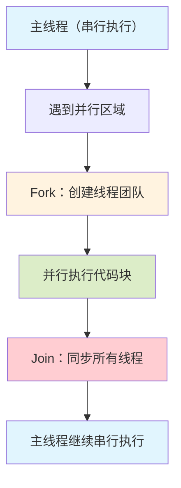

OpenMP（Open Multi-Processing）是一个支持多平台共享内存并行编程的应用程序接口（API），它通过编译器指令、运行时库和环境变量，为C、C++和Fortran程序提供简单而强大的并行化能力。OpenMP采用"增量并行化"的设计理念，允许开发者逐步将串行代码转换为并行代码，而无需大规模重构。本文深入探讨OpenMP的核心概念、编程模型、实际应用以及跨平台开发的注意事项。

## 一、OpenMP 基础概念

### 1.1 什么是 OpenMP

OpenMP是一个开放标准的并行编程模型，由OpenMP Architecture Review Board（ARB）维护。它提供了：

- **编译器指令**：通过`#pragma`指令指导编译器生成并行代码
- **运行时库函数**：提供线程管理、同步、环境查询等功能
- **环境变量**：控制并行执行的行为和性能

### 1.2 OpenMP 的执行模型

OpenMP采用**Fork-Join模型**：



**关键特点**：
- 程序从单线程（主线程）开始执行
- 遇到并行区域时，主线程创建一组工作线程
- 所有线程在并行区域内并行执行
- 并行区域结束时，所有线程同步，只有主线程继续执行

## 二、OpenMP 核心指令

### 2.1 并行区域指令

#### `#pragma omp parallel`

* 它告诉编译器，接下来的for循环，将会使用并行的方式执行
* 使用并行的时候需要满足以下4个需求：
    1.在循环的迭代其必须是可计算的并且在执行前就需要知道迭代次数的
    2.在循环的代码块不能包含break,return，exit
    3.在循环的代码块不能使用goto跳出到循环外部
    4.迭代其只能够被for语句中的增量表达式所修改
创建并行区域，是最基础的OpenMP指令：

```cpp
#include <omp.h>
#include <iostream>

int main() {
    #pragma omp parallel
    {
        int thread_id = omp_get_thread_num();
        int num_threads = omp_get_num_threads();
        std::cout << "线程 " << thread_id 
                  << " / " << num_threads << std::endl;
    }
    return 0;
}
```

**执行结果**（假设4个线程）：
```
线程 0 / 4
线程 1 / 4
线程 2 / 4
线程 3 / 4
```

#### 并行区域子句

```cpp
// num_threads：指定线程数
#pragma omp parallel num_threads(8)
{
    // 使用8个线程执行
}

// if：条件并行
int n = 1000;
#pragma omp parallel if(n > 100)
{
    // 只有当 n > 100 时才并行执行
}

// default：数据共享属性
#pragma omp parallel default(none) shared(a, b) private(i)
{
    // a, b 共享，i 私有
}
```

### 2.2 工作共享指令

#### `#pragma omp for`

将循环迭代分配给多个线程：

```cpp
#include <omp.h>
#include <vector>
#include <iostream>

int main() {
    const int n = 1000000;
    std::vector<double> a(n), b(n), c(n);
    
    // 初始化
    #pragma omp parallel for
    for (int i = 0; i < n; ++i) {
        a[i] = i * 0.1;
        b[i] = i * 0.2;
    }
    
    // 并行计算
    #pragma omp parallel for
    for (int i = 0; i < n; ++i) {
        c[i] = a[i] + b[i];
    }
    
    return 0;
}
```

#### 调度子句（schedule）

```cpp
// static：静态调度，编译时分配
#pragma omp parallel for schedule(static)
for (int i = 0; i < n; ++i) {
    // 每个线程处理连续的迭代块
}

// dynamic：动态调度，运行时分配
#pragma omp parallel for schedule(dynamic, 100)
for (int i = 0; i < n; ++i) {
    // 每次分配100个迭代，适合负载不均衡
}

// guided：引导调度，块大小逐渐减小
#pragma omp parallel for schedule(guided, 50)
for (int i = 0; i < n; ++i) {
    // 初始块较大，逐渐减小到50
}

// auto：让编译器自动选择
#pragma omp parallel for schedule(auto)
for (int i = 0; i < n; ++i) {
    // 编译器根据循环特征选择
}

// runtime：运行时通过环境变量决定
// 设置：export OMP_SCHEDULE="dynamic,100"
#pragma omp parallel for schedule(runtime)
for (int i = 0; i < n; ++i) {
    // 调度方式由环境变量决定
}
```

#### `#pragma omp sections`

* sections在封闭代码的指定部分中，由线程组进行分配任务
* 每个独立的section都需要在sections里面。
* 不同的section可能执行不同的任务
* 如果一个线程够快，改线程可能执行多个section

将代码块分配给不同线程：

```cpp
#pragma omp parallel sections
{
    #pragma omp section
    {
        // 任务1：由线程1执行
        process_data_A();
    }
    
    #pragma omp section
    {
        // 任务2：由线程2执行
        process_data_B();
    }
    
    #pragma omp section
    {
        // 任务3：由线程3执行
        process_data_C();
    }
}
```

#### `#pragma omp single`

**single选项是在并行块里面使用的**
    * 它告诉处理其接下来紧跟着的下一段代码只能在一个线程中执行
    * 它可能会在处理多段线程不安全代码时非常有用
    * 在不适用no wait选项时，在线程组中不想执行single的线程们将会等待single的结束

只有一个线程执行代码块：

```cpp
#pragma omp parallel
{
    // 所有线程执行
    do_parallel_work();
    
    #pragma omp single
    {
        // 只有主线程执行
        std::cout << "初始化完成" << std::endl;
    }
    
    // 所有线程继续执行
    do_more_work();
}
```

### 2.3 数据共享属性

#### shared（共享）

所有线程共享同一变量：

```cpp
int sum = 0;
#pragma omp parallel for shared(sum)
for (int i = 0; i < n; ++i) {
    sum += a[i];  // 危险！存在数据竞争
}
```

#### private（私有）

* private 在#pragma中作为一个可选的附加的选项
* 它能够直接的告诉编译器去使得共享变量作为每个线程中的私有变量
* #pragma omp ..private(<variable list>)

**关于private的信息：**
* 每一个线程都是拥有独自的该变量的副本
* 如果j被定义为私有变量，那么在for循环里面，所有的线程都不能访问其他j(尽管j是共享变量)
* 所有的线程都不会使用到先前的定义
* 所有的线程都不能共享的j赋值
* 在循环的入口以及出口，都不会进行定义

每个线程有独立的变量副本：

```cpp
int local_sum;
#pragma omp parallel for private(local_sum)
for (int i = 0; i < n; ++i) {
    local_sum = a[i] * 2;  // 每个线程有自己的local_sum
}
```

#### firstprivate（首次私有）

* firstprivate选项告诉编译器私有变量在第一个循环中会继承**共享变量**的值
* 这个私有的变量只会在每个线程的**第一个**循环继承，而不会在每个循环中继承
* 其使用方法于private几乎一致
* #pragma mop parallel for lastprivate(x)

**关于变量的拷贝**：
    * 如果变量是基础数据类型，如int, double等，会将数据进行**直接**拷贝
    * 如果变量是一个数组，他会拷贝一个对应的数据以及大小到私有内存中去
    * 如果变量为指针，它会将变量指向的地址拷贝过去，指向相同的地址
    * 如果变量是一个类的实例，他会调用对应的构造函数构造一个私有变量

私有变量，但用原值初始化：

```cpp
int base = 100;
#pragma omp parallel for firstprivate(base)
for (int i = 0; i < n; ++i) {
    int value = base + i;  // 每个线程的base初始值为100
}
```

#### lastprivate（最后私有）
* lastprivate选项告诉编译器私有变量会在最后一个循环出去的时候，用私有变量的值替换掉共享变量的值
* 当负责最后一个iteration的线程离开循环的时候，它会将该私有变量的值复制给当前共享变量的值

私有变量，但最后用最后一个迭代的值更新原变量：

```cpp
int last_i;
#pragma omp parallel for lastprivate(last_i)
for (int i = 0; i < n; ++i) {
    last_i = i;
}
// last_i 的值是最后一个迭代的值（n-1）
```

#### reduction（归约）
reduction也是一种相当常见的选项，它为我们的parallel,for，和sections提供了一个归并的功能
使用方法如下：
#pragma omp ... Reduction(pp:list)

它会提供一个私有的变量拷贝并且初始化该私有变量
私有变量的初始化的值取决于选择的归并的操作符
这些变量的拷贝会在本地线程中进行更新
在最后的出口中，所有的变量拷贝将会通过操作符所定义的挥着进行合并的计算，计算成一个共享变量。

对变量进行归约操作：

```cpp
int sum = 0;
#pragma omp parallel for reduction(+:sum)
for (int i = 0; i < n; ++i) {
    sum += a[i];  // 安全！自动处理数据竞争
}

// 支持的归约操作：
// +, -, *, /, &&, ||, &, |, ^, max, min
```

### 2.4 同步指令

#### `#pragma omp barrier`
用于实现同步的一种手段
它会在代码的某个点，令所有的线程停下来直到所有的线程都到达该地方

使用的语法如下：
#pragma omp barrier
许多情况下，它已经能够自动的插入到工作区结尾
比如说在for,single
但是它能够被nowait禁用

显式同步点：

```cpp
#pragma omp parallel
{
    // 阶段1：所有线程执行
    phase1_work();
    
    #pragma omp barrier  // 等待所有线程完成
    
    // 阶段2：所有线程继续
    phase2_work();
}
```

#### `#pragma omp critical`

使用方法
#pragma omp critical 
它告诉编译器接下来的一段代码在同一时间只能由一个线程进行
好处：解决了竞争现象
坏处：使用critical会让程序执行减少并行化程度，必须手动判断哪些部分一般公共用到critical

临界区，同一时刻只有一个线程执行：

```cpp
int counter = 0;
#pragma omp parallel for
for (int i = 0; i < n; ++i) {
    #pragma omp critical
    {
        counter++;  // 线程安全
    }
}
```

#### `#pragma omp atomic`
它只在特殊情况下使用：
* 在自增或者自减的情况下使用
* 在二元操作数的情况下使用
只能用于一条指令

原子操作，比critical更高效：

```cpp
int counter = 0;
#pragma omp parallel for
for (int i = 0; i < n; ++i) {
    #pragma omp atomic
    counter++;  // 原子递增
}

// 支持的原子操作：
// read, write, update, capture
// +=, -=, *=, /=, ++, --, etc.
```

#### `#pragma omp master`

**Master选项是在并行块中使用的
    * 它告诉编译器接下来的一段代码只会由主线程执行
    * 它不会出现等待现象

只有主线程执行：

```cpp
#pragma omp parallel
{
    do_work();
    
    #pragma omp master
    {
        // 只有线程0执行
        update_statistics();
    }
}
```

#### `#pragma omp flush`

内存同步，确保内存可见性：

```cpp
bool flag = false;
#pragma omp parallel
{
    if (omp_get_thread_num() == 0) {
        flag = true;
        #pragma omp flush(flag)  // 确保flag写入内存
    } else {
        #pragma omp flush(flag)  // 确保读取最新值
        while (!flag) {
            #pragma omp flush(flag)
        }
    }
}
```

## 三、OpenMP 任务并行

### 3.1 任务模型

OpenMP 3.0引入任务（task）概念，支持不规则并行：

```cpp
#include <omp.h>
#include <vector>

void process_node(Node* node) {
    if (node == nullptr) return;
    
    // 处理当前节点
    compute(node);
    
    // 创建子任务
    #pragma omp task
    process_node(node->left);
    
    #pragma omp task
    process_node(node->right);
    
    #pragma omp taskwait  // 等待子任务完成
}

int main() {
    Node* root = build_tree();
    
    #pragma omp parallel
    {
        #pragma omp single
        {
            process_node(root);
        }
    }
    return 0;
}
```

### 3.2 任务依赖

OpenMP 4.0支持任务依赖：

```cpp
int a = 0, b = 0, c = 0;

#pragma omp parallel
{
    #pragma omp single
    {
        #pragma omp task depend(out: a)
        {
            a = compute_a();
        }
        
        #pragma omp task depend(out: b)
        {
            b = compute_b();
        }
        
        #pragma omp task depend(in: a, b) depend(out: c)
        {
            c = a + b;  // 等待a和b完成
        }
    }
}
```

## 四、实际应用示例

### 4.1 矩阵乘法

```cpp
#include <omp.h>
#include <vector>
#include <iostream>

void matrix_multiply(const std::vector<std::vector<double>>& A,
                     const std::vector<std::vector<double>>& B,
                     std::vector<std::vector<double>>& C) {
    int n = A.size();
    int m = B[0].size();
    int p = B.size();
    
    #pragma omp parallel for collapse(2)
    for (int i = 0; i < n; ++i) {
        for (int j = 0; j < m; ++j) {
            double sum = 0.0;
            for (int k = 0; k < p; ++k) {
                sum += A[i][k] * B[k][j];
            }
            C[i][j] = sum;
        }
    }
}
```

### 4.2 数值积分（蒙特卡洛方法）

```cpp
#include <omp.h>
#include <random>
#include <cmath>

double monte_carlo_pi(int n_samples) {
    int count = 0;
    
    #pragma omp parallel reduction(+:count)
    {
        // 每个线程使用不同的随机数种子
        std::mt19937 gen(omp_get_thread_num());
        std::uniform_real_distribution<double> dis(0.0, 1.0);
        
        #pragma omp for
        for (int i = 0; i < n_samples; ++i) {
            double x = dis(gen);
            double y = dis(gen);
            if (x * x + y * y <= 1.0) {
                count++;
            }
        }
    }
    
    return 4.0 * count / n_samples;
}
```

### 4.3 并行归并排序

```cpp
#include <omp.h>
#include <vector>
#include <algorithm>

void parallel_merge_sort(std::vector<int>& arr, int left, int right) {
    if (left >= right) return;
    
    int mid = left + (right - left) / 2;
    
    #pragma omp parallel sections
    {
        #pragma omp section
        {
            parallel_merge_sort(arr, left, mid);
        }
        
        #pragma omp section
        {
            parallel_merge_sort(arr, mid + 1, right);
        }
    }
    
    std::inplace_merge(arr.begin() + left, 
                       arr.begin() + mid + 1, 
                       arr.begin() + right + 1);
}
```

## 五、跨平台开发注意事项

### 5.1 编译器支持

#### Windows 平台

**Microsoft Visual C++ (MSVC)**

```cpp
// 需要启用OpenMP支持
// 项目属性 -> C/C++ -> 语言 -> OpenMP支持：是 (/openmp)

#include <omp.h>

int main() {
    #pragma omp parallel
    {
        // OpenMP代码
    }
    return 0;
}
```

**编译选项**：
```bash
cl /openmp program.cpp
```

**注意事项**：
- MSVC对OpenMP 2.0支持较好，对OpenMP 3.0+支持有限
- 使用Visual Studio时，需要在项目属性中启用OpenMP
- MSVC的OpenMP实现可能与GCC/Clang有细微差异

**MinGW-w64 (GCC for Windows)**

```bash
g++ -fopenmp program.cpp -o program.exe
```

#### Linux 平台

**GCC**

```bash
# 编译
g++ -fopenmp program.cpp -o program

# 检查OpenMP版本
gcc -fopenmp -dumpversion
```

**Clang**

```bash
# 编译（需要libomp）
clang++ -fopenmp program.cpp -o program

# 或者使用LLVM的OpenMP
clang++ -fopenmp=libomp program.cpp -o program
```

**检查OpenMP支持**：

```cpp
#include <omp.h>
#include <iostream>

int main() {
    #ifdef _OPENMP
        std::cout << "OpenMP支持，版本: " << _OPENMP << std::endl;
        std::cout << "线程数: " << omp_get_max_threads() << std::endl;
    #else
        std::cout << "OpenMP不支持" << std::endl;
    #endif
    return 0;
}
```

#### macOS 平台

**Clang (Apple)**

```bash
# macOS的Clang默认不支持OpenMP，需要安装libomp
brew install libomp

# 编译
clang++ -Xpreprocessor -fopenmp -lomp program.cpp -o program

# 或者使用Homebrew的GCC
brew install gcc
g++-11 -fopenmp program.cpp -o program
```

**CMake跨平台配置**：

```cmake
cmake_minimum_required(VERSION 3.12)
project(OpenMPExample)

# 查找OpenMP
find_package(OpenMP REQUIRED)

# 添加可执行文件
add_executable(example main.cpp)

# 链接OpenMP
if(OpenMP_CXX_FOUND)
    target_link_libraries(example PUBLIC OpenMP::OpenMP_CXX)
    message(STATUS "OpenMP found, version: ${OpenMP_CXX_VERSION}")
else()
    message(FATAL_ERROR "OpenMP not found")
endif()

# 平台特定设置
if(WIN32)
    # Windows特定设置
    if(MSVC)
        target_compile_options(example PRIVATE /openmp)
    endif()
elseif(APPLE)
    # macOS特定设置
    find_library(LIBOMP_LIB omp)
    if(LIBOMP_LIB)
        target_link_libraries(example PUBLIC ${LIBOMP_LIB})
    endif()
endif()
```

### 5.2 线程数设置

**环境变量方式**（跨平台通用）：

```bash
# Linux/macOS
export OMP_NUM_THREADS=4

# Windows (PowerShell)
$env:OMP_NUM_THREADS=4

# Windows (CMD)
set OMP_NUM_THREADS=4
```

**代码中设置**：

```cpp
#include <omp.h>

int main() {
    // 设置线程数
    omp_set_num_threads(4);
    
    // 获取最大线程数
    int max_threads = omp_get_max_threads();
    
    // 获取当前线程数
    int current_threads = omp_get_num_threads();
    
    return 0;
}
```

**平台差异**：

```cpp
#include <omp.h>
#include <thread>

int get_optimal_thread_count() {
    #ifdef _WIN32
        // Windows: 考虑处理器组
        SYSTEM_INFO sysinfo;
        GetSystemInfo(&sysinfo);
        return sysinfo.dwNumberOfProcessors;
    #elif defined(__linux__)
        // Linux: 使用sysconf
        return sysconf(_SC_NPROCESSORS_ONLN);
    #elif defined(__APPLE__)
        // macOS: 使用std::thread
        return std::thread::hardware_concurrency();
    #else
        return omp_get_max_threads();
    #endif
}
```

### 5.3 内存模型差异

**False Sharing问题**（所有平台）：

```cpp
// 错误示例：false sharing
struct Data {
    int counter[8];  // 可能在同一缓存行
};

// 正确示例：避免false sharing
struct Data {
    alignas(64) int counter[8];  // 对齐到缓存行大小
};
```

**平台特定的缓存行大小**：

```cpp
#include <omp.h>

// 获取缓存行大小
int get_cache_line_size() {
    #ifdef _WIN32
        DWORD buffer_size = 0;
        GetLogicalProcessorInformation(nullptr, &buffer_size);
        // 解析buffer获取缓存行大小
        return 64;  // 通常64字节
    #elif defined(__linux__)
        return sysconf(_SC_LEVEL1_DCACHE_LINESIZE);
    #elif defined(__APPLE__)
        size_t line_size = 0;
        size_t size = sizeof(line_size);
        sysctlbyname("hw.cachelinesize", &line_size, &size, nullptr, 0);
        return line_size;
    #else
        return 64;  // 默认值
    #endif
}
```

### 5.4 时间测量

**跨平台时间测量**：

```cpp
#include <omp.h>
#include <chrono>

double get_time() {
    #ifdef _WIN32
        LARGE_INTEGER frequency, counter;
        QueryPerformanceFrequency(&frequency);
        QueryPerformanceCounter(&counter);
        return static_cast<double>(counter.QuadPart) / frequency.QuadPart;
    #else
        return omp_get_wtime();
    #endif
}

// 或者使用C++11标准库
auto start = std::chrono::high_resolution_clock::now();
// ... 并行代码 ...
auto end = std::chrono::high_resolution_clock::now();
auto duration = std::chrono::duration_cast<std::chrono::milliseconds>(end - start);
```

### 5.5 随机数生成

**线程安全的随机数**：

```cpp
#include <omp.h>
#include <random>
#include <vector>

void parallel_random_numbers(std::vector<double>& numbers) {
    #pragma omp parallel
    {
        // 每个线程使用不同的随机数生成器
        std::mt19937 gen(omp_get_thread_num());
        std::uniform_real_distribution<double> dis(0.0, 1.0);
        
        #pragma omp for
        for (size_t i = 0; i < numbers.size(); ++i) {
            numbers[i] = dis(gen);
        }
    }
}
```

### 5.6 嵌套并行

**平台差异**：

```cpp
#include <omp.h>

int main() {
    // 启用嵌套并行
    omp_set_nested(1);
    omp_set_max_active_levels(2);
    
    #pragma omp parallel num_threads(2)
    {
        // 外层并行
        #pragma omp parallel num_threads(2)
        {
            // 内层并行
            // 注意：不同平台对嵌套并行的支持不同
        }
    }
    
    return 0;
}
```

**注意事项**：
- Windows MSVC对嵌套并行支持有限
- Linux GCC支持较好
- macOS Clang需要libomp支持

### 5.7 调试和性能分析

**跨平台调试工具**：

```cpp
// 使用条件编译添加调试信息
#ifdef DEBUG
    #pragma omp parallel
    {
        int tid = omp_get_thread_num();
        printf("线程 %d 开始工作\n", tid);
    }
#endif
```

**性能分析工具**：
- **Linux**: `perf`, `gprof`, `Intel VTune`
- **Windows**: `Visual Studio Profiler`, `Intel VTune`
- **macOS**: `Instruments`, `Intel VTune`

## 六、性能优化技巧

### 6.1 负载均衡

```cpp
// 负载不均衡的循环
#pragma omp parallel for schedule(dynamic, 10)
for (int i = 0; i < n; ++i) {
    // 处理时间随i变化
    process_item(i);
}
```

### 6.2 减少同步开销

```cpp
// 错误：频繁同步
int sum = 0;
#pragma omp parallel for
for (int i = 0; i < n; ++i) {
    #pragma omp critical
    {
        sum += compute(i);
    }
}

// 正确：使用reduction
int sum = 0;
#pragma omp parallel for reduction(+:sum)
for (int i = 0; i < n; ++i) {
    sum += compute(i);
}
```

### 6.3 数据局部性

```cpp
// 优化：提高缓存命中率
#pragma omp parallel for schedule(static)
for (int i = 0; i < n; ++i) {
    // 连续内存访问
    result[i] = process(data[i]);
}
```

### 6.4 避免过度并行化

```cpp
// 判断是否值得并行化
if (n > 1000 && omp_get_max_threads() > 1) {
    #pragma omp parallel for
    for (int i = 0; i < n; ++i) {
        // 并行执行
    }
} else {
    // 串行执行
    for (int i = 0; i < n; ++i) {
        // 串行执行
    }
}
```

## 七、常见问题和解决方案

### 7.1 数据竞争

**问题**：

```cpp
int counter = 0;
#pragma omp parallel for
for (int i = 0; i < n; ++i) {
    counter++;  // 数据竞争！
}
```

**解决方案**：

```cpp
// 方案1：使用reduction
int counter = 0;
#pragma omp parallel for reduction(+:counter)
for (int i = 0; i < n; ++i) {
    counter++;
}

// 方案2：使用atomic
int counter = 0;
#pragma omp parallel for
for (int i = 0; i < n; ++i) {
    #pragma omp atomic
    counter++;
}

// 方案3：使用critical（较慢）
int counter = 0;
#pragma omp parallel for
for (int i = 0; i < n; ++i) {
    #pragma omp critical
    {
        counter++;
    }
}
```

### 7.2 False Sharing

**问题**：

```cpp
int counters[8];
#pragma omp parallel for
for (int i = 0; i < 8; ++i) {
    counters[i] = 0;  // 可能在同一缓存行
    for (int j = 0; j < n; ++j) {
        counters[i]++;  // False sharing导致性能下降
    }
}
```

**解决方案**：

```cpp
// 使用缓存行对齐
alignas(64) int counters[8];
#pragma omp parallel for
for (int i = 0; i < 8; ++i) {
    counters[i] = 0;
    for (int j = 0; j < n; ++j) {
        counters[i]++;
    }
}
```

### 7.3 线程数过多

**问题**：创建过多线程导致上下文切换开销

**解决方案**：

```cpp
// 限制线程数
int optimal_threads = std::min(
    omp_get_max_threads(),
    std::thread::hardware_concurrency()
);
omp_set_num_threads(optimal_threads);
```

### 7.4 嵌套并行性能问题

**问题**：嵌套并行可能导致线程数爆炸

**解决方案**：

```cpp
// 控制嵌套深度
omp_set_max_active_levels(2);

// 或者禁用嵌套并行
omp_set_nested(0);
```

## 八、环境变量参考

### 8.1 常用环境变量

| 变量名 | 说明 | 示例值 |
|--------|------|--------|
| `OMP_NUM_THREADS` | 线程数 | `4`, `2,4` (嵌套) |
| `OMP_PROC_BIND` | 线程绑定 | `true`, `false`, `close`, `spread` |
| `OMP_PLACES` | 线程放置 | `cores`, `threads`, `sockets` |
| `OMP_SCHEDULE` | 调度方式 | `static`, `dynamic,100`, `guided,50` |
| `OMP_DYNAMIC` | 动态调整线程数 | `true`, `false` |
| `OMP_NESTED` | 嵌套并行 | `true`, `false` |
| `OMP_MAX_ACTIVE_LEVELS` | 最大嵌套层数 | `2` |
| `OMP_THREAD_LIMIT` | 线程数上限 | `64` |
| `OMP_STACKSIZE` | 线程栈大小 | `4M`, `8M` |

### 8.2 平台特定设置

**Linux**：

```bash
# 绑定线程到特定CPU核心
export OMP_PROC_BIND=true
export OMP_PLACES=cores

# 设置线程亲和性
export OMP_NUM_THREADS=4
taskset -c 0-3 ./program
```

**Windows**：

```powershell
# PowerShell
$env:OMP_NUM_THREADS=4
$env:OMP_PROC_BIND="true"
.\program.exe
```

**macOS**：

```bash
# 设置线程数
export OMP_NUM_THREADS=4

# 如果使用Homebrew的GCC
export OMP_NUM_THREADS=4 ./program
```

**总结:**
**开发时**：先确保串行代码正确，再逐步添加并行化，通过性能测试找到最优线程配置，使用条件编译处理平台差异。
**性能上**：尽量减少线程同步开销（如用reduction替代critical），根据数据分布选择合适的调度策略，优化内存访问模式，并避免创建过多线程导致性能下降。
**可移植性**：优先使用标准的OpenMP API，对于必要的平台差异使用条件编译隔离，并详细记录各平台的配置要求。

