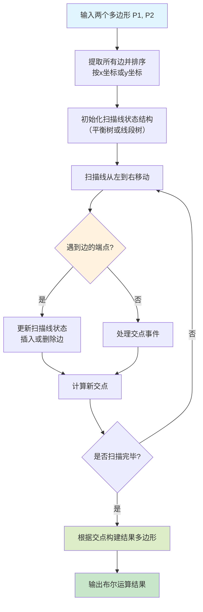
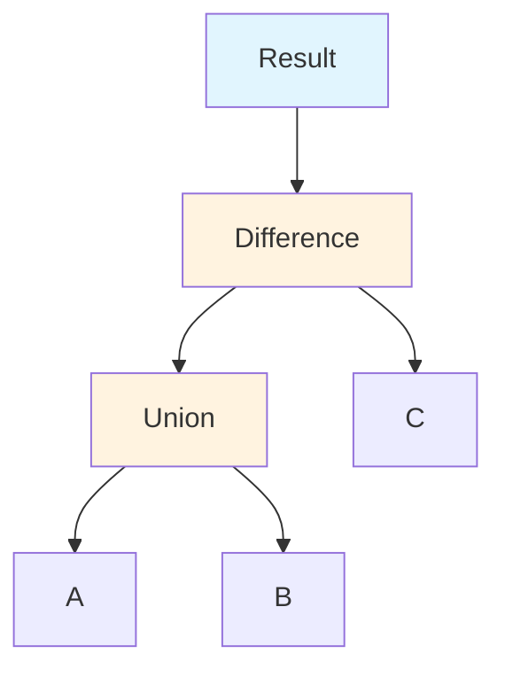
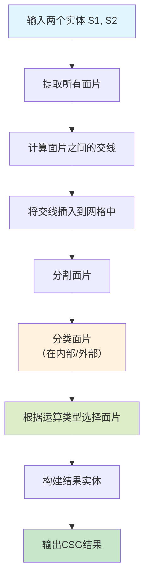
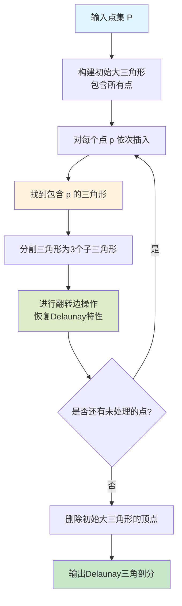
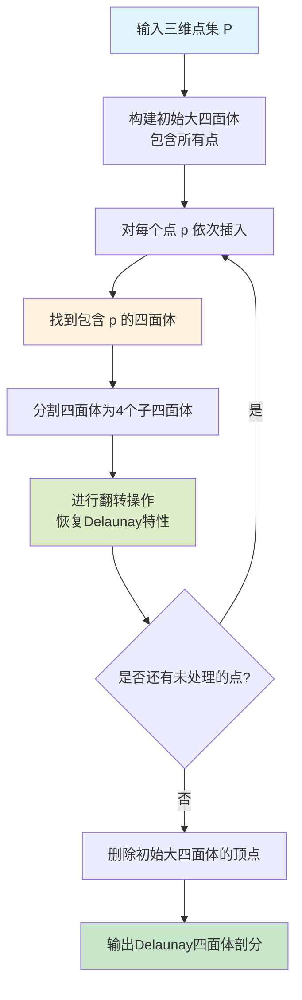
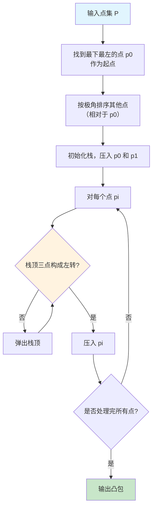

几何算法是计算几何学和计算机图形学的核心基础，广泛应用于CAD系统、游戏引擎、物理仿真、机器人路径规划等领域。本文深入探讨二维和三维布尔运算、剖分算法以及其他基础几何算法，从原理到实现全面解析这些经典算法。

## 一、问题描述与应用背景

### 1.1 几何算法的核心问题

几何算法主要解决以下几类问题：

1. **布尔运算**：计算两个或多个几何体的并集、交集、差集
2. **剖分算法**：将复杂几何体分解为简单的基元（三角形、四面体等）
3. **凸包计算**：找到包含所有点的最小凸多边形或多面体
4. **最小包围盒**：计算几何体的轴对齐包围盒（AABB）或方向包围盒（OBB）
5. **碰撞检测**：判断两个几何体是否相交

### 1.2 应用场景

- **CAD系统**：实体建模、布尔运算、网格生成
- **游戏引擎**：碰撞检测、物理仿真、渲染优化
- **计算机图形学**：三角化、网格处理、形状分析
- **机器人学**：路径规划、障碍物避让、抓取规划
- **地理信息系统（GIS）**：地图叠加、区域分析、空间查询

## 二、二维布尔运算

### 2.1 问题定义

给定两个二维多边形 $P_1$ 和 $P_2$，计算它们的：
- **并集**（Union）：$P_1 \cup P_2$
- **交集**（Intersection）：$P_1 \cap P_2$
- **差集**（Difference）：$P_1 \setminus P_2$ 或 $P_2 \setminus P_1$

### 2.2 扫描线算法（Sweep Line Algorithm）

扫描线算法是处理二维布尔运算的经典方法。

#### 算法思想

使用一条垂直扫描线从左到右扫描平面，维护扫描线与多边形边的交点，并根据交点的进入/退出状态判断点在多边形内或外。



#### 边的分类

对于每条边，需要记录：
- **边的方向**：从下到上或从上到下
- **边的类型**：属于哪个多边形（$P_1$ 或 $P_2$）
- **边的位置**：在扫描线左侧还是右侧

#### 交点计算

两条线段 $L_1 = (p_1, p_2)$ 和 $L_2 = (p_3, p_4)$ 的交点可以通过参数方程计算：

对于线段 $L_1$：
$$\mathbf{p} = \mathbf{p}_1 + t(\mathbf{p}_2 - \mathbf{p}_1), \quad t \in [0,1]$$

对于线段 $L_2$：
$$\mathbf{p} = \mathbf{p}_3 + s(\mathbf{p}_4 - \mathbf{p}_3), \quad s \in [0,1]$$

联立求解：
$$\mathbf{p}_1 + t(\mathbf{p}_2 - \mathbf{p}_1) = \mathbf{p}_3 + s(\mathbf{p}_4 - \mathbf{p}_3)$$

解出 $t$ 和 $s$，如果 $t, s \in [0,1]$，则两线段相交，交点为：
$$\mathbf{p}_{intersect} = \mathbf{p}_1 + t(\mathbf{p}_2 - \mathbf{p}_1)$$

### 2.3 Weiler-Atherton算法

Weiler-Atherton算法是处理带孔多边形布尔运算的有效方法。

#### 算法思想

1. **建立轮廓链表**：将两个多边形的顶点按逆时针顺序组织
2. **计算交点**：找到所有边的交点并插入到顶点列表中
3. **分类顶点**：将交点标记为"进入"（in）或"离开"（out）
4. **跟踪轮廓**：从交点开始，沿着正确的方向跟踪生成结果多边形

#### 进入/离开点判断

对于交点 $I$，需要判断它是"进入点"还是"离开点"：

- **进入点**：从多边形外部进入内部的点
- **离开点**：从多边形内部离开到外部的点

判断方法：
1. 计算交点的两条边的法向量
2. 判断点在另一个多边形的内部还是外部
3. 根据运算类型（并集、交集、差集）确定跟踪方向

### 2.4 并集算法实现思路

```cpp
// 伪代码：二维多边形并集
Polygon union2D(const Polygon& P1, const Polygon& P2) {
    // 1. 提取所有边
    vector<Edge> edges = extractEdges(P1, P2);
    
    // 2. 计算所有交点
    vector<Point> intersections = computeIntersections(edges);
    
    // 3. 将交点插入到顶点列表
    insertIntersections(intersections, P1, P2);
    
    // 4. 标记交点为进入/离开点
    markIntersectionTypes(intersections, P1, P2, UNION);
    
    // 5. 从进入点开始跟踪轮廓
    Polygon result;
    for (auto& inPoint : intersections) {
        if (inPoint.type == IN && !inPoint.visited) {
            traceContour(inPoint, P1, P2, UNION, result);
        }
    }
    
    return result;
}
```

### 2.5 交集与差集

交集和差集的算法与并集类似，主要区别在于：

- **交集**：只跟踪同时位于两个多边形内部的区域
- **差集**：跟踪位于第一个多边形但不在第二个多边形内的区域

关键区别在于进入/离开点的判断规则不同。

## 三、三维布尔运算（CSG操作）

### 3.1 构造实体几何（CSG）

构造实体几何（Constructive Solid Geometry, CSG）是三维建模中的核心概念，通过基本几何体的布尔运算构造复杂模型。

#### CSG树

CSG操作可以用二叉树表示：
- **叶子节点**：基本几何体（球、立方体、圆柱体等）
- **内部节点**：布尔运算（并集 $\cup$、交集 $\cap$、差集 $\setminus$）

例如：$Result = (A \cup B) \setminus C$ 可以表示为：



### 3.2 边界表示法（B-Rep）

三维布尔运算通常基于边界表示法（Boundary Representation），将实体表示为：
- **顶点（Vertex）**：三维点
- **边（Edge）**：连接两个顶点的线段
- **面（Face）**：由边围成的多边形区域
- **体（Solid）**：由面围成的封闭区域

### 3.3 三维布尔运算算法流程



#### 面片分类

对于面片 $F$，需要判断它相对于实体 $S$ 的位置：
- **外部面片**：面片位于实体外部
- **内部面片**：面片位于实体内部
- **相交面片**：面片与实体边界相交

判断方法：
1. 计算面片的中心点
2. 判断点在实体内部还是外部（使用射线法或符号距离函数）
3. 考虑面片的法向量方向

#### 射线法判断点是否在实体内部

从点 $P$ 发射一条射线，计算射线与实体表面的交点数量：
- **奇数个交点**：点在内部
- **偶数个交点**：点在外部

数学表达：
$$\text{Inside}(P, S) = \begin{cases}
\text{true} & \text{if } \sum_{i} \text{Intersect}(\text{Ray}(P), F_i) \bmod 2 = 1 \\
\text{false} & \text{otherwise}
\end{cases}$$

其中 $F_i$ 是实体 $S$ 的所有面片。

### 3.4 并集运算

三维并集算法步骤：

1. **计算交线**：找到 $S_1$ 和 $S_2$ 所有面片的交线
2. **分割面片**：用交线分割相交的面片
3. **分类面片**：
   - 保留 $S_1$ 在 $S_2$ 外部的面片
   - 保留 $S_2$ 在 $S_1$ 外部的面片
   - 删除在对方内部的面片
4. **合并结果**：将所有保留的面片组合成新实体

### 3.5 交集运算

三维交集算法步骤：

1. **计算交线**：找到所有面片的交线
2. **分割面片**：用交线分割面片
3. **分类面片**：
   - 保留同时位于 $S_1$ 和 $S_2$ 内部的面片
   - 删除在任一实体外部的面片
4. **构建结果**：组合保留的面片

### 3.6 差集运算

三维差集 $S_1 \setminus S_2$ 的算法步骤：

1. **计算交线**：找到所有面片的交线
2. **分割面片**：用交线分割面片
3. **分类面片**：
   - 保留 $S_1$ 在 $S_2$ 外部的面片
   - 反转 $S_2$ 在 $S_1$ 内部的面片（法向量反向）
   - 删除在对方外部的面片
4. **构建结果**：组合保留的面片

### 3.7 数值稳定性问题

三维布尔运算面临的主要挑战：

1. **浮点误差**：交线计算中的数值精度问题
2. **退化情况**：面片共面、边共线等特殊情况
3. **拓扑一致性**：确保结果实体的拓扑正确性

解决方案：
- 使用容差（tolerance）判断是否共点、共线、共面
- 使用精确算术（Exact Arithmetic）处理关键计算
- 后处理步骤检查和修复拓扑错误

## 四、二维剖分算法

### 4.1 Delaunay三角剖分

Delaunay三角剖分是二维点集的一种最优三角化方法，满足Delaunay空圆特性。

#### Delaunay空圆特性

对于三角形 $\triangle ABC$，其外接圆内不包含任何其他点。如果满足这一条件，则称该三角剖分为Delaunay三角剖分。

数学表达：对于三角形 $\triangle p_i p_j p_k$，其外接圆为 $C_{ijk}$，则：
$$\forall p_l \in P \setminus \{p_i, p_j, p_k\}, \quad p_l \notin \text{Interior}(C_{ijk})$$

#### Delaunay三角剖分的性质

1. **唯一性**：如果点集处于一般位置（无四点共圆），Delaunay三角剖分唯一
2. **最大最小角特性**：在所有可能的三角剖分中，Delaunay三角剖分最大化最小角
3. **局部最优性**：任何Delaunay边满足局部Delaunay条件

#### 局部Delaunay条件

边 $e = (p_i, p_j)$ 是局部Delaunay的，当且仅当：
- $e$ 是边界边，或
- $e$ 的两个相邻三角形满足空圆特性

#### 增量构造算法（Incremental Construction）



#### 翻转边操作（Edge Flip）

对于共享边 $e = (p_i, p_j)$ 的两个三角形 $\triangle p_i p_j p_k$ 和 $\triangle p_i p_j p_l$，如果它们不满足Delaunay条件，则翻转边 $e$，得到新边 $e' = (p_k, p_l)$。

翻转条件（圆内测试）：
- 如果 $p_l$ 在 $\triangle p_i p_j p_k$ 的外接圆内，则翻转边

外接圆测试可以通过行列式计算：

$$\text{InCircle}(p_i, p_j, p_k, p_l) = \begin{vmatrix}
x_i & y_i & x_i^2 + y_i^2 & 1 \\
x_j & y_j & x_j^2 + y_j^2 & 1 \\
x_k & y_k & x_k^2 + y_k^2 & 1 \\
x_l & y_l & x_l^2 + y_l^2 & 1
\end{vmatrix}$$

如果 $\text{InCircle} > 0$，则 $p_l$ 在圆内，需要翻转。

#### 时间复杂度

- **最优情况**：$O(n \log n)$（使用分治法）
- **最坏情况**：$O(n^2)$（增量算法）
- **平均情况**：$O(n \log n)$

### 4.2 Voronoi图

Voronoi图是Delaunay三角剖分的对偶图，具有重要的几何意义。

#### Voronoi图定义

给定点集 $P = \{p_1, p_2, \ldots, p_n\}$，每个点 $p_i$ 的Voronoi区域定义为：

$$V(p_i) = \{x \in \mathbb{R}^2 : \|x - p_i\| \leq \|x - p_j\|, \forall j \neq i\}$$

即到 $p_i$ 的距离小于或等于到其他所有点的距离的点的集合。

#### Voronoi图的性质

1. **对偶性**：Voronoi图与Delaunay三角剖分互为对偶
2. **凸性**：每个Voronoi区域都是凸多边形
3. **局部性**：两个点的Voronoi区域相邻当且仅当它们在Delaunay三角剖分中由边连接

#### 从Delaunay三角剖分构造Voronoi图

1. **计算外心**：对每个Delaunay三角形，计算其外接圆心
2. **连接外心**：如果两个三角形共享一条边，连接它们的外心
3. **处理边界**：对边界三角形，向外延伸到无限远

#### 外心计算公式

对于三角形 $\triangle ABC$，外心 $O$ 的坐标：

$$O = \frac{A \cdot |B-C|^2 + B \cdot |C-A|^2 + C \cdot |A-B|^2}{2|A \times B + B \times C + C \times A|}$$

其中 $A \times B = x_A y_B - x_B y_A$ 是二维叉积。

### 4.3 约束Delaunay三角剖分

约束Delaunay三角剖分（Constrained Delaunay Triangulation, CDT）要求在剖分中包含预定义的边（约束边）。

#### 问题定义

给定点集 $P$ 和边集 $E$（约束边），构造三角剖分使得：
- 包含所有约束边
- 在满足约束的前提下尽可能接近Delaunay三角剖分

#### 算法思路

1. **初始三角剖分**：对点集进行Delaunay三角剖分
2. **插入约束边**：对于每条约束边，如果不在三角剖分中，则插入它
3. **恢复约束**：使用翻转操作恢复局部Delaunay性质，但不破坏约束边

## 五、三维剖分算法

### 5.1 四面体剖分（Tetrahedralization）

四面体剖分是三维空间中的Delaunay三角剖分的扩展。

#### 三维Delaunay空球特性

对于四面体 $\mathcal{T} = (p_i, p_j, p_k, p_l)$，其外接球内不包含任何其他点。

#### 增量构造算法

与二维类似，采用增量插入的方式：



#### 四面体定位

找到包含点 $p$ 的四面体是算法的关键步骤：

1. **随机起点**：从任意四面体开始
2. **邻域搜索**：沿背离 $p$ 的方向移动到相邻四面体
3. **终止条件**：当前四面体包含 $p$

#### 翻转操作

在三维空间中，有五种基本翻转操作：
- **2-3翻转**：将两个共享面的四面体转换为三个四面体
- **3-2翻转**：将三个共享边的四面体转换为两个四面体
- **4-4翻转**：将四个四面体的配置转换为另一种配置

### 5.2 三维网格生成

对于复杂几何体，需要生成高质量的三维网格用于有限元分析或物理仿真。

#### 网格质量指标

- **形状质量**：四面体的形状接近正四面体
- **尺寸控制**：网格尺寸符合指定的密度函数
- **边界拟合**：网格准确拟合几何边界

#### 前沿推进法（Advancing Front Method）

1. **初始化前沿**：从边界开始，建立初始前沿
2. **生成单元**：从前沿生成新的四面体
3. **更新前沿**：更新前沿状态
4. **迭代**：重复直到所有区域被填满

### 5.3 约束四面体剖分

类似于约束Delaunay三角剖分，约束四面体剖分要求在剖分中包含预定义的三角形面片（约束面）。

## 六、其他基础几何算法

### 6.1 凸包算法

凸包（Convex Hull）是包含所有点的最小凸多边形或多面体。

#### Graham扫描算法



#### 左转判断

对于三点 $p_1, p_2, p_3$，判断是否左转：

$$\text{Cross2D}(p_2 - p_1, p_3 - p_2) = (x_2 - x_1)(y_3 - y_2) - (x_3 - x_2)(y_2 - y_1)$$

- **Cross2D > 0**：左转
- **Cross2D < 0**：右转
- **Cross2D = 0**：共线

#### 时间复杂度

- **Graham扫描**：$O(n \log n)$（主要是排序）
- **增量算法**：$O(n \log n)$
- **分治算法**：$O(n \log n)$

### 6.2 最小包围盒（Bounding Box）

#### 轴对齐包围盒（AABB）

AABB是最简单的包围盒，其边平行于坐标轴。

**计算步骤**：
1. 找到所有点在每个坐标轴上的最小值和最大值
2. 构造轴对齐的矩形或长方体

$$\text{AABB} = [x_{min}, x_{max}] \times [y_{min}, y_{max}] \times [z_{min}, z_{max}]$$

时间复杂度：$O(n)$

#### 方向包围盒（OBB）

OBB可以任意旋转，通常更紧密地包围几何体。

**计算方法**：
1. 计算点的协方差矩阵
2. 对协方差矩阵进行特征值分解
3. 以特征向量为新的坐标轴
4. 在新坐标系下计算AABB

协方差矩阵：

$$C = \frac{1}{n}\sum_{i=1}^{n}(\mathbf{p}_i - \bar{\mathbf{p}})(\mathbf{p}_i - \bar{\mathbf{p}})^T$$

其中 $\bar{\mathbf{p}} = \frac{1}{n}\sum_{i=1}^{n}\mathbf{p}_i$ 是点的质心。

### 6.3 最近点对问题

给定点集 $P$，找到距离最近的两个点。

#### 分治算法

1. **分割**：按x坐标将点集分为两部分
2. **递归**：分别在两部分中找最近点对
3. **合并**：考虑跨越分割线的点对

时间复杂度：$O(n \log^2 n)$，可以优化到 $O(n \log n)$

### 6.4 点在多边形内判断

#### 射线法（Ray Casting）

从点 $P$ 发射一条水平射线，计算与多边形边的交点数量。

```cpp
bool pointInPolygon(Point p, const Polygon& poly) {
    int count = 0;
    int n = poly.size();
    for (int i = 0; i < n; i++) {
        Point a = poly[i];
        Point b = poly[(i + 1) % n];
        
        // 检查射线是否与边相交
        if (((a.y > p.y) != (b.y > p.y)) &&
            (p.x < (b.x - a.x) * (p.y - a.y) / (b.y - a.y) + a.x)) {
            count++;
        }
    }
    return count % 2 == 1;
}
```

时间复杂度：$O(n)$

#### 绕数法（Winding Number）

计算点相对于多边形的绕数：

$$W(P) = \frac{1}{2\pi}\sum_{i=0}^{n-1}\arctan\left(\frac{\text{Cross}(\mathbf{v}_i, \mathbf{v}_{i+1})}{\mathbf{v}_i \cdot \mathbf{v}_{i+1}}\right)$$

如果 $W(P) \neq 0$，则点在多边形内。

## 七、算法实现与优化

### 7.1 数值稳定性

几何算法面临的主要挑战之一是浮点运算的精度问题。

#### 容差处理

使用容差 $\epsilon$ 判断：
- **共点判断**：$\|p_1 - p_2\| < \epsilon$
- **共线判断**：$|\text{Cross2D}(p_2 - p_1, p_3 - p_1)| < \epsilon$
- **共面判断**：$|\text{Dot}(n, (p_4 - p_1))| < \epsilon$（$n$ 是平面法向量）

#### 精确算术

对于关键计算，可以使用：
- **符号计算**：使用符号而不是数值
- **扩展精度**：使用多精度算术库
- **几何谓词**：使用稳定的几何谓词库（如CGAL的精确算术）

### 7.2 数据结构选择

#### 半边数据结构（Half-Edge）

用于表示二维网格：

```cpp
struct HalfEdge {
    Vertex* origin;        // 起点
    HalfEdge* twin;        // 对偶边
    HalfEdge* next;        // 下一条边（同面）
    HalfEdge* prev;        // 上一条边（同面）
    Face* face;            // 所属面
};
```

#### 翼边数据结构（Winged-Edge）

用于表示三维网格：

```cpp
struct Edge {
    Vertex* v1, *v2;       // 两个端点
    Face* f1, *f2;         // 两个相邻面
    Edge* next1, *prev1;   // 面f1中的下一条和上一条边
    Edge* next2, *prev2;   // 面f2中的下一条和上一条边
};
```

### 7.3 空间索引

对于大规模点集，使用空间索引加速查询：

- **四叉树/八叉树**：递归空间划分
- **KD树**：轴对齐的空间划分
- **BVH（Bounding Volume Hierarchy）**：层次包围盒

### 7.4 并行化

几何算法的并行化策略：

1. **空间划分**：将空间划分为独立区域并行处理
2. **任务并行**：将不同类型的任务分配给不同线程
3. **数据并行**：对大规模数据并行处理

## 八、实际应用示例

### 8.1 CAD系统中的布尔运算

现代CAD系统（如SolidWorks、CATIA）广泛使用CSG布尔运算进行实体建模。用户可以通过并集、交集、差集操作组合基本几何体创建复杂模型。

### 8.2 游戏引擎中的碰撞检测

游戏引擎使用几何算法进行：
- **碰撞检测**：AABB/OBB测试、凸包碰撞检测
- **物理仿真**：四面体网格用于有限元分析
- **地形生成**：Delaunay三角剖分用于地形网格生成

### 8.3 有限元分析中的网格生成

工程仿真软件（如ANSYS、ABAQUS）使用高质量网格生成算法：
- **Delaunay四面体剖分**：生成四面体网格
- **前沿推进法**：生成边界拟合网格
- **网格优化**：提高网格质量

### 8.4 机器人路径规划

机器人学中应用：
- **Voronoi图**：生成远离障碍物的路径
- **凸包**：计算机器人工作空间
- **布尔运算**：计算机器人与障碍物的交集

## 九、算法复杂度总结

| 算法 | 时间复杂度 | 空间复杂度 | 备注 |
|------|-----------|-----------|------|
| **二维布尔运算** | $O(n \log n)$ | $O(n)$ | 扫描线算法 |
| **三维布尔运算** | $O(n^2)$ | $O(n)$ | 最坏情况 |
| **Delaunay三角剖分** | $O(n \log n)$ | $O(n)$ | 平均情况 |
| **Voronoi图** | $O(n \log n)$ | $O(n)$ | 从Delaunay构造 |
| **四面体剖分** | $O(n^2)$ | $O(n)$ | 最坏情况 |
| **凸包（Graham）** | $O(n \log n)$ | $O(n)$ | |
| **AABB计算** | $O(n)$ | $O(1)$ | |
| **最近点对** | $O(n \log n)$ | $O(n)$ | 分治算法 |

其中 $n$ 是点、边或面的数量。

## 十、总结与展望

### 10.1 算法特点总结

几何算法具有以下特点：

1. **理论基础深厚**：涉及计算几何、代数几何、拓扑学等多个数学分支
2. **实现复杂度高**：需要处理大量边界情况和数值稳定性问题
3. **应用广泛**：在CAD、游戏、仿真、机器人等众多领域都有应用
4. **持续发展**：随着计算能力的提升和应用需求的增加，算法不断改进

### 10.2 研究方向

1. **鲁棒性改进**：提高算法对退化情况和数值误差的鲁棒性
2. **性能优化**：利用GPU并行计算、空间索引等技术提高性能
3. **新算法开发**：针对特定应用场景开发专用算法
4. **可扩展性**：处理大规模几何数据的能力

### 10.3 学习建议

1. **理论基础**：深入学习计算几何、线性代数、数值分析等数学基础
2. **实践编程**：通过实现经典算法加深理解
3. **使用库**：在实际项目中可以使用成熟的几何库（如CGAL、OpenMesh）
4. **关注前沿**：跟踪SIGGRAPH、SoCG等顶级会议的最新研究

---

**参考文献**：

1. de Berg, M., Cheong, O., van Kreveld, M., & Overmars, M. (2008). *Computational Geometry: Algorithms and Applications* (3rd ed.). Springer.
2. Shewchuk, J. R. (1996). Triangle: Engineering a 2D Quality Mesh Generator and Delaunay Triangulator. *Applied Computational Geometry*.
3. Garland, M., & Heckbert, P. S. (1997). Surface simplification using quadric error metrics. *SIGGRAPH*.
4. Hachenberger, P., Kettner, L., & Mehlhorn, K. (2007). Boolean operations on 3D selective Nef complexes: Data structure, algorithms, and implementation. *CGAL User and Reference Manual*.
5. Si, H. (2015). TetGen, a Delaunay-based quality tetrahedral mesh generator. *ACM Transactions on Mathematical Software*.

