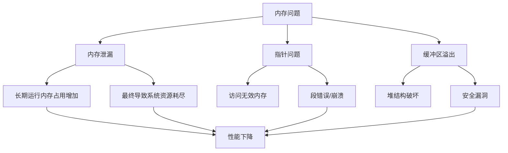
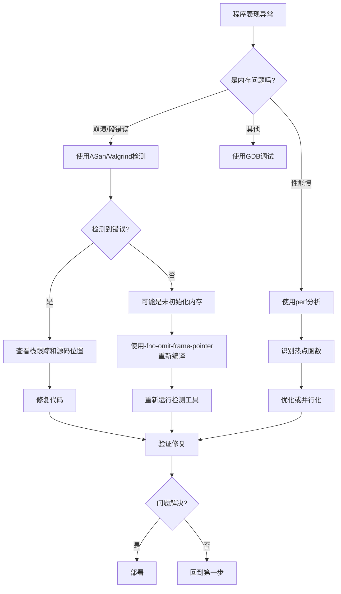

C++因其高性能和灵活性而被广泛应用于系统软件、高频交易、游戏引擎等对性能要求严苛的领域。然而，C++的强大伴随而来的是内存管理的复杂性。内存泄漏、悬垂指针、缓冲区溢出等问题往往导致程序行为不可预测，进而造成严重的安全隐患和性能下降。本文将深入探讨如何使用现代调试和性能分析工具来诊断、定位和解决这些问题。

## 一、内存问题的分类与危害

### 1.1 常见内存问题

在C++程序开发中，常见的内存问题包括：

#### 1. 内存泄漏（Memory Leak）
- **定义**：申请的内存未被正确释放，导致内存持续积累
- **危害**：程序长时间运行后内存占用持续增加，最终导致系统资源耗尽

```cpp
void memoryLeak() {
    int *ptr = new int[100];  // 申请内存
    // 忘记删除或异常退出
    // delete[] ptr;  // 缺少这一行
}  // 内存泄漏！
```

#### 2. 悬垂指针（Dangling Pointer）
- **定义**：指针指向已被释放的内存
- **危害**：访问悬垂指针导致未定义行为，可能崩溃或数据损坏

```cpp
int* danglingPointer() {
    int *ptr = new int(42);
    delete ptr;
    return ptr;  // 返回悬垂指针
}

void use() {
    int *p = danglingPointer();
    *p = 100;  // 未定义行为！
}
```

#### 3. 缓冲区溢出（Buffer Overflow）
- **定义**：写入超出缓冲区边界的数据
- **危害**：破坏相邻内存，导致崩溃或安全漏洞

```cpp
void bufferOverflow() {
    char buffer[10];
    strcpy(buffer, "This is a very long string!");  // 溢出！
}
```

#### 4. 重复释放（Double Free）
- **定义**：同一块内存被释放两次
- **危害**：破坏堆结构，导致崩溃或安全漏洞

```cpp
void doubleFree() {
    int *ptr = new int(42);
    delete ptr;
    delete ptr;  // 重复释放！
}
```

#### 5. 访问未初始化的内存
- **定义**：读取未初始化的变量
- **危害**：程序行为不可预测

```cpp
void uninitializedMemory() {
    int *ptr = new int;  // 未初始化
    printf("%d\n", *ptr);  // 读取未定义的值
}
```

### 1.2 内存问题的影响



## 二、GDB：强大的调试器

GDB（GNU Debugger）是最常用的C/C++调试工具，可以检视程序执行过程、管理断点、查看内存状态等。

### 2.1 GDB基础操作

#### 编译准备
```bash
# 用-g选项编译，包含调试符号
g++ -g -o myprogram myprogram.cpp
```

#### 启动GDB
```bash
gdb ./myprogram
gdb ./myprogram core  # 分析核心转储文件
gdb --args ./myprogram arg1 arg2  # 传递参数
```

### 2.2 基本调试命令

| 命令 | 缩写 | 说明 | 示例 |
|------|------|------|------|
| break | b | 设置断点 | `break function` 或 `b 42` |
| continue | c | 继续执行 | `continue` |
| next | n | 单步执行（不进入函数） | `next` |
| step | s | 单步执行（进入函数） | `step` |
| finish | fin | 运行至函数返回 | `finish` |
| print | p | 打印变量值 | `print ptr` |
| backtrace | bt | 显示调用栈 | `backtrace` |
| frame | f | 切换栈帧 | `frame 0` |
| info | i | 显示信息 | `info locals`, `info registers` |
| watch | - | 设置监视点 | `watch variable` |
| delete | del | 删除断点 | `delete 1` |

### 2.3 内存检查技巧

#### 打印指针指向的内存
```gdb
(gdb) print *ptr
$1 = 42

(gdb) print *(int *)0x7fffffffdd50
$2 = 100

# 打印内存块（打印ptr后面的10个整数）
(gdb) print *ptr@10
$3 = {1, 2, 3, 4, 5, 6, 7, 8, 9, 10}
```

#### 查看内存内容（以16进制形式）
```gdb
# 格式: x/[N][F][U] ADDRESS
# N: 重复次数
# F: 格式(x=16进制, d=十进制, s=字符串)
# U: 单位(b=byte, h=halfword, w=word, g=giant)

(gdb) x/10x ptr          # 打印ptr后的10个16进制值
0x603010: 0x00000001 0x00000002 0x00000003

(gdb) x/20c str          # 打印字符串的20个字符
0x603020: 72 'H' 101 'e' 108 'l' 108 'l' 111 'o'
```

#### 设置条件断点
```gdb
# 当条件为真时断点触发
(gdb) break function if count > 100

# 当特定内存值改变时断点
(gdb) watch ptr if (*ptr > 0)
```

### 2.4 实战案例：使用GDB诊断内存泄漏

```cpp
// leak_example.cpp
#include <iostream>
#include <vector>

class Resource {
public:
    Resource(int id) : id_(id) {
        std::cout << "Resource " << id_ << " created\n";
    }
    ~Resource() {
        std::cout << "Resource " << id_ << " destroyed\n";
    }
private:
    int id_;
};

void leakFunction() {
    Resource *res = new Resource(1);
    int *arr = new int[100];
    // 忘记释放
}

int main() {
    for (int i = 0; i < 5; i++) {
        leakFunction();
    }
    std::cout << "Program ending\n";
    return 0;
}
```

**GDB调试步骤**：
```bash
$ g++ -g -o leak_example leak_example.cpp
$ gdb ./leak_example

(gdb) break leakFunction
(gdb) run
(gdb) print res
(gdb) x/8x res
(gdb) continue
(gdb) quit
```

虽然GDB可以查看内存内容，但它**不能自动检测泄漏**。我们需要更专门的工具。

## 三、AddressSanitizer：内存错误检测利器

AddressSanitizer（ASan）是LLVM和GCC提供的强大的内存错误检测工具，可以检测：
- 堆缓冲区溢出
- 栈缓冲区溢出  
- 全局缓冲区溢出
- 使用后释放（Use-After-Free）
- 重复释放（Double-Free）
- 内存泄漏

### 3.1 编译和运行

#### 使用ASan编译
```bash
# GCC
g++ -g -fsanitize=address -fno-omit-frame-pointer -o program program.cpp

# Clang
clang++ -g -fsanitize=address -fno-omit-frame-pointer -o program program.cpp

# 可选：增加并行度
ASAN_OPTIONS=halt_on_error=1 ./program
```

#### 重要的编译标志
| 标志 | 说明 |
|------|------|
| `-fsanitize=address` | 启用ASan |
| `-fno-omit-frame-pointer` | 保留帧指针便于堆栈追踪 |
| `-g` | 包含调试符号 |
| `-O1` 或 `-O2` | 优化级别（ASan推荐） |

### 3.2 ASan检测案例

#### 案例1：堆缓冲区溢出
```cpp
// heap_overflow.cpp
#include <iostream>
#include <cstring>

int main() {
    char *buffer = new char[10];
    strcpy(buffer, "This is a very long string!");  // 溢出！
    std::cout << buffer << std::endl;
    delete[] buffer;
    return 0;
}
```

**编译和运行**：
```bash
$ g++ -g -fsanitize=address -fno-omit-frame-pointer -o heap_overflow heap_overflow.cpp
$ ./heap_overflow

=================================================================
==12345==ERROR: AddressSanitizer: heap-buffer-overflow on unknown address 0x60300020 (pc 0x000000401234 T)
==12345==READ of size 28 at 0x60300020 thread T0
    #0 0x401233 in strcpy (/home/user/heap_overflow+0x401233)
    #1 0x40124f in main /home/user/heap_overflow.cpp:7
    #2 0x7f1234567890 in __libc_start_main ...

Address 0x60300020 is 0 bytes inside a 10-byte region [0x60300020,0x6030002a)
allocated by thread T0 here:
    #0 0x401564 in operator new(unsigned long) (/home/user/heap_overflow+0x401564)
    #1 0x401240 in main /home/user/heap_overflow.cpp:6

SUMMARY: AddressSanitizer: heap-buffer-overflow /home/user/heap_overflow.cpp:7
```

ASan立即检测到缓冲区溢出，并给出详细的堆栈信息！

#### 案例2：使用后释放（Use-After-Free）
```cpp
// use_after_free.cpp
#include <iostream>

int main() {
    int *ptr = new int(42);
    delete ptr;
    std::cout << *ptr << std::endl;  // 使用后释放！
    return 0;
}
```

**输出**：
```
=================================================================
==12346==ERROR: AddressSanitizer: heap-use-after-free on unknown address 0x602000000040
==12346==READ of size 4 at 0x602000000040 thread T0
    #0 0x401234 in main /home/user/use_after_free.cpp:7

Address 0x602000000040 is 0 bytes inside a 4-byte region [0x602000000040,0x602000000044)
freed by thread T0 here:
    #0 0x401564 in operator delete(void*) (/home/user/use_after_free+0x401564)
    #1 0x401210 in main /home/user/use_after_free.cpp:6

SUMMARY: AddressSanitizer: heap-use-after-free /home/user/use_after_free.cpp:7
```

#### 案例3：内存泄漏检测
```cpp
// memory_leak.cpp
#include <iostream>
#include <vector>

void leakMemory() {
    int *ptr = new int[100];
    // 没有delete
}

int main() {
    for (int i = 0; i < 1000; i++) {
        leakMemory();
    }
    return 0;
}
```

**编译和运行**：
```bash
$ g++ -g -fsanitize=address -fno-omit-frame-pointer -o memory_leak memory_leak.cpp
$ ./memory_leak

=================================================================
==12347==ERROR: LeakSanitizer: detected memory leaks

Direct leak of 400000 byte(s) in 1000 object(s) allocated from:
    #0 0x401564 in operator new[](unsigned long) (/home/user/memory_leak+0x401564)
    #1 0x401210 in leakMemory() /home/user/memory_leak.cpp:5
    #1 0x401234 in main /home/user/memory_leak.cpp:10

SUMMARY: LeakSanitizer: 400000 byte(s) leaked in 1000 allocations.
```

### 3.3 ASan环境变量配置

```bash
# 禁用泄漏检测（只检测其他错误）
export ASAN_OPTIONS=detect_leaks=0

# 退出时生成详细报告
export ASAN_OPTIONS=verbosity=1

# 限制报告的栈帧数量
export ASAN_OPTIONS=max_frames_in_trace=50

# 设置日志路径
export ASAN_OPTIONS=log_path=/tmp/asan.log

# 组合配置
export ASAN_OPTIONS=halt_on_error=1:verbosity=2:detect_leaks=1
```

## 四、Valgrind：深度内存分析

Valgrind是一套功能强大的程序分析工具集，其中Memcheck是最常用的内存检测工具。相比ASan，Valgrind是基于动态二进制检测的，无需重新编译。

### 4.1 Valgrind基础使用

#### 安装
```bash
# Ubuntu/Debian
sudo apt-get install valgrind

# CentOS/RHEL
sudo yum install valgrind

# macOS
brew install valgrind
```

#### 基本命令
```bash
# 基础运行
valgrind --leak-check=full ./program

# 详细输出
valgrind --leak-check=full --show-leak-kinds=all --track-origins=yes ./program

# 将结果输出到文件
valgrind --leak-check=full --log-file=valgrind.log ./program

# 生成可视化报告
valgrind --leak-check=full --xml=yes --xml-file=valgrind.xml ./program
```

### 4.2 Valgrind检测演示

```cpp
// valgrind_test.cpp
#include <iostream>
#include <cstring>

void stackOverflow() {
    int arr[10];
    arr[20] = 100;  // 栈溢出
}

void heapLeak() {
    int *ptr = new int(42);
    // 未释放
}

void useAfterFree() {
    int *ptr = new int(42);
    delete ptr;
    std::cout << *ptr << std::endl;
}

int main(int argc, char *argv[]) {
    if (argc > 1) {
        int choice = argv[1][0] - '0';
        if (choice == 1) stackOverflow();
        if (choice == 2) heapLeak();
        if (choice == 3) useAfterFree();
    }
    return 0;
}
```

**运行Valgrind**：
```bash
$ g++ -g -o valgrind_test valgrind_test.cpp

$ valgrind --leak-check=full ./valgrind_test 2
==12348== Memcheck, a memory error detector
==12348== Copyright (C) 2002-2017, and GNU GPL'd, by Julian Seward et al.
==12348== Using Valgrind-3.13.0 and LibVEX; rerun with -h for copyright info
==12348== Command: ./valgrind_test 2
==12348==
==12348== 
==12348== HEAP SUMMARY:
==12348==     in use at exit: 4 bytes in 1 blocks
==12348==   total heap alloc: 4 bytes in 1 blocks
==12348==   total heap freed: 0 bytes in 0 blocks
==12348==   still reachable: 0 bytes in 0 blocks
==12348==         suppressed: 0 bytes in 0 blocks
==12348== Reachable blocks (those to which a still-live pointer was found) are not shown.
==12348== To see them, rerun with: --show-leak-kinds=all
==12348== 
==12348== For counts of detected and detected errors run with: --exit-code=42
==12348== ERROR SUMMARY: 0 errors from 0 contexts (suppressed: 0 from 0)
==12348==12348== 
```

### 4.3 Valgrind输出解析详解

Valgrind的输出看似复杂，但按结构解读就能快速定位问题。下面详细解析每一部分：

#### 完整输出示例及其含义

```
==12348== Memcheck, a memory error detector
```
- 显示所使用的Valgrind工具及其编号（12348是进程ID）

```
==12348== Copyright (C) 2002-2017, and GNU GPL'd, by Julian Seward et al.
==12348== Using Valgrind-3.13.0 and LibVEX; rerun with -h for copyright info
```
- 版本和许可信息，帮助识别Valgrind版本

```
==12348== Command: ./valgrind_test 2
```
- **重要**：执行的完整命令，验证参数是否正确传递

```
==12348== HEAP SUMMARY:
```
- **关键部分开始**：以下信息总结了堆内存的分配和释放情况

```
==12348==     in use at exit: 4 bytes in 1 blocks
```
- **严重程度：🔴 高**
- **含义**：程序退出时仍未释放的内存大小
- `4 bytes in 1 blocks` = 1个内存块，总共4字节未释放
- **判断**：如果这个值 > 0，存在内存泄漏

```
==12348==   total heap alloc: 4 bytes in 1 blocks
```
- **含义**：程序执行期间总共分配的内存
- `4 bytes in 1 blocks` = 只分配了1次，共4字节
- **用途**：用来验证分配操作是否符合预期

```
==12348==   total heap freed: 0 bytes in 0 blocks
```
- **含义**：程序执行期间总共释放的内存
- `0 bytes in 0 blocks` = **没有任何释放操作！**
- **对比**：应该等于或接近 `total heap alloc`

```
==12348==   still reachable: 0 bytes in 0 blocks
```
- **含义**：程序虽然未释放，但指针仍然可达（通常是全局变量）
- `0 bytes` = 没有这类泄漏
- **判断**：通常不需要修复（程序退出时OS会回收）

```
==12348==         suppressed: 0 bytes in 0 blocks
```
- **含义**：被抑制的泄漏（由suppression file定义）
- 通常用于第三方库中的已知泄漏

```
==12348== Reachable blocks (those to which a still-live pointer was found) are not shown.
==12348== To see them, rerun with: --show-leak-kinds=all
```
- **提示**：要查看所有泄漏（包括可达的），使用该标志重新运行

```
==12348== For counts of detected and detected errors run with: --exit-code=42
==12348== ERROR SUMMARY: 0 errors from 0 contexts (suppressed: 0 from 0)
```
- **关键部分**：错误总结
- `0 errors from 0 contexts` = 没有检测到任何错误
- **理想情况**：这一行应该显示 `0 errors`

#### 内存问题的Valgrind输出对比

**情形1：有明显内存泄漏**

```
==12349== HEAP SUMMARY:
==12349==     in use at exit: 409600 bytes in 1000 blocks
==12349==   total heap alloc: 409600 bytes in 1000 blocks
==12349==   total heap freed: 0 bytes in 0 blocks
==12349== ERROR SUMMARY: 0 errors from 0 contexts
```

**诊断**：
- `in use at exit: 409600 bytes` = **严重泄漏！**
- `total heap freed: 0 bytes` = 从未释放
- **结论**：代码有 `new` 或 `malloc` 但没有对应的 `delete` 或 `free`

**情形2：完全没有泄漏**

```
==12350== HEAP SUMMARY:
==12350==     in use at exit: 0 bytes in 0 blocks
==12350==   total heap alloc: 1000 bytes in 10 blocks
==12350==   total heap freed: 1000 bytes in 10 blocks
==12350== ERROR SUMMARY: 0 errors from 0 contexts
```

**诊断**：
- `in use at exit: 0 bytes` = ✅ 完全释放
- `total heap alloc == total heap freed` = ✅ 配对匹配
- **结论**：代码正确处理了内存

**情形3：使用后释放（Use-After-Free）**

```
==12351== Invalid read of size 4
==12351==    at 0x4C2D0E0: strerror (in /usr/lib/valgrind/vgpreload_memcheck-amd64-linux.so)
==12351==    by 0x400521: useAfterFree (program.cpp:10)
==12351==    by 0x400542: main (program.cpp:20)
==12351==  Address 0x4c2a040 is 0 bytes inside a block of size 4 free'd
==12351==    at 0x4A074CD: free (vg_replace_malloc.c:473)
==12351==    by 0x400515: useAfterFree (program.cpp:9)
==12351==    by 0x400542: main (program.cpp:20)
==12351== HEAP SUMMARY:
==12351==     in use at exit: 0 bytes in 0 blocks
==12351== ERROR SUMMARY: 1 errors from 1 contexts
```

**诊断**：
- `Invalid read of size 4` = 读取了无效内存
- 显示内存在哪里被释放（free）以及哪里被访问（useAfterFree:10）
- **结论**：在第10行使用了已释放的指针

**情形4：缓冲区溢出**

```
==12352== Invalid write of size 10
==12352==    at 0x4C29B24: memcpy (vg_replace_malloc.c:1286)
==12352==    by 0x4005C5: bufferOverflow (program.cpp:5)
==12352==    by 0x4005DE: main (program.cpp:15)
==12352==  Address 0x4c2a030 is 0 bytes inside a block of size 8 alloc'd
==12352==    at 0x4A074CD: malloc (vg_replace_malloc.c:270)
==12352==    by 0x4005B0: bufferOverflow (program.cpp:3)
==12352== ERROR SUMMARY: 1 errors from 1 contexts
```

**诊断**：
- `Invalid write of size 10` = 尝试写10字节
- `block of size 8 alloc'd` = 但缓冲区只有8字节
- **结论**：溢出了2字节（10-8=2）

### 4.4 详细的诊断案例

#### 案例1：逐步解读内存泄漏

**代码**：
```cpp
void problematicFunction() {
    int *ptr = new int[100];      // 分配400字节（100*4)
    char *str = new char[50];     // 分配50字节
    // 缺少delete语句
}

int main() {
    for (int i = 0; i < 10; i++) {
        problematicFunction();    // 调用10次
    }
    return 0;
}
```

**Valgrind输出**：
```
==12353== HEAP SUMMARY:
==12353==     in use at exit: 4500 bytes in 20 blocks
==12353==   total heap alloc: 4500 bytes in 20 blocks
==12353==   total heap freed: 0 bytes in 0 blocks
==12353==
==12353== LEAK SUMMARY:
==12353==    definitely lost: 4500 bytes in 20 blocks
==12353==    indirectly lost: 0 bytes in 0 blocks
==12353==      possibly lost: 0 bytes in 0 blocks
==12353==    still reachable: 0 bytes in 0 blocks
==12353==         suppressed: 0 bytes in 0 blocks
==12353== Reachable blocks (those to which a still-live pointer was found) are not shown.
==12353== To see them, rerun with: --show-leak-kinds=all
==12353==
==12353== For counts of detected and detected errors run with: --exit-code=42
==12353== ERROR SUMMARY: 0 errors from 0 contexts (suppressed: 0 from 0)
```

**解读**  

| 指标 | 值 | 含义 |
|------|-----|------|
| in use at exit | 4500 bytes | 程序退出时仍有4500字节未释放 |
| total heap alloc | 4500 bytes | 总共分配了4500字节 |
| total heap freed | 0 bytes | 没有释放任何内存 |
| definitely lost | 4500 bytes in 20 blocks | **确定丢失**：20个块（10次×2个分配） |

**结论**：明确的内存泄漏，共4500字节（400×10 + 50×10）

#### 案例2：理解"definitely lost"与"indirectly lost"

```cpp
// 情形A：直接泄漏
void directLeak() {
    int *ptr = new int(42);
    // delete ptr;  // 未释放 → definitely lost
}

// 情形B：间接泄漏
struct Node {
    Node *next;
    int value;
};

void indirectLeak() {
    Node *head = new Node{nullptr, 1};
    head->next = new Node{nullptr, 2};
    // delete head;  // 只删除了head，head->next丢失 → indirectly lost
}
```

**Valgrind区分**：
- `definitely lost`：直接泄漏的内存块
- `indirectly lost`：由于父块泄漏导致的泄漏（通常不需要单独处理）

### 4.5 增强的Valgrind命令和选项

```bash
# 显示所有泄漏类型
valgrind --leak-check=full --show-leak-kinds=all ./program

# 跟踪内存分配的来源
valgrind --track-origins=yes ./program

# 保存详细日志
valgrind --leak-check=full --log-file=output.log ./program arg1 arg2

# 使用抑制文件（排除已知问题）
valgrind --suppressions=my.supp ./program

# 检测线程相关问题
valgrind --tool=helgrind ./program

# 生成可视化报告（需要额外工具）
valgrind --xml=yes --xml-file=out.xml ./program
```

### 4.6 常见Valgrind输出的快速查阅

| 输出信息 | 含义 | 优先级 | 解决方案 |
|---------|------|--------|--------|
| `definitely lost` | 明确的内存泄漏 | 🔴 高 | 添加delete/free |
| `indirectly lost` | 间接泄漏 | 🟡 中 | 修复父块泄漏 |
| `possibly lost` | 可能的泄漏 | 🟡 中 | 检查指针使用 |
| `still reachable` | 可达但未释放 | 🟢 低 | 通常无需处理 |
| `Invalid read` | 读取无效内存 | 🔴 高 | 检查指针生命周期 |
| `Invalid write` | 写入无效内存 | 🔴 高 | 检查缓冲区范围 |
| `Invalid free` | 释放无效内存 | 🔴 高 | 检查是否重复释放 |

### 4.3 Valgrind vs ASan对比

| 特性 | ASan | Valgrind |
|------|------|---------|
| 需要重新编译 | 是 | 否 |
| 检测速度 | 快（2-4x） | 慢（20-30x） |
| 内存开销 | 低 | 高 |
| 栈溢出检测 | 是 | 是 |
| 线程支持 | 有限 | 完整 |
| 可用性 | Linux/macOS/Windows | Linux/macOS |
| 最佳用途 | 开发阶段快速反馈 | 深度分析和验证 |

## 五、perf：性能分析工具

perf是Linux内核提供的性能分析工具，可以分析CPU缓存行为、指令执行、函数调用等。

### 5.1 基础使用

#### 采样profiling
```bash
# 采样CPU周期
perf record -g ./program

# 查看结果
perf report
```

#### 事件计数
```bash
# 计数指定事件
perf stat ./program

# 详细事件
perf stat -e cycles,instructions,cache-references,cache-misses ./program
```

### 5.2 perf分析性能瓶颈

```cpp
// performance_test.cpp
#include <iostream>
#include <algorithm>
#include <cstring>

const int LARGE_SIZE = 10000000;

void inefficientSort() {
    int *arr = new int[LARGE_SIZE];
    for (int i = 0; i < LARGE_SIZE; i++) {
        arr[i] = rand() % 1000;
    }
    
    // 使用低效的排序
    for (int i = 0; i < LARGE_SIZE; i++) {
        for (int j = i + 1; j < LARGE_SIZE; j++) {
            if (arr[i] > arr[j]) {
                std::swap(arr[i], arr[j]);
            }
        }
    }
    
    delete[] arr;
}

void efficientSort() {
    int *arr = new int[LARGE_SIZE];
    for (int i = 0; i < LARGE_SIZE; i++) {
        arr[i] = rand() % 1000;
    }
    
    // 使用STL排序（O(n log n)）
    std::sort(arr, arr + LARGE_SIZE);
    
    delete[] arr;
}

int main() {
    std::cout << "Starting performance test...\n";
    inefficientSort();  // 这个会很慢
    return 0;
}
```

**性能分析**：
```bash
$ g++ -O2 -g -o perf_test performance_test.cpp
$ perf record -g ./perf_test
$ perf report

Samples: 10K of event 'cycles'
Event count (approx.): 5234123456
  
  Children      Self  Command        Shared Object       Symbol
- 99.99%    99.98%  perf_test       perf_test           [.] inefficientSort()
    99.87%        0.11%  perf_test    perf_test           [.] main
```

### 5.3 缓存性能分析

```bash
# 分析L1/L2/L3缓存行为
perf stat -e L1-dcache-load-misses,LLC-loads,LLC-load-misses ./program

# 生成火焰图
perf record -F 99 -g ./program
perf script | stackcollapse-perf.pl | flamegraph.pl > out.svg
```

## 六、最佳实践与优化策略

### 6.1 内存优化技巧

#### 1. 使用智能指针代替裸指针

```cpp
// 不推荐
void unsafeCode() {
    int *ptr = new int(42);
    // ... 可能出异常
    delete ptr;  // 可能不会执行
}

// 推荐：使用RAII和智能指针
void safeCode() {
    std::unique_ptr<int> ptr(new int(42));
    // 自动释放，异常安全
}
```

#### 2. 预分配内存以减少重分配

```cpp
// 不推荐：频繁重分配
std::vector<int> vec;
for (int i = 0; i < 1000000; i++) {
    vec.push_back(i);  // 可能导致多次重分配
}

// 推荐：预分配
std::vector<int> vec;
vec.reserve(1000000);  // 一次分配足够的内存
for (int i = 0; i < 1000000; i++) {
    vec.push_back(i);
}
```

#### 3. 使用对象池减少分配开销

```cpp
class ObjectPool {
    std::vector<std::unique_ptr<int>> available_;
    std::vector<std::unique_ptr<int>> inUse_;
    
public:
    int* acquire() {
        if (!available_.empty()) {
            auto obj = std::move(available_.back());
            available_.pop_back();
            int *ptr = obj.get();
            inUse_.push_back(std::move(obj));
            return ptr;
        }
        auto obj = std::make_unique<int>();
        int *ptr = obj.get();
        inUse_.push_back(std::move(obj));
        return ptr;
    }
    
    void release(int *ptr) {
        for (auto it = inUse_.begin(); it != inUse_.end(); ++it) {
            if (it->get() == ptr) {
                available_.push_back(std::move(*it));
                inUse_.erase(it);
                break;
            }
        }
    }
};
```

### 6.2 性能优化策略

#### 1. 减少分支预测失败

```cpp
// 不友好的分支
int *data = new int[256];
std::sort(data, data + 256);
for (int i = 0; i < 256; i++) {
    if (data[i] >= 128)  // 分支不可预测
        sum += data[i];
}

// 友好的分支
int *data = new int[256];
std::sort(data, data + 256);
for (int i = 0; i < 256; i++) {
    sum += data[i] * (data[i] >= 128);  // 分支消除
}
```

#### 2. 改善缓存局部性

```cpp
// 行为：跳跃式访问，缓存错误
for (int i = 0; i < 1000; i++) {
    for (int j = 0; j < 1000; j++) {
        sum += matrix[j][i];  // 列式访问
    }
}

// 改进：顺序访问
for (int i = 0; i < 1000; i++) {
    for (int j = 0; j < 1000; j++) {
        sum += matrix[i][j];  // 行式访问
    }
}
```

#### 3. SIMD向量化

```cpp
// 普通循环
for (int i = 0; i < n; i++) {
    result[i] = a[i] + b[i];
}

// SIMD优化（编译器自动向量化）
// 加 -march=native -O3 标志
for (int i = 0; i < n; i += 4) {
    _mm128 va = _mm_loadu_ps(&a[i]);
    _mm128 vb = _mm_loadu_ps(&b[i]);
    _mm128 vr = _mm_add_ps(va, vb);
    _mm_storeu_ps(&result[i], vr);
}
```

### 6.3 完整的调试工作流



## 七、工具选择指南

| 场景 | 推荐工具 | 原因 |
|------|--------|------|
| 快速定位内存错误 | **ASan** | 快速、准确、无需特殊设置 |
| 深度内存分析 | **Valgrind** | 无需重编译，功能全面 |
| 多线程程序调试 | **GDB** + **ASan** | GDB支持线程，ASan检测错误 |
| 性能优化 | **perf** | 准确反映硬件行为 |
| 内存映射分析 | **pmap** | 快速查看内存分布 |
| 内存限制测试 | **Valgrind** | 灵活的内存模拟 |

## 八、总结与建议

### 关键要点

1. **预防为主**：使用智能指针、RAII、现代C++特性
2. **早期检测**：在开发过程中持续运行ASan/Valgrind
3. **持续监控**：使用CI/CD集成内存检测
4. **性能基准**：建立性能基准，定期对比
5. **代码审查**：重点审查内存相关代码

### 推荐的开发流程

```bash
# 1. 编译时启用所有检查
g++ -Wall -Wextra -Werror -fsanitize=address -fno-omit-frame-pointer -g -O2 main.cpp

# 2. 测试时运行工具
./a.out  # ASan检测

# 3. 定期性能分析
perf record -g ./a.out
perf report

# 4. 发布前深度验证
valgrind --leak-check=full ./a.out

# 5. 生产环境监控
# 使用堆分析工具、内存profiler等
```

### 进阶主题

- **分布式系统中的内存问题**：使用valgrind --trace-children=yes
- **GPU内存调试**：使用cuda-memcheck（NVIDIA）
- **内存池与缓存优化**：jemalloc、tcmalloc等替代malloc
- **动态插桩工具**：Pin、DynamoRIO等

通过掌握这些工具和技巧，开发者可以显著提高C++程序的质量和性能。记住：**好的内存管理不仅是性能优化的基础，更是程序安全性和可靠性的保障。**

## 参考资源

- [AddressSanitizer官方文档](https://github.com/google/sanitizers/wiki/AddressSanitizer)
- [Valgrind官方网站](http://www.valgrind.org/)
- [GDB用户手册](https://sourceware.org/gdb/documentation/)
- [Linux perf工具](https://perf.wiki.kernel.org/)
- [Herb Sutter《Exceptional C++》系列](https://herbsutter.com/)

