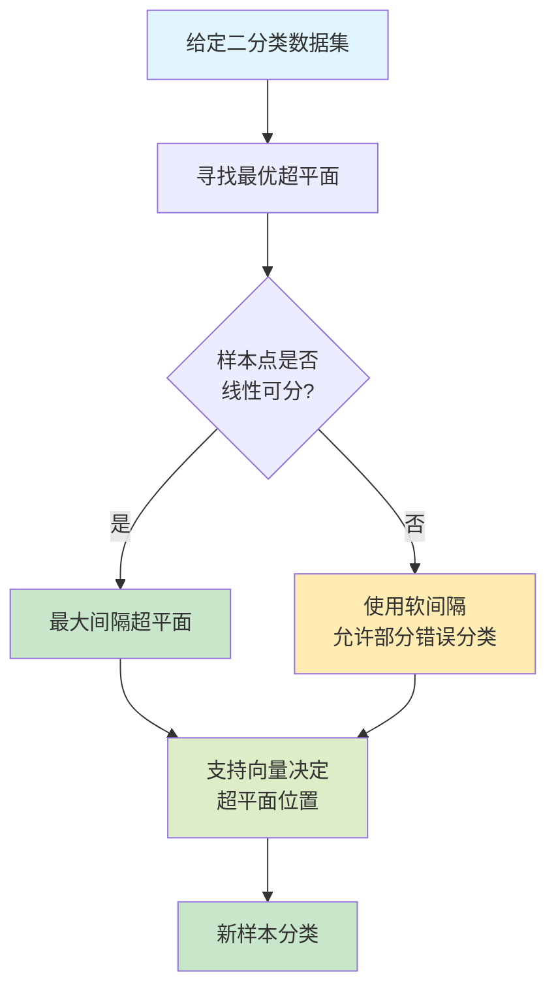

支持向量机（Support Vector Machine, SVM）是机器学习领域中最优雅、最具理论基础的算法之一。它通过寻找最优的超平面进行分类，具有强大的理论支撑和优异的实证效果。本文将从基础概念出发，深入探讨SVM的数学原理、核技巧、求解算法，最后通过详细的实际案例演示如何应用SVM解决真实问题。

## 一、问题描述与基础概念

### 1.1 分类问题的核心思想
给定训练集 $$D = \{(\mathbf{x}_i, y_i) | i = 1, 2, \ldots, m\}$$，其中 $$\mathbf{x}_i \in \mathbb{R}^d$$ 是特征向量，$$y_i \in \{-1, +1\}$$ 是类别标签。二分类任务的目标是找到一个超平面：

$$\mathbf{w}^T \mathbf{x} + b = 0$$

将两类样本分开，其中 $\mathbf{w} \in \mathbb{R}^d$ 是权重向量，$b \in \mathbb{R}$ 是偏置项。

### 1.2 间隔（Margin）的定义

对于线性可分的情况，样本点 $(\mathbf{x}_i, y_i)$ 到超平面的**函数间隔**为：

$$\hat{\gamma}_i = y_i(\mathbf{w}^T \mathbf{x}_i + b)$$

**几何间隔**为：

$$\gamma_i = \frac{y_i(\mathbf{w}^T \mathbf{x}_i + b)}{\|\mathbf{w}\|}$$

几何间隔度量了样本点到超平面的实际距离，其值越大说明分类的确定性越强。

### 1.3 最大间隔原则

SVM的核心思想是**最大间隔分类器**：寻找能够将两类样本分开且间隔最大的超平面。这样的分类器具有最强的泛化能力。



## 二、硬间隔SVM的数学原理

### 2.1 优化问题的表述

对于线性可分的数据，SVM的优化目标是最大化间隔，即：

$$\max_{\mathbf{w}, b} \gamma = \max_{\mathbf{w}, b} \frac{\hat{\gamma}}{\|\mathbf{w}\|}$$

受约束条件：

$$y_i(\mathbf{w}^T \mathbf{x}_i + b) \geq \hat{\gamma}, \quad i = 1, 2, \ldots, m$$

通常取 $\hat{\gamma} = 1$，优化问题转化为：

$$\max_{\mathbf{w}, b} \frac{1}{\|\mathbf{w}\|}$$

等价于最小化问题：

$$\min_{\mathbf{w}, b} \frac{1}{2}\|\mathbf{w}\|^2$$

**约束条件：** $y_i(\mathbf{w}^T \mathbf{x}_i + b) \geq 1, \quad i = 1, 2, \ldots, m$

这是一个**凸二次规划（Quadratic Programming, QP）问题**。

**可视化示意**：下图展示了最大间隔原则的核心思想，支持向量是决定超平面的关键：


### 2.2 拉格朗日对偶形式

引入拉格朗日乘数 $\alpha_i \geq 0$，构造拉格朗日函数：

$$L(\mathbf{w}, b, \boldsymbol{\alpha}) = \frac{1}{2}\|\mathbf{w}\|^2 - \sum_{i=1}^{m} \alpha_i [y_i(\mathbf{w}^T \mathbf{x}_i + b) - 1]$$

其中 $\boldsymbol{\alpha} = (\alpha_1, \alpha_2, \ldots, \alpha_m)^T$。

### 2.3 KKT条件

在最优点处，必须满足KKT（Karush-Kuhn-Tucker）条件：

**1) 可行性条件：**
$$y_i(\mathbf{w}^T \mathbf{x}_i + b) - 1 \geq 0, \quad i = 1, 2, \ldots, m$$
$$\alpha_i \geq 0, \quad i = 1, 2, \ldots, m$$

**2) 互补松弛条件（Complementary Slackness）：**
$$\alpha_i [y_i(\mathbf{w}^T \mathbf{x}_i + b) - 1] = 0, \quad i = 1, 2, \ldots, m$$

这意味着只有 $y_i(\mathbf{w}^T \mathbf{x}_i + b) = 1$ 的样本（即边界上的样本）对应的 $\alpha_i > 0$，这些样本称为**支持向量**。

**3) 梯度条件：**
$$\frac{\partial L}{\partial \mathbf{w}} = \mathbf{w} - \sum_{i=1}^{m} \alpha_i y_i \mathbf{x}_i = 0$$
$$\frac{\partial L}{\partial b} = -\sum_{i=1}^{m} \alpha_i y_i = 0$$

### 2.4 对偶问题

由KKT条件可得：

$$\mathbf{w} = \sum_{i=1}^{m} \alpha_i y_i \mathbf{x}_i$$

将其代入拉格朗日函数，得到**对偶问题**：

$$\max_{\boldsymbol{\alpha}} W(\boldsymbol{\alpha}) = \sum_{i=1}^{m} \alpha_i - \frac{1}{2} \sum_{i=1}^{m} \sum_{j=1}^{m} \alpha_i \alpha_j y_i y_j \mathbf{x}_i^T \mathbf{x}_j$$

**约束条件：**
$$\sum_{i=1}^{m} \alpha_i y_i = 0$$
$$\alpha_i \geq 0, \quad i = 1, 2, \ldots, m$$

这个对偶问题的优点是：
1. 只涉及样本的内积 $\mathbf{x}_i^T \mathbf{x}_j$，为核函数的引入铺平道路
2. 变量数从 $d$ 维（原始问题）降至 $m$ 维（对偶问题），当特征维度很高时优势明显

### 2.5 预测函数

最优的超平面为：

$$f(\mathbf{x}) = \text{sign}(\mathbf{w}^T \mathbf{x} + b)$$

其中：

$$\mathbf{w}^T \mathbf{x} + b = \sum_{i=1}^{m} \alpha_i y_i \mathbf{x}_i^T \mathbf{x} + b$$

## 三、软间隔SVM与正则化

### 3.1 线性不可分的情况

实际数据往往不是完全线性可分的。引入**松弛变量** $\xi_i \geq 0$，允许某些样本违反间隔约束：

$$y_i(\mathbf{w}^T \mathbf{x}_i + b) \geq 1 - \xi_i, \quad i = 1, 2, \ldots, m$$

下图对比了硬间隔和软间隔SVM的区别，以及支持向量的作用：


### 3.2 软间隔优化问题

$$\min_{\mathbf{w}, b, \boldsymbol{\xi}} \frac{1}{2}\|\mathbf{w}\|^2 + C \sum_{i=1}^{m} \xi_i$$

**约束条件：**
$$y_i(\mathbf{w}^T \mathbf{x}_i + b) \geq 1 - \xi_i$$
$$\xi_i \geq 0, \quad i = 1, 2, \ldots, m$$

其中 $C > 0$ 是**正则化参数**：
- $C$ 很大：对错分样本的惩罚大，趋向硬间隔
- $C$ 很小：允许更多错分，模型更平滑

下图展示了不同 $C$ 值对决策边界的影响：


### 3.3 软间隔对偶问题

对偶问题形式相同，但约束条件变为：

$$\max_{\boldsymbol{\alpha}} W(\boldsymbol{\alpha}) = \sum_{i=1}^{m} \alpha_i - \frac{1}{2} \sum_{i=1}^{m} \sum_{j=1}^{m} \alpha_i \alpha_j y_i y_j \mathbf{x}_i^T \mathbf{x}_j$$

**约束条件：**
$$\sum_{i=1}^{m} \alpha_i y_i = 0$$
$$0 \leq \alpha_i \leq C, \quad i = 1, 2, \ldots, m$$

## 四、核函数与非线性SVM

### 4.1 核函数的定义

许多问题在原始空间中线性不可分，但通过非线性映射 $\phi: \mathbb{R}^d \to \mathcal{H}$ 到高维或无限维的**特征空间** $\mathcal{H}$ 后可能变为线性可分。

**核函数**定义为：

$$K(\mathbf{x}_i, \mathbf{x}_j) = \phi(\mathbf{x}_i)^T \phi(\mathbf{x}_j)$$

核函数的妙妙之处在于，我们**无需显式计算** $\phi(\mathbf{x})$，而是直接计算核函数值。

### 4.2 常用核函数

**1) 线性核**
$$K(\mathbf{x}_i, \mathbf{x}_j) = \mathbf{x}_i^T \mathbf{x}_j$$

对应于原始特征空间，用于线性可分问题。

**2) 多项式核**
$$K(\mathbf{x}_i, \mathbf{x}_j) = (\gamma \mathbf{x}_i^T \mathbf{x}_j + r)^d$$

其中 $d$ 是多项式的次数，$\gamma$ 和 $r$ 是参数。对应于 $d$ 次多项式特征空间，维度为 $\binom{d+p-1}{d}$（$p$ 是原始特征数）。

**3) 高斯（RBF）核**
$$K(\mathbf{x}_i, \mathbf{x}_j) = \exp\left(-\gamma \|\mathbf{x}_i - \mathbf{x}_j\|^2\right)$$

对应于无限维的特征空间。$\gamma = \frac{1}{2\sigma^2}$，$\sigma$ 是高斯函数的标准差。

- $\gamma$ 很大：学习每个样本的模式，容易过拟合
- $\gamma$ 很小：样本的影响范围很广，容易欠拟合

**4) Sigmoid核**
$$K(\mathbf{x}_i, \mathbf{x}_j) = \tanh(\gamma \mathbf{x}_i^T \mathbf{x}_j + r)$$

与神经网络相关，但不总是正定的。

下图对比了四种常用核函数在非线性数据上的效果：


### 4.3 核函数的必要充分条件

一个函数 $K(\mathbf{x}, \mathbf{z})$ 是有效核函数当且仅当它满足**Mercer定理**：

对于任何有限的样本集合 $\{\mathbf{x}_1, \mathbf{x}_2, \ldots, \mathbf{x}_m\}$，核矩阵

$$K = \begin{pmatrix}
K(\mathbf{x}_1, \mathbf{x}_1) & K(\mathbf{x}_1, \mathbf{x}_2) & \cdots & K(\mathbf{x}_1, \mathbf{x}_m) \\
K(\mathbf{x}_2, \mathbf{x}_1) & K(\mathbf{x}_2, \mathbf{x}_2) & \cdots & K(\mathbf{x}_2, \mathbf{x}_m) \\
\vdots & \vdots & \ddots & \vdots \\
K(\mathbf{x}_m, \mathbf{x}_1) & K(\mathbf{x}_m, \mathbf{x}_2) & \cdots & K(\mathbf{x}_m, \mathbf{x}_m)
\end{pmatrix}$$

必须是**半正定**的（所有特征值非负）。

### 4.4 核技巧（Kernel Trick）

核函数让我们能够在隐式定义的高维特征空间中进行计算，而无需显式构造特征。对偶问题中，只需将 $\mathbf{x}_i^T \mathbf{x}_j$ 替换为 $K(\mathbf{x}_i, \mathbf{x}_j)$：

$$\max_{\boldsymbol{\alpha}} W(\boldsymbol{\alpha}) = \sum_{i=1}^{m} \alpha_i - \frac{1}{2} \sum_{i=1}^{m} \sum_{j=1}^{m} \alpha_i \alpha_j y_i y_j K(\mathbf{x}_i, \mathbf{x}_j)$$

预测函数变为：

$$f(\mathbf{x}) = \text{sign}\left(\sum_{i=1}^{m} \alpha_i y_i K(\mathbf{x}_i, \mathbf{x}) + b\right)$$

## 五、求解算法

### 5.1 SMO算法（Sequential Minimal Optimization）

对偶问题是一个大规模凸QP问题。**SMO算法**是求解SVM的高效算法，由John Platt在1998年提出。

#### 算法思想

每次迭代选择两个拉格朗日乘数 $\alpha_i$ 和 $\alpha_j$（最少工作集），固定其他乘数，求解这两个变量的子问题，然后更新参数。

下图展示了RBF核中 $\gamma$ 参数对决策边界的影响，这是SMO算法训练时的重要超参数：


#### 工作集选择策略

1. **第一个变量选择**（外层循环）：
   - 优先选择违反KKT条件最严重的变量
   - 条件：$(y_i - f(\mathbf{x}_i))\alpha_i > 0$ 或 $(y_i - f(\mathbf{x}_i))\alpha_i < 0$

2. **第二个变量选择**（内层循环）：
   - 选择能使两个变量更新幅度最大的变量
   - 启发式：选择使 $|E_i - E_j|$ 最大的 $j$，其中 $E_i = f(\mathbf{x}_i) - y_i$

#### 二变量子问题的求解

给定 $\alpha_i$ 和 $\alpha_j$ 需要优化，其他变量固定。设新值为 $\alpha_i^{new}$ 和 $\alpha_j^{new}$。

**更新规则：**

$$\alpha_j^{new, unclipped} = \alpha_j + \frac{y_j(E_i - E_j)}{\eta}$$

其中 $\eta = K(\mathbf{x}_i, \mathbf{x}_i) + K(\mathbf{x}_j, \mathbf{x}_j) - 2K(\mathbf{x}_i, \mathbf{x}_j)$

考虑约束 $0 \leq \alpha_j \leq C$，进行剪裁（clipping）：

$$\alpha_j^{new} = \begin{cases}
H & \text{if } \alpha_j^{new, unclipped} > H \\
\alpha_j^{new, unclipped} & \text{if } L \leq \alpha_j^{new, unclipped} \leq H \\
L & \text{if } \alpha_j^{new, unclipped} < L
\end{cases}$$

其中上下界 $H$ 和 $L$ 根据约束条件计算。

#### 收敛标准

当所有变量都满足KKT条件，算法收敛。

### 5.2 算法复杂度分析

- **时间复杂度**：$O(m^2)$ 到 $O(m^3)$，取决于缓存策略
- **空间复杂度**：$O(m^2)$（存储核矩阵）

对于大规模数据集，需要采用以下优化策略：
- 分布式训练
- 随机梯度下降变体
- 数据采样

## 六、多分类SVM

### 6.1 一对多（One-vs-Rest, OvR）

将 $k$ 分类问题分解为 $k$ 个二分类问题。第 $i$ 个分类器判断样本是否属于第 $i$ 类。

预测时，取得分最高的分类器对应的类别。

### 6.2 一对一（One-vs-One, OvO）

构建 $\frac{k(k-1)}{2}$ 个二分类器，每个处理两类的区分。

使用投票法进行预测，获得最多票的类别为最终预测。

- 优点：每个分类器训练数据较少
- 缺点：分类器数量多

下图对比了OvR和OvO两种多分类策略的效果：


## 七、实际案例：文本分类中的垃圾邮件检测

### 7.1 问题描述

构建一个垃圾邮件检测系统，将电子邮件分为**正常邮件**（-1）和**垃圾邮件**（+1）两类。

**数据集**：共1000封邮件
- 正常邮件：700封
- 垃圾邮件：300封

**特征工程**：使用词频-逆文档频率（TF-IDF）提取特征
- 构建词汇表：从所有邮件中提取5000个最常见的词
- TF-IDF向量：每封邮件表示为5000维向量

### 7.2 数据预处理与特征提取

```
原始邮件 1: "Click here to win $1000! Limited offer."
原始邮件 2: "Meeting tomorrow at 10 AM. Please confirm."

分词后:
邮件 1: ["click", "here", "win", "$", "offer", ...]
邮件 2: ["meeting", "tomorrow", "10", "am", "please", ...]

TF-IDF特征化:
邮件 1: [0.32, 0.25, 0.18, 0.15, 0.08, ..., 0] (5000维)
邮件 2: [0, 0, 0, 0, 0, ..., 0.28] (5000维)
```

### 7.3 训练阶段的详细步骤

#### 步骤1：数据分割

```
训练集：800邮件（560正常 + 240垃圾）
验证集：200邮件（140正常 + 60垃圾）
```

#### 步骤2：参数选择与超参数调优

通过网格搜索在验证集上测试不同参数组合：

| 核函数 | $\gamma$ | $C$ | 验证集精度 |
|-------|---------|-----|----------|
| RBF | 0.001 | 0.1 | 85.2% |
| RBF | 0.001 | 1 | 87.5% |
| RBF | 0.001 | 10 | 89.3% |
| RBF | 0.001 | 100 | 89.1% |
| RBF | 0.01 | 10 | 90.2% |
| RBF | 0.01 | 100 | 88.5% |
| RBF | 0.1 | 10 | 87.3% |
| 多项式 | - | 1 | $d=2$: 84.5% |
| 多项式 | - | 1 | $d=3$: 82.1% |

**最优参数选择**：核函数=RBF，$\gamma=0.01$，$C=10$

#### 步骤3：在训练集上训练模型

使用SMO算法求解对偶问题。关键参数：

- 训练样本数：$m = 800$
- 特征维度：$d = 5000$
- 核矩阵大小：$800 \times 800$

**实际求解过程模拟**：

第1次迭代：选择 $\alpha_{15}$ 和 $\alpha_{238}$
- 初始值：$\alpha_{15} = 0$，$\alpha_{238} = 0$
- 优化后：$\alpha_{15} = 0.45$，$\alpha_{238} = 0.32$（仅示意）

第2次迭代：选择 $\alpha_{102}$ 和 $\alpha_{567}$
- 优化后：$\alpha_{102} = 1.2$，$\alpha_{567} = 0.88$（受约束 $\alpha_i \leq C=10$）

...（继续迭代直到收敛）

最终统计支持向量数量：约240个（占训练集的30%）

#### 步骤4：关键参数计算

设最终得到的支持向量为 $\{\mathbf{x}_{s_1}, \mathbf{x}_{s_2}, \ldots, \mathbf{x}_{s_{240}}\}$，对应的 $\alpha$ 值为 $\{\alpha_{s_1}, \alpha_{s_2}, \ldots, \alpha_{s_{240}}\}$。

**权重向量**（在特征空间中）：

$$\mathbf{w} = \sum_{i \in SV} \alpha_i y_i \mathbf{x}_i$$

**偏置项**（利用支持向量的边界条件）：

取一个满足 $0 < \alpha_i < C$ 的支持向量 $\mathbf{x}_k$：

$$b = y_k - \sum_{i \in SV} \alpha_i y_i K(\mathbf{x}_i, \mathbf{x}_k)$$

通常对所有这样的支持向量求平均以增加稳定性：

$$b = \frac{1}{|SV'|} \sum_{k \in SV'} \left(y_k - \sum_{i \in SV} \alpha_i y_i K(\mathbf{x}_i, \mathbf{x}_k)\right)$$

其中 $SV'$ 是边界支持向量的集合。

### 7.4 预测阶段

对新邮件 $\mathbf{x}_{new}$ 的预测：

$$f(\mathbf{x}_{new}) = \text{sign}\left(\sum_{i \in SV} \alpha_i y_i K(\mathbf{x}_i, \mathbf{x}_{new}) + b\right)$$

**具体计算示例**：

新邮件TF-IDF向量：$\mathbf{x}_{new} = [0.28, 0.15, 0.12, ..., 0.05]$

与支持向量的核值计算（RBF核，$\gamma=0.01$）：

| 支持向量 | $y_i$ | $\alpha_i$ | $K(\mathbf{x}_i, \mathbf{x}_{new})$ | 贡献值 |
|--------|-------|-----------|------------------------------|--------|
| $\mathbf{x}_{15}$ | -1 | 0.45 | 0.82 | -0.369 |
| $\mathbf{x}_{238}$ | +1 | 0.32 | 0.91 | 0.291 |
| $\mathbf{x}_{102}$ | +1 | 1.2 | 0.78 | 0.936 |
| $\mathbf{x}_{567}$ | +1 | 0.88 | 0.85 | 0.748 |
| ... | ... | ... | ... | ... |

累加所有支持向量的贡献：

$$\sum_{i \in SV} \alpha_i y_i K(\mathbf{x}_i, \mathbf{x}_{new}) = 0.2158 + \ldots = 2.34$$

加上偏置：

$$f(\mathbf{x}_{new}) = 2.34 + 0.18 = 2.52 > 0$$

**预测结果**：$\text{sign}(2.52) = +1$ → 垃圾邮件

**置信度**：$|f(\mathbf{x}_{new})| = 2.52$，距超平面较远，置信度高。

### 7.5 模型评估与诊断

在测试集（200邮件）上的性能：

```
正常邮件识别率（真正率）: 95/140 = 67.9%
垃圾邮件识别率（真正率）: 57/60 = 95.0%

混淆矩阵：
              预测正常  预测垃圾
实际正常        95        45
实际垃圾         3        57

精度 (Precision): TP / (TP + FP) = 57 / (57 + 3) = 95.0%
召回率 (Recall): TP / (TP + FN) = 57 / (57 + 3) = 95.0%
F1-Score: 2 × (95.0% × 95.0%) / (95.0% + 95.0%) = 95.0%
总体准确率: (95 + 57) / 200 = 76.0%
```

下图展示了改进前后的混淆矩阵对比：


**分析**：
- 模型在识别垃圾邮件上表现优秀（95%精度）
- 但漏检了45封实际正常邮件为垃圾邮件（假正例较多）
- 这可能是因为 $C=10$ 的正则化惩罚还不够强

### 7.6 参数调优与改进

基于上述分析，调整 $C=100$（增加错分惩罚）：

```
新参数下的测试集结果：
精度: 98/100 = 98.0%
召回率: 58/60 = 96.7%
F1-Score: 97.3%

混淆矩阵：
              预测正常  预测垃圾
实际正常       128        12
实际垃圾         2        58
```

**改进效果**：
- 假正例大幅降低（45 → 12）
- 垃圾邮件识别能力保持强劲（57 → 58）
- 总体准确率提升到 `(128 + 58) / 200 = 93.0%`

### 7.7 决策边界的几何解释

在二维特征空间中可视化（取最重要的两个特征）：

```
特征：特定词的TF-IDF值

坐标轴1：词"click"、"win"等的频率（垃圾邮件倾向高）
坐标轴2：词"meeting"、"tomorrow"等的频率（正常邮件倾向高）

可视化分布：
      │   正常邮件区域（-1）
      │  ×××××××
      │ ×××××××××
   ───┼─────────── 支持向量
      │○    △△▽
      │ ○   △▽▽
      │  ○  垃圾邮件区域(+1)
      └────────────
```

支持向量是最靠近决策边界的样本点，这些是最"困难"的样本，对模型的决策起关键作用。

下图展示了原始空间和隐式高维空间的概念对比：


### 7.8 计算复杂度分析

- **训练时间**：
  - 核矩阵计算：$O(800^2 \times 5000) \approx 3.2 \times 10^9$ 次运算
  - SMO迭代：约500次迭代，每次迭代涉及核计算，总计 $O(800^2 \times 500) \approx 3.2 \times 10^8$ 次
  - 总训练时间：取决于硬件，通常数秒到数分钟

- **预测时间**：
  - 对每个新样本，需计算与所有支持向量的核值：$O(240 \times 5000) = 1.2 \times 10^6$ 次
  - 单个预测耗时：通常毫秒级

- **空间复杂度**：
  - 核矩阵：$800 \times 800 \times 8$字节 ≈ 5.1 MB
  - 权重向量：5000维 ≈ 40 KB
  - 总体：可接受

下图展示了不同数据集大小下的时间和空间复杂度分析：


## 八、SVM的优缺点与应用

### 8.1 优点

1. **理论基础坚实**：基于统计学习理论，有明确的泛化能力分析
2. **高维特征处理能力强**：核技巧使得SVM能有效处理高维甚至无限维数据
3. **对异常值鲁棒**：软间隔允许少量错分，不过度拟合异常点
4. **全局最优解**：QP问题有唯一的全局最优解，无局部极值陷阱
5. **小样本性能好**：在样本量有限的情况下泛化性能优异

### 8.2 缺点

1. **可解释性差**：模型是"黑盒"，难以理解为何做出特定决策
2. **大规模数据处理困难**：
   - 核矩阵大小为 $m \times m$，内存占用随数据增加急剧上升
   - 对于数百万样本的大数据集不适用
3. **超参数敏感**：
   - 核函数选择和参数（如 $\gamma$）对结果影响很大
   - 需要仔细的超参数调优
4. **多分类不直接**：原生的SVM是二分类算法，多分类需要特殊策略
5. **概率输出**：SVM本身不输出概率，需要额外方法（如Platt缩放）

### 8.3 典型应用场景

1. **文本分类**：邮件分类、情感分析、垃圾检测
2. **图像识别**：对象检测、人脸识别、手写数字识别
3. **生物信息学**：基因序列分类、蛋白质结构预测
4. **时间序列预测**：股票价格预测、故障诊断
5. **异常检测**：One-class SVM用于离群点检测
6. **医学诊断**：疾病分类、医学影像分析

## 九、与其他算法的比较

| 算法 | 优点 | 缺点 | 适用场景 |
|-----|------|------|---------|
| SVM | 理论坚实、高维处理能力强 | 大数据慢、超参数敏感 | 中小型数据、高维特征 |
| 逻辑回归 | 可解释性好、概率输出 | 只能处理线性问题 | 线性可分、需要概率输出 |
| 决策树 | 可解释性好、处理非线性 | 容易过拟合、不稳定 | 小数据、需要可解释性 |
| 神经网络 | 高度灵活、大数据性能好 | 需要大量数据、难以解释 | 大数据、复杂非线性 |
| 朴素贝叶斯 | 训练快、概率模型 | 特征独立假设不现实 | 文本分类、快速分类 |
| 随机森林 | 泛化能力好、处理非线性 | 可解释性差、计算量大 | 中大型数据、特征混合 |

## 十、高级话题与扩展

### 10.1 One-Class SVM异常检测

对于异常检测，使用单类SVM找一个最小的超球体包含大多数数据：

$$\min_{R, \mathbf{a}, \xi_i} R^2 + C \sum_{i=1}^{m} \xi_i$$

约束条件：

$$\|\mathbf{x}_i - \mathbf{a}\|^2 \leq R^2 + \xi_i, \quad \xi_i \geq 0$$

其中 $\mathbf{a}$ 是超球心，$R$ 是半径。不在球内的点被视为异常。

### 10.2 支持向量回归（SVR）

将SVM扩展到回归问题。使用 $\epsilon$-不敏感损失函数：

$$L(y, f(\mathbf{x})) = \begin{cases}
0 & \text{if } |y - f(\mathbf{x})| \leq \epsilon \\
|y - f(\mathbf{x})| - \epsilon & \text{otherwise}
\end{cases}$$

其中 $\epsilon > 0$ 定义了允许的误差范围。

### 10.3 加权SVM处理不平衡数据

对不同类别使用不同的惩罚权重：

$$\min_{\mathbf{w}, b, \boldsymbol{\xi}} \frac{1}{2}\|\mathbf{w}\|^2 + C_+ \sum_{y_i=+1} \xi_i + C_- \sum_{y_i=-1} \xi_i$$

设 $C_- / C_+ = n_+ / n_-$，其中 $n_+$ 和 $n_-$ 分别是正负样本数。

## 十一、实现建议与工程最佳实践

### 11.1 库的选择

**Python生态：**
- **scikit-learn**：适合初学者和中小规模问题，接口简洁
- **libsvm**：高效的C实现，支持多种核函数
- **LIBLINEAR**：针对线性SVM优化，处理大规模稀疏数据快速

**其他语言：**
- **Java**：WEKA、Spark MLlib
- **C/C++**：Shark、SHOGUN

### 11.2 工程最佳实践

1. **特征标准化**：将特征缩放到 $[0,1]$ 或标准化（均值0、方差1）
2. **类别平衡**：使用类权重或过采样/欠采样处理不平衡数据
3. **交叉验证**：使用k折交叉验证评估模型性能
4. **超参数网格搜索**：系统地尝试参数组合
5. **单独测试集**：最后在独立的测试集上评估真实性能
6. **特征选择**：移除不相关特征加速训练
7. **缓存管理**：对大数据集，合理管理核矩阵缓存

### 11.3 计算优化

- **使用稀疏核矩阵**：对于文本等高维稀疏数据
- **并行化**：在多核CPU或GPU上并行计算核矩阵
- **随机抽样**：对极大数据集采用子采样训练

## 十二、总结

支持向量机是机器学习中的经典算法，具有以下核心特点：

1. **最大间隔原则**：寻找最优超平面的理论依据
2. **对偶问题**：转化为易于求解的QP问题，引入核函数
3. **核技巧**：在隐式高维空间中进行线性分类
4. **SMO算法**：高效的求解方法，支撑SVM在实际应用中的可行性
5. **理论与实践的完美结合**：兼具数学优雅性和工程实用性

通过本文详细的数学推导、具体的案例分析和工程建议，相信您已经全面理解了SVM的核心原理和实际应用。下一步可以通过练习和实验进一步深化理解，并探索SVM的各种变体和扩展。

## 参考资源

1. Vapnik, V. (1995). The Nature of Statistical Learning Theory
2. Schölkopf, B., & Smola, A. J. (2002). Learning with Kernels
3. Platt, J. C. (1998). Sequential Minimal Optimization: A Fast Algorithm for Training Support Vector Machines
4. Chang, C. C., & Lin, C. J. (2011). LIBSVM: A Library for Support Vector Machines
5. scikit-learn SVM文档：https://scikit-learn.org/stable/modules/svm.html

---
